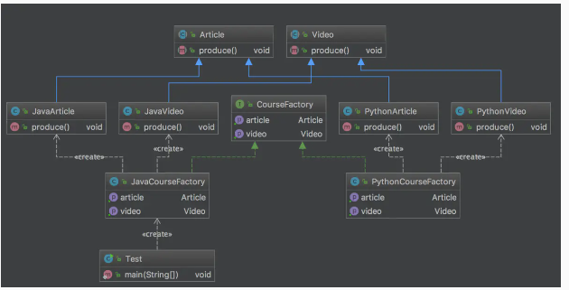
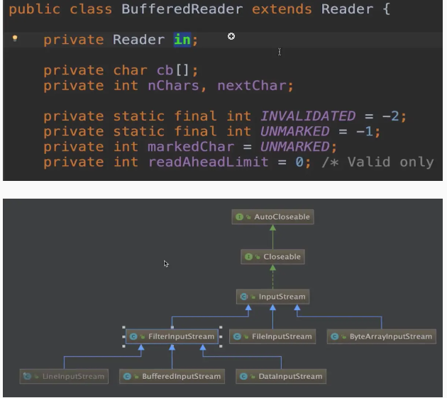
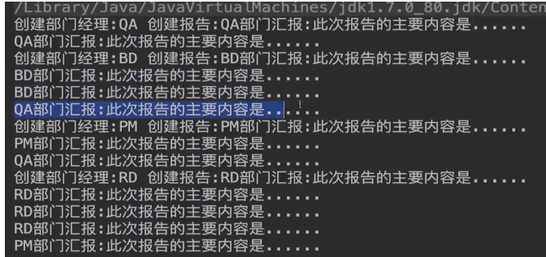
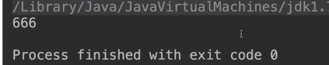
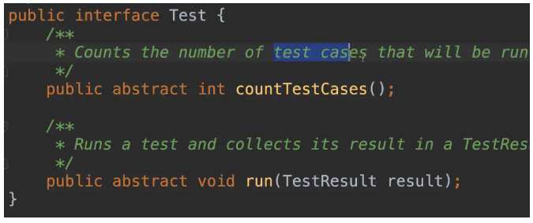

# 设计模式简介

设计模式（Design pattern）代表了最佳的实践，通常被有经验的面向对象的软件开发人员所采用。设计模式是软件开发人员在软件开发过程中面临的一般问题的解决方案。这些解决方案是众多软件开发人员经过相当长的一段时间的试验和错误总结出来的。

## 分类

**创建型模式**，共五种：

工厂方法模式、抽象工厂模式、单例模式、建造者模式、原型模式。

**结构型模式**，共七种：

适配器模式、装饰器模式、代理模式、门面模式、桥接模式、组合模式、享元模式。

**行为型模式**，共十一种：

策略模式、模板方法模式、观察者模式、迭代子模式、责任链模式、命令模式、备忘录模式、状态模式、访问者模式、中介者模式、解释器模式。

**J2EE 模式**，共八种：

这些设计模式特别关注表示层。这些模式是由 Sun Java Center 鉴定的。

MVC 模式，业务代表模式，组合实体模式，数据访问对象模式，前端控制器模式，拦截过滤器模式，服务定位器模式，传输对象模式

## 七大原则

**1️⃣开闭原则**

(1)概念

①定义:一个软件实体(如类 模块 函数)应该对扩展开放,对修改关闭

②用抽象构建框架,用实现扩展细节;

③优点:提高软件系统的可复用性及可维护性;

④开闭原则是所有原则的基础;

(2)开闭原则Coding

①声明接口ICourse

~~~java
public interface ICourse {
    Integer getId();
    String getName();
    Double getPrice();
}
~~~

②声明接口实现类

~~~java
public class JavaCourse implements ICourse{
    private Integer Id;
    private String name;
    private Double price;

    public JavaCourse(Integer id, String name, Double price) {
        this.Id = id;
        this.name = name;
        this.price = price;
    }

    public Integer getId() {
        return this.Id;
    }

    public String getName() {
        return this.name;
    }

    public Double getPrice() {
        return this.price;
    }
}
~~~

③声明新的类来继承接口实现类（扩展）

~~~java
public class JavaDiscountCourse extends JavaCourse {

    public JavaDiscountCourse(Integer id, String name, Double price) {
        super(id, name, price);
    }

    public Double getDiscountPrice(){
        return super.getPrice()*0.8;
    }
}
~~~

④编写测试代码

~~~java
public class Test {
    public static void main(String[] args) {
        ICourse iCourse = new JavaDiscountCourse(96, "Java开发", 348d);
        JavaDiscountCourse javaCourse = (JavaDiscountCourse) iCourse;
        System.out.println("课程ID:" + javaCourse.getId() + " 课程名称:" + javaCourse.getName() + " 课程原价:" + javaCourse.getPrice() + " 课程折后价格:" + javaCourse.getDiscountPrice() + "元");
    }
}
~~~

⑤UML类图


**2️⃣依赖倒置原则**

(1)概念

①定义:高层模块不应该依赖于低层模块,两者都应该依赖于抽象;

②抽象不应该依赖细节,细节应该依赖抽象;

③针对接口编程,不要针对实现编程;

④优点:可以降低类间的耦合性,提高系统稳定性,提高代码可读性和可维护性,可降低修改程序所造成的风险;

(2)依赖倒置原则Coding

①声明接口

~~~java
public interface ICourse {
    void studyCourse();
}
~~~

②创建多个实现类(JavaCourse FECourse PythonCourse)

~~~java
public class JavaCourse implements ICourse {
    @Override
    public void studyCourse() {
        System.out.println("学生在学习Java课程");
    }
}
//**//
public class FECourse implements ICourse {
    @Override
    public void studyCourse() {
        System.out.println("学生在学习FE课程");
    }
}
//**//
public class PythonCourse implements ICourse {
    @Override
    public void studyCourse() {
        System.out.println("学生在学习Python课程");
    }
}
~~~

③编写学生类

~~~java
public class Student {
    // 开放set方法实现注入
    public void setiCourse(ICourse iCourse) {
        this.iCourse = iCourse;
    }
    // 声明接口
    private ICourse iCourse;
    // 核心方法
    public void studyCourse(){
        iCourse.studyCourse();
    }
}
~~~

④编写测试方法

~~~java
public class Test {
    public static void main(String[] args) {
        Student student = new Student();

        student.setiCourse(new JavaCourse());
        student.studyCourse();

        student.setiCourse(new FECourse());
        student.studyCourse();
    }
}
~~~

⑤UML类图


**3️⃣单一职责原则**

(1)概念

①定义:不要存在多于一个导致类变更的原因;

②一个类 接口 方法只负责一项职责;

③降低类的复杂性,提高类的可读性,提高系统的可维护性,降低变更引起的风险;

(2)单一职责原则Coding

①创建获取课程内容的接口和管理课程的接口

~~~java
// 获取课程内容接口
public interface ICourseContent {
    String getCourseName();
    byte[] getCourseVideo();
}
// 课程管理接口
public interface ICourseManager {
    void studyCourse();
    void refundCourse();
}
~~~

②创建实现类实现两个接口

~~~java
public class CourseImpl implements ICourseManager,ICourseContent {
    @Override
    public void studyCourse() {

    }

    @Override
    public void refundCourse() {

    }

    @Override
    public String getCourseName() {
        return null;
    }

    @Override
    public byte[] getCourseVideo() {
        return new byte[0];
    }
}
~~~

③UML类图


④其实也可以通过类来实现单一职责的设计,但是使用类来实现单一职责如果控制不当会使类的数量爆炸,所以不推荐使用类来实现单一职责推荐使用接口来实现,毕竟类对于接口是可以多实现的嘛,也比较容易扩展;

**4️⃣接口隔离原则**

(1)概念

①定义:用多个专门的接口,而不使用单一的总接口,客户端不应该依赖于不需要的接口;

 ②一个类对一个类的依赖,应该建立在最小的接口上;

 ③建立单一接口,不要建立庞大臃肿的接口;

 ④尽量细化接口,接口中的方法尽量少;

 ⑤在使用接口隔离原则的时候一定要适度(如果控制不好,会提升程序的复杂性);

 ⑥优点:符合高内聚 低耦合的设计思想,从而使得类具有很好的可读性 可扩展性和可维护性;

(2)接口隔离原则Coding

①创建多个不同的接口

~~~java
public interface IEatAnimalAction {
    void eat();
}
//**//
public interface IFlyAnimalAction {
    void fly();
}
//**//
public interface ISwimAnimalAction {
    void swim();
}
~~~

②创建具体的实现类通过细粒度的实现组合来实现接口

~~~java
public class Dog implements ISwimAnimalAction,IEatAnimalAction {

    @Override
    public void eat() {

    }

    @Override
    public void swim() {

    }
}
~~~

③UML类图


④接口隔离原则与单一职责原则的区别

> <u>单一职责原则</u>:强调的是接口 类 方法的职责是单一的,这里强调的是职责,也就是说在一个接口中只要职责是单一的有多个方法也可以(例如游泳 仰泳 自由泳等);
>
> 另外单一职责原则约束是对接口 类 方法的约束针对的是程序中的实现和细节;
>
> <u>接口隔离原则</u>:注重的是对接口依赖的隔离,针对的是对程序框架的构建

**5️⃣迪米特原则(最少知道原则)**

(1)概念

①定义:一个对象应该对其他对象保持最少的了解,又叫最少知道原则;

②尽量降低类与类之间的耦合;

③优点:降低类之间的耦合;

④强调只和朋友交流,不和陌生人说话;

⑤朋友:出现在成员变量 方法的输入 输出参数中的类称为成员朋友类,而出现在方法体内部的类不属于朋友类;

(2)迪米特原则Coding

①创建Boss对象

~~~java
public class Boss {
    public void commandCheckNumber(TeamLeader teamLeader){
        teamLeader.checkNumberOfCourses();
    }
}
~~~

②创建Boss的"朋友"TeamLeader;

~~~java
public class TeamLeader {
    public void checkNumberOfCourses(){
        List<Course> courseList = new ArrayList<Course>();
        for(int i = 0 ;i < 20;i++){
            courseList.add(new Course());
        }
        System.out.println("在线课程的数量是："+courseList.size());
    }
}
~~~

③创建TeamLeader的朋友Course;

```java
public class Course {
}
```

④编写测试类

```java
public class Test {
    public static void main(String[] args) {
        Boss boss = new Boss();
        TeamLeader teamLeader = new TeamLeader();
        boss.commandCheckNumber(teamLeader);
    }
}
```

⑤UML类图


**6️⃣里氏替换原则**

(1)概念

①定义:如果对每一个类型为T1的对象O1,都有类型为T2的对象O2,使得以T1定义的所有程序P在所有的对象O1都替换成O2时,程序P的行为没有发生变化,那么类型T2是类型T1的子类型.

②定义扩展:一个软件实体如果适用一个父类的话,那一定适用于其子类,所有引用父类的地方必须能透明的使用其子类的对象,子类对象能够替换父类对象,而程序逻辑不变.

③引申意义:子类可以扩展父类的功能,但不能改变父类原有的功能;

④含义1:子类可以实现父类的抽象方法,但不能覆盖父类的非抽象方法;

⑤含义2:子类中可以增加自己特有的方法;

<u>⑥含义3:当子类的方法重载父类的方法时,方法的前置条件(即方法的输入/入参)要比父类方法的输入参数更宽松;</u>

⑦含义4:当子类的方法实现父类的方法时(重写/重载或实现抽象方法),方法的后置条件(即方法的输出/返回值)要比父类更严格或相等;

⑧优点1:约束继承泛滥,开闭原则的一种体现;

⑨优点2:加强程序的健壮性,同时变更时也可以做到非常好的兼容性提高程序的维护性和扩展性,降低需求变更时引入的风险.

(2)里氏替换原则Coding

由于里氏替换原则定义比较多,这里我们仅以含义3为参照来进行Coding,其他含义大家可以对照着文字解释进行尝试;在实际的工作中大家可以根据实际的环境来尽量满足里氏替换原则;

①定义Base类

```java
public class Base {
    public void method(HashMap map){
        System.out.println("父类被执行");
    }
}
```

②定义Child来实现Base

```java
public class Child extends Base {
    public void method(Map map) {
        System.out.println("子类HashMap入参方法被执行");
    }
}
```

③编写测试类

```java
public class Test {
    public static void main(String[] args) {
        Base child = new Child();
        HashMap hashMap = new HashMap();
        child.method(hashMap);
    }
}
```

**7️⃣合成复用原则**

(1)概念

①定义:尽量使用对象组合/聚合,而不是继承关系达到软件复用的目的(聚合has-A和组合contains-A);

②优点:可以使系统更加灵活,降低类与类之间的耦合度,一个类的变化对其他类造成的影响相对较少;

(2)合成复用原则Coding

①创建抽象基类

```java
public abstract class DBConnection {
    public abstract String getConnection();
}
```

②创建实现类来继承抽象基类

```java
public class MySQLConnection extends DBConnection {
    @Override
    public String getConnection() {
        return "MySQL数据库连接";
    }
}
//**//
public class PostgreSQLConnection extends DBConnection {
    @Override
    public String getConnection() {
        return "PostgreSQL数据库连接";
    }
}
```

③创建业务应用

```java
public class ProductDao{
    private DBConnection dbConnection;

    public void setDbConnection(DBConnection dbConnection) {
        this.dbConnection = dbConnection;
    }

    public void addProduct(){
        String conn = dbConnection.getConnection();
        System.out.println("使用"+conn+"增加产品");
    }
}
```

④创建测试类

```java
public class Test {
    public static void main(String[] args) {
        ProductDao productDao = new ProductDao();
        productDao.setDbConnection(new PostgreSQLConnection());
        productDao.addProduct();
    }
}
```

⑤UML类图


> 从UML类图中可以看出,合成服用原则是满足开闭原则以及里氏替换原则的;

# 创建型模式

## 工厂模式

工厂模式（Factory Pattern）是 Java 中最常用的设计模式之一。这种类型的设计模式属于创建型模式，它提供了一种创建对象的最佳方式。

在工厂模式中，我们在创建对象时不会对客户端暴露创建逻辑，并且是通过使用一个共同的接口来指向新创建的对象。

**简单工厂**

~~~java
//接口

public interface Fruit {       
	public void print();   
}   
//2个实现类
public class Apple implements Fruit{  
    @Override       
    public void print() {           
 	   System.out.println("我是一个苹果");       
 	}  
}   
public class Orange implements Fruit{  
    @Override       
    public void print() {           
 	   System.out.println("我是一个橘子");  
    }  
}   

//工厂类

public class FruitFactory {
    // 使用反射来提高扩展性
    public Fruit getVideo(Class c){
        Fruit fruit = null;
        try {
            fruit = (Fruit) Class.forName(c.getName()).newInstance();
        } catch (InstantiationException e) {
            e.printStackTrace();
        } catch (IllegalAccessException e) {
            e.printStackTrace();
        } catch (ClassNotFoundException e) {
            e.printStackTrace();
        }
        return fruit;
    }
    
	public Fruit produce(String type){           
		if(type.equals("apple")){               
			return new Apple();           
		}else if(type.equals("orange")){               
			return new Orange();           
		}else{               
			System.out.println("请输入正确的类型!");                 
		return null;            
		}       
	}   
}  
~~~

使用场景：jdbc连接数据库，硬件访问，降低对象的产生和销毁


**应用简单工厂的JDK类(java.util.calendar源码)**


```java
/**
     * Gets a calendar using the default time zone and locale. The
     * <code>Calendar</code> returned is based on the current time
     * in the default time zone with the default
     * {@link Locale.Category#FORMAT FORMAT} locale.
     *
     * @return a Calendar.
     */
    public static Calendar getInstance()
    {
        return createCalendar(TimeZone.getDefault(), Locale.getDefault(Locale.Category.FORMAT));
    }
```

```java
private static Calendar createCalendar(TimeZone zone,
                                           Locale aLocale)
    {
        CalendarProvider provider =
            LocaleProviderAdapter.getAdapter(CalendarProvider.class, aLocale)
                                 .getCalendarProvider();
        if (provider != null) {
            try {
                return provider.getInstance(zone, aLocale);
            } catch (IllegalArgumentException iae) {
                // fall back to the default instantiation
            }
        }

        Calendar cal = null;

        if (aLocale.hasExtensions()) {
            String caltype = aLocale.getUnicodeLocaleType("ca");
            if (caltype != null) {
                switch (caltype) {
                case "buddhist":
                cal = new BuddhistCalendar(zone, aLocale);
                    break;
                case "japanese":
                    cal = new JapaneseImperialCalendar(zone, aLocale);
                    break;
                case "gregory":
                    cal = new GregorianCalendar(zone, aLocale);
                    break;
                }
            }
        }
        if (cal == null) {
            // If no known calendar type is explicitly specified,
            // perform the traditional way to create a Calendar:
            // create a BuddhistCalendar for th_TH locale,
            // a JapaneseImperialCalendar for ja_JP_JP locale, or
            // a GregorianCalendar for any other locales.
            // NOTE: The language, country and variant strings are interned.
            if (aLocale.getLanguage() == "th" && aLocale.getCountry() == "TH") {
                cal = new BuddhistCalendar(zone, aLocale);
            } else if (aLocale.getVariant() == "JP" && aLocale.getLanguage() == "ja"
                       && aLocale.getCountry() == "JP") {
                cal = new JapaneseImperialCalendar(zone, aLocale);
            } else {
                cal = new GregorianCalendar(zone, aLocale);
            }
        }
        return cal;
    }
```


## 抽象工厂模式

抽象工厂模式（Abstract Factory Pattern）是围绕一个超级工厂创建其他工厂。该超级工厂又称为其他工厂的工厂。这种类型的设计模式属于创建型模式，它提供了一种创建对象的最佳方式。

①创建抽象工厂

```java
public interface CourseFactory {
    Video getVideo();
    Article getArticle();
}
```

②创建具体工厂来实现抽象工厂

```java
public class JavaCourseFactory implements CourseFactory {
    @Override
    public Video getVideo() {
        return new JavaVideo();
    }

    @Override
    public Article getArticle() {
        return new JavaArticle();
    }
}
```

```java
public class PythonCourseFactory implements CourseFactory {
    @Override
    public Video getVideo() {
        return new PythonVideo();
    }

    @Override
    public Article getArticle() {
        return new PythonArticle();
    }
}
```

③创建抽象产品族

```csharp
public abstract class Article {
    public abstract void produce();
}
```

```csharp
public abstract class Article {
    public abstract void produce();
}
```

④创建具体产品

```java
public class JavaArticle extends Article {
    @Override
    public void produce() {
        System.out.println("编写Java课程手记");
    }
}
public class JavaVideo extends Video {
    @Override
    public void produce() {
        System.out.println("录制Java课程视频");
    }
}
```

```java
public class PythonArticle extends Article {
    @Override
    public void produce() {
        System.out.println("编写Python课程手记");
    }
}
public class PythonVideo extends Video {
    @Override
    public void produce() {
        System.out.println("录制Python课程视频");
    }
}
```

⑤创建测试类

```cpp
public class Test {
    public static void main(String[] args) {
        CourseFactory courseFactory = new JavaCourseFactory();
        Video video = courseFactory.getVideo();
        Article article = courseFactory.getArticle();
        video.produce();
        article.produce();
    }
}
```

⑥UML类图



**抽象工厂的应用**

①org.apache.ibatis.session

```java
package org.apache.ibatis.session;

import java.sql.Connection;

/**
 * Creates an {@link SqlSession} out of a connection or a DataSource
 * 
 * @author Clinton Begin
 */
public interface SqlSessionFactory {

  SqlSession openSession();

  SqlSession openSession(boolean autoCommit);
  SqlSession openSession(Connection connection);
  SqlSession openSession(TransactionIsolationLevel level);

  SqlSession openSession(ExecutorType execType);
  SqlSession openSession(ExecutorType execType, boolean autoCommit);
  SqlSession openSession(ExecutorType execType, TransactionIsolationLevel level);
  SqlSession openSession(ExecutorType execType, Connection connection);

  Configuration getConfiguration();

}
```

②以SqlSession openSession(ExecutorType execType, TransactionIsolationLevel level)为例


③进入到DefaultSqlSessionFactory

```java
@Override
  public SqlSession openSession(ExecutorType execType, TransactionIsolationLevel level) {
    return openSessionFromDataSource(execType, level, false);
  }
```

④打开openSessionFromDateSource

```java
private SqlSession openSessionFromDataSource(ExecutorType execType, TransactionIsolationLevel level, boolean autoCommit) {
    Transaction tx = null;
    try {
      final Environment environment = configuration.getEnvironment();
      final TransactionFactory transactionFactory = getTransactionFactoryFromEnvironment(environment);
      tx = transactionFactory.newTransaction(environment.getDataSource(), level, autoCommit);
      final Executor executor = configuration.newExecutor(tx, execType);
      return new DefaultSqlSession(configuration, executor, autoCommit);
    } catch (Exception e) {
      closeTransaction(tx); // may have fetched a connection so lets call close()
      throw ExceptionFactory.wrapException("Error opening session.  Cause: " + e, e);
    } finally {
      ErrorContext.instance().reset();
    }
  }
```

⑤UML类图


## 建造者模式

将一个复杂的构建与其表示相分离，使得同样的构建过程可以创建不同的表示。

主要解决：主要解决在软件系统中，有时候面临着"一个复杂对象"的创建工作，其通常由各个部分的子对象用一定的算法构成；由于需求的变化，这个复杂对象的各个部分经常面临着剧烈的变化，但是将它们组合在一起的算法却相对稳定。

①创建Computer

```kotlin
public class Computer {

    private String cpu;
    private String mainBoard;
    private String hardDisk;
    private String displayCard;
    private String power;
    private String memory;

    public Computer(ComputerBuilder computerBuilder){
        this.cpu = computerBuilder.cpu;
        this.mainBoard = computerBuilder.mainBoard;
        this.hardDisk = computerBuilder.hardDisk;
        this.displayCard = computerBuilder.displayCard;
        this.power = computerBuilder.power;
        this.memory = computerBuilder.memory;
    }

    @Override
    public String toString() {
        return "Computer{" +
                "cpu='" + cpu + '\'' +
                ", mainBoard='" + mainBoard + '\'' +
                ", hardDisk='" + hardDisk + '\'' +
                ", displayCard='" + displayCard + '\'' +
                ", power='" + power + '\'' +
                ", memory='" + memory + '\'' +
                '}';
    }

    public static class ComputerBuilder{

        private String cpu;
        private String mainBoard;
        private String hardDisk;
        private String displayCard;
        private String power;
        private String memory;

        public ComputerBuilder buildCPU(String cpu){
            this.cpu = cpu;
            return this;
        }
        public ComputerBuilder buildMainBoard(String mainBoard){
            this.mainBoard = mainBoard;
            return this;
        }
        public ComputerBuilder buildHardDisk(String hardDisk){
            this.hardDisk = hardDisk;
            return this;
        }
        public ComputerBuilder buildDisplayCard(String displayCard){
            this.displayCard = displayCard;
            return this;
        }
        public ComputerBuilder buildPower(String power){
            this.power = power;
            return this;
        }
        public ComputerBuilder buildMemory(String memory){
            this.memory = memory;
            return this;
        }
        public Computer build(){
            return new Computer(this);
        }
    }
}
```

②创建测试类

```csharp
public class Test {
    public static void main(String[] args) {
        Computer computer = new Computer.ComputerBuilder().buildCPU("酷睿I7").buildMainBoard("华硕主板").build();
        System.out.println(computer);
        Set<String> set = ImmutableSet.<String>builder().add("a").add("b").build();
        System.out.println(set);
    }
}
```

③UML类图


**建造者模式的实际应用**

①在JDK中的应用`StringBuilder`与`StringBuffer`,这里仅列举出`StringBuilder`的append方法,`StringBuffer`与`StringBuilder`的区别在于`StringBuffer`的`append`方法是同步方法(线程安全);

```java
	@Override
    public StringBuilder append(Object obj) {
        return append(String.valueOf(obj));
    }

    @Override
    public StringBuilder append(String str) {
        super.append(str);
        return this;
    }

    /**
     * Appends the specified {@code StringBuffer} to this sequence.
     * <p>
     * The characters of the {@code StringBuffer} argument are appended,
     * in order, to this sequence, increasing the
     * length of this sequence by the length of the argument.
     * If {@code sb} is {@code null}, then the four characters
     * {@code "null"} are appended to this sequence.
     * <p>
     * Let <i>n</i> be the length of this character sequence just prior to
     * execution of the {@code append} method. Then the character at index
     * <i>k</i> in the new character sequence is equal to the character at
     * index <i>k</i> in the old character sequence, if <i>k</i> is less than
     * <i>n</i>; otherwise, it is equal to the character at index <i>k-n</i>
     * in the argument {@code sb}.
     *
     * @param   sb   the {@code StringBuffer} to append.
     * @return  a reference to this object.
     */
    public StringBuilder append(StringBuffer sb) {
        super.append(sb);
        return this;
    }

    @Override
    public StringBuilder append(CharSequence s) {
        super.append(s);
        return this;
    }

    /**
     * @throws     IndexOutOfBoundsException {@inheritDoc}
     */
    @Override
    public StringBuilder append(CharSequence s, int start, int end) {
        super.append(s, start, end);
        return this;
    }

    @Override
    public StringBuilder append(char[] str) {
        super.append(str);
        return this;
    }

    /**
     * @throws IndexOutOfBoundsException {@inheritDoc}
     */
    @Override
    public StringBuilder append(char[] str, int offset, int len) {
        super.append(str, offset, len);
        return this;
    }

    @Override
    public StringBuilder append(boolean b) {
        super.append(b);
        return this;
    }
```

②建造者模式在Spring中的应用

```java
package org.springframework.beans.factory.support;

import org.springframework.beans.factory.config.RuntimeBeanReference;
import org.springframework.util.ObjectUtils;

public class BeanDefinitionBuilder {
    private AbstractBeanDefinition beanDefinition;
    private int constructorArgIndex;

    public static BeanDefinitionBuilder genericBeanDefinition() {
        BeanDefinitionBuilder builder = new BeanDefinitionBuilder();
        builder.beanDefinition = new GenericBeanDefinition();
        return builder;
    }

    public static BeanDefinitionBuilder genericBeanDefinition(Class<?> beanClass) {
        BeanDefinitionBuilder builder = new BeanDefinitionBuilder();
        builder.beanDefinition = new GenericBeanDefinition();
        builder.beanDefinition.setBeanClass(beanClass);
        return builder;
    }

    public static BeanDefinitionBuilder genericBeanDefinition(String beanClassName) {
        BeanDefinitionBuilder builder = new BeanDefinitionBuilder();
        builder.beanDefinition = new GenericBeanDefinition();
        builder.beanDefinition.setBeanClassName(beanClassName);
        return builder;
    }

    public static BeanDefinitionBuilder rootBeanDefinition(Class<?> beanClass) {
        return rootBeanDefinition((Class)beanClass, (String)null);
    }

    public static BeanDefinitionBuilder rootBeanDefinition(Class<?> beanClass, String factoryMethodName) {
        BeanDefinitionBuilder builder = new BeanDefinitionBuilder();
        builder.beanDefinition = new RootBeanDefinition();
        builder.beanDefinition.setBeanClass(beanClass);
        builder.beanDefinition.setFactoryMethodName(factoryMethodName);
        return builder;
    }

    public static BeanDefinitionBuilder rootBeanDefinition(String beanClassName) {
        return rootBeanDefinition((String)beanClassName, (String)null);
    }

    public static BeanDefinitionBuilder rootBeanDefinition(String beanClassName, String factoryMethodName) {
        BeanDefinitionBuilder builder = new BeanDefinitionBuilder();
        builder.beanDefinition = new RootBeanDefinition();
        builder.beanDefinition.setBeanClassName(beanClassName);
        builder.beanDefinition.setFactoryMethodName(factoryMethodName);
        return builder;
    }

    public static BeanDefinitionBuilder childBeanDefinition(String parentName) {
        BeanDefinitionBuilder builder = new BeanDefinitionBuilder();
        builder.beanDefinition = new ChildBeanDefinition(parentName);
        return builder;
    }

    private BeanDefinitionBuilder() {
    }

    public AbstractBeanDefinition getRawBeanDefinition() {
        return this.beanDefinition;
    }

    public AbstractBeanDefinition getBeanDefinition() {
        this.beanDefinition.validate();
        return this.beanDefinition;
    }

    public BeanDefinitionBuilder setParentName(String parentName) {
        this.beanDefinition.setParentName(parentName);
        return this;
    }

    public BeanDefinitionBuilder setFactoryMethod(String factoryMethod) {
        this.beanDefinition.setFactoryMethodName(factoryMethod);
        return this;
    }

    /** @deprecated */
    @Deprecated
    public BeanDefinitionBuilder addConstructorArg(Object value) {
        return this.addConstructorArgValue(value);
    }

    public BeanDefinitionBuilder addConstructorArgValue(Object value) {
        this.beanDefinition.getConstructorArgumentValues().addIndexedArgumentValue(this.constructorArgIndex++, value);
        return this;
    }

    public BeanDefinitionBuilder addConstructorArgReference(String beanName) {
        this.beanDefinition.getConstructorArgumentValues().addIndexedArgumentValue(this.constructorArgIndex++, new RuntimeBeanReference(beanName));
        return this;
    }

    public BeanDefinitionBuilder addPropertyValue(String name, Object value) {
        this.beanDefinition.getPropertyValues().add(name, value);
        return this;
    }

    public BeanDefinitionBuilder addPropertyReference(String name, String beanName) {
        this.beanDefinition.getPropertyValues().add(name, new RuntimeBeanReference(beanName));
        return this;
    }

    public BeanDefinitionBuilder setInitMethodName(String methodName) {
        this.beanDefinition.setInitMethodName(methodName);
        return this;
    }

    public BeanDefinitionBuilder setDestroyMethodName(String methodName) {
        this.beanDefinition.setDestroyMethodName(methodName);
        return this;
    }

    public BeanDefinitionBuilder setScope(String scope) {
        this.beanDefinition.setScope(scope);
        return this;
    }

    public BeanDefinitionBuilder setAbstract(boolean flag) {
        this.beanDefinition.setAbstract(flag);
        return this;
    }

    public BeanDefinitionBuilder setLazyInit(boolean lazy) {
        this.beanDefinition.setLazyInit(lazy);
        return this;
    }

    public BeanDefinitionBuilder setAutowireMode(int autowireMode) {
        this.beanDefinition.setAutowireMode(autowireMode);
        return this;
    }

    public BeanDefinitionBuilder setDependencyCheck(int dependencyCheck) {
        this.beanDefinition.setDependencyCheck(dependencyCheck);
        return this;
    }

    public BeanDefinitionBuilder addDependsOn(String beanName) {
        if(this.beanDefinition.getDependsOn() == null) {
            this.beanDefinition.setDependsOn(new String[]{beanName});
        } else {
            String[] added = (String[])ObjectUtils.addObjectToArray(this.beanDefinition.getDependsOn(), beanName);
            this.beanDefinition.setDependsOn(added);
        }

        return this;
    }

    public BeanDefinitionBuilder setRole(int role) {
        this.beanDefinition.setRole(role);
        return this;
    }
}
```

## 单例模式

单例模式（Singleton Pattern）是 Java 中最简单的设计模式之一。这种类型的设计模式属于创建型模式，它提供了一种创建对象的最佳方式。

这种模式涉及到一个单一的类，该类负责创建自己的对象，同时确保只有单个对象被创建。这个类提供了一种访问其唯一的对象的方式，可以直接访问，不需要实例化该类的对象。

> 注意：
>
> 1、单例类只能有一个实例。
>
> 2、单例类必须自己创建自己的唯一实例。
>
> 3、单例类必须给所有其他对象提供这一实例

**懒汉式**

①懒汉式简单版实现

```csharp
public class LazySingletonV1 {
    private static LazySingleton lazySingleton = null;
    private LazySingleton(){}
    public static LazySingleton getInstance(){
        if(lazySingleton == null){
            lazySingleton = new LazySingleton();
        }
        return lazySingleton;
    }
```

> 这个版本的实现会在多线程环境中出现问题

②实现线程安全的懒汉式

```java
public class LazySingletonV2 {
    private static LazySingleton lazySingleton = null;
    private LazySingleton(){}
    public synchronized static LazySingleton getInstance(){
        if(lazySingleton == null){
            lazySingleton = new LazySingleton();
        }
        return lazySingleton;
    }
```

>通过使用synchronized同步锁来实现懒汉式单例的线程安全是一种较为普遍的解决方案,但是此方案也有一定的局限; synchronized修饰static方法其实是锁的整个class文件,因为同步锁有上锁和解锁的开销所以此解决方案会存在性能开销过大的问题;

③DoubleCheck双重检查实现懒汉式

```java
public class LazyDoubleCheckSingleton {
    private static LazyDoubleCheckSingleton lazyDoubleCheckSingleton = null;
    private LazyDoubleCheckSingleton(){}
    public static LazyDoubleCheckSingleton getInstance(){
        if(lazyDoubleCheckSingleton == null){
            synchronized (LazyDoubleCheckSingleton.class){
                if(lazyDoubleCheckSingleton == null){
                    lazyDoubleCheckSingleton = new LazyDoubleCheckSingleton();
                }
            }
        }
        return lazyDoubleCheckSingleton;
    }
}
```

> 虽然这种方式兼顾了性能和安全同时也满足懒加载的情况,但是这种情况也有一定的缺陷,首先通过synchronized我们保证了多线程情况下只有一个线程可以创建对象,如果对象已经被创建则直接返回不需要在进行加锁的操作,避免了性能的开销;但是根据java规范intra-thread semantics我们知道单线程在执行操作的时候有可能会出现指令重排序的问题,指令重排序不会影响单线程的结果,如果放在多线程的情况下就会出现问题;


> 如上图所示,在多线程环境下,由于线程0并没有初始化完成对象,但是线程1已经将此对象判断为非空,也就是说线程1拿到的其实是线程0正在进行初始化的对象,在这样的情况下系统就会报异常了;

④通过volatile关键字禁止DoubleCheck双重检查指令重排序的问题;

```java
public class LazyDoubleCheckSingleton {
    private volatile static LazyDoubleCheckSingleton lazyDoubleCheckSingleton = null;
    private LazyDoubleCheckSingleton(){}
    public static LazyDoubleCheckSingleton getInstance(){
        if(lazyDoubleCheckSingleton == null){
            synchronized (LazyDoubleCheckSingleton.class){
                if(lazyDoubleCheckSingleton == null){
                    lazyDoubleCheckSingleton = new LazyDoubleCheckSingleton();
                }
            }
        }
        return lazyDoubleCheckSingleton;
    }
}
```

> 通过volatile关键字我们可以禁止掉指令重排序,从而解决了多线程情况下的指令重排序问题;volatile关键字主要使用的是缓存一致性协议

**饿汉式**

①饿汉式简单实现

```java
public class HungrySingleton{
    private final static HungrySingleton hungrySingleton;
    private HungrySingleton(){}
    public static HungrySingleton getInstance(){
        return hungrySingleton;
    }
}
```

②序列化破坏单例模式原理解析及解决方案

```java
public class HungrySingleton implements Serializable{
    private final static HungrySingleton hungrySingleton;
    private HungrySingleton(){}
    public static HungrySingleton getInstance(){
        return hungrySingleton;
    }
}
```

```csharp
public class Test {
    public static void main(String[] args) throws Exception {
        ObjectOutputStream oos = new ObjectOutputStream(new FileOutputStream("singleton_file"));
        oos.writeObject(instance);

        File file = new File("singleton_file");
        ObjectInputStream ois = new ObjectInputStream(new FileInputStream(file));

        HungrySingleton newInstance = (HungrySingleton) ois.readObject();
  
        System.out.println(instance);
        System.out.println(newInstance);
        System.out.println(instance == newInstance);
    }
}
```


>  从上边的测试中,我们可以看出通过序列化和反序列化我们得到了两个不同的对象,这样就违背了单例的初衷;接下来我们就解决这个问题;

```java
public class HungrySingleton implements Serializable{
    private final static HungrySingleton hungrySingleton;
    private HungrySingleton(){}
    public static HungrySingleton getInstance(){
        return hungrySingleton;
    }
    private Object readResolve(){
        return hungrySingleton;
    }
}
```


> 针对这个问题,我们就需要去readObject()方法中去看一下了(由于源码调用层次较深,这里不做演示,有兴趣的小伙伴可以自己尝试一下)通过看源码我们了解到底层是通过反射来创建的对象,既然是通过反射来创建的对象那么可能和原对象是不一致,这也就解释了为什么第一次比较的时候为false了;那么为什么加上了readResolve方法就能解决这个问题呢?通过继续看源码我们找到了答案,在反射的时候jdk会确认被反射的类有没有readResolve()方法,如果有则返回true;如果结果为true会通过反射调用被反射类的readResolve()方法,然后readResolve()方法会返回我们创建好的实例对象,这样就实现两个对象比较结果为true的情况了;

③单例模式反射攻击的解决方案(暴力反射)

```tsx
public class Test {
    public static void main(String[] args) throws Exception {
        Class objectClass = HungrySingleton.class;
        Constructor constructor = objectClass.getDeclaredConstructor();
        constructor.setAccessible(true);
        StaticInnerClassSingleton instance = StaticInnerClassSingleton.getInstance();
        StaticInnerClassSingleton newInstance = (StaticInnerClassSingleton) constructor.newInstance();
        System.out.println(instance);
        System.out.println(newInstance);
        System.out.println(instance == newInstance);
    }
}
```


> 我们可以看到通过反射我们依然可以得到两个对象,那我们该怎么解决这样的问题呢请往下看

```java
public class HungrySingleton implements Serializable{
    private final static HungrySingleton hungrySingleton;
    static{
        hungrySingleton = new HungrySingleton();
    }
    private HungrySingleton(){
        if(hungrySingleton != null){
            throw new RuntimeException("单例构造器禁止反射调用");
        }
    }
    public static HungrySingleton getInstance(){
        return hungrySingleton;
    }

    private Object readResolve(){
        return hungrySingleton;
    }
}
```


**单例模式的其他实现**

①Enum枚举单例

```csharp
public enum EnumInstance {
    INSTANCE{
        protected  void printTest(){
            System.out.println("Enum Print Test");
        }
    };
    protected abstract void printTest();
    private Object data;

    public Object getData() {
        return data;
    }

    public void setData(Object data) {
        this.data = data;
    }
    public static EnumInstance getInstance(){
        return INSTANCE;
    }
}
```

序列化验证

```tsx
public class Test {
    public static void main(String[] args) throws Exception {
        EnumInstance instance = EnumInstance.getInstance();
        instance.setData(new Object());
        ObjectOutputStream oos = new ObjectOutputStream(new FileOutputStream("singleton_file"));
        oos.writeObject(instance);
        File file = new File("singleton_file");
        ObjectInputStream ois = new ObjectInputStream(new FileInputStream(file));
        EnumInstance newInstance = (EnumInstance) ois.readObject();
        System.out.println(instance.getData());
        System.out.println(newInstance.getData());
        System.out.println(instance.getData() == newInstance.getData());
    }
}
```


反射验证

```tsx
public class Test {
    public static void main(String[] args) throws Exception {
        Class objectClass = EnumInstance.class;
        Constructor constructor = objectClass.getDeclaredConstructor(String.class,int.class);
        constructor.setAccessible(true);
        EnumInstance instance = (EnumInstance) constructor.newInstance("测试",666);
    }
}
```


> 可以看到枚举单例可以完美的解决上述的问题;

②ThreadLocal线程单例

这种单例并不能保证全局唯一,但是可以保证线程唯一

```java
public class ThreadLocalInstance {
    private static final ThreadLocal<ThreadLocalInstance> threadLocalInstanceThreadLocal
             = new ThreadLocal<ThreadLocalInstance>(){
        @Override
        protected ThreadLocalInstance initialValue() {
            return new ThreadLocalInstance();
        }
    };
    private ThreadLocalInstance(){}

    public static ThreadLocalInstance getInstance(){
        return threadLocalInstanceThreadLocal.get();
    }

}
```

```java
public class T implements Runnable {
    @Override
    public void run() {
        ThreadLocalInstance instance = ThreadLocalInstance.getInstance();
        System.out.println(Thread.currentThread().getName()+"  "+instance);
    }
}
```

```csharp
public class Test {
    public static void main(String[] args) throws IOException, ClassNotFoundException, NoSuchMethodException, IllegalAccessException, InvocationTargetException, InstantiationException {
        System.out.println("main thread"+ThreadLocalInstance.getInstance());
        System.out.println("main thread"+ThreadLocalInstance.getInstance());
        System.out.println("main thread"+ThreadLocalInstance.getInstance());
        System.out.println("main thread"+ThreadLocalInstance.getInstance());
        System.out.println("main thread"+ThreadLocalInstance.getInstance());
        System.out.println("main thread"+ThreadLocalInstance.getInstance());
    }
}
```


**单例模式的应用**

单例模式在JDK中的应用

```cpp
public class Runtime {
    private static Runtime currentRuntime = new Runtime();

    /**
     * Returns the runtime object associated with the current Java application.
     * Most of the methods of class <code>Runtime</code> are instance
     * methods and must be invoked with respect to the current runtime object.
     *
     * @return  the <code>Runtime</code> object associated with the current
     *          Java application.
     */
    public static Runtime getRuntime() {
        return currentRuntime;
    }

    /** Don't let anyone else instantiate this class */
    private Runtime() {}
    ......
}
```

## 原型模式

原型模式（Prototype Pattern）是用于创建重复的对象，同时又能保证性能。这种类型的设计模式属于创建型模式，它提供了一种创建对象的最佳方式之一。

这种模式是实现了一个原型接口，该接口用于创建当前对象的克隆。当直接创建对象的代价比较大时，则采用这种模式。例如，一个对象需要在一个高代价的数据库操作之后被创建。我们可以缓存该对象，在下一个请求时返回它的克隆，在需要的时候更新数据库，以此来减少数据库调用。

①创建一个发邮件的场景

```java
public class Mail implements Cloneable{
    private String name;
    private String emailAddress;
    private String content;
    public Mail(){
        System.out.println("Mail Class Constructor");
    }

    public String getName() {
        return name;
    }

    public void setName(String name) {
        this.name = name;
    }

    public String getEmailAddress() {
        return emailAddress;
    }

    public void setEmailAddress(String emailAddress) {
        this.emailAddress = emailAddress;
    }

    public String getContent() {
        return content;
    }

    public void setContent(String content) {
        this.content = content;
    }

    @Override
    public String toString() {
        return "Mail{" +
                "name='" + name + '\'' +
                ", emailAddress='" + emailAddress + '\'' +
                ", content='" + content + '\'' +
                '}'+super.toString();
    }

    @Override
    protected Object clone() throws CloneNotSupportedException {
        System.out.println("clone mail object");
        return super.clone();
    }
}
```

②创建MailUtil工具类

```csharp
public class MailUtil {
    public static void sendMail(Mail mail){
        String outputContent = "向{0}同学,邮件地址:{1},邮件内容:{2}发送邮件成功";
        System.out.println(MessageFormat.format(outputContent,mail.getName(),mail.getEmailAddress(),mail.getContent()));
    }
    public static void saveOriginMailRecord(Mail mail){
        System.out.println("存储originMail记录,originMail:"+mail.getContent());
    }
}
```

③编写测试类

```csharp
public class Test {
    public static void main(String[] args) throws CloneNotSupportedException {
        Mail mail = new Mail();
        mail.setContent("初始化模板");
        System.out.println("初始化mail:"+mail);
        for(int i = 0;i < 10;i++){
            Mail mailTemp = (Mail) mail.clone();
            mailTemp.setName("姓名"+i);
            mailTemp.setEmailAddress("姓名"+i+"@test.com");
            mailTemp.setContent("恭喜您，此次活动中奖了");
            MailUtil.sendMail(mailTemp);
            System.out.println("克隆的mailTemp:"+mailTemp);
        }
        MailUtil.saveOriginMailRecord(mail);
    }
}
```


**深克隆与浅克隆**

(1)浅克隆

①创建pig类

```java
public class Pig implements Cloneable{
    private String name;
    private Date birthday;

    public Pig(String name, Date birthday) {
        this.name = name;
        this.birthday = birthday;
    }

    public String getName() {
        return name;
    }

    public void setName(String name) {
        this.name = name;
    }

    public Date getBirthday() {
        return birthday;
    }

    public void setBirthday(Date birthday) {
        this.birthday = birthday;
    }

    @Override
    protected Object clone() throws CloneNotSupportedException {
        Pig pig = (Pig)super.clone();
    }

    @Override
    public String toString() {
        return "Pig{" +
                "name='" + name + '\'' +
                ", birthday=" + birthday +
                '}'+super.toString();
    }
}
```

②编写测试类

```csharp
public class Test {
    public static void main(String[] args) throws CloneNotSupportedException, NoSuchMethodException, InvocationTargetException, IllegalAccessException {
        Date birthday = new Date(0L);
        Pig pig1 = new Pig("佩奇",birthday);
        Pig pig2 = (Pig) pig1.clone();
        System.out.println(pig1);
        System.out.println(pig2);

        pig1.getBirthday().setTime(666666666666L);

        System.out.println(pig1);
        System.out.println(pig2);
    }
}
```


> 从结果中可以看出,先打印的pig1与pig2的内容是一致的,在设置完生日以后打印的一组结果内容也是一致的,但是我们发现在我们设置完pig1的生日以后,后打印的一组内容的生日都发生了变化,这又是为什么呢?我们通过debug找到了答案;


> 通过分析我们找到了原因,pig1与pig2对象所使用的生日属性都是一个对象的,所以我们在修改完生日以后两个对象的内容都发生了变化(也就是说我们引用的克隆对象都是同一个对象,当我们修改被克隆对象的属性的时候,克隆出来的对象属性也会跟着发生变化);这就是浅克隆,同时默认的也是浅克隆;

(2)深克隆

从上边的结论中我们可以得出,默认的克隆方式是浅克隆,那么怎么实现深克隆呢?其实也简单,只要我们对对象的引用类型也添加克隆实现就可以解决了;

```java
@Override
    protected Object clone() throws CloneNotSupportedException {
        Pig pig = (Pig)super.clone();

        //深克隆
        pig.birthday = (Date) pig.birthday.clone();
        return pig;
    }
```


通过上图我们可以看出在我们进行了引用属性的深克隆以后,最后一组对象的内容已经发生了变化,同时debug的时候内存中引用的对象也发生了变化,效果已经达到了我们的预期

> 注意:在使用原型模式的时候一定要进行深克隆,否则可能会出现Bug

**原型模式破坏单例**

①使用HungrySingleton

```java
public class HungrySingleton implements Serializable,Cloneable{

    private final static HungrySingleton hungrySingleton;

    static{
        hungrySingleton = new HungrySingleton();
    }
    private HungrySingleton(){
        if(hungrySingleton != null){
            throw new RuntimeException("单例构造器禁止反射调用");
        }
    }
    public static HungrySingleton getInstance(){
        return hungrySingleton;
    }

    private Object readResolve(){
        return hungrySingleton;
    }

    @Override
    protected Object clone() throws CloneNotSupportedException {
        return super.clone();
    }
}
```

②编写测试类

```csharp
public class Test {
    public static void main(String[] args) throws CloneNotSupportedException, NoSuchMethodException, InvocationTargetException, IllegalAccessException {
        HungrySingleton hungrySingleton = HungrySingleton.getInstance();
        Method method = hungrySingleton.getClass().getDeclaredMethod("clone");
        method.setAccessible(true);
        HungrySingleton cloneHungrySingleton = (HungrySingleton) method.invoke(hungrySingleton);
        System.out.println(hungrySingleton);
        System.out.println(cloneHungrySingleton);
    }
}
```


可以看到通过使用clone我们依旧破坏了单例,那要如何才能解决这个问题呢?

①单例类不实现Cloneable接口;

②单例类在重写clone方法时不使用默认的实现,将其修改为

```java
@Override
    protected Object clone() throws CloneNotSupportedException {
        return getInstance();
    }
```


> 可以看到通过以上的修改,再次运行测试类的时候两个对象就完全是一致的了;

**原型模式的实际应用**

JDK中原型模式的使用

```java
public class ArrayList<E> extends AbstractList<E>
        implements List<E>, RandomAccess, Cloneable, java.io.Serializable
```

```php
/**
     * Returns a shallow copy of this <tt>ArrayList</tt> instance.  (The
     * elements themselves are not copied.)
     *
     * @return a clone of this <tt>ArrayList</tt> instance
     */
    public Object clone() {
        try {
            ArrayList<?> v = (ArrayList<?>) super.clone();
            v.elementData = Arrays.copyOf(elementData, size);
            v.modCount = 0;
            return v;
        } catch (CloneNotSupportedException e) {
            // this shouldn't happen, since we are Cloneable
            throw new InternalError(e);
        }
    }
```

> 同理hashMap也实现了克隆接口也重写了克隆方法,也就是说HashMap也应用了原型模式;

# 结构型模式

## 门面模式

外观模式（Facade Pattern）隐藏系统的复杂性，并向客户端提供了一个客户端可以访问系统的接口。这种类型的设计模式属于结构型模式，它向现有的系统添加一个接口，来隐藏系统的复杂性。

这种模式涉及到一个单一的类，该类提供了客户端请求的简化方法和对现有系统类方法的委托调用。

**适用场景**：当子系统越来越复杂,增加外观模式提供简单调用接口;

构建多层系统结构,利用外观对象作为每层的入口,简化层间调用;

①创建cpu

```java
public class CPU {
    public void open(){
        System.out.println("open cpu");
    }
    public void close(){
        System.out.println("close cpu");
    }
}
```

②创建硬盘disk

```java
public class Disk {
    public void open(){
        System.out.println("open disk");
    }
    public void close(){
        System.out.println("close disk");
    }
}
```

③创建Computer

```java
public class Computer {
    private CPU cpu;
    private Disk disk;

    public Computer(){
        this.cpu = new CPU();
        this.disk = new Disk();
    }
    public void open(){
        this.cpu.open();
        this.disk.open();
    }
    public void close(){
        this.cpu.close();
        this.disk.close();
    }
}
```

④创建测试类

```java
public class Test {
    public static void main(String[] args) {
        Computer computer = new Computer();
        computer.open();
        System.out.println("玩一会电脑");
        computer.close();
    }
}
```


UML类图


**外观模式的实际应用**

外观模式在Tomcat中大量使用


## 装饰者模式

**定义**:<u>在不改变原有对象的基础上</u>,将功能附加到对象上;提供了比继承更有弹性的替代方案(扩展原有对象功能);

**适用场景**:扩展一个类的功能或者给一个类添加附加职责;动态的给一个对象添加功能,这些功能可以在动态的撤销;

v1版本
①创建基础类

```java
public class Battercake {
    protected String getDesc(){
        return "煎饼";
    }
    protected int cost(){
        return 8;
    }
}
```

②创建扩展类继承基础类

```java
public class BattercakeWithEgg extends Battercake {
    @Override
    public String getDesc() {
        return super.getDesc()+" 加一个鸡蛋";
    }

    @Override
    public int cost() {
        return super.cost()+1;
    }
}
```

③创建扩展类继承①和②

```java
public class BattercakeWithEggSausage extends BattercakeWithEgg {
    @Override
    public String getDesc() {
        return super.getDesc()+ " 加一根香肠";
    }

    @Override
    public int cost() {
        return super.cost()+2;
    }
}
```

④创建测试类

```java
public class Test {
    public static void main(String[] args) {
        Battercake battercake = new Battercake();
        System.out.println(battercake.getDesc()+" 销售价格:"+battercake.cost());

        Battercake battercakeWithEgg = new BattercakeWithEgg();
        System.out.println(battercakeWithEgg.getDesc()+" 销售价格:"+battercakeWithEgg.cost());

        Battercake battercakeWithEggSausage = new BattercakeWithEggSausage();
        System.out.println(battercakeWithEggSausage.getDesc()+" 销售价格:"+battercakeWithEggSausage.cost());
    }
}
```

⑤UML类图


> 使用这样的方式来进行扩展的话,如果组合非常的多我们的程序会发生类爆炸的情况,怎么样才能让我们的程序更加的优雅呢?请往下看

v2版本
①创建抽象类

```java
public abstract class ABattercake {
    //基础功能
    protected abstract String getDesc();
    protected abstract int cost();
}
```

②创建抽象类继承①

```java
public abstract class AbstractDecorator extends ABattercake {
    //在基础功能上进行功能扩充
    private ABattercake aBattercake;

    public AbstractDecorator(ABattercake aBattercake) {
        this.aBattercake = aBattercake;
    }

    protected abstract void doSomething();

    @Override
    protected String getDesc() {
        return this.aBattercake.getDesc();
    }

    @Override
    protected int cost() {
        return this.aBattercake.cost();
    }
}
```

③创建实体类继承①并实现抽象方法

```java
public class Battercake extends ABattercake {
    //基础功能（功能入口）
    @Override
    protected String getDesc() {
        return "煎饼";
    }

    @Override
    protected int cost() {
        return 8;
    }
}
```

④创建实体类继承①并实现抽象方法;

```java
public class EggDecorator extends AbstractDecorator {
    //扩充功能（在基础功能之上扩充）
    public EggDecorator(ABattercake aBattercake) {
        super(aBattercake);
    }

    @Override
    protected void doSomething() {

    }

    @Override
    protected String getDesc() {
        return super.getDesc()+" 加一个鸡蛋";
    }

    @Override
    protected int cost() {
        return super.cost()+1;
    }
}
```

⑤创建实体类继承①并实现抽象方法;

```java
public class SausageDecorator extends AbstractDecorator{
    //扩充功能（在基础功能之上扩充）
    public SausageDecorator(ABattercake aBattercake) {
        super(aBattercake);
    }

    @Override
    protected void doSomething() {

    }

    @Override
    protected String getDesc() {
        return super.getDesc()+" 加一根香肠";
    }

    @Override
    protected int cost() {
        return super.cost()+2;
    }
}
```

⑥编写测试类

```java
public class Test {
    public static void main(String[] args) {
        ABattercake aBattercake;
        //基础功能
        aBattercake = new Battercake();
        //在基础功能上扩充（基础功能为入参）
        aBattercake = new EggDecorator(aBattercake);
        aBattercake = new SausageDecorator(aBattercake);

        System.out.println(aBattercake.getDesc()+" 销售价格:"+aBattercake.cost());
    }
}
```


> 说明:由于每个实体类都继承了抽象类①,所以我们在使用的时候可以直接创建,也就是说所有的实体类都是ABattercake的子类;另外关于doSomething方法,可以理解成每个实体类进行操作前的一个动作,便于扩展;

⑦UML类图


**装饰者模式的实际应用**

JDK中的使用(java IO)




## 适配器模式

**定义**:是将一个类的接口转换成客户期望的另一个接口;使原本不兼容的类可以一起工作;
**适用场景**:已经存在的类,方法和需求不匹配时(方法结果相同或相似);不是软件设计阶段考虑的设计模式,是随着软件维护,由于不同产品 不同厂家造成功能类似而接口不相同情况下的解决方案;

**适配器模式的扩展**:对象适配器，类适配器
他们之间的主要区别就是一个是通过组合来进行操作的,一个是通过继承来进行操作的

**实现(对象适配器)**

我们有一个 *MediaPlayer* 接口和一个实现了 *MediaPlayer* 接口的实体类 *AudioPlayer*。默认情况下，*AudioPlayer* 可以播放 mp3 格式的音频文件。

我们还有另一个接口 *AdvancedMediaPlayer* 和实现了 *AdvancedMediaPlayer* 接口的实体类。该类可以播放 vlc 和 mp4 格式的文件。

我们想要让 *AudioPlayer* 播放其他格式的音频文件。为了实现这个功能，我们需要创建一个实现了 *MediaPlayer* 接口的适配器类 *MediaAdapter*，并使用 *AdvancedMediaPlayer* 对象来播放所需的格式。

*AudioPlayer* 使用适配器类 *MediaAdapter* 传递所需的音频类型，不需要知道能播放所需格式音频的实际类。*AdapterPatternDemo* 类使用 *AudioPlayer* 类来播放各种格式。

①UML图


②为媒体播放器和更高级的媒体播放器创建接口

~~~java
public interface MediaPlayer {
   public void play(String audioType, String fileName);
}
//**//
public interface AdvancedMediaPlayer { 
   public void playVlc(String fileName);
   public void playMp4(String fileName);
}
~~~

③创建实现了 *AdvancedMediaPlayer* 接口的实体类。

~~~java
public class VlcPlayer implements AdvancedMediaPlayer{
   @Override
   public void playVlc(String fileName) {
      System.out.println("Playing vlc file. Name: "+ fileName);      
   }
 
   @Override
   public void playMp4(String fileName) {
      //什么也不做
   }
}
//**//
public class Mp4Player implements AdvancedMediaPlayer{
 
   @Override
   public void playVlc(String fileName) {
      //什么也不做
   }
 
   @Override
   public void playMp4(String fileName) {
      System.out.println("Playing mp4 file. Name: "+ fileName);      
   }
}
~~~

④创建实现了 *MediaPlayer* 接口的适配器类

~~~java
public class MediaAdapter implements MediaPlayer {
 
   AdvancedMediaPlayer advancedMusicPlayer;
 
   public MediaAdapter(String audioType){
      if(audioType.equalsIgnoreCase("vlc") ){
         advancedMusicPlayer = new VlcPlayer();       
      } else if (audioType.equalsIgnoreCase("mp4")){
         advancedMusicPlayer = new Mp4Player();
      }  
   }
 
   @Override
   public void play(String audioType, String fileName) {
      if(audioType.equalsIgnoreCase("vlc")){
         advancedMusicPlayer.playVlc(fileName);
      }else if(audioType.equalsIgnoreCase("mp4")){
         advancedMusicPlayer.playMp4(fileName);
      }
   }
}
~~~

⑤创建实现了 *MediaPlayer* 接口的实体类

~~~java
public class AudioPlayer implements MediaPlayer {
   MediaAdapter mediaAdapter; 
 
   @Override
   public void play(String audioType, String fileName) {    
 
      //播放 mp3 音乐文件的内置支持
      if(audioType.equalsIgnoreCase("mp3")){
         System.out.println("Playing mp3 file. Name: "+ fileName);         
      } 
      //mediaAdapter 提供了播放其他文件格式的支持
      else if(audioType.equalsIgnoreCase("vlc") 
         || audioType.equalsIgnoreCase("mp4")){
         mediaAdapter = new MediaAdapter(audioType);
         mediaAdapter.play(audioType, fileName);
      }
      else{
         System.out.println("Invalid media. "+
            audioType + " format not supported");
      }
   }   
}
~~~

使用 AudioPlayer 来播放不同类型的音频格式

~~~java
public class AdapterPatternDemo {
   public static void main(String[] args) {
      AudioPlayer audioPlayer = new AudioPlayer();
 
      audioPlayer.play("mp3", "beyond the horizon.mp3");
      audioPlayer.play("mp4", "alone.mp4");
      audioPlayer.play("vlc", "far far away.vlc");
      audioPlayer.play("avi", "mind me.avi");
   }
}
~~~


**实现（类适配器）**

①创建被适配者

```java
public class Adaptee {
    public void adapteeRequest(){
        System.out.println("被适配者的方法");
    }
}
```

②创建目标适配

```java
public class ConcreteTarget implements Target {
    @Override
    public void request() {
        System.out.println("concreteTarget目标方法");
    }
}
```

③创建接口

```java
public interface Target {
    void request();
}
```

④创建适配方法

```java
public class Adapter extends Adaptee implements Target{
    @Override
    public void request() {
        //...
        super.adapteeRequest();
        //...
    }
}
```

⑤创建测试类

```java
public class Test {
    public static void main(String[] args) {
        Target target = new ConcreteTarget();
        target.request();

        Target adapterTarget = new Adapter();
        adapterTarget.request();
    }
}
```

⑥UML类图


**适配器模式实际应用**

在JDK中的应用 XmlAdapter

## 享元模式

**定义**:提供了减少对象数量从而改善应用所需的对象结构的方式;运用共享技术有效地支持大量细粒度的对象;

**适用场景**：常常应用于系统底层的开发,以便解决系统的性能问题;系统有大量的相似对象,需要缓冲池的场景;

①创建Employee接口

```java
public interface Employee {
    void report();
}
```

②创建Manager类实现接口

```java
public class Manager implements Employee {
    @Override
    public void report() {
        System.out.println(reportContent);
    }
    private String title = "部门经理";
    private String department;
    private String reportContent;

    public void setReportContent(String reportContent) {
        this.reportContent = reportContent;
    }

    public Manager(String department) {
        this.department = department;
    }
}
```

③创建EmployeeFactory工厂类

```java
public class EmployeeFactory {
    private static final Map<String,Employee> EMPLOYEE_MAP = new HashMap<String,Employee>();

    public static Employee getManager(String department){
        Manager manager = (Manager) EMPLOYEE_MAP.get(department);

        if(manager == null){
            manager = new Manager(department);
            System.out.print("创建部门经理:"+department);
            String reportContent = department+"部门汇报:此次报告的主要内容是......";
            manager.setReportContent(reportContent);
            System.out.println(" 创建报告:"+reportContent);
            EMPLOYEE_MAP.put(department,manager);
        }
        return manager;
    }
}
```

④编写测试类

```java
public class Test {
    private static final String departments[] = {"RD","QA","PM","BD"};

    public static void main(String[] args) {
        for(int i=0; i<10; i++){
            String department = departments[(int)(Math.random() * departments.length)];
            Manager manager = (Manager) EmployeeFactory.getManager(department);
            manager.report();
        }
    }
}
```



⑤UML类图


**享元模式的应用**

JDK中的Integer;


## 组合模式

**定义**:将对象组合成树形结构以表示"部分-整体"的层次结构;组合模式使客户端对单个对象和组合对象保持一致的方式处理。

**适用场景**：希望客户端可以忽略组合对象与单个对象的差异时;处理一个树形结构时;

①UML图


②创建抽象类Entry

```java
public abstract class Entry {
	//树形
    protected Entry parent;

    public abstract String getName();

    public abstract int getSize();

    public Entry add(Entry entry) throws FileTreatmentException {
        throw new FileTreatmentException();
    }

    public void printList() {
        printList("");
    }

    protected abstract void printList(String prefix);

    @Override
    public String toString() {
        return getName() + "(" + getSize() + ")";
    }


    public String filePath() {
        StringBuffer fullName = new StringBuffer();
        //设置当前为叶子结点
        Entry entry = this;
        //一步一步找到根节点
        do {
            fullName.insert(0, "/" + entry.getName());
            entry = entry.parent;
        } while (entry != null);
        return fullName.toString();
    }

}
```

③创建实体类File

```java
public class File extends Entry{
    private String name;

    private int size;


    public File(String name, int size) {
        this.name = name;
        this.size = size;
    }

    @Override
    public String getName() {
        return name;
    }

    @Override
    public int getSize() {
        return size;
    }

    @Override
    protected void printList(String prefix) {
        System.out.println(prefix + "/" + this);
    }

}
```

④创建实体类Directory

```java
public class Directory extends Entry {

    private String name;

    private List<Entry> directory = new ArrayList<>();

    public Directory(String name) {
        this.name = name;
    }

    @Override
    public String getName() {
        return name;
    }

    @Override
    public int getSize() {
        int size = 0;
        Iterator<Entry> it = directory.iterator();
        while (it.hasNext()) {
            Entry entry = it.next();
            size += entry.getSize();
        }
        return size;
    }

    @Override
    public Entry add(Entry entry) throws FileTreatmentException {
        directory.add(entry);
        entry.parent = this;
        return this;
    }

    @Override
    protected void printList(String prefix) {
        System.out.println(prefix + "/" + this);
        Iterator<Entry> it = directory.iterator();
        while (it.hasNext()) {
            Entry entry = it.next();
            entry.printList(prefix + "/" + name);
        }
    }

}
```

⑤统一异常处理FileTreatmentException

```java
public class FileTreatmentException extends RuntimeException {

    public FileTreatmentException() {
    }

    public FileTreatmentException(String message) {
        super(message);
    }
}
```

⑥测试方法

```java
public class Main {
    public static void main(String[] args) {
        try {
            Directory rootDir = new Directory("root");
            Directory usrDir = new Directory("usr");
            rootDir.add(usrDir);
            Directory yukiDir = new Directory("yuki");
            usrDir.add(yukiDir);
            File file = new File("Composite.java", 1000);
            yukiDir.add(file);
            rootDir.printList();
            System.out.println("file = " + file.filePath());
            System.out.println("yuki = " + yukiDir.filePath());
        } catch (FileTreatmentException e) {
            e.printStackTrace();
        }
    }
}
```


**组合模式的实际应用**

JDK java.util.hashmap


myBatis SqlNode


## *桥接模式

**定义**:将抽象部分与它的具体实现部分分离,使他们都可以独立的变化;通过组合的方式建立两个类之间联系,而不是继承;

**适用场景**：抽象与具体实现之间增加更多的灵活性;一个类存在两个(或多个)独立变化的维度,且这两个(或多个)维度都需要进行独立扩展;不希望使用继承,或因为多层继承导致系统类的个数剧增;

**意图：**将抽象部分与实现部分分离，使它们都可以独立的变化。

①创建Account接口

```java
public interface Account {
    Account openAccount();
    void showAccountType();
}
```

②创建DepositAccount类实现Account接口

```java
public class DepositAccount implements Account {
    @Override
    public Account openAccount() {
        System.out.println("打开定期账号");
        return new DepositAccount();
    }

    @Override
    public void showAccountType() {
        System.out.println("这是一个定期账号");
    }
}
```

③创建SavingAccount类实现Account接口

```java
public class SavingAccount implements Account {
    @Override
    public Account openAccount() {
        System.out.println("打开活期账号");
        //...
        return new SavingAccount();
    }

    @Override
    public void showAccountType() {
        System.out.println("这是一个活期账号");
    }
}
```

④创建抽象类Bank

```java
public abstract class Bank {
    protected Account account;
    public Bank(Account account){
        this.account = account;
    }
    abstract Account openAccount();
}
```

⑤创建ABCBank类继承Bank类

```java
public class ABCBank extends Bank {
    public ABCBank(Account account) {
        super(account);
    }

    @Override
    Account openAccount() {
        System.out.println("打开中国农业银行账号");
        //账户的类型是不确定
        account.openAccount();
        return account;
    }
}
```

⑥创建ICBCBank类继承Bank类

```java
public class ICBCBank extends Bank {
    public ICBCBank(Account account) {
        super(account);
    }

    @Override
    Account openAccount() {
        System.out.println("打开中国工商银行账号");
        //账户的类型是不确定
        account.openAccount();
        return account;
    }
}
```

⑦UML类图


⑧创建测试类

```java
public class Test {
    public static void main(String[] args) {
        Bank icbcBank = new ICBCBank(new DepositAccount());
        Account icbcAccount = icbcBank.openAccount();
        icbcAccount.showAccountType();

        Bank icbcBank2 = new ICBCBank(new SavingAccount());
        Account icbcAccount2 = icbcBank2.openAccount();
        icbcAccount2.showAccountType();

        Bank abcBank = new ABCBank(new SavingAccount());
        Account abcAccount = abcBank.openAccount();
        abcAccount.showAccountType();
    }
}
```


**桥接模式的实际应用**

JDK java.sql.driver接口


## 代理模式

**定义**:为其他对象提供一种代理,以控制对这个对象的访问;代理对象在客户端和目标对象之间起到中介的作用;

**适用场景**:保护目标对象增强目标对象

①UML类图


②创建Sourceable接口

```java
public interface Sourceable {
    public void method();
}
```

③创建Source类实现Sourceable

```java
public class Source implements Sourceable {

    @Override
    public void method() {
        System.out.println("the original method!");
    }
}
```

④创建代理类Proxy实现Sourceable

```java
public class Proxy implements Sourceable {
 
    private Source source;
    public Proxy(){
        super();
        this.source = new Source();
    }
    @Override
    public void method() {
        before();
        source.method();
        atfer();
    }
    private void atfer() {
        System.out.println("after proxy!");
    }
    private void before() {
        System.out.println("before proxy!");
    }
}
```

⑤创建测试类ProxyTest

```java
public class ProxyTest {
 
    public static void main(String[] args) {
        Sourceable source = new Proxy();
        source.method();
    }
 
}
```

```java
输出结果
before proxy!
the original method!
after proxy!
```

# 行为型模式

## 迭代器模式

**定义**:提供一种方法,顺序访问一个集合对象中的各个元素,而又不暴露该对象的内部表示;

**适用场景**：访问一个集合对象的内容而无需暴露它的内部表示;为遍历不同的集合结构提供一个统一的接口;

**意图：**提供一种方法顺序访问一个聚合对象中各个元素, 而又无须暴露该对象的内部表示。

①创建Course类

```java
public class Course {
    private String name;

    public Course(String name) {
        this.name = name;
    }

    public String getName() {
        return name;
    }
}
```

②创建接口CourseAggregate

```java
public interface CourseAggregate {

    void addCourse(Course course);
    void removeCourse(Course course);

    CourseIterator getCourseIterator();
}
```

③创建接口CourseIterator

```java
public interface CourseIterator {
    Course nextCourse();
    boolean isLastCourse();
}
```

④创建CourseAggregateImpl类实现CourseAggregate

```java
public class CourseAggregateImpl implements CourseAggregate {

    private List courseList;

    public CourseAggregateImpl() {
        this.courseList = new ArrayList();
    }

    @Override
    public void addCourse(Course course) {
        courseList.add(course);
    }

    @Override
    public void removeCourse(Course course) {
        courseList.remove(course);
    }

    @Override
    public CourseIterator getCourseIterator() {
        return new CourseIteratorImpl(courseList);
    }
}
```

⑤创建CourseIteratorImpl实现CourseIterator

```java
public class CourseIteratorImpl implements CourseIterator {

    private List courseList;
    private int position;
    private Course course;
    public CourseIteratorImpl(List courseList){
        this.courseList=courseList;
    }

    @Override
    public Course nextCourse() {
        System.out.println("返回课程,位置是: "+position);
        course=(Course)courseList.get(position);
        position++;
        return course;
    }

    @Override
    public boolean isLastCourse(){
        if(position< courseList.size()){
            return false;
        }
        return true;
    }
}
```

⑥UML类图


⑦编写测试类

```java
public class Test {

    public static void main(String[] args) {
        Course course1 = new Course("Java电商一期课程");
        Course course2 = new Course("Java电商二期课程");
        Course course3 = new Course("Java设计模式课程");
        Course course4 = new Course("Python课程");
        Course course5 = new Course("算法课程");
        Course course6 = new Course("前端课程");

        CourseAggregate courseAggregate = new CourseAggregateImpl();

        courseAggregate.addCourse(course1);
        courseAggregate.addCourse(course2);
        courseAggregate.addCourse(course3);
        courseAggregate.addCourse(course4);
        courseAggregate.addCourse(course5);
        courseAggregate.addCourse(course6);

        System.out.println("-----课程列表-----");
        printCourses(courseAggregate);

        courseAggregate.removeCourse(course4);
        courseAggregate.removeCourse(course5);

        System.out.println("-----删除操作之后的课程列表-----");
        printCourses(courseAggregate);
    }

    public static void printCourses(CourseAggregate courseAggregate){
        CourseIterator courseIterator= courseAggregate.getCourseIterator();
        while(!courseIterator.isLastCourse()){
            Course course=courseIterator.nextCourse();
            System.out.println(course.getName());
        }
    }
}
```


## 模板方法模式

**定义**:定义了一个算法的骨架,并允许子类为一个或多个步骤提供实现;

**补充**:模板方法使得子类可以在不改变算法结构的情况下,重新定义算法的某些步骤;

**意图：**定义一个操作中的算法的骨架，而将一些步骤延迟到子类中。模板方法使得子类可以不改变一个算法的结构即可重定义该算法的某些特定步骤。

①创建ACourse抽象类

```java
public abstract class ACourse {

    protected final void makeCourse(){
        this.makePPT();
        this.makeVideo();
        if(needWriteArticle()){
            this.writeArticle();
        }
        this.packageCourse();
    }

    final void makePPT(){
        System.out.println("制作PPT");
    }
    final void makeVideo(){
        System.out.println("制作视频");
    }
    final void writeArticle(){
        System.out.println("编写手记");
    }
    //钩子方法
    protected boolean needWriteArticle(){
        return false;
    }
    abstract void packageCourse();
}
```

②创建DesignPatternCourse类继承ACourse

```java
public class DesignPatternCourse extends ACourse {
    @Override
    void packageCourse() {
        System.out.println("提供课程Java源代码");
    }

    @Override
    protected boolean needWriteArticle() {
        return true;
    }
}
```

③创建FECourse类继承ACourse

```java
public class FECourse extends ACourse {
    private boolean needWriteArticleFlag = false;
    @Override
    void packageCourse() {
        System.out.println("提供课程的前端代码");
        System.out.println("提供课程的图片等多媒体素材");
    }

    public FECourse(boolean needWriteArticleFlag) {
        this.needWriteArticleFlag = needWriteArticleFlag;
    }

    @Override
    protected boolean needWriteArticle() {
        return this.needWriteArticleFlag;
    }
}
```

④UML类图


⑤编写测试类

```java
public class Test {
    public static void main(String[] args) {
//        System.out.println("后端设计模式课程start---");
//        ACourse designPatternCourse = new DesignPatternCourse();
//        designPatternCourse.makeCourse();
//        System.out.println("后端设计模式课程end---");


        System.out.println("前端课程start---");
        ACourse feCourse = new FECourse(false);
        feCourse.makeCourse();
        System.out.println("前端课程end---");
    }
}
```

## 策略模式

**定义**: 定义了算法家族,分别封装起来,让他们之间可以互相替换,此模式让算法的变化不会影响到使用算法的用户;

**适用场景**：系统有很多类,<u>而他们的区别仅仅在于他们的行为不同</u>;一个系统需要动态地在几种算法中选择一种;

**主要解决**：在有多种算法相似的情况下，使用 if...else 所带来的复杂和难以维护。

1 创建PromotionStrategy接口

```java
public interface PromotionStrategy {
    void doPromotion();
}
```

2 创建不同的策略实现类

```java
/**
 * 满减策略
 */
public class ManJianPromotionStrategy implements PromotionStrategy{
    @Override
    public void doPromotion() {
        System.out.println("满减促销,满200-20元");
    }
}
-----------------------------------------------------------------------------------------------
/**
 * 立减策略
 */
public class LiJianPromotionStrategy implements PromotionStrategy {
    @Override
    public void doPromotion() {
        System.out.println("立减促销,课程的价格直接减去配置的价格");
    }
}
-----------------------------------------------------------------------------------------------
/**
 * 返现策略
 */
public class FanXianPromotionStrategy implements PromotionStrategy {
    @Override
    public void doPromotion() {
        System.out.println("返现促销,返回的金额存放到慕课网用户的余额中");
    }
}
```

3 创建类PromotionActivity

```java
public class PromotionActivity {
    private PromotionStrategy promotionStrategy;

    public PromotionActivity(PromotionStrategy promotionStrategy) {
        this.promotionStrategy = promotionStrategy;
    }

    public void executePromotionStrategy(){
        promotionStrategy.doPromotion();
    }
}
```

4 编写测试类

```java
public class Test {
    public static void main(String[] args) {
        PromotionActivity promotionActivity618 = new PromotionActivity(new LiJianPromotionStrategy());
        PromotionActivity promotionActivity1111 = new PromotionActivity(new FanXianPromotionStrategy());

        promotionActivity618.executePromotionStrategy();
        promotionActivity1111.executePromotionStrategy();
    }
}
```


5 UML类图


6 但是这样的写法并不能消除if else这样的判断我们来测试一下

```java
public class Test {

    public static void main(String[] args) {
        PromotionActivity promotionActivity = null;

        String promotionKey = "LIJIAN";

        if(StringUtils.equals(promotionKey,"LIJIAN")){
            promotionActivity = new PromotionActivity(new LiJianPromotionStrategy());
        }else if(StringUtils.equals(promotionKey,"FANXIAN")){
            promotionActivity = new PromotionActivity(new FanXianPromotionStrategy());
        }//......
        promotionActivity.executePromotionStrategy();
    }
}
```


>  从上边的实例中我们可以看到,这样的代码还是会出现很多的判断并且会在命中某个条件以后创建新的对象,现在我们队这个进行一下改进,结合工厂模式;

7 创建策略工厂PromotionStrategyFactory

```java
public class PromotionStrategyFactory {
    private static Map<String,PromotionStrategy> PROMOTION_STRATEGY_MAP = new HashMap<String, PromotionStrategy>();
    static {
        PROMOTION_STRATEGY_MAP.put(PromotionKey.LIJIAN,new LiJianPromotionStrategy());
        PROMOTION_STRATEGY_MAP.put(PromotionKey.FANXIAN,new FanXianPromotionStrategy());
        PROMOTION_STRATEGY_MAP.put(PromotionKey.MANJIAN,new ManJianPromotionStrategy());
    }

    private static final PromotionStrategy NON_PROMOTION = new EmptyPromotionStrategy();

    private PromotionStrategyFactory(){

    }

    public static PromotionStrategy getPromotionStrategy(String promotionKey){
        PromotionStrategy promotionStrategy = PROMOTION_STRATEGY_MAP.get(promotionKey);
        return promotionStrategy == null ? NON_PROMOTION : promotionStrategy;
    }

    private interface PromotionKey{
        String LIJIAN = "LIJIAN";
        String FANXIAN = "FANXIAN";
        String MANJIAN = "MANJIAN";
    }
}
```

8 创建空策略EmptyPromotionStrategy实现类

```java
public class EmptyPromotionStrategy implements PromotionStrategy {
    @Override
    public void doPromotion() {
        System.out.println("无促销活动");
    }
}
```

9 编写新的测试类

```java
public class Test {
    public static void main(String[] args) {
        String promotionKey = "MANJIANxxx";
        PromotionActivity promotionActivity = new PromotionActivity(PromotionStrategyFactory.getPromotionStrategy(promotionKey));
        promotionActivity.executePromotionStrategy();
    }
}
```


**策略模式源码解析(jdk+spring)**

`jdk : public interface Comparator<T>`

`Spring : Resource`

## 解释器模式

**定义**:给定一个语言,定义它的文法的一种表示,并定义一个解释器,这个解释器使用该表示来解释语言中的句子(为了解释一种语言,而为语言创建的解释器).

**适用场景**:某个特定类型问题的发生频率足够高的时候(例如系统中的日志服务);

**主要解决：**对于一些固定文法构建一个解释句子的解释器

1 先来了解一下我们要实现一个什么样的功能;

```java
public class Test {
    public static void main(String[] args) {
        String inputStr="6 100 11 + *";
        TestExpressionParser expressionParser=new TestExpressionParser();
        int result=expressionParser.parse(inputStr);
        System.out.println("解释器计算结果: "+result);
    }
}
```


> 我们先自定义一个字符串(6 100 11 + *)两个字符串之间用空格隔开,先计算100 + 11,然后其结果在乘以6得到最终的结果;

2 声明Interpreter接口

```java
public interface Interpreter {
    int interpret();
}
```

3 编写加法解释器AddInterpreter,MultiInterpreter,NumberInterpreter

```java
public class AddInterpreter implements Interpreter {
    private Interpreter firstExpression,secondExpression;
    public AddInterpreter(Interpreter firstExpression, Interpreter secondExpression){
        this.firstExpression=firstExpression;
        this.secondExpression=secondExpression;
    }
    @Override
    public int interpret(){
        return this.firstExpression.interpret()+this.secondExpression.interpret();
    }
    @Override
    public String toString(){
        return "+";
    }
}

public class MultiInterpreter implements Interpreter {

    private Interpreter firstExpression,secondExpression;
    public MultiInterpreter(Interpreter firstExpression, Interpreter secondExpression){
        this.firstExpression=firstExpression;
        this.secondExpression=secondExpression;
    }
    @Override
    public int interpret(){
        return this.firstExpression.interpret() * this.secondExpression.interpret();
    }
    @Override
    public String toString(){
        return "*";
    }
}

public class NumberInterpreter implements Interpreter {
    private int number;
    public NumberInterpreter(int number){
        this.number=number;
    }
    public NumberInterpreter(String number){
        this.number=Integer.parseInt(number);
    }
    @Override
    public int interpret(){
        return this.number;
    }
}
```

5 编写TestExpressionParser

```java
public class TestExpressionParser {
    private Stack<Interpreter> stack = new Stack<Interpreter>();

    public int parse(String str) {
        String[] strItemArray = str.split(" ");
        for (String symbol : strItemArray) {
            if (!OperatorUtil.isOperator(symbol)) {
                Interpreter numberExpression = new NumberInterpreter(symbol);
                stack.push(numberExpression);
                System.out.println(String.format("入栈: %d", numberExpression.interpret()));
            } else {
                //是运算符号，可以计算
                Interpreter firstExpression = stack.pop();
                Interpreter secondExpression = stack.pop();
                System.out.println(String.format("出栈: %d 和 %d",
                        firstExpression.interpret(), secondExpression.interpret()));
                Interpreter operator = OperatorUtil.getExpressionObject(firstExpression, secondExpression, symbol);
                System.out.println(String.format("应用运算符: %s", operator));
                int result = operator.interpret();
                NumberInterpreter resultExpression = new NumberInterpreter(result);
                stack.push(resultExpression);
                System.out.println(String.format("阶段结果入栈: %d", resultExpression.interpret()));
            }
        }
        int result = stack.pop().interpret();
        return result;

    }
}
```

6 编写工具类OperatorUtil

```java
public class OperatorUtil {
    public static boolean isOperator(String symbol) {
        return (symbol.equals("+") || symbol.equals("*"));

    }

    public static Interpreter getExpressionObject(Interpreter firstExpression, Interpreter secondExpression, String symbol) {
        if (symbol.equals("+")) {
            return new AddInterpreter(firstExpression, secondExpression);
        } else if (symbol.equals("*")) {
            return new MultiInterpreter(firstExpression, secondExpression);
        }
        return null;
    }
}
```

7 UML类图


**解释器源码解析-jdk+spring**

jdk : pattern


spring : org.springframework.expression.ExpressionParser


Spring的解释器可以使用以下代码进行测试

```java
public class SpringTest {
    public static void main(String[] args) {
        ExpressionParser parser = new SpelExpressionParser();
        Expression expression = parser.parseExpression("100 * 2 + 400 * 1 + 66");
        int result = (Integer) expression.getValue();
        System.out.println(result);
    }
}
```



>  补充: 解释器模式平时使用的比较少,一般都使用开源的,所以了解即可

## 观察者模式

**定义**:定义了对象之间的一对多的依赖,让多个观察者对象同时监听某一个主题对象,当主题对象发生变化时,它的所有依赖者(观察者)都会收到通知并更新;

**适用场景**:观察者与被观察者之间建立了一个抽象的耦合;观察者模式支持广播通信;

1 创建Course类

```java
public class Course extends Observable{
    private String courseName;

    public Course(String courseName) {
        this.courseName = courseName;
    }

    public String getCourseName() {
        return courseName;
    }

    public void produceQuestion(Course course, Question question){
        System.out.println(question.getUserName()+"在"+course.courseName+"提交了一个问题");
        setChanged();
        notifyObservers(question);

    }
}
```

2 创建Question类

```java
public class Question {
    private String userName;
    private String questionContent;

    public String getUserName() {
        return userName;
    }

    public void setUserName(String userName) {
        this.userName = userName;
    }

    public String getQuestionContent() {
        return questionContent;
    }

    public void setQuestionContent(String questionContent) {
        this.questionContent = questionContent;
    }
}
```

3 创建Teacher类

```java
public class Teacher implements Observer{
    private String teacherName;

    public Teacher(String teacherName) {
        this.teacherName = teacherName;
    }

    @Override
    public void update(Observable o, Object arg) {
        Course course = (Course)o;
        Question question = (Question)arg;
        System.out.println(teacherName+"老师的"+course.getCourseName()+"课程接收到一个"+question.getUserName()+"提交的问答:"+question.getQuestionContent());
    }
}
```

4 编写测试类

```java
public class Test {
    public static void main(String[] args) {
        Course course = new Course("设计模式");
        Teacher teacher1 = new Teacher("Alpha");
        Teacher teacher2 = new Teacher("Beta");

        course.addObserver(teacher1);
        course.addObserver(teacher2);

        //业务逻辑代码
        Question question = new Question();
        question.setUserName("mufeng");
        question.setQuestionContent("Java的主函数如何编写");

        course.produceQuestion(course,question);
    }
}
```

5 UML类图


**观察者模式源码解析**

JDK : EventListener监听器


Guava

```java
public class GuavaEvent {
    @Subscribe
    public void subscribe(String str){
        //业务逻辑
        System.out.println("执行subscribe方法,传入的参数是:" + str);
    }
}
```

```java
public class GuavaEventTest {
    public static void main(String[] args) {
        EventBus eventbus = new EventBus();
        GuavaEvent guavaEvent = new GuavaEvent();
        eventbus.register(guavaEvent);
        eventbus.post("post的内容");
    }
}
```


> 在使用Guava来实现观察者模式的时候,可以直接使用@Subscribe这个注解,将这个注解放在方法上边就直接实现了观察者;

## 备忘录模式

**定义**:保存一个对象的某个状态,以便在适当的时候恢复对象;

**适用场景**:保存及恢复数据相关的业务场景;后悔的时候,即想恢复到之前的状态;

1 创建Article

```java
public class Article {

    private String title;
    private String content;
    private String imgs;

    public Article(String title, String content, String imgs) {
        this.title = title;
        this.content = content;
        this.imgs = imgs;
    }

    public String getTitle() {
        return title;
    }

    public void setTitle(String title) {
        this.title = title;
    }

    public String getContent() {
        return content;
    }

    public void setContent(String content) {
        this.content = content;
    }

    public String getImgs() {
        return imgs;
    }

    public void setImgs(String imgs) {
        this.imgs = imgs;
    }

    public ArticleMemento saveToMemento() {
        ArticleMemento articleMemento = new ArticleMemento(this.title,this.content,this.imgs);
        return articleMemento;
    }

    public void undoFromMemento(ArticleMemento articleMemento) {

        this.title = articleMemento.getTitle();
        this.content = articleMemento.getContent();
        this.imgs = articleMemento.getImgs();
    }

    @Override
    public String toString() {
        return "Article{" +
                "title='" + title + '\'' +
                ", content='" + content + '\'' +
                ", imgs='" + imgs + '\'' +
                '}';
    }
}
```

2 创建ArticleMemento

```java
public class ArticleMemento {
    private String title;
    private String content;
    private String imgs;

    public ArticleMemento(String title, String content, String imgs) {
        this.title = title;
        this.content = content;
        this.imgs = imgs;
    }

    public String getTitle() {
        return title;
    }

    public String getContent() {
        return content;
    }

    public String getImgs() {
        return imgs;
    }

    @Override
    public String toString() {
        return "ArticleMemento{" +
                "title='" + title + '\'' +
                ", content='" + content + '\'' +
                ", imgs='" + imgs + '\'' +
                '}';
    }
}
```

3 创建ArticleMementoManager

```java
public class ArticleMementoManager {

    private final Stack<ArticleMemento> ARTICLE_MEMENTO_STACK = new Stack<ArticleMemento>();

    public ArticleMemento getMemento()
    {
        ArticleMemento articleMemento= ARTICLE_MEMENTO_STACK.pop();
        return articleMemento;
    }

    public void addMemento(ArticleMemento articleMemento)
    {
        ARTICLE_MEMENTO_STACK.push(articleMemento);
    }
}
```

4 创建测试类

```java
public class Test {

    public static void main(String[] args) {
        ArticleMementoManager articleMementoManager = new ArticleMementoManager();

        Article article= new Article("如影随行的设计模式A","手记内容A","手记图片A");

        ArticleMemento articleMemento = article.saveToMemento();

        articleMementoManager.addMemento(articleMemento);
        System.out.println("标题:"+article.getTitle()+" 内容:"+article.getContent()+" 图片:"+article.getImgs()+" 暂存成功");

        System.out.println("手记完整信息:"+article);


        System.out.println("修改手记start");

        article.setTitle("如影随行的设计模式B");
        article.setContent("手记内容B");
        article.setImgs("手记图片B");

        System.out.println("修改手记end");

        System.out.println("手记完整信息:"+article);

        articleMemento = article.saveToMemento();
        articleMementoManager.addMemento(articleMemento);


        article.setTitle("如影随行的设计模式C");
        article.setContent("手记内容C");
        article.setImgs("手记图片C");

        System.out.println("暂存回退start");

        System.out.println("回退出栈1次");
        articleMemento = articleMementoManager.getMemento();
        article.undoFromMemento(articleMemento);

        System.out.println("回退出栈2次");
        articleMemento = articleMementoManager.getMemento();
        article.undoFromMemento(articleMemento);


        System.out.println("暂存回退end");
        System.out.println("手记完整信息:"+article);

    }
}
```


5 UML类图


**备忘录模式源码解析**

org.springframework.webflow


## 命令模式

**定义** : 将请求封装成对象以便使用不同的请求;命令模式解决了应用程序中对象的职责以及他们之间的通信方式;

**适用场景**:请求调用者和请求接收者需要解耦,使得调用者和接收者不直接交互;需要抽象出等待执行的行为

1 创建Command接口

```java
public interface Command {
    void execute();
}
```

2 创建CourseVideo类

```java
public class CourseVideo {
    private String name;

    public CourseVideo(String name) {
        this.name = name;
    }
    public void open(){
        System.out.println(this.name+"课程视频开放");
    }
    public void close(){
        System.out.println(this.name+"课程视频关闭");
    }
}
```

3 创建OpenCourseVideoCommand类

```java
public class OpenCourseVideoCommand implements Command {
    private CourseVideo courseVideo;

    public OpenCourseVideoCommand(CourseVideo courseVideo) {
        this.courseVideo = courseVideo;
    }

    @Override
    public void execute() {
        courseVideo.open();
    }
}
```

4 创建CloseCourseVideoCommand类

```java
public class CloseCourseVideoCommand implements Command {
    private CourseVideo courseVideo;

    public CloseCourseVideoCommand(CourseVideo courseVideo) {
        this.courseVideo = courseVideo;
    }

    @Override
    public void execute() {
        courseVideo.close();
    }
}
```

5 声明Staff类

```java
public class Staff {
    private List<Command> commandList = new ArrayList<Command>();
    public void addCommand(Command command){
        commandList.add(command);
    }

    public void executeCommands(){
        for(Command command : commandList){
            command.execute();
        }
        commandList.clear();
    }
}
```

6 UML类图


7 编写测试类

```java
public class Test {
    public static void main(String[] args) {
        CourseVideo courseVideo = new CourseVideo("Java设计模式");
        OpenCourseVideoCommand openCourseVideoCommand = new OpenCourseVideoCommand(courseVideo);
        CloseCourseVideoCommand closeCourseVideoCommand = new CloseCourseVideoCommand(courseVideo);

        Staff staff = new Staff();
        staff.addCommand(openCourseVideoCommand);
        staff.addCommand(closeCourseVideoCommand);

        staff.executeCommands();
    }
}
```

**命令模式源码解析**

public interface Runnable



## *中介者模式

**定义** : 定义了一个封装一组对象如何交互的对象;通过使对象明确的相互引用来促进松散耦合,并允许独立的改变地它们的交互;

**适用场景**:系统中对象之间存在复杂的引用关系,产生的相互依赖关系结构混乱且难以理解;交互的公共行为,如果需要改变行为则可以增加新的中介者类;

**意图：**用一个中介对象来封装一系列的对象交互，中介者使各对象不需要显式地相互引用，从而使其耦合松散，而且可以独立地改变它们之间的交互

1 创建中介类

~~~java
public class ChatRoom {
   public static void showMessage(User user, String message){
      System.out.println(new Date().toString()
         + " [" + user.getName() +"] : " + message);
   }
}
~~~

2 创建 user 类

~~~java
public class User {
   private String name;
 
   public String getName() {
      return name;
   }
 
   public void setName(String name) {
      this.name = name;
   }
 
   public User(String name){
      this.name  = name;
   }
 
   public void sendMessage(String message){
      ChatRoom.showMessage(this,message);
   }
}
~~~

3 使用 *User* 对象来显示他们之间的通信

~~~java
public class MediatorPatternDemo {
   public static void main(String[] args) {
      User robert = new User("Robert");
      User john = new User("John");
 
      robert.sendMessage("Hi! John!");
      john.sendMessage("Hello! Robert!");
   }
}
~~~

~~~java
Thu Jan 31 16:05:46 IST 2013 [Robert] : Hi! John!
Thu Jan 31 16:05:46 IST 2013 [John] : Hello! Robert!
~~~

4 UML图


**中介者模式源码解析**

java.util.Timer


## 责任链模式

**定义** : 为请求创建一个接收此次请求对象的链;

**适用场景**：一个请求的处理需要多个对象当中的一个或几个协作处理;

**意图：**避免请求发送者与接收者耦合在一起，让多个对象都有可能接收请求，将这些对象连接成一条链，并且沿着这条链传递请求，直到有对象处理它为止。

1 编写问题类

```java
public class Trouble {
    private int number;

    public Trouble(int number) {
        this.number = number;
    }

    public int getNumber() {
        return number;
    }

    @Override
    public String toString() {
        return "Trouble{" +
                "number=" + number +
                '}';
    }
}
```

2 编写support抽象类

```java
public abstract class Support {
    private String name;
    private Support next;

    public Support(String name) {
        this.name = name;
    }

    public Support setNext(Support next) {
        this.next = next;
        return next;
    }

    public final void support(Trouble trouble) {
        if (resolve(trouble)) {
            done(trouble);
        } else if (next != null) {
            next.support(trouble);
        } else {
            fail(trouble);
        }
    }

    protected void fail(Trouble trouble) {
        System.out.println(trouble + " cannot be resolved.");
    }

    protected void done(Trouble trouble) {
        System.out.println(trouble + "is resolved by " + this + ".");
    }

    /**
     * 具体解决方案由实现类编写
     */
    protected abstract boolean resolve(Trouble trouble);

    @Override
    public String toString() {
        return "Support{" +name + '}';
    }
}
```

3 编写LimitSupport类

```java
public class LimitSupport extends Support {

    private int limit;

    public LimitSupport(String name, int limit) {
        super(name);
        this.limit = limit;
    }

    @Override
    public boolean resolve(Trouble trouble) {
        if (trouble.getNumber() <= limit) {
            return true;
        }
        return false;
    }
}
```

4 NoSupport类

```java
public class NoSupport extends Support {

    public NoSupport(String name) {
        super(name);
    }

    @Override
    public boolean resolve(Trouble trouble) {
        return false;
    }
}
```

5 OddSupport类

~~~java
public class OddSupport extends Support {


    public OddSupport(String name) {
        super(name);
    }

    @Override
    public boolean resolve(Trouble trouble) {
        if(trouble.getNumber() % 2 == 1){
            return true;
        }
        return false;
    }
}
~~~

6 SpecialSupport类

```java
public class SpecialSupport extends Support {

    private int number;

    public SpecialSupport(String name, int number) {
        super(name);
        this.number = number;
    }

    @Override
    public boolean resolve(Trouble trouble) {
        if (trouble.getNumber() == number) {
            return true;
        }
        return false;
    }
}
```

7 测试方法

~~~java
public class Main {
    public static void main(String[] args) {
        NoSupport arrow = new NoSupport("Arrow");
        LimitSupport bob = new LimitSupport("Bob", 100);
        SpecialSupport charlie = new SpecialSupport("Charlie", 429);
        LimitSupport diana = new LimitSupport("Diana", 200);
        OddSupport elli = new OddSupport("Elli");
        LimitSupport free = new LimitSupport("Free", 300);
        arrow.setNext(bob).setNext(charlie).setNext(diana).setNext(elli).setNext(free);

        for (int i = 0; i < 500; i += 33) {
            arrow.support(new Trouble(i));
        }

    }
}
~~~

**责任链模式源码解析**

javax.servlet.Filter FilterChain


## *访问者模式

**定义** : 封装作用于某种数据结构(如List / Set / Map等)中的各元素的操作,可以在不改变各元素的类的前提下定义作用于这些元素的操作;

**适用场景**：一个数据结构(如List / Set / Map等)包含很多类型对象;数据结构与数据操作分离;

**意图：**主要将数据结构与数据操作分离。

1 创建抽象类Course

```java
public abstract class Course {
    private String name;

    public String getName() {
        return name;
    }

    public void setName(String name) {
        this.name = name;
    }

    public abstract void accept(IVisitor visitor);

}
```

2 创建FreeCourse继承Course

```java
public class FreeCourse extends Course {

    @Override
    public void accept(IVisitor visitor) {
        visitor.visit(this);
    }
}
```

3 创建CodingCourse继承Course

```java
public class CodingCourse extends Course {
    private int price;

    public int getPrice() {
        return price;
    }

    public void setPrice(int price) {
        this.price = price;
    }

    @Override
    public void accept(IVisitor visitor) {
        visitor.visit(this);
    }
}
```

4 创建IVisitor接口

```java
public interface IVisitor {

    void visit(FreeCourse freeCourse);

    void visit(CodingCourse codingCourse);
}
```

5 创建Visitor实现IVisitor

```java
public class Visitor implements IVisitor {

    //访问免费课程，打印所有免费课程名称
    @Override
    public void visit(FreeCourse freeCourse) {
        System.out.println("免费课程:"+freeCourse.getName());
    }

    //访问实战课程，打印所有实战课程名称及价格
    @Override
    public void visit(CodingCourse codingCourse) {
        System.out.println("实战课程:"+codingCourse.getName()+" 价格:"+codingCourse.getPrice()+"元");
    }
}
```

6 UML类图


7 编写测试类

```java
public class Test {
    public static void main(String[] args) {
        List<Course> courseList = new ArrayList<Course>();

        FreeCourse freeCourse = new FreeCourse();
        freeCourse.setName("SpringMVC数据绑定");

        CodingCourse codingCourse = new CodingCourse();
        codingCourse.setName("Java设计模式精讲 -- By Geely");
        codingCourse.setPrice(299);

        courseList.add(freeCourse);
        courseList.add(codingCourse);

        for(Course course : courseList){
            course.accept(new Visitor());
        }
    }
}
```

## 状态模式

**定义** : 允许一个对象在其内部状态改变时,改变它的行为;

**使用场景**：一个对象存在多个状态(不同状态下行为不同)且状态可相互切换;

**主要解决：**对象的行为依赖于它的状态（属性），并且可以根据它的状态改变而改变它的相关行为。

1 创建CourseVideoState抽象类

```java
public abstract class CourseVideoState {
    protected CourseVideoContext courseVideoContext;

    public void setCourseVideoContext(CourseVideoContext courseVideoContext) {
        this.courseVideoContext = courseVideoContext;
    }

    public abstract void play();
    public abstract void speed();
    public abstract void pause();
    public abstract void stop();
}
```

2 创建CourseVideoContext类

```java
public class CourseVideoContext {

    private CourseVideoState courseVideoState;
    public final static PlayState PLAY_STATE = new PlayState();
    public final static StopState STOP_STATE = new StopState();
    public final static PauseState PAUSE_STATE = new PauseState();
    public final static SpeedState SPEED_STATE = new SpeedState();

    public CourseVideoState getCourseVideoState() {
        return courseVideoState;
    }

    public void setCourseVideoState(CourseVideoState courseVideoState) {
        this.courseVideoState = courseVideoState;
        this.courseVideoState.setCourseVideoContext(this);
    }
    public void play(){
        this.courseVideoState.play();
    }

    public void speed(){
        this.courseVideoState.speed();
    }

    public void stop(){
        this.courseVideoState.stop();
    }

    public void pause(){
        this.courseVideoState.pause();
    }
}
```

3 创建不同的状态类

```java
/**
 * 暂停状态
 */
public class PauseState extends CourseVideoState {

    @Override
    public void play() {
        super.courseVideoContext.setCourseVideoState(CourseVideoContext.PLAY_STATE);
    }

    @Override
    public void speed() {
        super.courseVideoContext.setCourseVideoState(CourseVideoContext.SPEED_STATE);
    }

    @Override
    public void pause() {
        System.out.println("暂停播放课程视频状态");
    }

    @Override
    public void stop() {
        super.courseVideoContext.setCourseVideoState(CourseVideoContext.STOP_STATE);
    }
}

/**
 * 播放状态
 */
public class PlayState extends CourseVideoState {

    @Override
    public void play() {
        System.out.println("正常播放课程视频状态");
    }

    @Override
    public void speed() {
        super.courseVideoContext.setCourseVideoState(CourseVideoContext.SPEED_STATE);
    }

    @Override
    public void pause() {
        super.courseVideoContext.setCourseVideoState(CourseVideoContext.PAUSE_STATE);
    }

    @Override
    public void stop() {
        super.courseVideoContext.setCourseVideoState(CourseVideoContext.STOP_STATE);
    }
}

/**
 * 快进状态
 */
public class SpeedState extends CourseVideoState {
    @Override
    public void play() {
        super.courseVideoContext.setCourseVideoState(CourseVideoContext.PLAY_STATE);
    }

    @Override
    public void speed() {
        System.out.println("快进播放课程视频状态");
    }

    @Override
    public void pause() {
        super.courseVideoContext.setCourseVideoState(CourseVideoContext.PAUSE_STATE);
    }

    @Override
    public void stop() {
        super.courseVideoContext.setCourseVideoState(CourseVideoContext.STOP_STATE);
    }
}

/**
 * 停止状态
 */
public class StopState extends CourseVideoState {
    @Override
    public void play() {
        super.courseVideoContext.setCourseVideoState(CourseVideoContext.PLAY_STATE);
    }

    @Override
    public void speed() {
        System.out.println("ERROR 停止状态不能快进!!");
    }

    @Override
    public void pause() {
        System.out.println("ERROR 停止状态不能暂停!!");
    }

    @Override
    public void stop() {
        System.out.println("停止播放课程视频状态");
    }
}
```

4 UML类图


5 编写测试类

```java
public class Test {
    public static void main(String[] args) {
        CourseVideoContext courseVideoContext = new CourseVideoContext();
        courseVideoContext.setCourseVideoState(new PlayState());
        System.out.println("当前状态:"+courseVideoContext.getCourseVideoState().getClass().getSimpleName());

        courseVideoContext.pause();
        System.out.println("当前状态:"+courseVideoContext.getCourseVideoState().getClass().getSimpleName());

        courseVideoContext.speed();
        System.out.println("当前状态:"+courseVideoContext.getCourseVideoState().getClass().getSimpleName());

        courseVideoContext.stop();
        System.out.println("当前状态:"+courseVideoContext.getCourseVideoState().getClass().getSimpleName());

        courseVideoContext.speed();
    }
}
```

**状态模式源码解析**

JSF : javax.faces.lifecycle execute()

# J2EE 模式

## MVC 模式

MVC 模式代表 Model-View-Controller（模型-视图-控制器） 模式。这种模式用于应用程序的分层开发。

- **Model（模型）** - 模型代表一个存取数据的对象或 JAVA POJO。它也可以带有逻辑，在数据变化时更新控制器。
- **View（视图）** - 视图代表模型包含的数据的可视化。
- **Controller（控制器）** - 控制器作用于模型和视图上。它控制数据流向模型对象，并在数据变化时更新视图。它使视图与模型分离开


1 UML图


2 创建模型

~~~java
public class Student {
   private String rollNo;
   private String name;
   public String getRollNo() {
      return rollNo;
   }
   public void setRollNo(String rollNo) {
      this.rollNo = rollNo;
   }
   public String getName() {
      return name;
   }
   public void setName(String name) {
      this.name = name;
   }
}
~~~

3 创建视图

~~~java
public class StudentView {
   public void printStudentDetails(String studentName, String studentRollNo){
      System.out.println("Student: ");
      System.out.println("Name: " + studentName);
      System.out.println("Roll No: " + studentRollNo);
   }
}
~~~

4 创建控制器

~~~java
public class StudentController {
   private Student model;
   private StudentView view;
 
   public StudentController(Student model, StudentView view){
      this.model = model;
      this.view = view;
   }
 
   public void setStudentName(String name){
      model.setName(name);    
   }
 
   public String getStudentName(){
      return model.getName();    
   }
 
   public void setStudentRollNo(String rollNo){
      model.setRollNo(rollNo);      
   }
 
   public String getStudentRollNo(){
      return model.getRollNo();     
   }
 
   public void updateView(){           
      view.printStudentDetails(model.getName(), model.getRollNo());
   }  
}
~~~

5 使用 *StudentController* 方法来演示 MVC 设计模式的用法。

~~~java
public class MVCPatternDemo {
   public static void main(String[] args) {
 
      //从数据库获取学生记录
      Student model  = retrieveStudentFromDatabase();
 
      //创建一个视图：把学生详细信息输出到控制台
      StudentView view = new StudentView();
 
      StudentController controller = new StudentController(model, view);
 
      controller.updateView();
 
      //更新模型数据
      controller.setStudentName("John");
 
      controller.updateView();
   }
 
   private static Student retrieveStudentFromDatabase(){
      Student student = new Student();
      student.setName("Robert");
      student.setRollNo("10");
      return student;
   }
}
~~~

~~~java
//执行程序，输出结果：
Student: 
Name: Robert
Roll No: 10
Student: 
Name: John
Roll No: 10
~~~

## *业务代表模式

业务代表模式（Business Delegate Pattern）用于对表示层和业务层解耦。它基本上是用来减少通信或对表示层代码中的业务层代码的远程查询功能。在业务层中我们有以下实体。

- **客户端（Client）** - 表示层代码可以是 JSP、servlet 或 UI java 代码。
- **业务代表（Business Delegate）** - 一个为客户端实体提供的入口类，它提供了对业务服务方法的访问。
- **查询服务（LookUp Service）** - 查找服务对象负责获取相关的业务实现，并提供业务对象对业务代表对象的访问。
- **业务服务（Business Service）** - 业务服务接口。实现了该业务服务的实体类，提供了实际的业务实现逻辑。


创建 BusinessService 接口

~~~java
public interface BusinessService {
   public void doProcessing();
}
~~~

创建实体服务类

~~~java
public class EJBService implements BusinessService {
 
   @Override
   public void doProcessing() {
      System.out.println("Processing task by invoking EJB Service");
   }
}
//**//
public class JMSService implements BusinessService {
 
   @Override
   public void doProcessing() {
      System.out.println("Processing task by invoking JMS Service");
   }
}
~~~

创建业务查询服务

~~~java
public class BusinessLookUp {
   public BusinessService getBusinessService(String serviceType){
      if(serviceType.equalsIgnoreCase("EJB")){
         return new EJBService();
      }else {
         return new JMSService();
      }
   }
}
~~~

创建业务代表

~~~java
public class BusinessDelegate {
   private BusinessLookUp lookupService = new BusinessLookUp();
   private BusinessService businessService;
   private String serviceType;
 
   public void setServiceType(String serviceType){
      this.serviceType = serviceType;
   }
 
   public void doTask(){
      businessService = lookupService.getBusinessService(serviceType);
      businessService.doProcessing();     
   }
}
~~~

创建客户端

~~~java
public class Client {
   
   BusinessDelegate businessService;
 
   public Client(BusinessDelegate businessService){
      this.businessService  = businessService;
   }
 
   public void doTask(){      
      businessService.doTask();
   }
}
~~~

使用 BusinessDelegate 和 Client 类来演示业务代表模式

~~~java
public class BusinessDelegatePatternDemo {
   
   public static void main(String[] args) {
 
      BusinessDelegate businessDelegate = new BusinessDelegate();
      businessDelegate.setServiceType("EJB");
 
      Client client = new Client(businessDelegate);
      client.doTask();
 
      businessDelegate.setServiceType("JMS");
      client.doTask();
   }
}
~~~

~~~java
执行程序，输出结果：
Processing task by invoking EJB Service
Processing task by invoking JMS Service
~~~

## *组合实体模式

组合实体模式（Composite Entity Pattern）用在 EJB 持久化机制中。一个组合实体是一个 EJB 实体 bean，代表了对象的图解。当更新一个组合实体时，内部依赖对象 beans 会自动更新，因为它们是由 EJB 实体 bean 管理的。以下是组合实体 bean 的参与者。

- **组合实体（Composite Entity）** - 它是主要的实体 bean。它可以是粗粒的，或者可以包含一个粗粒度对象，用于持续生命周期。
- **粗粒度对象（Coarse-Grained Object）** - 该对象包含依赖对象。它有自己的生命周期，也能管理依赖对象的生命周期。
- **依赖对象（Dependent Object）** - 依赖对象是一个持续生命周期依赖于粗粒度对象的对象。
- **策略（Strategies）** - 策略表示如何实现组合实体。


创建依赖对象

```java
public class DependentObject1 {
   
   private String data;
 
   public void setData(String data){
      this.data = data; 
   } 
 
   public String getData(){
      return data;
   }
}
//**//
public class DependentObject2 {
   
   private String data;
 
   public void setData(String data){
      this.data = data; 
   } 
 
   public String getData(){
      return data;
   }
}
```

创建粗粒度对象

~~~java
public class CoarseGrainedObject {
   DependentObject1 do1 = new DependentObject1();
   DependentObject2 do2 = new DependentObject2();
 
   public void setData(String data1, String data2){
      do1.setData(data1);
      do2.setData(data2);
   }
 
   public String[] getData(){
      return new String[] {do1.getData(),do2.getData()};
   }
}
~~~

创建组合实体

~~~java
public class CompositeEntity {
   private CoarseGrainedObject cgo = new CoarseGrainedObject();
 
   public void setData(String data1, String data2){
      cgo.setData(data1, data2);
   }
 
   public String[] getData(){
      return cgo.getData();
   }
}
~~~

创建使用组合实体的客户端类

~~~java
public class Client {
   private CompositeEntity compositeEntity = new CompositeEntity();
 
   public void printData(){
      for (int i = 0; i < compositeEntity.getData().length; i++) {
         System.out.println("Data: " + compositeEntity.getData()[i]);
      }
   }
 
   public void setData(String data1, String data2){
      compositeEntity.setData(data1, data2);
   }
}
~~~

使用 *Client* 来演示组合实体设计模式的用法

~~~java
public class CompositeEntityPatternDemo {
   public static void main(String[] args) {
       Client client = new Client();
       client.setData("Test", "Data");
       client.printData();
       client.setData("Second Test", "Data1");
       client.printData();
   }
}
~~~

~~~java
执行程序，输出结果：

Data: Test
Data: Data
Data: Second Test
Data: Data1
~~~

## 数据访问对象模式

数据访问对象模式（Data Access Object Pattern）或 DAO 模式用于把低级的数据访问 API 或操作从高级的业务服务中分离出来。以下是数据访问对象模式的参与者。

- **数据访问对象接口（Data Access Object Interface）** - 该接口定义了在一个模型对象上要执行的标准操作。
- **数据访问对象实体类（Data Access Object concrete class）** - 该类实现了上述的接口。该类负责从数据源获取数据，数据源可以是数据库，也可以是 xml，或者是其他的存储机制。
- **模型对象/数值对象（Model Object/Value Object）** - 该对象是简单的 POJO，包含了 get/set 方法来存储通过使用 DAO 类检索到的数据


创建数值对象

~~~java
public class Student {
   private String name;
   private int rollNo;
 
   Student(String name, int rollNo){
      this.name = name;
      this.rollNo = rollNo;
   }
 
   public String getName() {
      return name;
   }
 
   public void setName(String name) {
      this.name = name;
   }
 
   public int getRollNo() {
      return rollNo;
   }
 
   public void setRollNo(int rollNo) {
      this.rollNo = rollNo;
   }
}
~~~

创建数据访问对象接口

~~~java
public interface StudentDao {
   public List<Student> getAllStudents();
   public Student getStudent(int rollNo);
   public void updateStudent(Student student);
   public void deleteStudent(Student student);
}
~~~

创建实现了上述接口的实体类

~~~java
public class StudentDaoImpl implements StudentDao {
   
   //列表是当作一个数据库
   List<Student> students;
 
   public StudentDaoImpl(){
      students = new ArrayList<Student>();
      Student student1 = new Student("Robert",0);
      Student student2 = new Student("John",1);
      students.add(student1);
      students.add(student2);    
   }
   @Override
   public void deleteStudent(Student student) {
      students.remove(student.getRollNo());
      System.out.println("Student: Roll No " + student.getRollNo() 
         +", deleted from database");
   }
 
   //从数据库中检索学生名单
   @Override
   public List<Student> getAllStudents() {
      return students;
   }
 
   @Override
   public Student getStudent(int rollNo) {
      return students.get(rollNo);
   }
 
   @Override
   public void updateStudent(Student student) {
      students.get(student.getRollNo()).setName(student.getName());
      System.out.println("Student: Roll No " + student.getRollNo() 
         +", updated in the database");
   }
}
~~~

使用 *StudentDao* 来演示数据访问对象模式的用法

~~~java
public class DaoPatternDemo {
   public static void main(String[] args) {
      StudentDao studentDao = new StudentDaoImpl();
 
      //输出所有的学生
      for (Student student : studentDao.getAllStudents()) {
         System.out.println("Student: [RollNo : "
            +student.getRollNo()+", Name : "+student.getName()+" ]");
      }
 
 
      //更新学生
      Student student =studentDao.getAllStudents().get(0);
      student.setName("Michael");
      studentDao.updateStudent(student);
 
      //获取学生
      studentDao.getStudent(0);
      System.out.println("Student: [RollNo : "
         +student.getRollNo()+", Name : "+student.getName()+" ]");      
   }
}
~~~

~~~java
执行程序，输出结果：

Student: [RollNo : 0, Name : Robert ]
Student: [RollNo : 1, Name : John ]
Student: Roll No 0, updated in the database
Student: [RollNo : 0, Name : Michael ]
~~~

## 前端控制器模式

前端控制器模式（Front Controller Pattern）是用来提供一个集中的请求处理机制，所有的请求都将由一个单一的处理程序处理。该处理程序可以做认证/授权/记录日志，或者跟踪请求，然后把请求传给相应的处理程序。以下是这种设计模式的实体。

- **前端控制器（Front Controller）** - 处理应用程序所有类型请求的单个处理程序，应用程序可以是基于 web 的应用程序，也可以是基于桌面的应用程序。
- **调度器（Dispatcher）** - 前端控制器可能使用一个调度器对象来调度请求到相应的具体处理程序。
- **视图（View）** - 视图是为请求而创建的对象。


创建视图

~~~java
public class HomeView {
   public void show(){
      System.out.println("Displaying Home Page");
   }
}
//**//
public class StudentView {
   public void show(){
      System.out.println("Displaying Student Page");
   }
}
~~~

创建调度器 Dispatcher

~~~java
public class Dispatcher {
   private StudentView studentView;
   private HomeView homeView;
   public Dispatcher(){
      studentView = new StudentView();
      homeView = new HomeView();
   }
 
   public void dispatch(String request){
      if(request.equalsIgnoreCase("STUDENT")){
         studentView.show();
      }else{
         homeView.show();
      }  
   }
}

~~~

创建前端控制器 FrontController

~~~java
public class FrontController {
   
   private Dispatcher dispatcher;
 
   public FrontController(){
      dispatcher = new Dispatcher();
   }
 
   private boolean isAuthenticUser(){
      System.out.println("User is authenticated successfully.");
      return true;
   }
 
   private void trackRequest(String request){
      System.out.println("Page requested: " + request);
   }
 
   public void dispatchRequest(String request){
      //记录每一个请求
      trackRequest(request);
      //对用户进行身份验证
      if(isAuthenticUser()){
         dispatcher.dispatch(request);
      }  
   }
}
~~~

使用 *FrontController* 来演示前端控制器设计模式

~~~java
public class FrontControllerPatternDemo {
   public static void main(String[] args) {
      FrontController frontController = new FrontController();
      frontController.dispatchRequest("HOME");
      frontController.dispatchRequest("STUDENT");
   }
}
~~~

~~~java
执行程序，输出结果：

Page requested: HOME
User is authenticated successfully.
Displaying Home Page
Page requested: STUDENT
User is authenticated successfully.
Displaying Student Page
~~~

## 拦截过滤器模式

拦截过滤器模式（Intercepting Filter Pattern）用于对应用程序的请求或响应做一些预处理/后处理。定义过滤器，并在把请求传给实际目标应用程序之前应用在请求上。过滤器可以做认证/授权/记录日志，或者跟踪请求，然后把请求传给相应的处理程序。以下是这种设计模式的实体。

- **过滤器（Filter）** - 过滤器在请求处理程序执行请求之前或之后，执行某些任务。
- **过滤器链（Filter Chain）** - 过滤器链带有多个过滤器，并在 Target 上按照定义的顺序执行这些过滤器。
- **Target** - Target 对象是请求处理程序。
- **过滤管理器（Filter Manager）** - 过滤管理器管理过滤器和过滤器链。
- **客户端（Client）** - Client 是向 Target 对象发送请求的对象。


创建过滤器接口 Filter

~~~java
public interface Filter {
   public void execute(String request);
}
~~~

创建实体过滤器

~~~java
public class AuthenticationFilter implements Filter {
   public void execute(String request){
      System.out.println("Authenticating request: " + request);
   }
}
//**//
public class DebugFilter implements Filter {
   public void execute(String request){
      System.out.println("request log: " + request);
   }
}
~~~

创建 Target

~~~java
public class Target {
   public void execute(String request){
      System.out.println("Executing request: " + request);
   }
}
~~~

创建过滤器链

~~~java
public class FilterChain {
   private List<Filter> filters = new ArrayList<Filter>();
   private Target target;
 
   public void addFilter(Filter filter){
      filters.add(filter);
   }
 
   public void execute(String request){
      for (Filter filter : filters) {
         filter.execute(request);
      }
      target.execute(request);
   }
 
   public void setTarget(Target target){
      this.target = target;
   }
}
~~~

创建过滤管理器

~~~java
public class FilterManager {
   FilterChain filterChain;
 
   public FilterManager(Target target){
      filterChain = new FilterChain();
      filterChain.setTarget(target);
   }
   public void setFilter(Filter filter){
      filterChain.addFilter(filter);
   }
 
   public void filterRequest(String request){
      filterChain.execute(request);
   }
}
~~~

创建客户端 Client

~~~java
public class Client {
   FilterManager filterManager;
 
   public void setFilterManager(FilterManager filterManager){
      this.filterManager = filterManager;
   }
 
   public void sendRequest(String request){
      filterManager.filterRequest(request);
   }
}
~~~

使用 *Client* 来演示拦截过滤器设计模式

~~~java
public class InterceptingFilterDemo {
   public static void main(String[] args) {
      FilterManager filterManager = new FilterManager(new Target());
      filterManager.setFilter(new AuthenticationFilter());
      filterManager.setFilter(new DebugFilter());
 
      Client client = new Client();
      client.setFilterManager(filterManager);
      client.sendRequest("HOME");
   }
}
~~~

~~~java
执行程序，输出结果：

Authenticating request: HOME
request log: HOME
Executing request: HOME
~~~

## *服务定位器模式

服务定位器模式（Service Locator Pattern）用在我们想使用 JNDI 查询定位各种服务的时候。考虑到为某个服务查找 JNDI 的代价很高，服务定位器模式充分利用了缓存技术。在首次请求某个服务时，服务定位器在 JNDI 中查找服务，并缓存该服务对象。当再次请求相同的服务时，服务定位器会在它的缓存中查找，这样可以在很大程度上提高应用程序的性能。以下是这种设计模式的实体。

- **服务（Service）** - 实际处理请求的服务。对这种服务的引用可以在 JNDI 服务器中查找到。
- **Context / 初始的 Context** - JNDI Context 带有对要查找的服务的引用。
- **服务定位器（Service Locator）** - 服务定位器是通过 JNDI 查找和缓存服务来获取服务的单点接触。
- **缓存（Cache）** - 缓存存储服务的引用，以便复用它们。
- **客户端（Client）** - Client 是通过 ServiceLocator 调用服务的对象。


创建服务接口 Service

~~~java
public interface Service {
   public String getName();
   public void execute();
}
~~~

创建实体服务

~~~java
public class Service1 implements Service {
   public void execute(){
      System.out.println("Executing Service1");
   }
 
   @Override
   public String getName() {
      return "Service1";
   }
}
//**//
public class Service2 implements Service {
   public void execute(){
      System.out.println("Executing Service2");
   }
 
   @Override
   public String getName() {
      return "Service2";
   }
}
~~~

为 JNDI 查询创建 InitialContext

~~~java
public class InitialContext {
   public Object lookup(String jndiName){
      if(jndiName.equalsIgnoreCase("SERVICE1")){
         System.out.println("Looking up and creating a new Service1 object");
         return new Service1();
      }else if (jndiName.equalsIgnoreCase("SERVICE2")){
         System.out.println("Looking up and creating a new Service2 object");
         return new Service2();
      }
      return null;      
   }
}
~~~

创建缓存 Cache

~~~java
public class Cache {
 
   private List<Service> services;
 
   public Cache(){
      services = new ArrayList<Service>();
   }
 
   public Service getService(String serviceName){
      for (Service service : services) {
         if(service.getName().equalsIgnoreCase(serviceName)){
            System.out.println("Returning cached  "+serviceName+" object");
            return service;
         }
      }
      return null;
   }
 
   public void addService(Service newService){
      boolean exists = false;
      for (Service service : services) {
         if(service.getName().equalsIgnoreCase(newService.getName())){
            exists = true;
         }
      }
      if(!exists){
         services.add(newService);
      }
   }
}
~~~

创建服务定位器

~~~java
public class ServiceLocator {
   private static Cache cache;
 
   static {
      cache = new Cache();    
   }
 
   public static Service getService(String jndiName){
 
      Service service = cache.getService(jndiName);
 
      if(service != null){
         return service;
      }
 
      InitialContext context = new InitialContext();
      Service service1 = (Service)context.lookup(jndiName);
      cache.addService(service1);
      return service1;
   }
}
~~~

使用 *ServiceLocator* 来演示服务定位器设计模式

~~~java
public class ServiceLocatorPatternDemo {
   public static void main(String[] args) {
      Service service = ServiceLocator.getService("Service1");
      service.execute();
      service = ServiceLocator.getService("Service2");
      service.execute();
      service = ServiceLocator.getService("Service1");
      service.execute();
      service = ServiceLocator.getService("Service2");
      service.execute();      
   }
}
~~~

~~~java
执行程序，输出结果：

Looking up and creating a new Service1 object
Executing Service1
Looking up and creating a new Service2 object
Executing Service2
Returning cached  Service1 object
Executing Service1
Returning cached  Service2 object
Executing Service2
~~~

## 传输对象模式

传输对象模式（Transfer Object Pattern）用于从客户端向服务器一次性传递带有多个属性的数据。传输对象也被称为数值对象。传输对象是一个具有 getter/setter 方法的简单的 POJO 类，它是可序列化的，所以它可以通过网络传输。它没有任何的行为。服务器端的业务类通常从数据库读取数据，然后填充 POJO，并把它发送到客户端或按值传递它。对于客户端，传输对象是只读的。客户端可以创建自己的传输对象，并把它传递给服务器，以便一次性更新数据库中的数值。以下是这种设计模式的实体。

- **业务对象（Business Object）** - 为传输对象填充数据的业务服务。
- **传输对象（Transfer Object）** - 简单的 POJO，只有设置/获取属性的方法。
- **客户端（Client）** - 客户端可以发送请求或者发送传输对象到业务对象。


创建传输对象

~~~java
public class StudentVO {
   private String name;
   private int rollNo;
 
   StudentVO(String name, int rollNo){
      this.name = name;
      this.rollNo = rollNo;
   }
 
   public String getName() {
      return name;
   }
 
   public void setName(String name) {
      this.name = name;
   }
 
   public int getRollNo() {
      return rollNo;
   }
 
   public void setRollNo(int rollNo) {
      this.rollNo = rollNo;
   }
}
~~~

创建业务对象

~~~java
public class StudentBO {
   
   //列表是当作一个数据库
   List<StudentVO> students;
 
   public StudentBO(){
      students = new ArrayList<StudentVO>();
      StudentVO student1 = new StudentVO("Robert",0);
      StudentVO student2 = new StudentVO("John",1);
      students.add(student1);
      students.add(student2);    
   }
   public void deleteStudent(StudentVO student) {
      students.remove(student.getRollNo());
      System.out.println("Student: Roll No " 
      + student.getRollNo() +", deleted from database");
   }
 
   //从数据库中检索学生名单
   public List<StudentVO> getAllStudents() {
      return students;
   }
 
   public StudentVO getStudent(int rollNo) {
      return students.get(rollNo);
   }
 
   public void updateStudent(StudentVO student) {
      students.get(student.getRollNo()).setName(student.getName());
      System.out.println("Student: Roll No " 
      + student.getRollNo() +", updated in the database");
   }
}
~~~

使用 *StudentBO* 来演示传输对象设计模式

~~~java
public class TransferObjectPatternDemo {
   public static void main(String[] args) {
      StudentBO studentBusinessObject = new StudentBO();
 
      //输出所有的学生
      for (StudentVO student : studentBusinessObject.getAllStudents()) {
         System.out.println("Student: [RollNo : "
         +student.getRollNo()+", Name : "+student.getName()+" ]");
      }
 
      //更新学生
      StudentVO student =studentBusinessObject.getAllStudents().get(0);
      student.setName("Michael");
      studentBusinessObject.updateStudent(student);
 
      //获取学生
      studentBusinessObject.getStudent(0);
      System.out.println("Student: [RollNo : "
      +student.getRollNo()+", Name : "+student.getName()+" ]");
   }
}
~~~

~~~java
执行程序，输出结果：

Student: [RollNo : 0, Name : Robert ]
Student: [RollNo : 1, Name : John ]
Student: Roll No 0, updated in the database
Student: [RollNo : 0, Name : Michael ]
~~~


