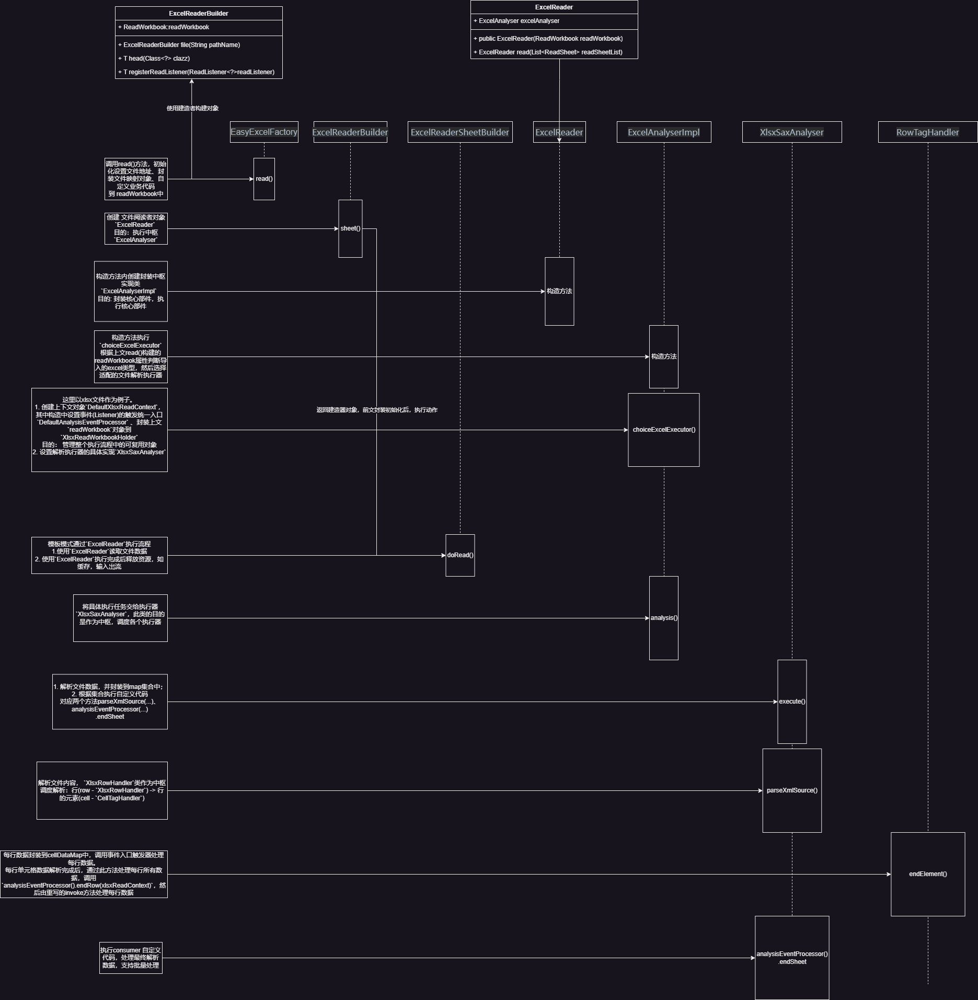

# EasyExcel源码理解

## 简单读取文件代码流程

以最基础的**读Execl**操作入手，即以下方法：

```java
    @Test
    public void simpleRead() {
        String fileName = TestFileUtil.getPath() + "demo" + File.separator + "demo.xlsx";
        EasyExcel.read(fileName, DemoData.class, new PageReadListener<DemoData>(dataList -> {
            for (DemoData demoData : dataList) {
                log.info("读取到一条数据{}", JSON.toJSONString(demoData));
            }
        })).sheet().doRead();
    }
```

方法的每步作用：

1. `read()` 和 `sheet()` 方法目的是构建对象，封装属性；
2. `doRead()` 方法利用前文构建的对象去解析`Excel`文件数据，并且执行自定义的业务代码。

### read()

```java
    public static ExcelReaderBuilder read(String pathName, Class head, ReadListener readListener) {
        ExcelReaderBuilder excelReaderBuilder = new ExcelReaderBuilder();
        excelReaderBuilder.file(pathName);
        if (head != null) {
            excelReaderBuilder.head(head);
        }
        if (readListener != null) {
            excelReaderBuilder.registerReadListener(readListener);
        }
        return excelReaderBuilder;
    }
```

`ExcelReaderBuilder`建造者构建的对象为`ReadWorkbook`。`read()`方法封装了<u>文件路径、行对象Class、自定义处理Excel数据方法</u>。

### sheet()

```java
public ExcelReaderSheetBuilder sheet(Integer sheetNo, String sheetName) {
    // 其中build()方法封装核心的组建
    ExcelReaderSheetBuilder excelReaderSheetBuilder = new ExcelReaderSheetBuilder(build());
    if (sheetNo != null) {
        excelReaderSheetBuilder.sheetNo(sheetNo);
    }
    if (sheetName != null) {
        excelReaderSheetBuilder.sheetName(sheetName);
    }
    return excelReaderSheetBuilder;
}
```

`ExcelReaderSheetBuilder`建造者构建对象`ExcelReader`，`ExcelReader`对象封装的重要对象为`ExcelAnalyser`。

```java
public ExcelReader(ReadWorkbook readWorkbook) {
    // 封装中枢实现类  --> 此对象目的: 封装核心部件，执行核心部件
    excelAnalyser = new ExcelAnalyserImpl(readWorkbook);
}
```

`ExcelReader`职责是调用`ExcelAnalyser`读取Excel文件数据；处理过数据后释放`ExcelAnalyser`资源。具体在代码中表现如下。

### doRead()

```java
public void doRead() {
    if (excelReader == null) {
        throw new ExcelGenerateException("Must use 'EasyExcelFactory.read().sheet()' to call this method");
    }
    excelReader.read(build());
    excelReader.finish();
}
```

关键方法是读取Excel表格，处理数据。即`excelReader.read(build());`

```java
public ExcelReader read(List<ReadSheet> readSheetList) {
    // 读取文件数据，并且执行自定义业务代码
    excelAnalyser.analysis(readSheetList, Boolean.FALSE);
    return this;
}
```

`ExcelAnalyser`实现类`ExcelAnalyserImpl`执行核心方法

```java
public void analysis(List<ReadSheet> readSheetList, Boolean readAll) {
    try {
        if (!readAll && CollectionUtils.isEmpty(readSheetList)) {
            throw new IllegalArgumentException("Specify at least one read sheet.");
        }
        analysisContext.readWorkbookHolder().setParameterSheetDataList(readSheetList);
        analysisContext.readWorkbookHolder().setReadAll(readAll);
        try {
            // 调用执行器 
            excelReadExecutor.execute();
        } catch (ExcelAnalysisStopException e) {
            if (LOGGER.isDebugEnabled()) {
                LOGGER.debug("Custom stop!");
            }
        }
    } catch (RuntimeException e) {
        finish();
        throw e;
    } catch (Throwable e) {
        finish();
        throw new ExcelAnalysisException(e);
    }
}
```

调用执行器：

1. 解析文件数据，并将每行数据封装到map集合中；
2. 每解析一行后，根据集合执行自定义代码。

方法中出现三类重要的对象：`ExcelAnalyser`、`AnalysisContext`、`ExcelReadExecutor`.

### `ExcelAnalyser`

<u>*文件解析器-中枢dispatch.*</u>

`ExcelReader`构造方法中初始化`excelAnalyser`属性，具体实现为`ExcelAnalyserImpl`。而`ExcelAnalyserImpl`构造方法传参为`readWorkbook`其中封装了文件的关键信息，代码如下。

```java
public ExcelAnalyserImpl(ReadWorkbook readWorkbook) {
    try {
        // 根据导入的excel类型选择适配的文件解析执行器
        choiceExcelExecutor(readWorkbook);
    } catch (RuntimeException e) {
        finish();
        throw e;
    } catch (Throwable e) {
        finish();
        throw new ExcelAnalysisException(e);
    }
}
```

选择合适的文件解析执行器，封装`ExcelAnalyser`中两个关键的属性：`analysisContext`、`excelReadExecutor`。

```java
private void choiceExcelExecutor(ReadWorkbook readWorkbook) throws Exception {
    //...
    case XLSX:
    // 创建上下文对象，其中设置事件(Listener)的触发统一入口`DefaultAnalysisEventProcessor` --> 此类目的： 管理整个执行流程中的可复用对象
    XlsxReadContext xlsxReadContext = new DefaultXlsxReadContext(readWorkbook, ExcelTypeEnum.XLSX);
    analysisContext = xlsxReadContext;
    // 设置解析执行器的具体实现
    excelReadExecutor = new XlsxSaxAnalyser(xlsxReadContext, null);
    break; 
    //...
}
```

#### `AnalysisContext`

流程执行上下文，存储了流程执行中所有公共的复用对象。

上下文对象封装两个重要属性：`readWorkbookHolder`等`Holder`、用户自定义`Listener`的方法的执行器`analysisEventProcessor`

> `AnalysisContext`作为上下文资源的管理者，具体的资源存储在各个`Holder`中。

```java
public AnalysisContextImpl(ReadWorkbook readWorkbook, ExcelTypeEnum actualExcelType) {
    if (readWorkbook == null) {
        throw new IllegalArgumentException("Workbook argument cannot be null");
    }
    switch (actualExcelType) {
        case XLS:
            readWorkbookHolder = new XlsReadWorkbookHolder(readWorkbook);
            break;
        case XLSX:
            readWorkbookHolder = new XlsxReadWorkbookHolder(readWorkbook);
            break;
        case CSV:
            readWorkbookHolder = new CsvReadWorkbookHolder(readWorkbook);
            break;
        default:
            break;
    }
    currentReadHolder = readWorkbookHolder;
    // 事件的触发统一入口
    analysisEventProcessor = new DefaultAnalysisEventProcessor();
    if (log.isDebugEnabled()) {
        log.debug("Initialization 'AnalysisContextImpl' complete");
    }
}
```

#### `excelReadExecutor`

文件解析执行器，其中关键方法为`execute()`。对文件进行每行内容解析并封装为对象的集合、执行自定义代码。

```java
public void execute() {
    for (ReadSheet readSheet : sheetList) {
        readSheet = SheetUtils.match(readSheet, xlsxReadContext);
        if (readSheet != null) {
            try {
                xlsxReadContext.currentSheet(readSheet);
                // 解析文件内容， `XlsxRowHandler`类作为中枢调度解析：行(row - `XlsxRowHandler`) -> 行的元素(cell - `CellTagHandler`)
                parseXmlSource(sheetMap.get(readSheet.getSheetNo()), new XlsxRowHandler(xlsxReadContext));
                // Read comments
                readComments(readSheet);
            } catch (ExcelAnalysisStopSheetException e) {
                if (log.isDebugEnabled()) {
                    log.debug("Custom stop!", e);
                }
            }
            // The last sheet is read
            // 执行Listener接口的doAfterAllAnalysed()方法 `ReadListener.doAfterAllAnalysed()`
            xlsxReadContext.analysisEventProcessor().endSheet(xlsxReadContext);
        }
    }
}
```

其中核心的文件解析方法为`parseXmlSource()`，`XlsxRowHandler`类作为中枢调度解析：行(row - `XlsxRowHandler`) -> 行的元素(cell - `CellTagHandler`)

两个类都继承了`AbstractXlsxTagHandler`抽象类，两个核心方法`startElement()`、`endElement()`;

1. `CellTagHandler`：`startElement()`: 初始化数据存放集合，数据结构等、`endElement()`: 封装每个单元格数据到`tempCellData`.
2. `RowTagHandler`:   `startElement()`: 初始化数据存放集合，数据结构等、`endElement`： 每行单元格解析完成后，执行次方法，调度事件处理业务代码.

> 执行的先后顺序为  `RowTagHandler#startElement()` --> `CellTagHandler#startElement()` --> `CellTagHandler#endElement()` -->  `RowTagHandler#endElement()`

这里我们只关注最后的一个方法`RowTagHandler#endElement()`，即每行处理后调用自定义方法处理数据。

```java
@Override
public void endElement(XlsxReadContext xlsxReadContext, String name) {
    XlsxReadSheetHolder xlsxReadSheetHolder = xlsxReadContext.xlsxReadSheetHolder();
    RowTypeEnum rowType = MapUtils.isEmpty(xlsxReadSheetHolder.getCellMap()) ? RowTypeEnum.EMPTY : RowTypeEnum.DATA;
    // It's possible that all of the cells in the row are empty
    if (rowType == RowTypeEnum.DATA) {
        boolean hasData = false;
        for (Cell cell : xlsxReadSheetHolder.getCellMap().values()) {
            if (!(cell instanceof ReadCellData)) {
                hasData = true;
                break;
            }
            ReadCellData<?> readCellData = (ReadCellData<?>)cell;
            if (readCellData.getType() != CellDataTypeEnum.EMPTY) {
                hasData = true;
                break;
            }
        }
        if (!hasData) {
            rowType = RowTypeEnum.EMPTY;
        }
    }
    xlsxReadContext.readRowHolder(new ReadRowHolder(xlsxReadSheetHolder.getRowIndex(), rowType,
        xlsxReadSheetHolder.getGlobalConfiguration(), xlsxReadSheetHolder.getCellMap()));
    // 每行数据封装到cellDataMap中，调用事件入口触发器处理每行数据 ReadListener.invoke();
    xlsxReadContext.analysisEventProcessor().endRow(xlsxReadContext);
    xlsxReadSheetHolder.setColumnIndex(null);
    xlsxReadSheetHolder.setCellMap(new LinkedHashMap<>());
}
```

### `PageReadListener`

```java
public class PageReadListener<T> implements ReadListener<T> {
    /**
     * Default single handle the amount of data
     */
    public static int BATCH_COUNT = 100;
    /**
     * Temporary storage of data
     */
    private List<T> cachedDataList = ListUtils.newArrayListWithExpectedSize(BATCH_COUNT);
    /**
     * consumer
     */
    private final Consumer<List<T>> consumer;

    /**
     * Single handle the amount of data
     */
    private final int batchCount;

    public PageReadListener(Consumer<List<T>> consumer) {
        this(consumer, BATCH_COUNT);
    }

    public PageReadListener(Consumer<List<T>> consumer, int batchCount) {
        this.consumer = consumer;
        this.batchCount = batchCount;
    }

    @Override
    public void invoke(T data, AnalysisContext context) {
        cachedDataList.add(data);
        if (cachedDataList.size() >= batchCount) {
            consumer.accept(cachedDataList);
            cachedDataList = ListUtils.newArrayListWithExpectedSize(batchCount);
        }
    }

    @Override
    public void doAfterAllAnalysed(AnalysisContext context) {
        if (CollectionUtils.isNotEmpty(cachedDataList)) {
            consumer.accept(cachedDataList);
        }
    }

}
```

### 流程图解析




