# 什么是JVM

## 定义：

Java Virtual Machine - java 程序的运行环境（java 二进制字节码的运行环境）

## 好处：

* 一次编写，到处运行

* 自动内存管理，垃圾回收功能

* 数组下标越界检查

* 多态

## 比较：jvm jre jdk

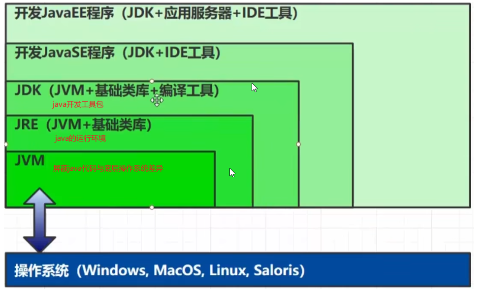

# JVM学习路线

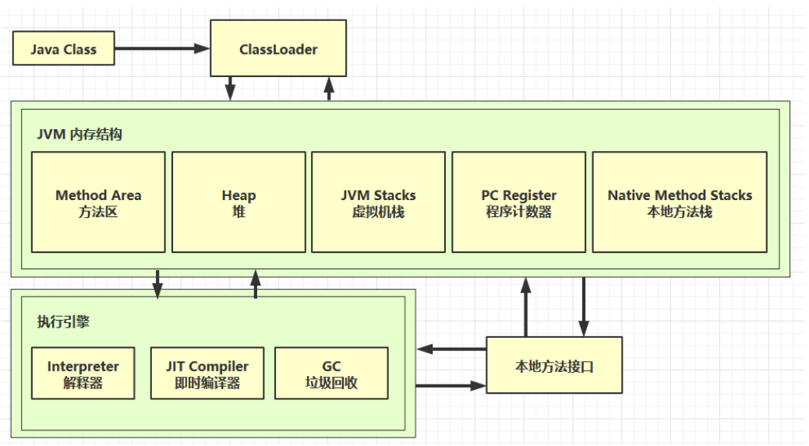

* JVM内存结构

# 内存结构

1. **程序计数器**

   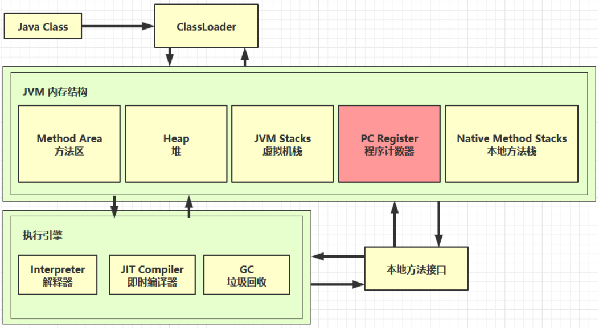

2. **虚拟机栈**

3. **本地方法栈**

4. **堆**

5. **方法区**

## 程序计数器

**定义**

Program Counter Register 程序计数器（寄存器，物理地址是使用寄存器作为程序计数器），字节码解释器工作时就是通过改变这个计数器的值来选取下一条需要执行的字节码指令，分支、循环、跳转、异常处理、线程恢复等基础功能都需要依赖这个计数器来完成。

**特点**

* 是线程私有的

* 不会存在内存溢出

**作用**

作用，是记住下一条jvm指令的执行地址

~~~java
0: getstatic #20 		// PrintStream out = System.out;
3: astore_1 			// --
4: aload_1 				// out.println(1);
5: iconst_1 			// --
6: invokevirtual #26 	// --
9: aload_1 				// out.println(2);
10: iconst_2 			// --
11: invokevirtual #26 	// --
14: aload_1 			// out.println(3);
15: iconst_3 			// --
16: invokevirtual #26 	// --
19: aload_1 			// out.println(4);
20: iconst_4			// --
21: invokevirtual #26 	// --
24: aload_1 			// out.println(5);
25: iconst_5 			// --
26: invokevirtual #26 	// --
29: return
~~~

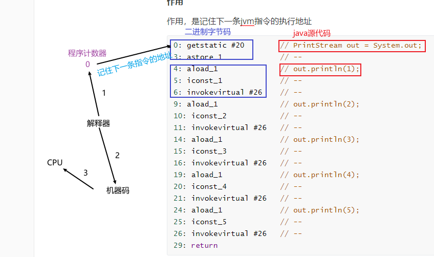

> 如果线程正在执行的是一个Java方法，这个计数器记录的是正在执行的虚拟机字节码指令的地址，如果正在执行的是 Native 方法，这个数器值则为空 (Undefined)。

## 虚拟机栈

**定义**

Java Virtual Machine Stacks （Java 虚拟机栈）

* 每个线程运行时所需要的内存，称为虚拟机栈

* 每个栈由多个栈帧（Frame）组成，对应着每次方法调用时所占用的内存

* 每个线程只能有一个活动栈帧，对应着当前正在执行的那个方法

**问题辨析**

1. 垃圾回收是否涉及栈内存？		不需要，每次栈帧使用完毕也就是方法执行完成后，会进行栈帧的弹出。

2. 栈内存分配越大越好吗？		    不是，栈内存越大，线程数越少。栈内存增大只会增多方法递归的调用。     

3. 方法内的局部变量是否线程安全？

* 如果方法内局部变量没有逃离方法的作用访问，它是线程安全的

* 如果是局部变量引用了对象，并逃离方法的作用范围，需要考虑线程安全

**栈内存溢出**

* 栈帧过多导致栈内存溢出

* 栈帧过大导致栈内存溢出

**线程运行诊断**

案例：cpu 占用过多

定位

* 用top定位哪个进程对cpu的占用过高

* ps H -eo pid,tid,%cpu | grep 进程id （用ps命令进一步定位是哪个线程引起的cpu占用过高）

* jstack 进程id
  * 可以根据线程id 找到有问题的线程，进一步定位到问题代码的源码行号

## 本地方法栈

调用本地方法的方法使用的栈内存。本地方法常用`native`关键字标识；

本地方法栈 (Native Method Stack) 与虚拟机栈所发挥的作用是非常相似的，它们之间的区别不过是虚拟机栈为虚拟机执行 Java 方法(也就是字节码)服务，而本地方法栈则为虚拟机使用到的 Native 方法服务

本地方法是`java`层面不能实现的方法，而使用`C`或者`C++`进行方法实现底层的逻辑。

## 堆

**定义**

Heap 堆，通过 new 关键字，创建对象都会使用堆内存

**特点**

* 它是线程共享的，堆中对象都需要考虑线程安全的问题

* 有垃圾回收机制

**堆内存溢出诊断**

1. jps 工具

查看当前系统中有哪些 java 进程

2. jmap 工具

查看堆内存占用情况 jmap - heap 进程id

3. jconsole 工具

图形界面的，多功能的监测工具，可以连续监测

**案例**

* 垃圾回收后，内存占用仍然很高

## 方法区

**定义**
Java 虚拟机有一个在所有 Java 虚拟机线程之间共享的方法区域。它存储每个类的结构，例如运行时常量池、字段和方法数据，以及方法和构造函数的代码，包括类和实例初始化以及接口初始化中使用的特殊方法。<u>方法区域在逻辑上是堆的一部分</u>。

**组成**

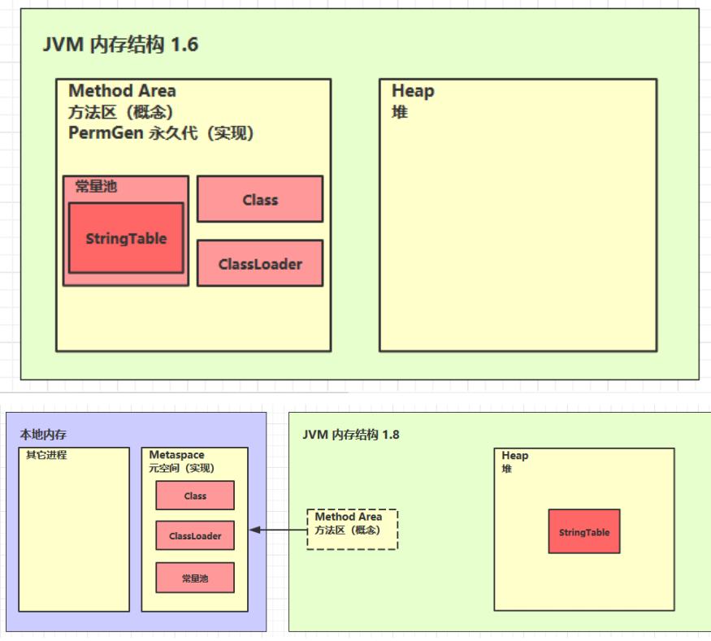

**方法区内存溢出**

1.8 以前会导致永久代内存溢出  

* 演示永久代内存溢出 `java.lang.OutOfMemoryError: PermGen space`

* `-XX:MaxPermSize=8m`

1.8 之后会导致元空间内存溢出

* 演示元空间内存溢出 `java.lang.OutOfMemoryError: Metaspace`
* `-XX:MaxMetaspaceSize=8m`

> 这区域的内存回收目标主要是针对常量池的回收和对类型的卸载

**运行时常量池**

* 常量池，就是一张表，虚拟机指令根据这张常量表找到要执行的类名、方法名、参数类型、字面量等信息
* 运行时常量池，常量池是 *.class 文件中的，当该类被加载，它的常量池信息就会放入运行时常量池，并把里面的符号地址变为真实地址
* 运行时常量池相对于 Class 文件常量池的另外一个重要特征是具备动态性，Java 语言并不要求常量一定只有编译期才能产生，也就是并非预置入 Class 文件中常量池的内容才能进入方法区运行时常量池，运行期间也可能将新的常量放人池中，这种特性被开发人员利用得比较多的便是 String 类的 intern() 方法。

**StringTable（串池）**

先看几道面试题：

~~~java
String s1 = "a";
String s2 = "b";
String s3 = "a" + "b";	//值是固定的，因此在编译期间就能确定s3的值
String s4 = s1 + s2;	//new StringBuilder().append("a").append("b").toString();
String s5 = "ab";		// 串池中有
String s6 = s4.intern();
// 问
System.out.println(s3 == s4); //false
System.out.println(s3 == s5); //true
System.out.println(s3 == s6); //true

String x2 = new String("c") + new String("d"); 	//new String("cd")
x2.intern();		//1.8放入串池并且返回给x2 //1.6复制一份放入串池
String x1 = "cd";	
// 如果是jdk1.6呢
 //1.8 true  //1.6 false
System.out.println(x1 == x2);
~~~

**StringTable** **特性**

* 常量池中的字符串仅是符号，第一次用到时才变为对象

* 利用串池的机制，来避免重复创建字符串对象

* 字符串变量拼接的原理是 StringBuilder （1.8）

* 字符串常量拼接的原理是编译期优化

* 可以使用 intern 方法，主动将串池中还没有的字符串对象放入串池
  * 1.8 将这个字符串对象尝试放入串池，如果有则并不会放入，如果没有则放入串池， 会把串池中的对象返回
  * 1.6 将这个字符串对象尝试放入串池，如果有则并不会放入，如果没有会把此对象复制一份，放入串池

> String.intern() 是一个 Native 方法，它的作用是: 如果字符串常量池中已经包含一个等于此 String 对象的字符串，则返回代表池中这个字符串的 String 对象;否则，将此 String 对象包含的字符串添加到常量池中，并且返回此 String 对象的引用。

**StringTable** **位置**

* 1.6在PermGen永久代
* 1.8在Heap堆内存

**StringTable** **性能调优**

* 调整 -XX:StringTableSize=桶个数

* 考虑将字符串对象是否入池

## 直接内存

**定义**

Direct Memory

* 常见于 NIO 操作时，用于数据缓冲区

* 属于操作系统内存，分配回收成本较高，但读写性能高

* 不受 JVM 内存回收管理

**`Java IO`读取文件**

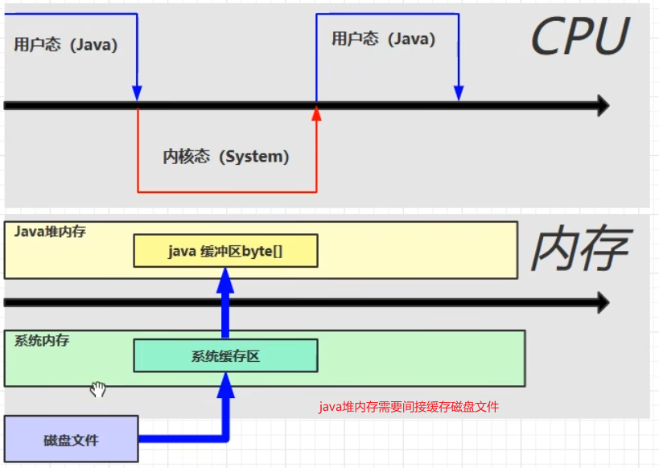

**`NIO`读取文件**

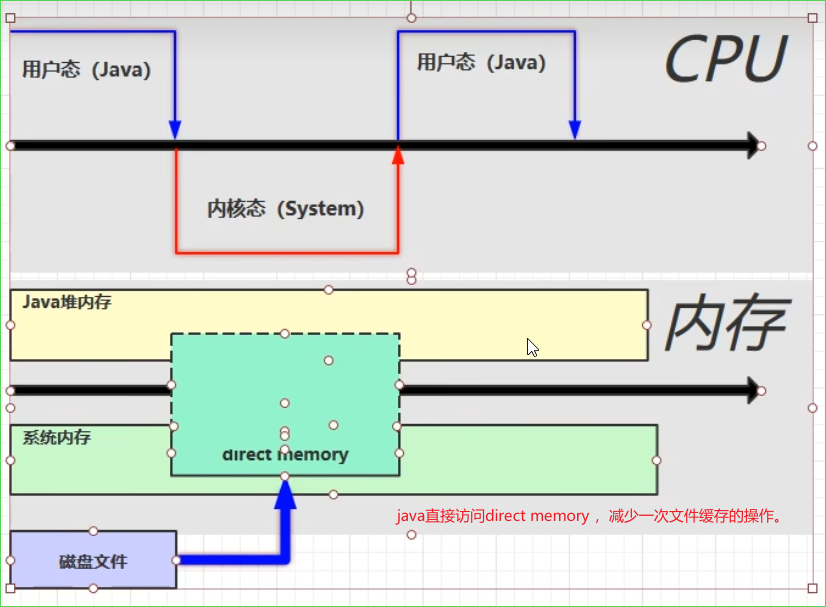

**分配和回收原理**

* 使用了 Unsafe 对象完成直接内存的分配回收，并且回收需要主动调用 freeMemory 方法
* ByteBuffffer 的实现类内部，使用了 Cleaner （虚引用）来监测 ByteBuffffer 对象，一旦ByteBuffffer 对象被垃圾回收，那么就会由 ReferenceHandler 线程通过 Cleaner 的 clean 方法调用 freeMemory 来释放直接内存

## hotspot虚拟机对象

**对象创建**

对象(文中讨论的对象限于普通 Java 对象，不包括数组和 Class 对象等) 的创建又是怎样一个过程呢?

虚拟机遇到一条 new 指令时，首先将去检查这个指令的参数是否能在常量池中定位到一个类的符号引用，并且检查这个符号引用代表的类是否已被加载、解析和初始化过。如果没有，那必须先执行相应的类加载过程。在类加载检查通过后，接下来虚拟机将为新生对象分配内存。

> 在使用 Serial、ParNcw 等带 Compact 过程的收集器时，系统采用的分配算法是指针碰撞，而使用 CMS 这种基于 Mark-Sweep 算法的收集器时，通常采用空闲列表。

**对象的内存布局**

在 HotSpot 虚拟机中，对象在内存中存储的布局可以分为 3 块区域:<u>对象头</u>(Header).<u>实例数据</u> (Instance Data) 和<u>对齐填充</u> (Padding)。

* <u>对象头</u>包括两部分信息 :① 第一部分用于存储对象自身的运行时数据,如哈希码 (HashCode)、GC 分代年龄、锁状态标志、线程持有的锁、偏向线程ID、偏向时间戳等，这部分数据的长度在 32 位和 64 位的虚拟机(未开启压缩指针) 中分别为 32bit 和64bit，官方称它为“Mark Word”。② 对象头的另外一部分是类型指针，即对象指向它的类元数据的指针，虚拟机通过这个指针来确定这个对象是哪个类的实例。

> 如果对象是一个 Java 数组，那在对象头中还必须有一块用于记录数组长度的数据，因为虚拟机可以通过普通 Java 对象的元数据信息确定 Java 对象的大小，但是从数组的元数据中却无法确定数组的大小。

* 接下来的<u>实例数据</u>部分是对象真正存储的有效信息，也是在程序代码中所定义的各种类型的字段内容。

* 第三部分<u>对齐填充</u>并不是必然存在的，也没有特别的含义，它仅仅起着占位符的作。

**对象的访问定位**

目前主流的访问方式有使用句柄和直接指针两种

句柄 访问

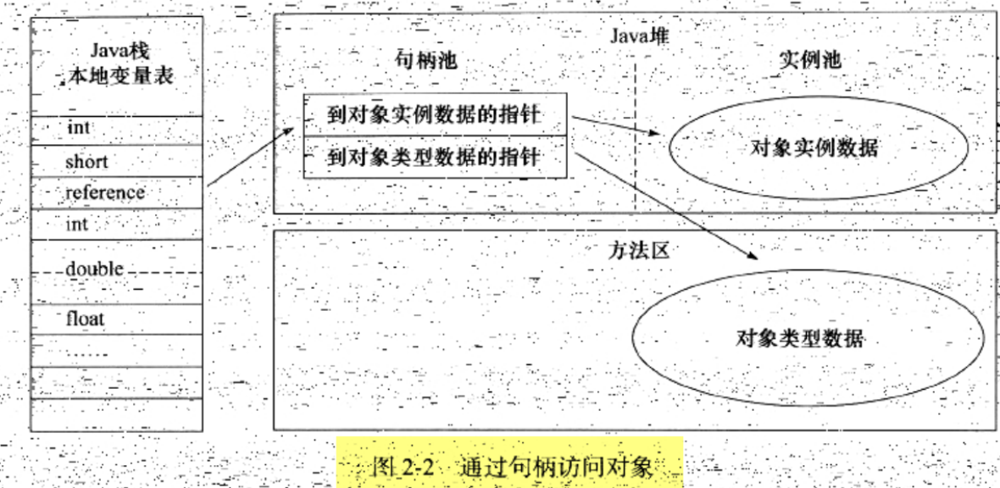

直接指针 访问

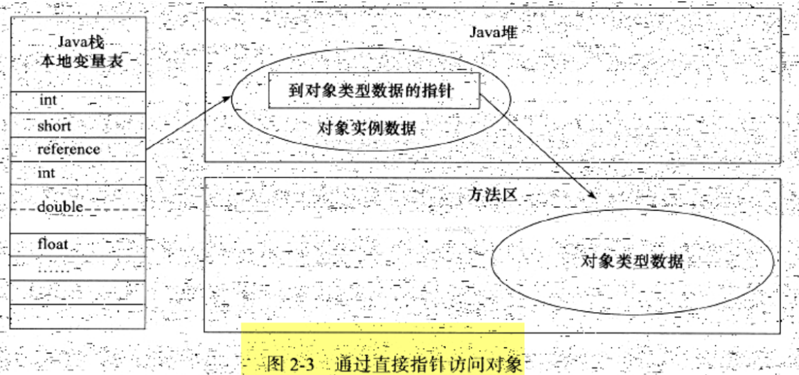

## outOfMemoryError

**虚拟机栈和本地方法方法栈溢出**

关于虚拟机栈和本地方法栈，在 Java 虚拟机规范中描述了两种异常:

* 如果线程请求的栈深度大于虚拟机所允许的最大深度，将抛出 StackOverfiowError 异常

* 如果虚拟机在扩展栈时无法申请到足够的内存空间，则抛出 OutOfMemoryError 异常

> 在单个线程下，无论是由于栈帧太大还是虚拟机栈容量太小，当内存无法分配的时候，虚拟机抛出的都是 StackOverflowError 异常。

# 垃圾回收

## 判断对象可以回收

### 可达性分析算法

* Java 虚拟机中的垃圾回收器采用可达性分析来探索所有存活的对象
* 扫描堆中的对象，看是否能够沿着 GC Root对象 为起点的引用链找到该对象，找不到，表示可以回收
* 这个算法的基本思路就是通过一系列的称为“GC Roots”的对象作为起始点，从这些节点开始向下搜索，搜索所走过的路径称为引用链 (Reference Chain)，当一个对象到 GC Roots 没有任何引用链相连(用图论的话来说，就是从 GC Roots 到这个对象不可达)时，则证明此对象是不可用的
* 哪些对象可以作为 GC Root ?

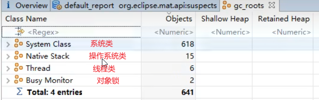

### 回收方法区

永久代的垃圾收集主要回收两部分内容 ： **废弃常量**和**无用的类**

类需要同时满足下面 3 个条件才能算是“无用的类”

* 该类所有的实例都已经被回收，也就是 Java 堆中不存在该类的任何实例。
* 加载该类的 ClassLoader 已经被回收。
* 该类对应的java.lang.Class 对象没有在任何地方被引用，无法在任何地方通过反射访问该类的方法。

### 五种引用

1. 强引用
   * 只有所有 GC Roots 对象都不通过【强引用】引用该对象，该对象才能被垃圾回收

2. 软引用（SoftReference）
   * 仅有软引用引用该对象时，<u>在垃圾回收后，内存仍不足时会再次触发垃圾回收</u>，回收软引用对象可以配合引用队列来释放软引用自身

3. 弱引用（WeakReference）
   * 仅有弱引用引用该对象时，<u>在垃圾回收时，无论内存是否充足</u>，都会回收弱引用对象可以配合引用队列来释放弱引用自身

4. 虚引用（PhantomReference）
   * <u>必须配合引用队列使用</u>，主要配合 ByteBuffffer 使用，被引用对象回收时，会将虚引用入队，由 Reference Handler 线程调用虚引用相关方法释放<u>直接内存</u>

5. 终结器引用（FinalReference）
   * 无需手动编码，但其内部<u>配合引用队列使用</u>，在垃圾回收时，终结器引用入队（被引用对象暂时没有被回收），再由 Finalizer 线程通过终结器引用找到被引用对象并调用它的 fifinalize方法，第二次 GC 时才能回收被引用对象

## 垃圾回收算法

**标记清除**

定义： Mark Sweep

* 速度较快

* 会造成内存碎片

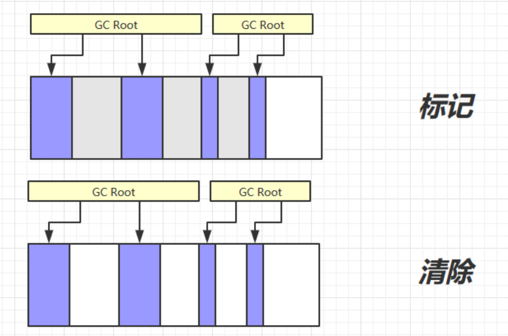

> 注意：标记清除中清除并不会直接将内存清零，而是将内存地址起始结束地址保存在空闲列表中，下次使用时通过保存的地址信息进行合理分配。

**标记整理**

定义：Mark Compact

* 速度慢
* 没有内存碎片

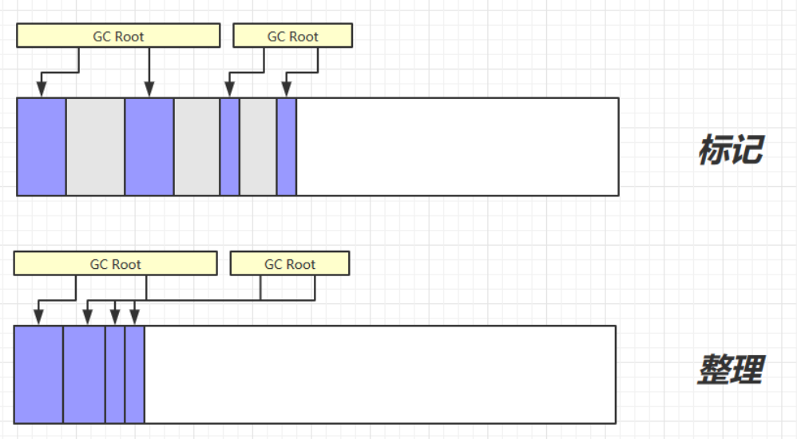

**复制**

定义：Copy

* 不会有内存碎片
* 需要占用双倍内存空间

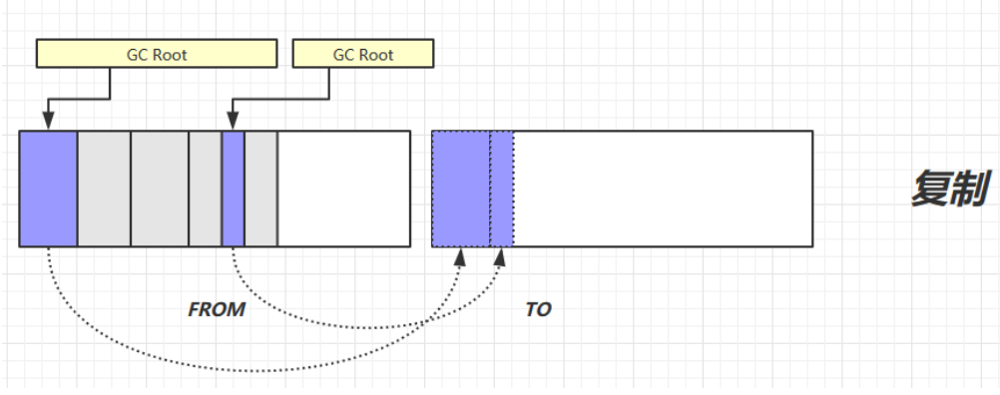

## 分代垃圾回收

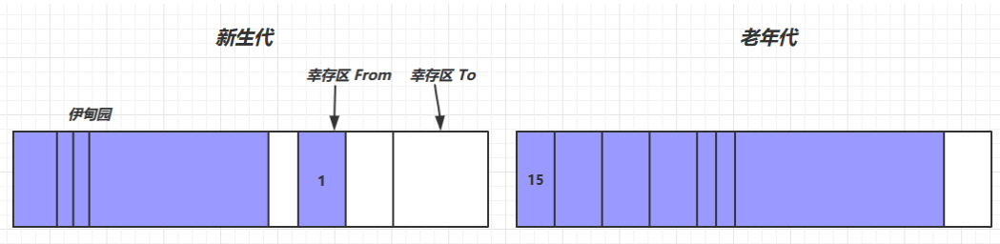

* 对象首先分配在伊甸园区域
* 新生代空间不足时，触发 minor gc，伊甸园和 from 存活的对象使用 copy 复制到 to 中，存活的对象年龄加 1并且交换 from to
* minor gc 会引发 stop the world，暂停其它用户的线程，等垃圾回收结束，用户线程才恢复运行
* 当对象寿命超过阈值时，会晋升至老年代，最大寿命是15（4bit）
* 当老年代空间不足，会先尝试触发 minor gc，如果之后空间仍不足，那么触发 full gc，STW的时间更长

> 为了能更好地适应不同程序的内存状况，虚拟机并不是永远地要求对象的年龄必须达到了MaxTenuringThreshold才能晋老年代，如果在Survivor 空间中相同年龄所有对象大小的总和大下Survivor 空间的半，年龄大于或等于该年龄的对象就可以直接进大老年代，无须等待MaxTenuringThreshold中要求的年龄。

## 垃圾回收器

1. 串行
   * 单线程
   * 堆内存较小，适合个人电脑

2. 吞吐量优先

   * 所谓吞吐量就是 CPU 用于运行用户代码的时间与 CPU 总消耗时间的比值，即吞吐量 = 运行用户代码时间 /(运行用户代码时间 +垃圾收集时间)，虚拟机总共运行了 100 分钟，其中垃圾收集花掉 1 分钟，那吞吐量就是99%。

   * 多线程
   * 堆内存较大，多核 cpu
   * 让单位时间内，STW 的时间最短 0.2 0.2 = 0.4，垃圾回收时间占比最低，这样就称吞吐量高。（最短的时间完成垃圾回收，关注回收量）

3. 响应时间优先
   * 多线程
   * 堆内存较大，多核 cpu
   * 尽可能让单次 STW 的时间最短 0.1 0.1 0.1 0.1 0.1 = 0.5（关注时间短）

### 串行

`-XX:+UseSerialGC = Serial + SerialOld` 	串行垃圾回收：复制（新生代）+ 标记整理（老年代）

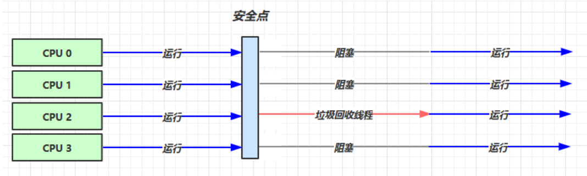

### 吞吐量优先

`-XX:+UseParallelGC` ~` -XX:+UseParallelOldGC`  	并行垃圾回收：复制（新生代）+ 标记整理（老年代）

`-XX:+UseAdaptiveSizePolicy`		动态调整伊甸园和幸存区的大小

`-XX:GCTimeRatio=ratio`		调整吞吐率（1/（1+radio））

`-XX:MaxGCPauseMillis=ms`		最大暂停毫秒数（默认200MS）

`-XX:ParallelGCThreads=n`		垃圾回收线程数

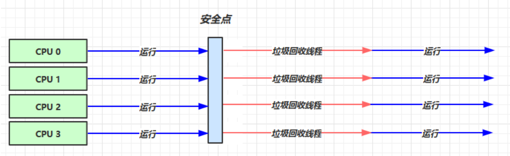

### 响应时间优先（CMS）

`-XX:+UseConcMarkSweepGC ~ -XX:+UseParNewGC ~ SerialOld`		CMS垃圾回收器（老年代）；COPY算法垃圾回收器（新生代）；串行化垃圾回收器（并发失败后）

`-XX:ParallelGCThreads=n ~ -XX:ConcGCThreads=threads`		垃圾回收线程数；标记线程（一般为整体的四分之一）

`-XX:CMSInitiatingOccupancyFraction=percent`	垃圾回收内存占比，预留内存给**浮动垃圾**占中

`-XX:+CMSScavengeBeforeRemark`		重新标记前，再对新生代进行垃圾回收，以防止新生代引用老生代的对象，导致扫描整个堆

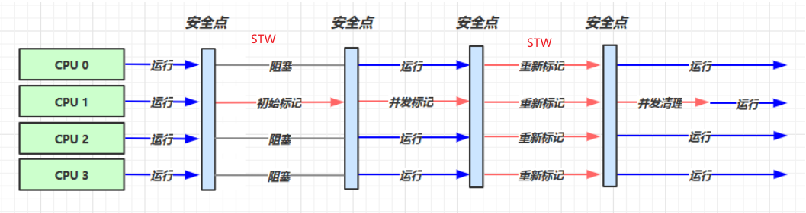

> <u>重新标记</u>进行STW，防止在并发标记的时候其他线程干扰对象引用，从而重新标记
>
> <u>并发清理</u>过程中其他线程产生的垃圾，称为**浮动垃圾**

### G1

**定义**：Garbage First

2004 论文发布

2009 JDK 6u14 体验

2012 JDK 7u4 官方支持

2017 JDK 9 默认

**适用场景**

* 同时注重吞吐量（Throughput）和低延迟（Low latency），默认的暂停目标是 200 ms

* 超大堆内存，会将堆划分为多个大小相等的 Region

* 整体上是 `标记+整理` 算法，两个区域之间是 `复制` 算法

**相关 JVM 参数**

`-XX:+UseG1GC`

`-XX:G1HeapRegionSize=size`

`-XX:MaxGCPauseMillis=time`

**G1** **垃圾回收阶段**

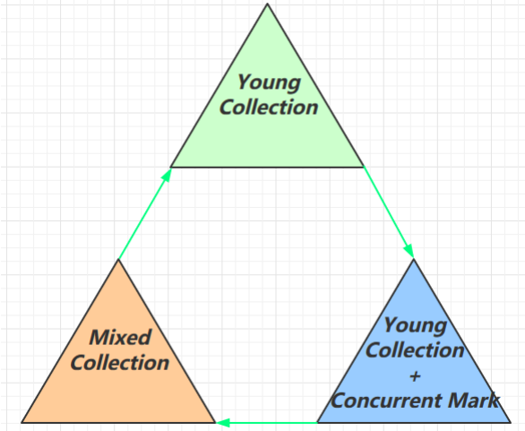

* Young Collection

会 STW

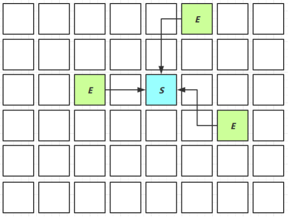

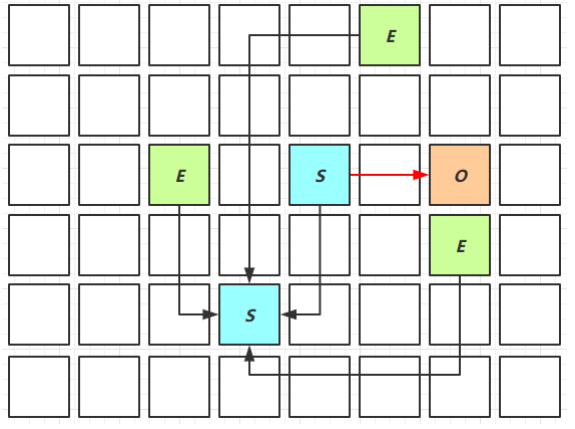

* Young Collection + CM(Concurrent Mark)
  * 在 Young GC 时会进行 GC Root 的初始标记
  * 老年代占用堆空间比例达到阈值时，进行并发标记（不会 STW），由下面的 JVM 参数决定

`-XX:InitiatingHeapOccupancyPercent=percent` （默认45%）

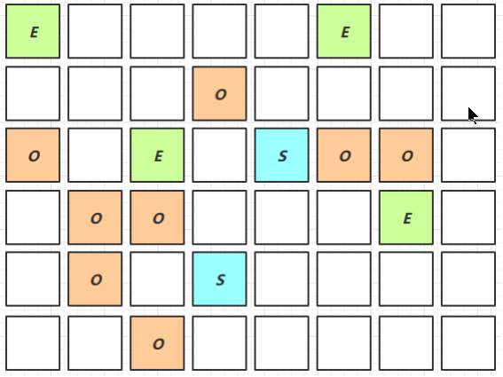

* Mixed Collection

  会对 E、S、O 进行全面垃圾回收

  ​	最终标记（Remark）会 STW

  ​	拷贝存活（Evacuation）会 STW

  `-XX:MaxGCPauseMillis=ms` 	设置暂停时间，在暂停时间内复制部分老年代

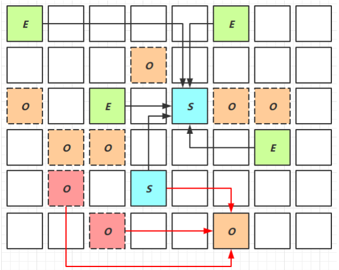

**Full GC**

* SerialGC
  * 新生代内存不足发生的垃圾收集 - minor gc
  * 老年代内存不足发生的垃圾收集 - full gc

* ParallelGC
  * 新生代内存不足发生的垃圾收集 - minor gc
  * 老年代内存不足发生的垃圾收集 - full gc

* CMS
  * 新生代内存不足发生的垃圾收集 - minor gc
  * 老年代内存不足

* G1
  * 新生代内存不足发生的垃圾收集 - minor gc
  * 老年代内存不足

**Young Collection** **跨代引用**

* 新生代回收的跨代引用（老年代引用新生代）问题

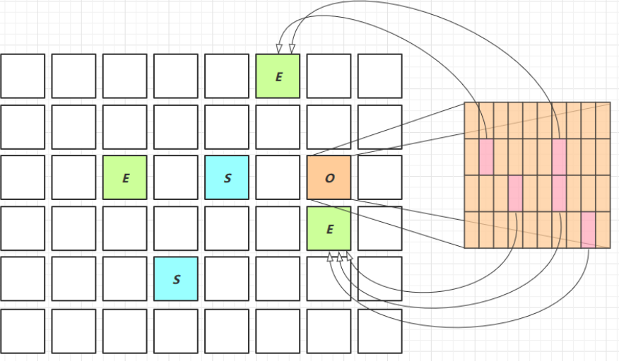

* 卡表与 Remembered Set

* 在引用变更时通过 post-write barrier + dirty card queue

* concurrent refinement threads 更新 Remembered Set

**JDK 8u20** **字符串去重**

* 优点：节省大量内存

- 缺点：略微多占用了 cpu 时间，新生代回收时间略微增加

`-XX:+UseStringDeduplication`   默认开启

~~~java
String s1 = new String("hello"); // char[]{'h','e','l','l','o'}
String s2 = new String("hello"); // char[]{'h','e','l','l','o'}
~~~

* 将所有新分配的字符串放入一个队列
* 当新生代回收时，G1并发检查是否有字符串重复
* 如果它们值一样，让它们引用同一个 char[]

>  注意，与 String.intern() 不一样
>
> String.intern() 关注的是<u>字符串对象</u>
>
> 而字符串去重关注的是 char[]
>
> 在 JVM 内部，使用了不同的字符串表

 **JDK 8u40** **并发标记类卸载**

所有对象都经过并发标记后，就能知道哪些类不再被使用，当一个类加载器的所有类都不再使用，则卸载它所加载的所有类

`-XX:+ClassUnloadingWithConcurrentMark` 默认启用

 **JDK 8u60** **回收巨型对象**

* 一个对象大于 region 的一半时，称之为巨型对象
* G1 不会对巨型对象进行拷贝
* 回收时被优先考虑
* G1 会跟踪老年代所有 incoming 引用，这样老年代 incoming 引用为0 的巨型对象就可以在新生代垃圾回收时处理掉

### 垃圾回收调优

**调优领域**

* 内存
* 锁竞争
* cpu 占用
* io

**确定目标**

* 【低延迟】还是【高吞吐量】，选择合适的回收器

- CMS，G1，ZGC

- ParallelGC

- Zing

**最快的** **GC**

- 答案是不发生 GC

- 查看 FullGC 前后的内存占用，考虑下面几个问题
  - 数据是不是太多？
    - resultSet = statement.executeQuery("select * from 大表 limit n")
  - 数据表示是否太臃肿？
    - 对象图
    - 对象大小 16 Integer 24 int 4

  * 是否存在内存泄漏？

    - static Map map =	

    - 软
    - 弱
    -  第三方缓存实现

**新生代调优**

- 新生代的特点
  - 所有的 new 操作的内存分配非常廉价
    - TLAB thread-local allocation buffffer
  - 死亡对象的回收代价是零
  - 大部分对象用过即死
  - Minor GC 的时间远远低于 Full GC

**老年代调优**

以 CMS 为例

- CMS 的老年代内存越大越好

- 先尝试不做调优，如果没有 Full GC 那么已经...，否则先尝试调优新生代
- 观察发生 Full GC 时老年代内存占用，将老年代内存预设调大 1/4 ~ 1/3
  - -XX:CMSInitiatingOccupancyFraction=percent

**案例分析**

① 堆外内存导致的溢出错误

垃圾收集进行时，虚拟机虽然会对 Direct Memory 进行回收，但是 DirectMemory 却不能像新生代、老年代那样，发现空间不足了就通知收集器进行垃圾回收，它只能等待老年代满了后 Full GC，然后“顺便地”帮它清理掉内存的废弃对象。否则它只能一直等到抛出内存溢出异常时，先 catch 掉，再在 catch 块里面“大喊”一声:“System.gc()!”。要是虚拟机还是不听(如打开了 -XX:+DisableExplicitGC 开关)，那就只能眼睁睁地看着堆中还有许多空闲内存，自己却不得不抛出内存溢出异常了

从实践经验的角度出发，除了 Java 堆和永久代之外，我们注意到下面这些区域还会占用较多的内存，这里所有的内存总和受到操作系统进程最大内存的限制。

② 外部命令导致系统缓慢

每个用户请求的处理都需要执行一个外部 shell 脚本来获得系统的一些信息。执行这个 shell 脚本是通过Java.Runtime.getRuntime(.exec0 方法来调用的

Java 虚拟机执行这个命令的过程是:首先克隆一个和当前虚拟机拥有一样环境变量的进程，再用这个新的进程去执行外部命令，最后再退出这个进程。如果频繁执行这个操作，系统的消耗会很大，不仅是 CPU，内存负担也很重。

# 类加载与字节码技术

## 概述

**无关性的基石**

1. 实现语言无关性的基础仍然是虚拟机和字节码存储格式；

2. Java虚拟机不和包括Java在内的任何语言绑定，它只与“Class文件”这种特定的二进制文件格式所关联，Class文件中包含了Java虚拟机指令集和符号表以及若干其他辅助信息；
3. 作为一个通用的、机器无关的执行平台，任何其他语言的实现者都可以将Java虚拟机作为语言的产品交付媒介
   - 例如，使用Java编译器可以把Java代码编译为存储字节码的Class文件，使用JRuby等其他语言的编译器一样可以把程序代码编译成Class文件，虚拟机并不关心Class的来源是何种语言，如图

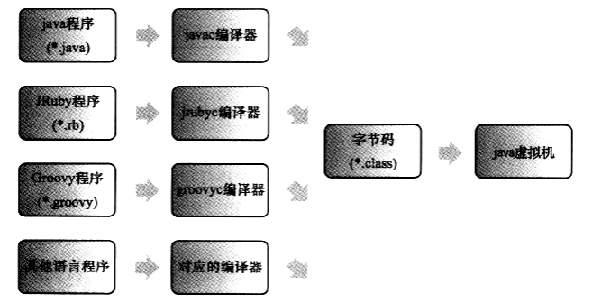

**介绍**

1. 类文件结构
2. 字节码指令
3. 编译期处理
4. 类加载阶段
5. 类加载器
6. 运行期优化

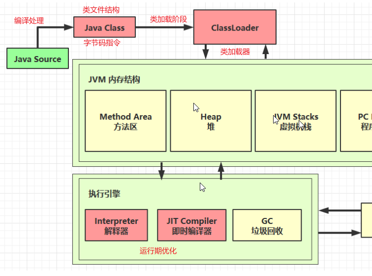

## 类文件结构

整个Class文件实质上就是一张表。

~~~java
ClassFile {
    u4 				magic;
    u2 				minor_version;
    u2 				major_version;
    u2 				constant_pool_count;
    cp_info 		constant_pool[constant_pool_count-1];
    u2 				access_flags;
    u2 				this_class;
    u2 				super_class;
    u2 				interfaces_count;
    u2 				interfaces[interfaces_count];
    u2 				fields_count;
    field_info 		fields[fields_count];
    u2 				methods_count;
    method_info 	methods[methods_count];
    u2 				attributes_count;
    attribute_info 	attributes[attributes_count];
}
~~~

> 以helloworld.class为例

**魔数**

0~3 字节，每个Class文件的头4个字节称为魔术，它的唯一作用是确定这个文件是否为一个能被虚拟机接受的Class文件。

0000000 <u>ca fe ba be</u> 00 00 00 34 00 23 0a 00 06 00 15 09

**版本**

4~7 字节，表示类的版本 00 34（52） 表示是 Java 8

0000000 ca fe ba be <u>00 00 00 34</u> 00 23 0a 00 06 00 15 09

**常量池**

* 他是Class文件结构中与其他项目相关最多的数据类型，也是占用Class文件空间最大的数据项目之一，同时还是Class文件中第一个出现表类型数据项目；

- 8~9 字节，表示常量池长度，00 23 （35） 表示常量池有 #1~#34项，注意 #0 项不计入，也没有值；

> 设计者将第0项常量空出来的目的在于满足后面某些指向常量池的索引值的数据在特定情况下需要表达“不引用任何一个常量池项目”的含义，这种情况就可以吧索引值设置为0来表示；

- class文件只有常量池容量计数是从1开始，其他集合类型，包括接口索引集合，字段集合等都是从0开始计数。

0000000 ca fe ba be 00 00 00 34 <u>00 23</u> 0a 00 06 00 15 09

**字段表集合**

描述符的作用是用来描述字段的数据类型，方法的参数列表（包括数量、类型以及顺序）和返回值。

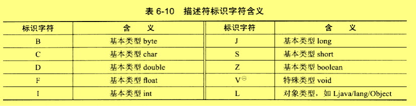

方法`java.lang.String.toString()`的描述符为"`()Ljava/lang/String`"

**方法表集合**

类构造器”`<c|init>`“方法和是实例构造器"`<init>`"方法

**属性表集合**

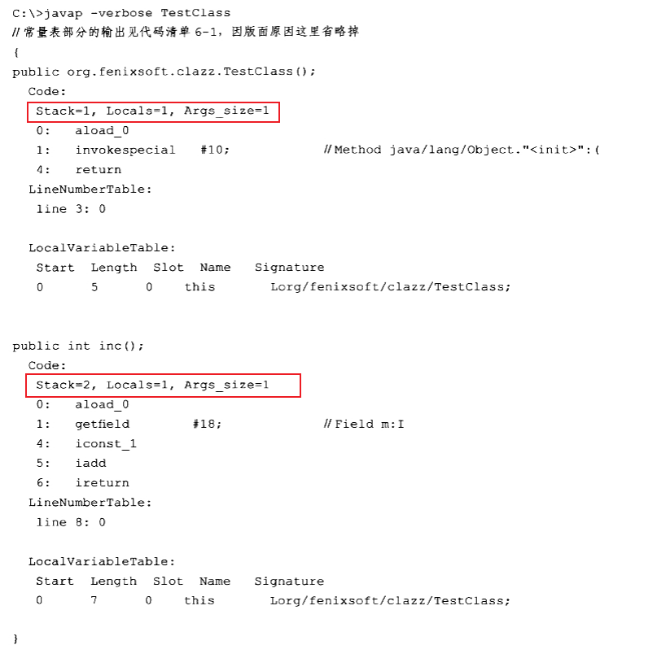

如果大家注意到`javap`中输出的“`Args_size`”的值，可能会有疑问：这个类有两个方法——实例构造器`<init>()`和`inc()`,这两个方法很明显都是没有参数的，为什么`Args_size`会为1?而且无论是在参数列表里还是方法体内，都没有定义任何局部变量，那Locals又为什么会等于1?如果有这样的疑问，大家可能是忽略了一点：在任何实例方法里面，都可以通过“this”关键字访问到此方法所属的对象。

这个访问机制对Java程序的编写很重要，而它的实现却非常简单，仅仅是通过Javac编译器编译的时候把对this关键字的访问转变为对一个普通方法参数的访问，然后在虚拟机调用实例方法时自动传入此参数而已。因此在实例方法的局部变量表中至少会存在一个指向当前对象实例的局部变量，局部变量表中也会预留出第一个Slot位来存放对象实例的引用，方法参数值从1开始计算。<u>这个处理只对实例方法有效</u>，如果代码清单6-1中的inc()方法声明为`static`,那`Args_size`就不会等于1而是等于0了

**访问标识与继承信息**

21 表示该 class 是一个类，公共的(access_flags)

0000660 29 56 <u>00 21</u> 00 05 00 06 00 00 00 00 00 02 00 01

05 表示根据常量池中 #5 找到本类全限定名(this_class)

0000660 29 56 00 21 <u>00 05</u> 00 06 00 00 00 00 00 02 00 01

06 表示根据常量池中 #6 找到父类全限定名(super_class)

0000660 29 56 00 21 00 05 <u>00 06</u> 00 00 00 00 00 02 00 01

表示接口的数量，本类为 0（interfaces_count）

0000660 29 56 00 21 00 05 00 06 <u>00 00</u> 00 00 00 02 00 01

**Field** **信息**

表示成员变量数量，本类为 0

0000660 29 56 00 21 00 05 00 06 00 00 00 <u>00 00</u> 02 00 01

**Method** **信息**

表示方法数量，本类为 2

0000660 29 56 00 21 00 05 00 06 00 00 00 00 <u>00 02</u> 00 01

**附加属性**

- 00 01 表示附加属性数量

- 00 13 表示引用了常量池 #19 项，即【SourceFile】，用于记录生成这个class文件的源码文件名称

  > 对于大多数类来说，类名和文件名是一致的，但是有一些特殊情况（如内部类）例外，如果不生成这项属性，当抛出异常时，堆栈中将不会显示出错代码所属的文件名。

- 00 00 00 02 表示此属性的长度

- 00 14 表示引用了常量池 #20 项，即【HelloWorld.java】

0001100 00 12 00 00 00 05 01 00 10 00 00 <u>00 01 00 13 00</u>

0001120 <u>00 00 02 00 14</u>

## 字节码指令

**入门**

接着上一节，研究一下两组字节码指令，一个是

`public cn.itcast.jvm.t5.HelloWorld();` 构造方法的字节码指令

~~~java
2a b7 00 01 b1
~~~

1. 2a => *aload_0* 加载 slot 0 的局部变量，即 this，做为下面的 *invokespecial* 构造方法调用的参数

2. b7 => *invokespecial* 预备调用构造方法，哪个方法呢？

3. 00 01 引用常量池中 #1 项，即【 Method java/lang/Object."<init>":()V 】

4. b1 表示返回

另一个是 `public static void main(java.lang.String[]);` 主方法的字节码指令

~~~java
b2 00 02 12 03 b6 00 04 b1
~~~

1. b2 => *getstatic* 用来加载静态变量，哪个静态变量呢？
2. 00 02 引用常量池中 #2 项，即【Field java/lang/System.out:Ljava/io/PrintStream;】
3. 12 => *ldc* 加载参数，哪个参数呢？
4. 03 引用常量池中 #3 项，即 【String hello world】
5. b6 => *invokevirtual* 预备调用成员方法，哪个方法呢？
6. 00 04 引用常量池中 #4 项，即【Method java/io/PrintStream.println:(Ljava/lang/String;)V】
7. b1 表示返回

**字节码与数据类型**

大部分的指令都没有支持整数类型byte、char和short,甚至没有任何指令支持boolcan类型。编译器会在编译期或运行期将byte和short类型的数据带符号扩展(Sign-Extend)为相应的int类型数据，将boolean和char类型数据零位扩展(Zero-Extend)为相应的int类型数据。与之类似，在处理boolean、byte、short和char 类型的数组时，也会转换为使用对应的int类型的字节码指令来处理。因此，大多数对于boolean、byte、short和char类型数据的操作，实际上都是使用相应的int类型作为运算类型。

**局部变量表**

- reference类型表示对一个对象实例的引用，虚拟机实现至少都应该通过这个引用做到两点，一是从此引用中直接或者间接的查找到对象在java堆中的数据存放的起始地址索引，二是此引用中直接或者间接的查找到对象所属数据类型在方法区中的存储类型信息。

- 因此，即使在初始化阶段程序员没有为类变量赋值也没有关系，类变量仍然具有一个确定的初始值。但局部变量就不一样，如果一个局部变量定义了但没有赋初始值是不能使用的，不要认为Java中任何情况下都存在诸如整型变量默认为0,布尔型变量默认为false等这样的默认值

  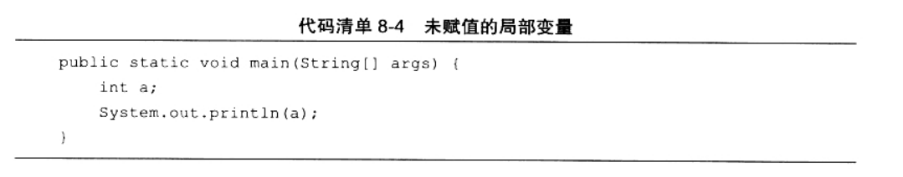

### 图解方法执行流程

**原始 java 代码**

~~~java
package cn.itcast.jvm.t3.bytecode;
/**
* 演示 字节码指令 和 操作数栈、常量池的关系
*/
public class Demo3_1 {
public static void main(String[] args) {
	int a = 10;
	int b = Short.MAX_VALUE + 1;
	int c = a + b;
	System.out.println(c);
	}
}
~~~

**常量池载入运行时常量池**

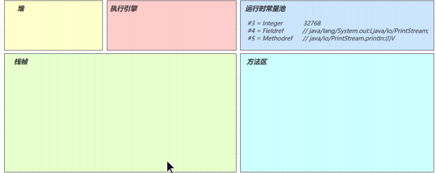

**方法字节码载入方法区**

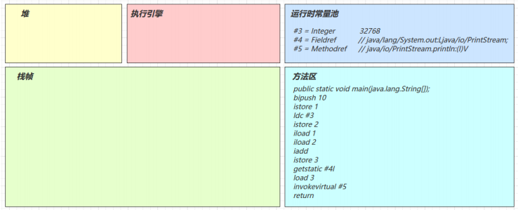

**main** **线程开始运行，分配栈帧内存**

（stack=2，locals=4）

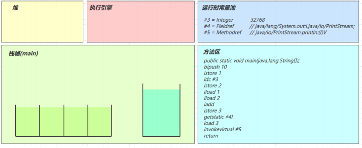

**执行引擎开始执行字节码**

* bipush 10

  将一个 byte 压入操作数栈（其长度会补齐 4 个字节），类似的指令还有

  sipush 将一个 short 压入操作数栈（其长度会补齐 4 个字节）

  ldc 将一个 int 压入操作数栈

  ldc2_w 将一个 long 压入操作数栈（分两次压入，因为 long 是 8 个字节）

  这里小的数字都是和字节码指令存在一起，超过 short 范围的数字存入了常量池

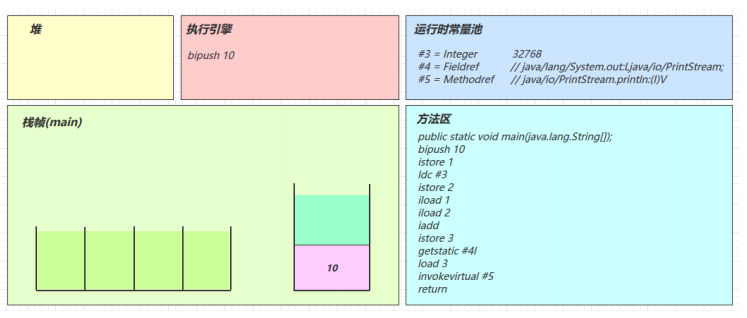

* istore_1

  将操作数栈顶数据弹出，存入局部变量表的 slot 1

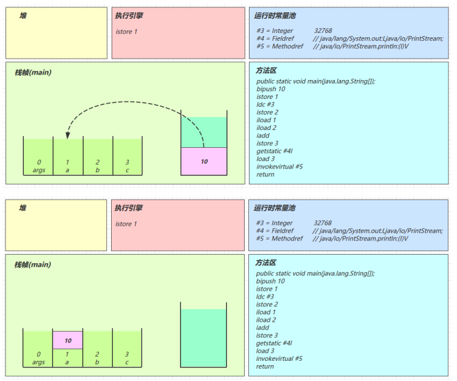

* ldc #3

  从常量池加载 #3 数据到操作数栈

  注意 Short.MAX_VALUE 是 32767，所以 32768 = Short.MAX_VALUE + 1 实际是在编译期间计算

  好的

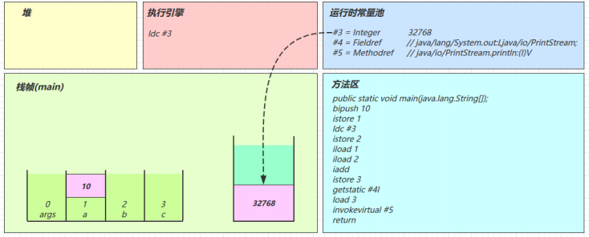

* istore_2

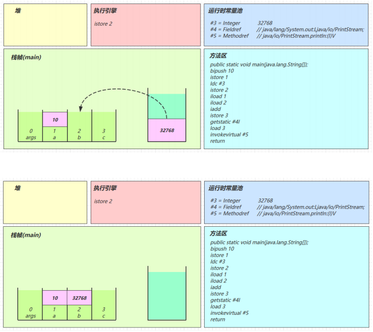

* iload_1

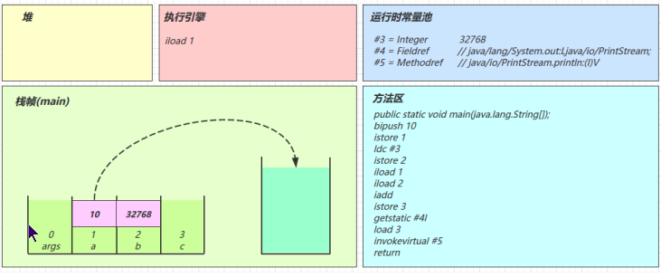

* iload_2

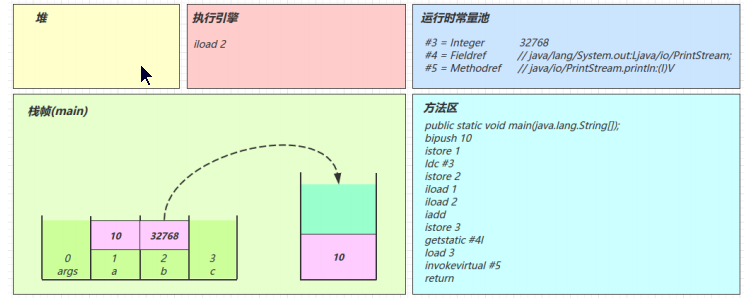

* iadd

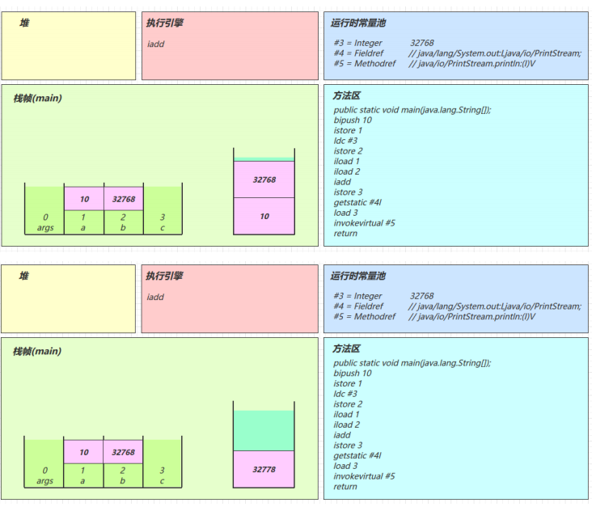

* istore_3

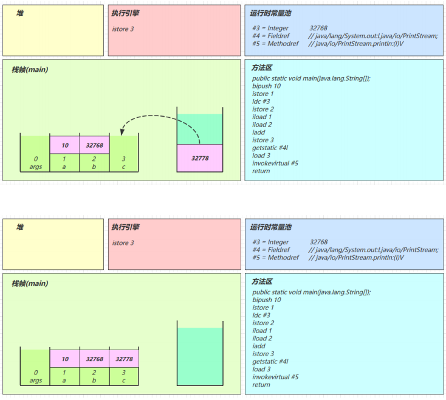

* getstatic #4

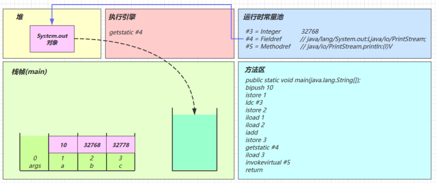

​												 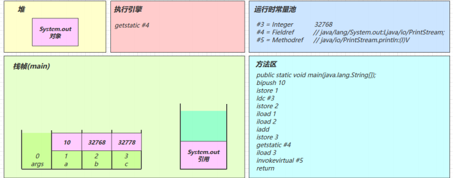

* iload_3

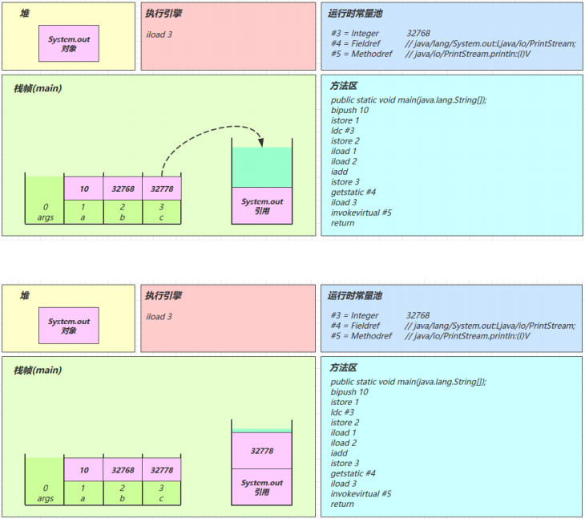

* invokevirtual #5

  找到常量池 #5 项

  定位到方法区 java/io/PrintStream.println:(I)V 方法

  生成新的栈帧（分配 locals、stack等）

  传递参数，执行新栈帧中的字节码

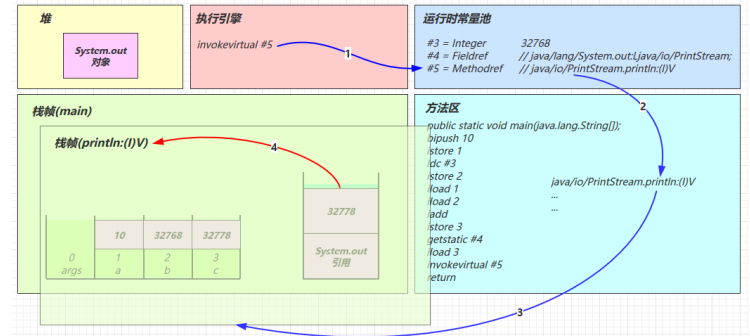

​		执行完毕，弹出栈帧

​		清除 main 操作数栈内容

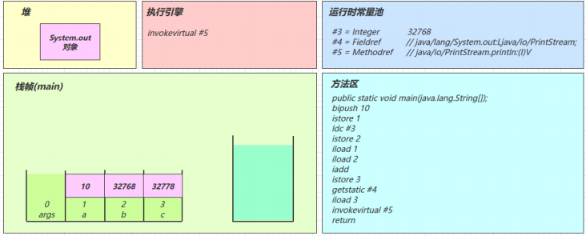

* return

  完成 main 方法调用，弹出 main 栈帧

  程序结束

### 练习 **-** 分析 i++

~~~java
package cn.itcast.jvm.t3.bytecode;
/**
* 从字节码角度分析 a++ 相关题目
*/
public class Demo3_2 {
public static void main(String[] args) {
        int a = 10;
        int b = a++ + ++a + a--;
        System.out.println(a);
        System.out.println(b);
    }
}
~~~

分析：

* 注意 iinc 指令是直接在局部变量 slot 上进行运算

* a++ 和 ++a 的区别是先执行 iload 还是 先执行 iinc

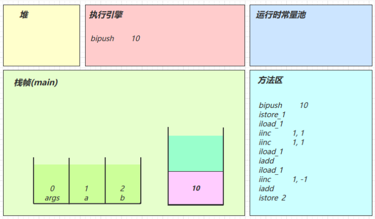

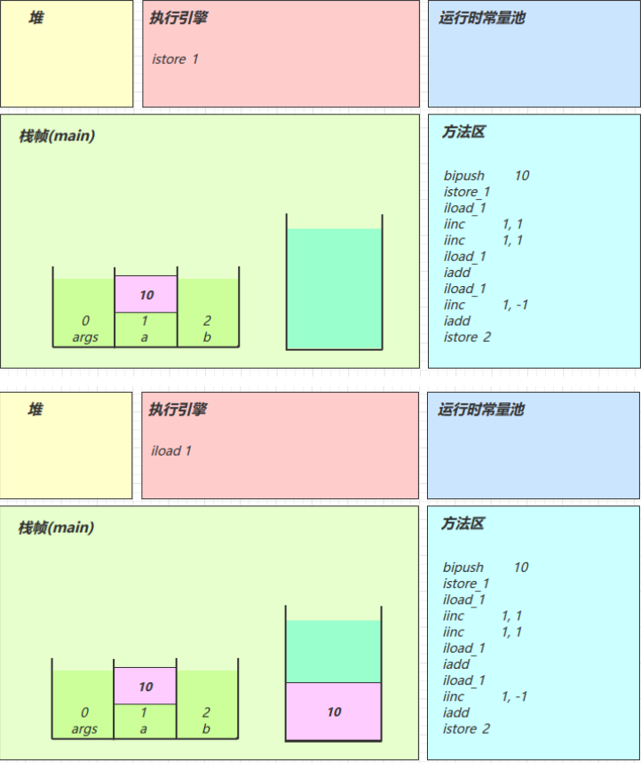

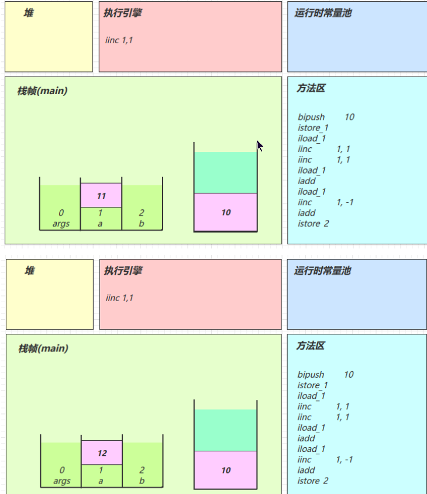

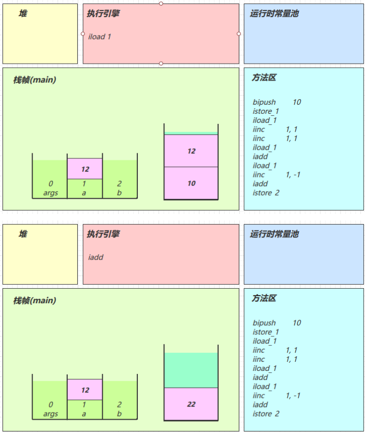

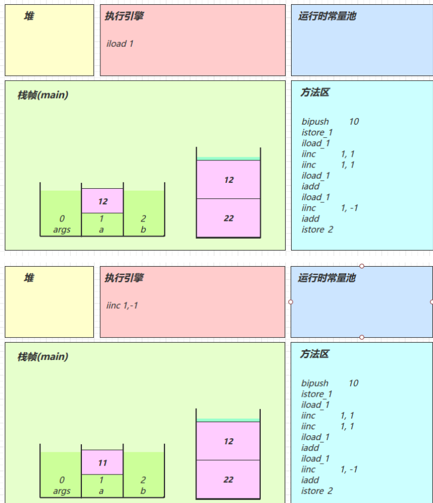

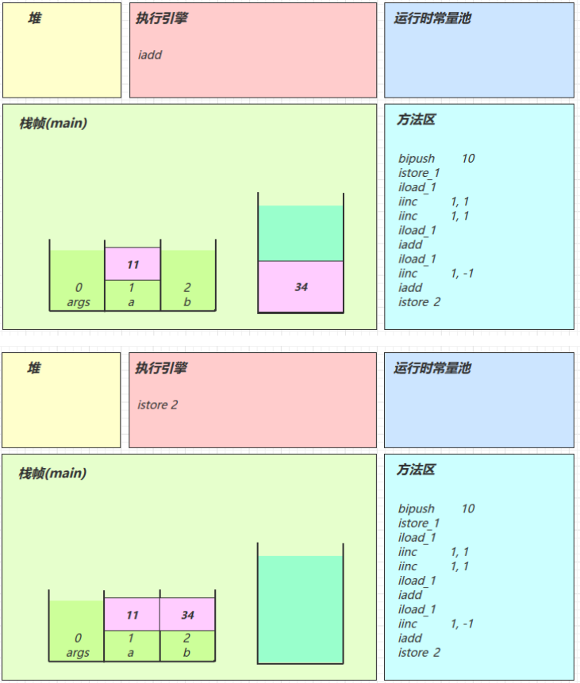

### 条件判断指令

byte，short，char 都会按 int 比较，因为操作数栈都是 4 字节

goto 用来进行跳转到指定行号的字节码

~~~java
public class Demo3_3 {
public static void main(String[] args) {
        int a = 0;
        if(a == 0) {
        a = 10;
        } else {
      	  a = 20;
        }
    }
}
~~~

字节码:

~~~java
0: iconst_0
1: istore_1
2: iload_1
3: ifne 12
6: bipush 10
8: istore_1
9: goto 15
12: bipush 20
14: istore_1
15: return
~~~

### 循环控制指令

~~~java
public class Demo3_4 {
public static void main(String[] args) {
    int a = 0;
    while (a < 10) {
       	 a++;
        }
    }
}
~~~

字节码是：

~~~java
0: iconst_0
1: istore_1
2: iload_1
3: bipush 10
5: if_icmpge 14
8: iinc 1, 1
11: goto 2
14: return
~~~

再比如 do while 循环：

~~~java
public class Demo3_5 {
public static void main(String[] args) {
    int a = 0;
    do {
        a++;
        } while (a < 10);
    }
}
~~~

字节码是：

~~~java
 0: iconst_0
 1: istore_1
 2: iinc 1, 1
 5: iload_1
 6: bipush 10
 8: if_icmplt 2
11: return
~~~

最后再看看 for 循环：

~~~java
public class Demo3_6 {
public static void main(String[] args) {
for (int i = 0; i < 10; i++) {
		}
	}
}
~~~

字节码是：

~~~java
0: iconst_0
1: istore_1
2: iload_1
3: bipush 10
5: if_icmpge 14
8: iinc 1, 1
11: goto 2
14: return
~~~

### 构造方法

**`<cinit>()V`(静态构造)**

~~~java
public class Demo3_8_1 {
		static int i = 10;
    static {
    	i = 20;
    }
    static {
   	 	i = 30;
    }
}
~~~

编译器会按从上至下的顺序，收集所有 static 静态代码块和静态成员赋值的代码，合并为一个特殊的方法 `<cinit>()V `：

~~~java
0: bipush 10
2: putstatic #2 // Field i:I
5: bipush 20
7: putstatic #2 // Field i:I
10: bipush 30
12: putstatic #2 // Field i:I
15: return
~~~

>  `<cinit>()V` 方法会在类加载的初始化阶段被调用

**`<init>()V`(构造方法)**

~~~java
public class Demo3_8_2 {
    private String a = "s1";
    {
   	 	b = 20;
    }
    private int b = 10;
    {
    	a = "s2";
    }
    public Demo3_8_2(String a, int b) {
        this.a = a;
        this.b = b;
    }
    public static void main(String[] args) {
        Demo3_8_2 d = new Demo3_8_2("s3", 30);
        System.out.println(d.a);
        System.out.println(d.b);
    }
}
~~~

编译器会按从上至下的顺序，收集所有 {} 代码块和成员变量赋值的代码，形成新的构造方法，但原始构造方法内的代码总是在最后

~~~java
public cn.itcast.jvm.t3.bytecode.Demo3_8_2(java.lang.String, int);
descriptor: (Ljava/lang/String;I)V
flags: ACC_PUBLIC
Code:
stack=2, locals=3, args_size=3
0: aload_0
1: invokespecial #1 // super.<init>()V
4: aload_0
5: ldc #2 // <- "s1"
7: putfield #3 // -> this.a
10: aload_0
11: bipush 20 // <- 20
13: putfield #4 // -> this.b
16: aload_0
17: bipush 10 // <- 10
19: putfield #4 // -> this.b
22: aload_0
23: ldc #5 // <- "s2"
25: putfield #3 // -> this.a
28: aload_0 // ------------------------------
29: aload_1 // <- slot 1(a) "s3" |
30: putfield #3 // -> this.a |
33: aload_0 |
34: iload_2 // <- slot 2(b) 30 |
35: putfield #4 // -> this.b --------------------
38: return
LineNumberTable: ...
LocalVariableTable:
Start Length Slot Name Signature
0 39 0 this Lcn/itcast/jvm/t3/bytecode/Demo3_8_2;
0 39 1 a Ljava/lang/String;
0 39 2 b I
MethodParameters: ...
~~~

### 方法调用

~~~java
public class Demo3_9 {
    public Demo3_9() { }
    private void test1() { }
    private final void test2() { }
    public void test3() { }
    public static void test4() { }
    public static void main(String[] args) {
        Demo3_9 d = new Demo3_9();
        d.test1();
        d.test2();
        d.test3();
        d.test4();
        Demo3_9.test4();
    }
}
~~~

字节码：

~~~java
0: new #2 // class cn/itcast/jvm/t3/bytecode/Demo3_9
3: dup
4: invokespecial #3 // Method "<init>":()V
7: astore_1
8: aload_1
9: invokespecial #4 // Method test1:()V
12: aload_1
13: invokespecial #5 // Method test2:()V
16: aload_1
17: invokevirtual #6 // Method test3:()V
20: aload_1
21: pop
22: invokestatic #7 // Method test4:()V
25: invokestatic #7 // Method test4:()V
28: return
~~~

* new 是创建【对象】，给对象分配堆内存，执行成功会将【对象引用】压入操作数栈

- dup 是赋值操作数栈栈顶的内容，本例即为【对象引用】，为什么需要两份引用呢，一个是要配合 invokespecial 调用该对象的构造方法 "<init>":()V （会消耗掉栈顶一个引用），另一个要配合 astore_1 赋值给局部变量

* 最终方法（fifinal），私有方法（private），构造方法都是由 invokespecial 指令来调用，属于静态绑定

- 普通成员方法是由 invokevirtual 调用，属于动态绑定，即支持多态
- 成员方法与静态方法调用的另一个区别是，执行方法前是否需要【对象引用】
- 比较有意思的是 d.test4(); 是通过【对象引用】调用一个静态方法，可以看到在调用
- invokestatic 之前执行了 pop 指令，把【对象引用】从操作数栈弹掉了😂，静态方法的调用不需要对象
- 还有一个执行 invokespecial 的情况是通过 super 调用父类方法

**分派**

- 静态分派

所有依赖静态类型来定位方法执行版本的分派动作称为静态分派。静态分派的典型应用是<u>方法重载</u>。静态分派发生在编译阶段，因此确定静态分派的动作实际上不是由虚拟机来执行的。

invokevirtual指令的运行时解析过程大致分为以下几个步骤

1)找到操作数栈顶的第一个元素所指向的对象的实际类型，记作C。

2)如果在类型C中找到与常量中的描述符和简单名称都相符的方法，则进行访问权限校验，如果通过则返回这个方法的直接引用，查找过程结束；如果不通过，则返回java.lang,IlegalAccessError异常

3)否则，按照继承关系从下往上依次对C的各个父类进行第2步的搜索和验证过程。

4)如果始终没有找到合适的方法，则抛出java.lang,AbstractMethodError异常

- 动态分派

由于invokevirtual指令执行的第一步就是在运行期确定接收者的实际类型，所以两次调用中（不同实现类调用同一个抽象方法）的invokevirtual指令把常量池中的类方法符号引用解析到了不同的直接引用上，这个过程就是Java语言中方法重写的本质。我们把这种在运行期根据实际类型确定方法执行版本的分派过程称为动态分派。

### 多态的原理

当执行 invokevirtual 指令时，

1. 先通过栈帧中的对象引用找到对象

2. 分析对象头，找到对象的实际 Class

3. Class 结构中有 vtable，它在类加载的链接阶段就已经根据方法的重写规则生成好了

4. 查表得到方法的具体地址

5. 执行方法的字节码

### 异常处理

**try-catch**

~~~java
public class Demo3_11_1 {
public static void main(String[] args) {
    int i = 0;
    try {
    	i = 10;
    } catch (Exception e) {
    	i = 20;
    	}
    }
}
~~~

字节码

~~~java
public static void main(java.lang.String[]);
descriptor: ([Ljava/lang/String;)V
flags: ACC_PUBLIC, ACC_STATIC
Code:
stack=1, locals=3, args_size=1
0: iconst_0
1: istore_1
2: bipush 10
4: istore_1
5: goto 12
8: astore_2
9: bipush 20
11: istore_1
12: return
    Exception table:
    from to target type
    2 	5 	8 		Class java/lang/Exception
    LineNumberTable: ...
    LocalVariableTable:
    Start Length Slot Name Signature
    9        3 	   2 	e Ljava/lang/Exception;
    0 13 0 args [Ljava/lang/String;
    2 11 1 i I
    StackMapTable: ...
MethodParameters: ...
}
~~~

* 可以看到多出来一个 Exception table 的结构，[from, to) 是前闭后开的检测范围，一旦这个范围内的字节码执行出现异常，则通过 type 匹配异常类型，如果一致，进入 target 所指示行号

* 8 行的字节码指令 astore_2 是将异常对象引用存入局部变量表的 slot 2 位置

**多个** **single-catch** **块的情况**

~~~java
public class Demo3_11_2 {
public static void main(String[] args) {
int i = 0;
try {
    		i = 10;
        } catch (ArithmeticException e) {
        	i = 30;
        } catch (NullPointerException e) {
        	i = 40;
        } catch (Exception e) {
       	 	i = 50;
        }
	}
}
~~~

字节码

~~~java
public static void main(java.lang.String[]);
descriptor: ([Ljava/lang/String;)V
flags: ACC_PUBLIC, ACC_STATIC
Code:
stack=1, locals=3, args_size=1
0: iconst_0
1: istore_1
2: bipush 10
4: istore_1
5: goto 26
8: astore_2
9: bipush 30
11: istore_1
12: goto 26
15: astore_2
16: bipush 40
18: istore_1
19: goto 26
22: astore_2
23: bipush 50
25: istore_1
26: return
Exception table:
from to target type
2 5 8 Class java/lang/ArithmeticException
2 5 15 Class java/lang/NullPointerException
2 5 22 Class java/lang/Exception
LineNumberTable: ...
LocalVariableTable:
Start Length Slot Name Signature
9 3 2 e Ljava/lang/ArithmeticException;
16 3 2 e Ljava/lang/NullPointerException;
23 3 2 e Ljava/lang/Exception;
0 27 0 args [Ljava/lang/String;
2 25 1 i I
StackMapTable: ...
MethodParameters: ..
~~~

- 因为异常出现时，只能进入 Exception table 中一个分支，所以局部变量表 slot 2 位置被共用

**finally**

~~~java
public class Demo3_11_4 {
public static void main(String[] args) {
    int i = 0;
    try {
    	i = 10;
    } catch (Exception e) {
    	i = 20;
    } finally {
    	i = 30;
    	}
    }
}
~~~

字节码

~~~java
public static void main(java.lang.String[]);
descriptor: ([Ljava/lang/String;)V
flags: ACC_PUBLIC, ACC_STATIC
Code:
stack=1, locals=4, args_size=1
0: iconst_0
1: istore_1 // 0 -> i
2: bipush 10 // try --------------------------------------
4: istore_1 // 10 -> i |
5: bipush 30 // finally |
7: istore_1 // 30 -> i |
8: goto 27 // return -----------------------------------
11: astore_2 // catch Exceptin -> e ----------------------
12: bipush 20 // |
14: istore_1 // 20 -> i |
15: bipush 30 // finally |
17: istore_1 // 30 -> i |
18: goto 27 // return -----------------------------------
21: astore_3 // catch any -> slot 3 ----------------------
22: bipush 30 // finally |
24: istore_1 // 30 -> i |
25: aload_3 // <- slot 3 |
26: athrow // throw ------------------------------------
27: return
Exception table:
from to target type
2 5 11 Class java/lang/Exception
2 5 21 any // 剩余的异常类型，比如 Error
11 15 21 any // 剩余的异常类型，比如 Error
LineNumberTable: ...
LocalVariableTable:
Start Length Slot Name Signature
12 3 2 e Ljava/lang/Exception;
0 28 0 args [Ljava/lang/String;
2 26 1 i I
StackMapTable: ...
MethodParameters: ...
~~~

* 可以看到 fifinally 中的代码被复制了 3 份，分别放入 try 流程，catch 流程以及 catch 剩余的异常类型流程

### **练习** **- finally** **面试题**

**finally** **出现了** **return**

~~~java
public class Demo3_12_2 {
public static void main(String[] args) {
    	int result = test();
    	System.out.println(result);
    }
    public static int test() {
    try {
   	 	return 10;
    } finally {
        return 20;
        }
    }
}
~~~

字节码

~~~java
public static int test();
descriptor: ()I
flags: ACC_PUBLIC, ACC_STATIC
Code:
stack=1, locals=2, args_size=0
0: bipush 10 // <- 10 放入栈顶
2: istore_0 // 10 -> slot 0 (从栈顶移除了)
3: bipush 20 // <- 20 放入栈顶
5: ireturn // 返回栈顶 int(20)
6: astore_1 // catch any -> slot 1
7: bipush 20 // <- 20 放入栈顶
9: ireturn // 返回栈顶 int(20)
Exception table:
from to target type
0 3 6 any
LineNumberTable: ...
StackMapTable: ...
~~~

* 由于 finally 中的 ireturn 被插入了所有可能的流程，因此返回结果肯定以 finally 的为准

* 至于字节码中第 2 行，似乎没啥用，且留个伏笔，看下个例子

* 跟上例中的 finally 相比，发现没有 athrow 了，这告诉我们：如果在 finally 中出现了 return，会吞掉异常😱😱😱，可以试一下下面的代码

> 尽量不要在finally中使用return

**finally** **对返回值影响**

~~~java
public class Demo3_12_2 {
public static void main(String[] args) {
    int result = test();
    	System.out.println(result);
    }
    public static int test() {
    int i = 10;
    try {
    	return i;
    } finally {
    	i = 20;
    }
    }
}
~~~

字节码

~~~java
public static int test();
descriptor: ()I
flags: ACC_PUBLIC, ACC_STATIC
Code:
stack=1, locals=3, args_size=0
0: bipush 10 // <- 10 放入栈顶
2: istore_0 // 10 -> i
3: iload_0 // <- i(10)
4: istore_1 // 10 -> slot 1，暂存至 slot 1，目的是为了固定返回值
5: bipush 20 // <- 20 放入栈顶
7: istore_0 // 20 -> i
8: iload_1 // <- slot 1(10) 载入 slot 1 暂存的值
9: ireturn // 返回栈顶的 int(10)
10: astore_2
11: bipush 20
13: istore_0
14: aload_2
15: athrow
Exception table:
from to target type
3 5 10 any
LineNumberTable: ...
LocalVariableTable:
Start Length Slot Name Signature
3 13 0 i I
~~~

* 固定了return的值，finally修改变量的值也不会影响返回值

## 编译期处理

Javac这类编译器对代码的运行效率几乎没有任何优化措施，虚拟机设计团队把对性能的优化集中到了后端的即时编译器中，这样可以让那些不是由Javac产生的Class (如Juby、Groovy等语言的Class 文件)文件也同样能享受到编译器优化所带来的好处，但是Javac 做了许多针对Java语言编码过程的优化措施来改善程序员的编码风格和提高编码效率。Java 中即时编译器在**运行期**的优化过程对于程序运行来说更重要，而前端编译器在**编译期**的优化过程对于程序编码来说关系更加密切。

所谓的 语法糖 ，其实就是指 java 编译器把 *.java 源码编译为 *.class 字节码的过程中，自动生成和转换的一些代码，主要是为了减轻程序员的负担，算是 java 编译器给我们的一个额外福利（给糖吃嘛）

>  注意，以下代码的分析，借助了 javap 工具，idea 的反编译功能，idea 插件 jclasslib 等工具。另外，编译器转换的结果直接就是 class 字节码，只是为了便于阅读，给出了 几乎等价 的 java 源码方式，并不是编译器还会转换出中间的 java 源码，切记。

### javac编译器

**语义分析与字节码生成**

~~~java
//方法一带有final修饰
public void foo (final int arg){
	final int var = 0;
    // do something
}
//方法二没有 final修饰
public void foo(int arg){
    int var = 0 ;
    //do something
}
~~~

> 两段代码编译出来的 Class 文件是没有任何一点区别的

原因：局部变量与字段(实例变量、类变量) 是有区别的，它在常量池中没有CONSTANT Fieldref info 的符号引用，自然就没有访问标志 (Access Flags)的信息，甚至可能连名称都不会保留下来 (取决于编译时的选项)，自然在 Class 文件中不可能知道一个局部变量是不是声明为 final了。因此，将局部变量声明为 final，对运行期是没有影响的，变量的不变性仅仅由编译器在编译期间保障。

### 默认构造器

~~~java
public class Candy1 {
}
~~~

编译成class后的代码：

~~~java
public class Candy1 {
// 这个无参构造是编译器帮助我们加上的
	public Candy1() {
        super(); // 即调用父类 Object 的无参构造方法，即调用 java/lang/Object."
        <init>":()V
    }
}
~~~

### 自动拆装箱

这个特性是 JDK 5 开始加入的， 代码片段1 ：

~~~java
public class Candy2 {
public static void main(String[] args) {
    Integer x = 1;
    int y = x;
    }
}
~~~

这段代码在 JDK 5 之前是无法编译通过的，必须改写为 代码片段2 :

~~~java
public class Candy2 {
    public static void main(String[] args) {
        Integer x = Integer.valueOf(1);
        int y = x.intValue();
    }
}
~~~

显然之前版本的代码太麻烦了，需要在基本类型和包装类型之间来回转换（尤其是集合类中操作的都是包装类型），因此这些转换的事情在 JDK 5 以后都由编译器在编译阶段完成。即 代码片段1 都会在编译阶段被转换为 代码片段2

### 泛型集合取值

泛型也是在 JDK 5 开始加入的特性，但 java 在编译泛型代码后会执行 泛型擦除 的动作，即泛型信息在编译为字节码之后就丢失了，实际的类型都当做了 Object 类型来处理：

~~~java
public class Candy3 {
    public static void main(String[] args) {
        List<Integer> list = new ArrayList<>();
        list.add(10); // 实际调用的是 List.add(Object e)
        Integer x = list.get(0); // 实际调用的是 Object obj = List.get(int index);
    }
}
~~~

所以在取值时，编译器真正生成的字节码中，还要额外做一个类型转换的操作：

~~~java
// 需要将 Object 转为 Integer
Integer x = (Integer)list.get(0);
~~~

如果前面的 x 变量类型修改为 int 基本类型那么最终生成的字节码是：

~~~java
// 需要将 Object 转为 Integer, 并执行拆箱操作
int x = ((Integer)list.get(0)).intValue();
~~~

* 擦除的是字节码上的泛型信息，可以看到 LocalVariableTypeTable 仍然保留了方法参数泛型的信息
* 使用反射，仍然能够获得这些信息

### 方法重载

~~~java
public class GenericTypes{
    public static String method(List<String> list){
        System.out.println("invoke method(List<String> list)");
        return "";
    }
        public static int method(List<Integer> list){
        System.out.println("invoke method(List<Integer> list)");
        return 1;
    }
        public static void main(String[] args){
        method(new ArrayList<String>());
		method(new ArrayList<Integer>());
    }
}
~~~

代码清单中的重载<u>当然不是根据返回值来确定的</u>，之所以这次能编译和执行成功是因为两个 method方法<u>加入了不同的返回值</u>后才能共存在一个 CIass 文件之中。第 6 章介绍 Class 文件方法表 (method info) 的数据结构时曾经提到过，<u>方法重载要求方法具备不同的特征签名，返回值并不包含在方法的特征签名之中</u>，所以返回值不参与重载选择，但是在Class 文件格式之中，只要描述符不是完全一致的两个方法就以共存。也就是说，两个方法如果有相同的名称和特征签名，但返回值不同，那它们也是可以合法地共存于一个 Class文件中的。

## 类加载阶段

类从被加载到虚拟机内存中开始，到卸载出内存为止，它的整个生命周期包括：加载(Loading)、验证(Verifcation)、准备(Preparation)、解析(Resolution)、初始化(Initialization)、使用(Using)和卸载(Unloading)7个阶段。其中验证、准备、解析3个部分统称为连接(Linking),这7个阶段的发生顺序如图7-1所示。

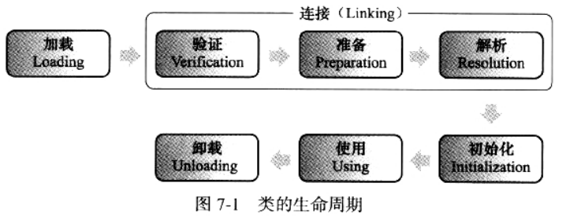

### 加载

加载阶段与连接阶段的部分内容(如一部分字节码文件格式验证动作) 是交叉进行的,加载阶段尚未完成，连接阶段可能已经开始，但这此夹在加载阶段之中进行的动作，仍然属于连接阶段的内容，这两个阶段的开始时间仍然保持着固定的先后顺序。

- 将类的字节码载入方法区中，内部采用 C++ 的 instanceKlass 描述 java 类，它的重要 field 有：

  - _java_mirror 即 java 的类镜像，例如对 String 来说，就是 String.class，作用是把 klass 暴

  - 露给 java 使用
  - _super 即父类_
  - fields 即成员变量
  - _methods 即方法_
  - constants 即常量池
  - _class_loader 即类加载器_
  - vtable 虚方法表
  - _itable 接口方法表

- 如果这个类还有父类没有加载，先加载父类

- 加载和链接可能是交替运行的

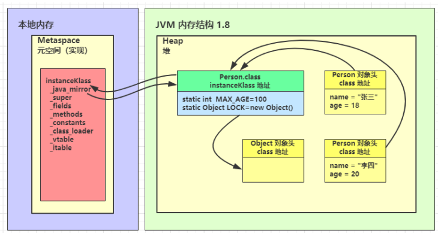

### 链接

**验证**

验证类是否符合 JVM规范，安全性检查；验证阶段是非常重要的，这个阶段是否严谨，直接决定了 Java虚拟机是否能承受恶意代码的攻击，从执行性能的角度上讲，验证阶段的工作量在虚拟机的类加载子系统中又占了相当大的一部分

**准备**

为 static 变量分配空间，设置默认值

- static 变量在 JDK 7 之前存储于 instanceKlass 末尾（存储在方法区中），从 JDK 7 开始，存储于 _java_mirror 末尾（存储在堆中）
- static 变量分配空间和赋值是两个步骤，分配空间在准备阶段完成，赋值在初始化阶段完成
- 如果 static 变量是 final 的基本类型，以及字符串常量，那么编译阶段值就确定了，赋值在准备阶段完成
- 如果 static 变量是 final 的，但属于引用类型，那么赋值也会在初始化阶段完成

准备阶段是正式为类变量分配内存并设置类变量初始值的阶段，首先，这时候进行内存分配的仅包括类变量(被 static 修饰的变量)，而不包括实例变量，实例变量将会在对象实例化时随着对象一起分配在 Java 堆中。其次，这里所说的初始值“通常情况”下是数据类型的零值，假设一个类变量的定义为:

~~~Java
public static int value = 123;
~~~

* 那变量 value 在准备阶段过后的初始值为0而不是123，因为这时候尚未开始执行任何Java方法，而把value赋值为123的putstatic 指令是程序被编译后，存放于类构造器<clinit>0方法之中，所以把value 赋值为 123的动作将在<u>初始化阶段</u>才会执行。

那相对的会有一些“特殊情况”: 如果类字段的字段属性表中存在 ConstantValue 属性，那在准备阶段变量 value 就会被初始化为
ConstantValue 属性所指定的值，假设上面类变量 value 的定义变为:

~~~java
public static final int value = 123;
~~~

- 编译时Javac 将会为 value 生成 ConstantValue 属性，在准备阶段虚拟机就会根据 ConstantValue的设置将 value 赋值为123。

**解析**

解析阶段是虚拟机将常量池内的符号引用替换为直接引用的过程

1. 符号引用(Symbolic References): 符号引用以一组符号来描述所引用的目标，符号可以是任何形式的字面量，只要使用时能无歧义地定位到目标即可。符号引用与虚拟机实现的内存布局无关，引用的目标并不一定已经加载到内存中。各种虚拟机实现的内存布局可以各不相同，但是它们能接受的符号引用必须都是一致的，因为符号引用的字面量形式明确定义在 Java 虚拟机规范的 Class 文件格式中。
2. 直接引用(Direct References): 直接用可以是直接指向目标的指针、相对偏移量或是一个能间接定位到目标的句柄。直接引用是和虚拟机实现的内存布局相关的，同-个符号引用在不同虚拟机实例上翻译出来的直接引用一般不会相同。<u>如果有了直接引用，那引用的目标必定已经在内存中存在</u>。

### 初始化

`<cinit>()V` **方法**

初始化即调用 `<cinit>()V` ，虚拟机会保证这个类的『构造方法』的线程安全

**初始化阶段**，虚拟机规范则是严格规定了有且只有 5 种情况必须立即对类进行“初始化”(而加载、验证、准备自然需要在此之前开始):

1)遇到 new、getstatic、putstatic 或 invokestatic 这 4条字节码指令时，如果类没有进行过初始化，则需要先触发其初始化。

2)使用java.lang.reflect 包的方法对类进行反射调用的时候，如果类没有进行过初始化则需要先触发其初始化。

3)当初始化一个类的时候，如果发现其父类还没有进行过初始化，则需要先触发其父类的初始化。

4)当虚拟机启动时，用户需要指定一个要执行的主类(包含 main() 方法的那个类)，虚拟机会先初始化这个主类

5)当使用JDK 1.7 的动态语言支持时，如果一个java.lang.invoke.MethodHandle 实例最后的解析结果 REF_getStatic、REF putStatic、REF invokeStatic 的方法句柄，并且这个方法句柄所对应的类没有进行过初始化，则需要先触发其初始化。

> 当一个类在初始化时，要求其父类全部都已经初始化过了，但是一个接口在初始化时，并不要求其父接口全部都完成了初始化，只有在真正使用到父接口的时候(如引用接口中定义的常量) 才会初始化。

静态语句块中只能访问到定义在静态语句块之前的变量，定义在它之后的变量，在前面的静态语句块可以赋值，但是不能访问

~~~java
public class test{
    static{
        i = 0;	//赋值正常编译通过
        System.out.print(i);  //无法编译通过，‘非法向前引用’
    }
    static int i = 1;
}
~~~

* 类构造函数
  <clinit>0 方法对于类或接口来说并不是必需的，如果一个类中没有静态语句块，也没有对变量的赋值操作，那么编译器可以不为这个类生成 <clini>0方法。

  接口中不能使用静态语句块，但仍然有变量初始化的赋值操作，因此接口与类一样都会生成 <clinit>0-方法。但接口与类不同的是，执行接口的 <clinit>()方法不需要先执行父接口的 <clinit>0方法。只存当父接口中定义的变量使用时，父接口才会初始化另外，接口的实现类在初始化时也一样不会执行接口的 <clinit>0 方法。

  虚拟机会保证一个类的<clinit>0) 方法在多线程环境中被正确地加锁、同步，如果多个线程同时去初始化一个类，那么只会有一个线程去执行这个类的 <clini>O 方法其他线程都需要阻塞等待，直到活动线程执行 <clinit>0 方法完毕。如果在--个类的<clinit>0 方法中有耗时很长的操作，就可能造成多个进程阻塞2，在实际应用中这种阻塞往往是很隐蔽的

**发生的时机**

概括得说，类初始化是【懒惰的】

- main 方法所在的类，总会被首先初始化
- 首次访问这个类的静态变量或静态方法时
- 子类初始化，如果父类还没初始化，会引发
- 子类访问父类的静态变量，只会触发父类的初始化Class.forName
- new 会导致初始化

不会导致类初始化的情况

- 访问类的 static fifinal 静态常量（基本类型和字符串）不会触发初始化
- 类对象.class 不会触发初始化
- 创建该类的数组不会触发初始化
- 类加载器的 loadClass 方法
- Class.forName 的参数 2 为 false 时

**实例**

~~~java
class A {
    static int a = 0;
    static {
    	System.out.println("a init");
    }
}
class B extends A {
    final static double b = 5.0;
    static boolean c = false;
    static {
    	System.out.println("b init");
    }
}
~~~

~~~java
public class Load3 {
    static {
    	System.out.println("main init");
    }
    public static void main(String[] args) throws ClassNotFoundException {
        // 1. 静态常量（基本类型和字符串）不会触发初始化
        System.out.println(B.b);
        // 2. 类对象.class 不会触发初始化
        System.out.println(B.class);
        // 3. 创建该类的数组不会触发初始化
        System.out.println(new B[0]);
        // 4. 不会初始化类 B，但会加载 B、A
        ClassLoader cl = Thread.currentThread().getContextClassLoader();
            cl.loadClass("cn.itcast.jvm.t3.B");
        // 5. 不会初始化类 B，但会加载 B、A
        ClassLoader c2 = Thread.currentThread().getContextClassLoader();
        Class.forName("cn.itcast.jvm.t3.B", false, c2);
        // 1. 首次访问这个类的静态变量或静态方法时
        System.out.println(A.a);
        // 2. 子类初始化，如果父类还没初始化，会引发
        System.out.println(B.c);
        // 3. 子类访问父类静态变量，只触发父类初始化
        System.out.println(B.a);
        // 4. 会初始化类 B，并先初始化类 A
        Class.forName("cn.itcast.jvm.t3.B");
    }
}
~~~

## 类加载器

以 JDK 8 为例：

| **名称**                | **加载哪的类**        | **说明**                      |
| ----------------------- | --------------------- | ----------------------------- |
| Bootstrap ClassLoader   | JAVA_HOME/jre/lib     | 无法直接访问                  |
| Extension ClassLoader   | JAVA_HOME/jre/lib/ext | 上级为 Bootstrap，显示为 null |
| Application ClassLoader | classpath             | 上级为 Extension              |
| 自定义类加载器          | 自定义                | 上级为 Application            |

比较两个类是否“相等”，只有在这两个类是由同一个类加载器加载的前提下才有意义，否则，即使这两个类来源于同一个 Class 文件，被同一个虚拟机加载，只要加载它们的类加载器不同，那这两个类就必定不相等。

> 这里所指的“相等”，包括代表类的 Class 对象的 equals0 方法、isAssignableFrom() 方法isInstance0) 方法的返结果，也包括使用 instanceof 关键字做对象所属关系判定等情况。

### 启动类加载器

用 Bootstrap 类加载器加载类：

~~~java
public class F {
	static {
    	System.out.println("bootstrap F init");
    }
}
~~~

执行

~~~Java
package cn.itcast.jvm.t3.load;
public class Load5_1 {
    public static void main(String[] args) throws ClassNotFoundException {
        Class<?> aClass = Class.forName("cn.itcast.jvm.t3.load.F");
        System.out.println(aClass.getClassLoader());
    }
}
~~~

输出

~~~java
E:\git\jvm\out\production\jvm>java -Xbootclasspath/a:.
cn.itcast.jvm.t3.load.Load5
bootstrap F init
null
~~~

- -Xbootclasspath 表示设置 bootclasspath

- 其中 /a:. 表示将当前目录追加至 bootclasspath 之后

- 可以用这个办法替换核心类

  java -Xbootclasspath:<new bootclasspath>

  java -Xbootclasspath/a:<追加路径>

  java -Xbootclasspath/p:<追加路径>

### 扩展类加载器

~~~java
public class G {
    static {
        System.out.println("ext G init");
    }
}
~~~

执行

~~~java
public class Load5_2 {
    public static void main(String[] args) throws ClassNotFoundException {
        Class<?> aClass = Class.forName("cn.itcast.jvm.t3.load.G");
        System.out.println(aClass.getClassLoader());
    }
}
~~~

打个 jar 包

~~~java
E:\git\jvm\out\production\jvm>jar -cvf my.jar cn/itcast/jvm/t3/load/G.class
已添加清单
正在添加: cn/itcast/jvm/t3/load/G.class(输入 = 481) (输出 = 322)(压缩了 33%)
~~~

将 jar 包拷贝到 JAVA_HOME/jre/lib/ext

重新执行 Load5_2

输出

~~~java
ext G init
sun.misc.Launcher$ExtClassLoader@29453f44
~~~

### 双亲委派模式

双亲委派模型的工作过程是:如果个类加载器收到了类加载的请求，它首先不会自己去尝试加载这个类，而是把这个请求委派给父类加载器丢完成，每一个层次的类加载器都是如此，因此所有的加载请求最终都应该传送到顶层的启动类加载器中，只有当父加载器反馈自己无法完成这个加载请求(它的搜索范中没有找到所需的类)时，子加载器才会尝试自己丢加载。

所谓的双亲委派，就是指调用类加载器的 loadClass 方法时，查找类的规则

> **注意**
>
> 这里的双亲，翻译为上级似乎更为合适，因为它们并没有继承关系

执行流程为：

1. sun.misc.Launcher$AppClassLoader //1 处， 开始查看已加载的类，结果没有

2. sun.misc.Launcher$AppClassLoader // 2 处，委派上级sun.misc.Launcher$ExtClassLoader.loadClass()

3. sun.misc.Launcher$ExtClassLoader // 1 处，查看已加载的类，结果没有

4. sun.misc.Launcher$ExtClassLoader // 3 处，没有上级了，则委派 BootstrapClassLoader查找

5. BootstrapClassLoader 是在 JAVA_HOME/jre/lib 下找 H 这个类，显然没有

6. sun.misc.Launcher$ExtClassLoader // 4 处，调用自己的 findClass 方法，是在JAVA_HOME/jre/lib/ext 下找 H 这个类，显然没有，回到 sun.misc.Launcher$AppClassLoader的 // 2 处

7. 继续执行到 sun.misc.Launcher$AppClassLoader // 4 处，调用它自己的 fifindClass 方法，在classpath 下查找，找到了

### 线程上下文类加载器

有了线程上下文类加载器，就可以做一些“舞弊”的事情了，JNDI服务使用这个线程上下文类加载器去加载所需要的 SPI代码，也就是父类加载器请求子类加载器去完成类加载的动作，这种行为实际上就是打通了双亲委派模型的层次结构来逆向使用类加载器，

1. 使用 Class.forName 完成类的加载和初始化，关联的是<u>应用程序类加载器</u>，因此可以顺利完成类加载

* 它就是大名鼎鼎的 Service Provider Interface （SPI）
  * 约定如下，在 jar 包的 META-INF/services 包下，以接口全限定名名为文件，文件内容是实现类名称

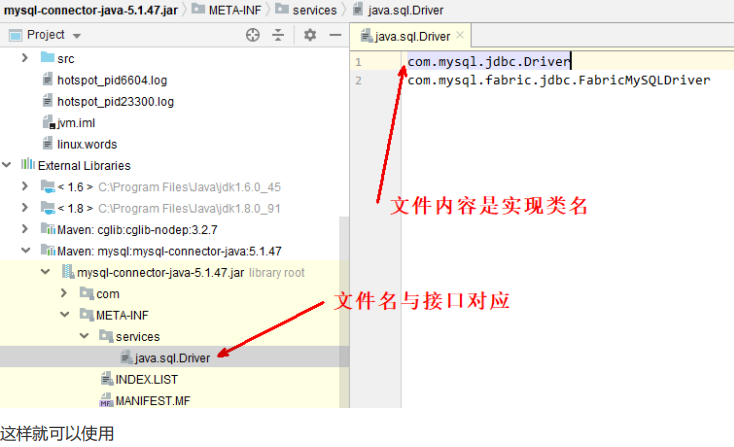

~~~java
ServiceLoader<接口类型> allImpls = ServiceLoader.load(接口类型.class);
    Iterator<接口类型> iter = allImpls.iterator();
    while(iter.hasNext()) {
    	iter.next();
}
~~~

来得到实现类，体现的是【面向接口编程+解耦】的思想，在下面一些框架中都运用了此思想：

- JDBC
- Servlet 初始化器
- Spring 容器
- Dubbo（对 SPI 进行了扩展）

2. 线程上下文类加载器是当前线程使用的类加载器，<u>默认就是应用程序类加载器</u>，它内部又是由Class.forName 调用了线程上下文类加载器完成类加
3. <u>为了打破双亲委派模式</u>

### 自定义类加载器

问问自己，什么时候需要自定义类加载器

1）想加载非 classpath 随意路径中的类文件

2）都是通过接口来使用实现，希望解耦时，常用在框架设计

3）这些类希望予以隔离，不同应用的同名类都可以加载，不冲突，常见于 tomcat 容器

步骤：

1. 继承 ClassLoader 父类

2. 要遵从双亲委派机制，重写 fifindClass 方法

   ​	注意不是重写 loadClass 方法，否则不会走双亲委派机制

3. 读取类文件的字节码

4. 调用父类的 defifineClass 方法来加载类

5. 使用者调用该类加载器的 loadClass 方法

## 运行期优化

### 解释器与编译器

解释器与编译器两者各有优势:当程序需要迅速启动和执行的时候，解释器可以首先发挥作用，省去编译的时间，立即执行。在程序运行后，随着时间的推移，编译器逐渐发挥作用，把越来越多的代码编译成本地代码之后，可以获取更高的执行效率

> 编译器和解释器的主要区别在于编译器需要预先将源代码转换成目标代码，并生成可执行文件，而解释器则在运行时直接读取源代码并解释执行

### 即时编译

**分层编译**

~~~java
public class JIT1 {
    public static void main(String[] args) {
        for (int i = 0; i < 200; i++) {
        	long start = System.nanoTime();
        for (int j = 0; j < 1000; j++) {
        	new Object();
        }
        	long end = System.nanoTime();
        	System.out.printf("%d\t%d\n",i,(end - start));
        }
    }
}
~~~

~~~java
0 96426
1 52907
2 44800
3 119040
4 65280
5 47360
6 45226
7 47786
8 48640
9 60586
10 42667
11 48640
...
82 18774
83 17067
84 21760
85 23467
86 17920
87 17920
88 18774
89 18773
90 19200
91 20053
92 18347
...
157 854
158 853
159 853
160 854
~~~

原因是什么呢？

JVM 将执行状态分成了 5 个层次：

0 层，解释执行（Interpreter）

1 层，使用 C1 即时编译器编译执行（不带 profifiling）

2 层，使用 C1 即时编译器编译执行（带基本的 profifiling）

3 层，使用 C1 即时编译器编译执行（带完全的 profifiling）

4 层，使用 C2 即时编译器编译执行

> profifiling 是指在运行过程中收集一些程序执行状态的数据，例如【方法的调用次数】，【循环的回边次数】等

**分层编译流程**

第0层，程序解释执行，解释器不开启性能监控功能 (Profling)，可触发第1层编译	

第1层，也称为 C1 编译，将字节码编译为本地代码，进行简单、可靠的优化，如有必要将加入性能监控的逻辑。

第2层(或2层以上)，也称为 C2 编译，也是将字节码编译为本地代码，但是会启用一些编译耗时较长的优化，甚至会根据性能监控信息进行一些不可靠的激进优化

> 实施分层编译后，Client Compiler 和 Server Compiler 将会同时工作，许多代码都可能会被多次编译，用 Client Compiler 取更高的编译速度，用 Server Compiler 来获取更好的编译质量，在解释执行的时候也无须再承担收集性能监控信息的任务。

**即时编译器（JIT）与解释器的区别**

- 解释器是将字节码解释为机器码，下次即使遇到相同的字节码，仍会执行重复的解释

- JIT 是将一些字节码编译为机器码，并存入 Code Cache，下次遇到相同的代码，直接执行，无需再编译

- 解释器是将字节码解释为针对所有平台都通用的机器码

- JIT 会根据平台类型，生成平台特定的机器码

对于占据大部分的不常用的代码，我们无需耗费时间将其编译成机器码，而是采取解释执行的方式运

行；另一方面，对于仅占据小部分的热点代码，我们则可以将其编译成机器码，以达到理想的运行速

度。 执行效率上简单比较一下 Interpreter < C1 < C2，总的目标是发现热点代码（hotspot名称的由

来），优化之

**方法内联**

~~~java
private static int square(final int i) {
return i * i;
}
System.out.println(square(9));
~~~

如果发现 square 是热点方法，并且长度不太长时，会进行内联，所谓的内联就是把方法内代码拷贝、粘贴到调用者的位置：

~~~java
System.out.println(9 * 9);
~~~

还能够进行常量折叠（constant folding）的优化

~~~java
System.out.println(81);
~~~

### 反射优化

~~~java
public class Reflect1 {
    public static void foo() {
    	System.out.println("foo...");
}
public static void main(String[] args) throws Exception {
    Method foo = Reflect1.class.getMethod("foo");
    for (int i = 0; i <= 16; i++) {
    System.out.printf("%d\t", i);
    	foo.invoke(null);
    }
   	 	System.in.read();
    }
}
~~~

- foo.invoke 前面 0 ~ 15 次调用使用的是 MethodAccessor 的 NativeMethodAccessorImpl 实现

- 当调用到第 16 次（从0开始算）时，会采用运行时生成的类代替掉最初的实现，可以通过 debug 得到类名为 sun.reflflect.GeneratedMethodAccessor1

~~~java
public Object invoke(Object object, Object[] arrobject) throws
    InvocationTargetException {
        // 比较奇葩的做法，如果有参数，那么抛非法参数异常
        block4 : {
            if (arrobject == null || arrobject.length == 0) break block4;
            throw new IllegalArgumentException();
        }
        try {
            // 可以看到，已经是直接调用了😱😱😱
            Reflect1.foo();
            // 因为没有返回值
            return null;
        }
        catch (Throwable throwable) {
        	throw new InvocationTargetException(throwable);
        }
        catch (ClassCastException | NullPointerException runtimeException) {
        	throw new IllegalArgumentException(Object.super.toString());
        }
    }
}
~~~

