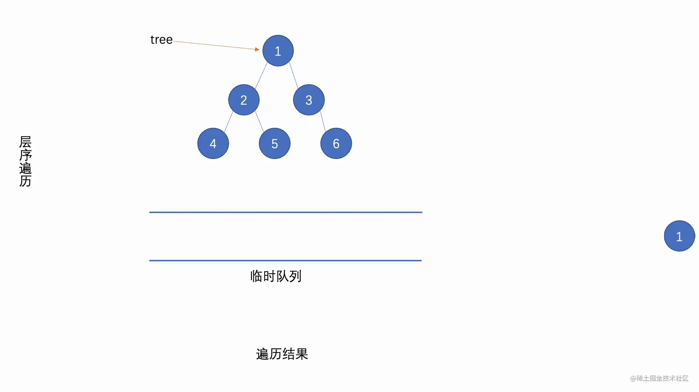

---

## 题目

1. 给定四个整数 rows ,   cols ,  rCenter 和 cCenter 。有一个 rows x cols 的矩阵，你在单元格上的坐标是 (rCenter, cCenter) 。

2. 返回矩阵中的所有单元格的坐标，并按与 (rCenter, cCenter) 的 距离 从最小到最大的顺序排。你可以按 任何 满足此条件的顺序返回答案。

3. 单元格(r1, c1) 和 (r2, c2) 之间的距离为|r1 - r2| + |c1 - c2|。

示例：

~~~
输入：rows = 1, cols = 2, rCenter = 0, cCenter = 0
输出：[[0,0],[0,1]]
解释：从 (r0, c0) 到其他单元格的距离为：[0,1]
~~~

## 分析

1. 需要二维数组`int[][]`;
2. 计算目标节点到坐标上各个节点的距离，并且进行由近到远的排序；
3. 如何将节点进行排序？

在**题目**第三点的支持下，前两点比较好完成，但是**分析**的第三点如何解决将是一个关键的问题。

对于一般的二维数组赋值为：

~~~java
//第一种方式：
int a[][]={{1,2,3},{4,5,6}};
//第二种方式；
int[][] ints = new int[4][2];
ints[i][j] =__; //分别赋值
//第三种方式：第二维的长度可以动态申请
int[][] arr3 = new int[5][];//五行的长度
for(int i=0; i<arr3.length; ++i){
    arr3[i]=new int[i+1];   //列的长度每次都变化。每次都要重新申请空间(长度)
    for(int j=0; j<arr3[i].length; ++j)
        arr3[i][j]= i+j;
}
~~~

我们专注于对每一个节点的值的使用，比如：

~~~java
//第一种方式
int a[][]={{1,2,3},{4,5,6}};
System.out.println(a[1][1]); // 结果为5
~~~

而在这一题中，我们只专注每个节点的位置，因此可以将二维数组改造为N行2列（n*2），以便记录每个节点的位置信息，比如：

~~~java
rows =2 ,cols =2;
int[][] res= new int[2 * 2][2]{{0,0},{0,1},{1,0},{1,1}}; // 只专注位置信息
~~~

如何进行排序的问题就是通过改变每行的数组就可以了。比如：

~~~java
//需要将{1,1}节点的位置放在第一行就可以这样表示
res[0] = new int[]{1,1};
~~~

*因此这道题的一种解法就明确了*

## 实现

**解法1：直接排序**

~~~java
public static int[][] allCellsDistOrder(int rows, int cols, int rCenter, int cCenter) {

        int[][] res = new int[rows*cols][2];
        int index = 0;
        for (int i = 0 ; i < rows ; i ++) {
            for(int j = 0 ; j < cols ; j ++) {
                int[] xy = {i,j};
                res[index++] = xy;
            }
        }
    //根据单元格距离的算法来进行每个节点的位置排序
        Arrays.sort(res,
            Comparator.comparingInt(o -> (Math.abs(o[0] - rCenter) + Math.abs(o[1] - cCenter))));
        return res;

}
~~~

**解法2：BFS**

~~~java
    public static int[][] allCellsDistOrder(int R, int C, int r0, int c0) {
        //1.准备工作
        //1.1准备二维数组序列（结果集序列）**
        int[][] res = new int[R * C][2];
        //1.2准备每个位置被记录标识 **
        boolean vis[][] = new boolean[R][C];
        //1.3初始化位置记录标识
        for (int i = 0; i < R; i++) {
            for (int j = 0; j < C; j++) {
                vis[i][j] = false;
            }
        }
        //1.4创建队列 ****
        Queue<node> q = new LinkedList<>();
        //1.5用于计算当前节点四周 **
        int dx[] = new int[]{1, -1, 0, 0};
        int dy[] = new int[]{0, 0, 1, -1};
        //1.5将第一个节点加入队列
        q.add(new node(r0, c0));
        int cnt = 0;
        //1.6设置当前节点为被记录过
        vis[r0][c0] = true;
        //2.遍历队列
        while (!q.isEmpty()) {
            node n = q.poll();
            //2.1将队列首部节点放入结果集序列中
            res[cnt][0] = n.x;
            res[cnt++][1] = n.y;
            //2.2辐射四周节点 **
            for (int i = 0; i < 4; i++) {
                int tx = n.x + dx[i];
                int ty = n.y + dy[i];
                //2.3若满足需求则放入队列 **
                if (tx >= 0 && tx < R && ty >= 0 && ty < C && !vis[tx][ty]) {
                    vis[tx][ty] = true;
                    q.add(new node(tx, ty));
                }
            }
        }
        //3.返回结果集队列
        return res;

    }
~~~

## 扩充：BFS

**广度优先 (BFS：Breadth First Search)**

从一个开始出发，每次都把当前视野内能处理的事儿都处理好之后，然后再递进处理更深层级的事儿，滴水不漏。广度优先算法需要用到我们早期学过的一个数据结构：<u>队列</u>。

算法的执行过程如下：首先选一个顶点作为起始点，从这个节点开始，我们先将其加入到队列中。然后开始不断的迭代，迭代过程中，首先，看队列还有没有未处理的元素，有则从队列的头部取出一个节点，然后将当前节点标记为已访问，然后将这个节点的所有没有被访问过的临接点都加入到队列中（若有），因为队列具有先入先出的性质，这就可以使得我们的节点总是保持当时入队时的相对顺序；若没有了，则遍历完成。

算法执行流程如下图所示：

广度优先算法的伪代码如下：

~~~
function bfsSearch(节点){
  const map = new Map();
  const queue = [];
  将节点加入queue中
  while(queue不为空) {
    const currentNode = queue.shift();
    用map将currentNode标记为已访问
    for(遍历currentNode的所有临接点) {
      取出一个邻接点node
      if(邻接点node还没有被访问) {
        将邻接点node加入queue中
      }
    }
  }
}
~~~

