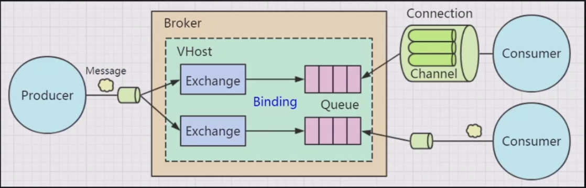
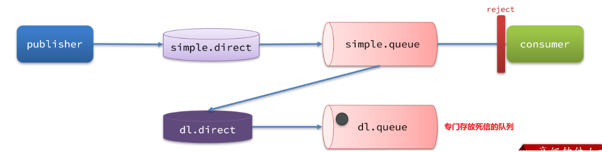
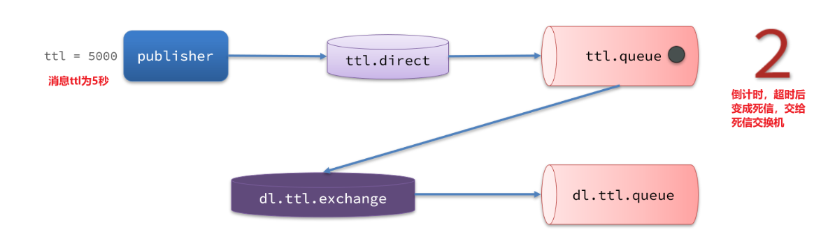
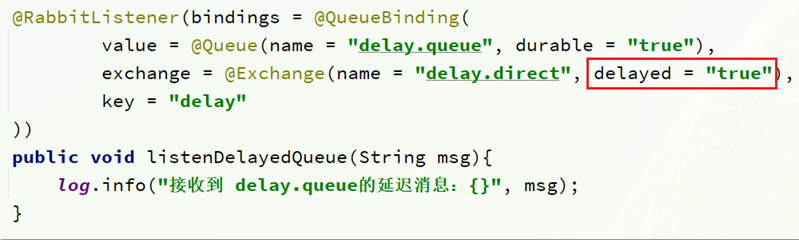
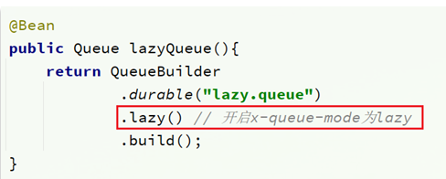
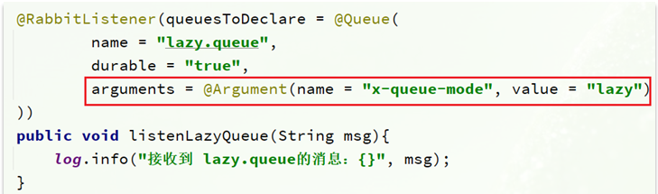

# RabbitMQ-Review

## 工作模型



**名词解释以及作用**

* Broker(代理)：存储，发放转发消息；

* Channel(信道)：在RabbitMQ中，TCP连接通常是不关闭的。

  * 不关闭的原因是 建立和关闭 TCP 连接是有成本的，尤其是当需要频繁发送和接收消息时。如果每次消息传递都要创建和关闭 TCP 连接，性能会受到很大影响。因此，保持长时间的 TCP 连接可以减少这种开销。

  * 那么引入Channel的作用是它提供了**轻量级的虚拟连接**，能够在一个 TCP 连接上实现**并发操作**、**隔离消息**等操作的独立性和灵活性。

  > 在Java中调用**发送和接收消息**的方法中，都是建立在Channel上。

* Queue(消息队列)：业务数据存储在MQ的数据库中，Mnesia。

* Exchange(交换机)：生产者成产消息不直接到Queue中，而是先到Exchange中，Exchange进行消息的转发。交换机有多种转发方式。

  - Fanout：广播，将消息交给所有绑定到交换机的队列
  - Direct：定向，把消息交给符合指定routing key 的队列
  - Topic：通配符，把消息交给符合routing pattern（路由模式） 的队列

* VHost(虚拟主机)：`VHost` 在 RabbitMQ 中主要用于提供资源隔离、权限管理、多租户支持以及环境隔离的功能。 类似Nacos中的namespace。

## 死信交换机

死信交换机作为一个兜底方案。



我们可以给simple.queue添加一个死信交换机，给死信交换机绑定一个队列。这样消息变成死信后也不会丢弃，而是最终投递到死信交换机，路由到与死信交换机绑定的队列。

~~~java
// 声明普通的 simple.queue队列，并且为其指定死信交换机：dl.direct
@Bean
public Queue simpleQueue2(){
    return QueueBuilder.durable("simple.queue") // 指定队列名称，并持久化
        .deadLetterExchange("dl.direct") // 指定死信交换机
        .build();
}
// 声明死信交换机 dl.direct
@Bean
public DirectExchange dlExchange(){
    return new DirectExchange("dl.direct", true, false);
}
// 声明存储死信的队列 dl.queue
@Bean
public Queue dlQueue(){
    return new Queue("dl.queue", true);
}
// 将死信队列 与 死信交换机绑定
@Bean
public Binding dlBinding(){
    return BindingBuilder.bind(dlQueue()).to(dlExchange()).with("simple");
}
~~~

> 什么样的消息会成为死信？
>
> - 消息被消费者reject或者返回nack
> - 消息超时未消费
> - 队列满了

## TTL

**使用死信交换机实现延迟队列。**

设置延迟时间的方式：

- 消息所在的**队列**设置了超时时间
- **消息**本身设置了超时时间



> 上图为消息本事设置了延迟发送时间。

1. 在consumer服务的SpringRabbitListener中，定义一个新的消费者，并且声明 死信交换机、死信队列：

```java
@RabbitListener(bindings = @QueueBinding(
    value = @Queue(name = "dl.ttl.queue", durable = "true"),
    exchange = @Exchange(name = "dl.ttl.direct"),
    key = "ttl"
))
public void listenDlQueue(String msg){
    log.info("接收到 dl.ttl.queue的延迟消息：{}", msg);
}
```

> Spring 会自动创建队列、交换机及其绑定关系，无需再通过 `@Bean` 显式声明。

2. 要给队列设置超时时间，需要在声明队列时配置x-message-ttl属性：

```java
@Bean
public Queue ttlQueue(){
    return QueueBuilder.durable("ttl.queue") // 指定队列名称，并持久化
        .ttl(10000) // 设置队列的超时时间，10秒
        .deadLetterExchange("dl.ttl.direct") // 指定死信交换机
        .build();
}
```

> 注意，这个队列设定了死信交换机为`dl.ttl.direct`

3. 声明交换机，将ttl与交换机绑定：

```java
@Bean
public DirectExchange ttlExchange(){
    return new DirectExchange("ttl.direct");
}
@Bean
public Binding ttlBinding(){
    return BindingBuilder.bind(ttlQueue()).to(ttlExchange()).with("ttl");
}
```

## 延迟队列(插件)

因为延迟队列的需求非常多，所以RabbitMQ的官方也推出了一个<u>插件</u>，原生支持延迟队列效果。

**DelayExchange原理**

DelayExchange需要将一个交换机声明为delayed类型。当我们发送消息到delayExchange时，流程如下：

- 接收消息
- 判断消息是否具备x-delay属性
- 如果有x-delay属性，说明是延迟消息，持久化到硬盘，读取x-delay值，作为延迟时间
- 返回routing not found结果给消息发送者
- x-delay时间到期后，重新投递消息到指定队列

**使用DelayExchange**

基于注解方式：



> 延迟队列插件的使用步骤包括哪些？
>
> * 声明一个交换机，添加delayed属性为true
>
> * 发送消息时，添加x-delay头，值为超时时间

## 惰性队列

**消息堆积问题**

当生产者发送消息的速度超过了消费者处理消息的速度，就会导致队列中的消息堆积，直到队列存储消息达到上限。之后发送的消息就会成为死信，可能会被丢弃，这就是消息堆积问题。

**惰性队列的特征如下：**

- 接收到消息后直接存入磁盘而非内存
- 消费者要消费消息时才会从磁盘中读取并加载到内存
- 支持数百万条的消息存储

**初始化队列时声明**

`@Bean`



`@RabbitListener`



> 消息堆积问题的解决方案？
>
> - 队列上绑定多个消费者，提高消费速度
> - 使用惰性队列，可以再mq中保存更多消息
>
> 惰性队列的优点有哪些？
>
> - 基于磁盘存储，消息上限高
> - 没有间歇性的page-out，性能比较稳定
>
> 惰性队列的缺点有哪些？
>
> - 基于磁盘存储，消息时效性会降低
> - 性能受限于磁盘的IO

## 提出问题

**①在Java库中也有类似Queue的实现，为什么还有再使用第三方组件RabbitMQ等消息中间件呢？**

  类似于Map集合同样可以实现缓存的效果，但是为什么要使用Redis呢。因为在Java层实现的缓存只能适用于这一个服务进程。现在大部分系统架构都是分布式架构，而Redis，RabbitMQ这种组件可以适用于分布式跨进程的环境中，并且这些组件有更多其他的功能，比如持久化。

