# 1. MybatisPlus 简介

* Mybatis-Plus是由baomidou（苞米豆）组织开发并且开源的，目前该组织大概有30人左右。
* 码云地址：https://gitee.com/organizations/baomidou

# 2. 相关配置

* 导入依赖：

```xml
<!-- mybatis-plus插件依赖 -->
<dependency>
<groupId>com.baomidou</groupId>
<artifactId>mybatis-plus</artifactId>
<version>3.1.1</version>
</dependency>
```

* 编写jdbc.properties

```properties
jdbc.driver=com.mysql.jdbc.Driver
jdbc.url=jdbc:mysql://127.0.0.1:3306/mp?
useUnicode=true&characterEncoding=utf8&autoReconnect=true&allowMultiQueries=true&useSSL=false
jdbc.username=root
jdbc.password=root
```

* 编写applicationContext.xml

```xml
<?xml version="1.0" encoding="UTF-8"?>
<beans xmlns="http://www.springframework.org/schema/beans"
       xmlns:xsi="http://www.w3.org/2001/XMLSchema-instance"
       xmlns:context="http://www.springframework.org/schema/context"
       xsi:schemaLocation="http://www.springframework.org/schema/beans
http://www.springframework.org/schema/beans/spring-beans.xsd
http://www.springframework.org/schema/context
http://www.springframework.org/schema/context/spring-context.xsd">

        <!--资源注入-->
        <context:property-placeholder location="classpath:*.properties"/>
        <bean id="dataSource" class="com.alibaba.druid.pool.DruidDataSource" destroy-method="close">
            <property name="driverClassName" value="${jdbc.driver}"/>
            <property name="url" value="${jdbc.url}"/>
            <property name="username" value="${jdbc.username}"/>
            <property name="password" value="${jdbc.password}"/>
            <property name="maxActive" value="10"/>
            <property name="minIdle" value="5"/>
        </bean>
       <!-- mybatisPlus配置-->
        <bean class="com.baomidou.mybatisplus.extension.spring.MybatisSqlSessionFactoryBean">
            <property name="dataSource" ref="dataSource"/>
            <!--MyBatis 配置文件位置，有单独的 MyBatis 配置-->
            <property name="configLocation" value="classpath:mybatis-config.xml"/>
            <!--MyBatis Mapper 所对应的 XML 文件位置，在 Mapper 中有自定义方法（XML 中有自定义实现）-->
            <property name="mapperLocations" value="classpath*:mybatis/*.xml"/>
            <!--MyBaits 别名包扫描路径，通过该属性可以给包中的类注册别名-->
            <property name="typeAliasesPackage"
                      value="com.baomidou.mybatisplus.samples.quickstart.entity"/>
            <property name="globalConfig">
                <bean class="com.baomidou.mybatisplus.core.config.GlobalConfig">
                    <property name="dbConfig">
                        <bean
                                class="com.baomidou.mybatisplus.core.config.GlobalConfig$DbConfig">
                   <!--全局默认主键类型，设置后，即可省略实体对象中的@TableId(type = IdType.AUTO)配置。-->
                            <property name="idType" value="AUTO"/>
                            <!--表名前缀，全局配置后可省略@TableName()配置。-->
                            <property name="tablePrefix" value="tb_"/>
                        </bean>
                    </property>
                </bean>
            </property>
         </bean>
    <!--mapper接口创建实体类-->
    <bean class="org.mybatis.spring.mapper.MapperScannerConfigurer">
        <property name="basePackage" value="com.zua.mapper"/>
     </bean>

</beans>
```

# 3. 实现查询User

* 编写User对象以及UserMapper接口

```java
@Data
@NoArgsConstructor
@AllArgsConstructor
@TableName("tb_user")
public class User {
private Long id;
private String userName;
private String password;
private String name;
private Integer age;
private String email;
}
/*-------------------------------------*/
public interface UserMapper extends BaseMapper<User> {
}
```

* 编写测试用例

```java
@RunWith(SpringJUnit4ClassRunner.class)
@ContextConfiguration(locations = "classpath:applicationContext.xml")
public class TestSpringMP {
@Autowired
private UserMapper userMapper;
@Test
public void testSelectList(){
List<User> users = this.userMapper.selectList(null);
for (User user : users) {
System.out.println(user);
		}
	}
}
```

* 测试结果

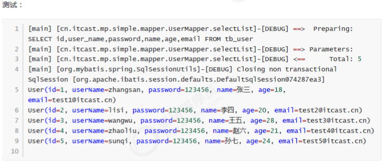


# 4. 通用CRUD

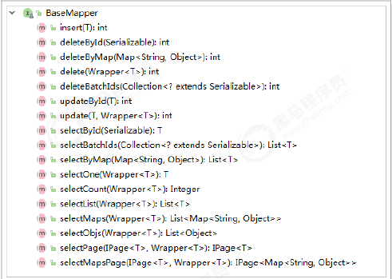


## 4.1 插入操作

* 方法定义

```java
/**
* 插入一条记录
*
* @param entity 实体对象
*/
int insert(T entity);
```

* 测试 用例

```java
@RunWith(SpringRunner.class)
@SpringBootTest
public class UserMapperTest {
@Autowired
private UserMapper userMapper;
@Test
public void testInsert(){
User user = new User();
user.setAge(20);
user.setEmail("test@itcast.cn");
user.setName("曹操");
user.setUserName("caocao");
user.setPassword("123456");
int result = this.userMapper.insert(user); //返回的result是受影响的行数，并不是自增
后的id
System.out.println("result = " + result);
System.out.println(user.getId()); //自增后的id会回填到对象中
}
}
```

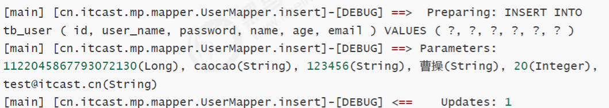

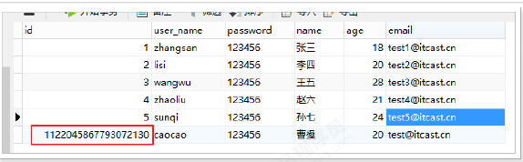

* 插入数据库的id不是自增长的，所以使用MP自增长策略

```java
@Getter
public enum IdType {
/**
* 数据库ID自增
*/
AUTO(0),
/**
* 该类型为未设置主键类型
*/
NONE(1),
/**
* 用户输入ID
* <p>该类型可以通过自己注册自动填充插件进行填充</p>
*/
INPUT(2),
/* 以下3种类型、只有当插入对象ID 为空，才自动填充。 */
/**
* 全局唯一ID (idWorker)
*/
ID_WORKER(3),
/**
* 全局唯一ID (UUID)
*/
UUID(4),
/**
* 字符串全局唯一ID (idWorker 的字符串表示)
*/
ID_WORKER_STR(5);
private final int key;
IdType(int key) {
this.key = key;
	}
}
```

* 修改User实体

```java
@Data
@NoArgsConstructor
@AllArgsConstructor
@TableName("tb_user")
public class User {
@TableId(type = IdType.AUTO) //指定id类型为自增长
private Long id;
private String userName;
private String password;
private String name;
private Integer age;
private String email;
}
```

* 数据插入成功

  ### 4.1.1 @TableField

* 在MP中通过@TableField注解可以指定字段的一些属性，常常解决的问题有2个：

  1、对象中的属性名和字段名不一致的问题（非驼峰）
  2、对象中的属性字段在表中不存在的问题

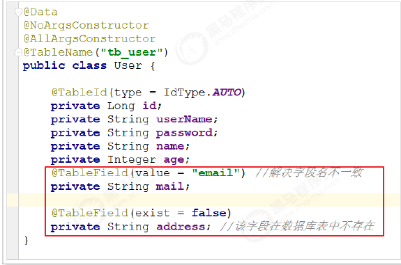

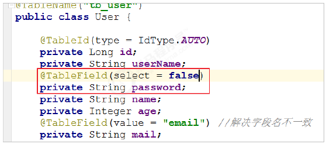

## 4.2 更新操作

### 4.2.1 根据id修改

* 方法定义

```java
/**
* 根据 ID 修改
*
* @param entity 实体对象
*/
int updateById(@Param(Constants.ENTITY) T entity);
```

* 测试用例

```java
@RunWith(SpringRunner.class)
@SpringBootTest
public class UserMapperTest {
@Autowired
private UserMapper userMapper;
@Test
public void testUpdateById() {
User user = new User();
user.setId(6L); //主键
user.setAge(21); //更新的字段
//根据id更新，更新不为null的字段
this.userMapper.updateById(user);
}
}
```

* 结果


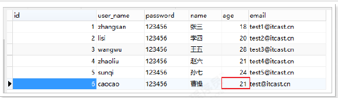

### 4.2.2 根据条件更新

* 方法定义

```java
/**
* 根据 whereEntity 条件，更新记录
*
* @param entity 实体对象 (set 条件值,可以为 null)
* @param updateWrapper 实体对象封装操作类（可以为 null,里面的 entity 用于生成 where 语句）
*/
int update(@Param(Constants.ENTITY) T entity, @Param(Constants.WRAPPER) Wrapper<T>
updateWrapper);
```

* 测试用例

```java
@RunWith(SpringRunner.class)
@SpringBootTest
public class UserMapperTest {
@Autowired
private UserMapper userMapper;
@Test
public void testUpdate() {
User user = new User();
user.setAge(22); //更新的字段
//更新的条件
QueryWrapper<User> wrapper = new QueryWrapper<>();
wrapper.eq("id", 6);
//执行更新操作
int result = this.userMapper.update(user, wrapper);
System.out.println("result = " + result);
}
}
```

* 测试结果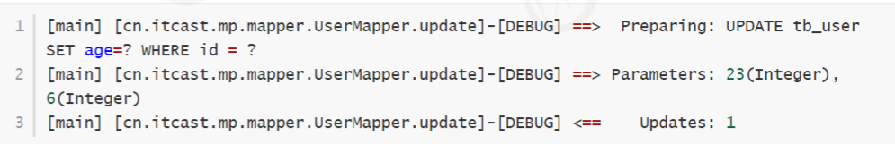

## 4.3 删除操作

### 4.3.1 deleteById

* 方法定义

```java
/**
* 根据 ID 删除
*
* @param id 主键ID
*/
int deleteById(Serializable id);
```

* 测试用例

```java
@RunWith(SpringRunner.class)
@SpringBootTest
public class UserMapperTest {
@Autowired
private UserMapper userMapper;
@Test
public void testDeleteById() {
//执行删除操作
int result = this.userMapper.deleteById(6L);
System.out.println("result = " + result);
}
}
```

* 结果

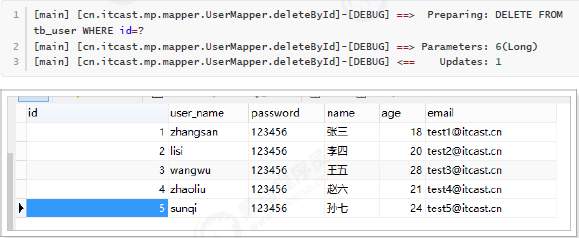

### 4.3.2 deleteByMap

* 方法定义

```java
/**
* 根据 columnMap 条件，删除记录
*
* @param columnMap 表字段 map 对象
*/
int deleteByMap(@Param(Constants.COLUMN_MAP) Map<String, Object> columnMap);
```

* 测试用例

```java
@RunWith(SpringRunner.class)
@SpringBootTest
public class UserMapperTest {
@Autowired
private UserMapper userMapper;
@Test
public void testDeleteByMap() {
Map<String, Object> columnMap = new HashMap<>();
columnMap.put("age",20);
columnMap.put("name","张三");
//将columnMap中的元素设置为删除的条件，多个之间为and关系
int result = this.userMapper.deleteByMap(columnMap);
System.out.println("result = " + result);
}
}
```

* 结果

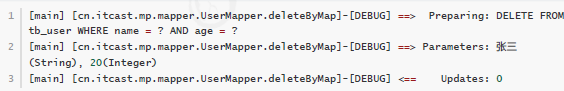

### 4.3.3 delete

* 方法定义

````java
/**
* 根据 entity 条件，删除记录
*
* @param wrapper 实体对象封装操作类（可以为 null）
*/
int delete(@Param(Constants.WRAPPER) Wrapper<T> wrapper);
````

* 测试用例

```java
@RunWith(SpringRunner.class)
@SpringBootTest
public class UserMapperTest {
@Autowired
private UserMapper userMapper;
@Test
public void testDeleteByMap() {
User user = new User();
user.setAge(20);
user.setName("张三");
//将实体对象进行包装，包装为操作条件
QueryWrapper<User> wrapper = new QueryWrapper<>(user);
int result = this.userMapper.delete(wrapper);
System.out.println("result = " + result);
}
}
```

* 结果

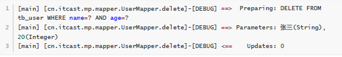

### 4.3.4 deleteBatchIds

* 方法定义

```java
/**
* 删除（根据ID 批量删除）
*
* @param idList 主键ID列表(不能为 null 以及 empty)
*/
int deleteBatchIds(@Param(Constants.COLLECTION) Collection<? extends Serializable>
idList);
```

* 测试用例

```java
@RunWith(SpringRunner.class)
@SpringBootTest
public class UserMapperTest {
@Autowired
private UserMapper userMapper;
@Test
public void testDeleteByMap() {
//根据id集合批量删除
int result = this.userMapper.deleteBatchIds(Arrays.asList(1L,10L,20L));
System.out.println("result = " + result);
}
}
```

* 结果


## 4.4 查询操作

### 4.4.1 selectById

* 方法定义

```
/**
* 根据 ID 查询
*
* @param id 主键ID
*/
T selectById(Serializable id);
```

* 测试用例

```java
@RunWith(SpringRunner.class)
@SpringBootTest
public class UserMapperTest {
@Autowired
private UserMapper userMapper;
@Test
public void testSelectById() {
//根据id查询数据
User user = this.userMapper.selectById(2L);
System.out.println("result = " + user);
}
}
```

* 结果

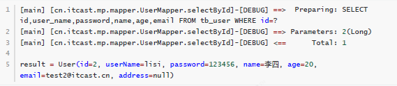

### 4.4.2 selectBatchIds

* 方法定义

```java
/**
* 查询（根据ID 批量查询）
*
* @param idList 主键ID列表(不能为 null 以及 empty)
*/
List<T> selectBatchIds(@Param(Constants.COLLECTION) Collection<? extends Serializable>
idList);
```

* 测试用例

```java
@RunWith(SpringRunner.class)
@SpringBootTest
public class UserMapperTest {
@Autowired
private UserMapper userMapper;
@Test
public void testSelectBatchIds() {
//根据id集合批量查询
List<User> users = this.userMapper.selectBatchIds(Arrays.asList(2L, 3L, 10L));
for (User user : users) {
System.out.println(user);
}
}
}
```

* 结果

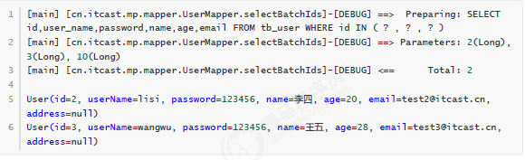

### 4.4.3 selectOne

* 方法定义

```java
/**
* 根据 entity 条件，查询一条记录
*
* @param queryWrapper 实体对象封装操作类（可以为 null）
*/
T selectOne(@Param(Constants.WRAPPER) Wrapper<T> queryWrapper);
```

* 测试

```java
@RunWith(SpringRunner.class)
@SpringBootTest
public class UserMapperTest {
@Autowired
private UserMapper userMapper;
@Test
public void testSelectOne() {
QueryWrapper<User> wrapper = new QueryWrapper<User>();
wrapper.eq("name", "李四");
//根据条件查询一条数据，如果结果超过一条会报错
User user = this.userMapper.selectOne(wrapper);
    System.out.println(user);
	}
}
```

* 结果

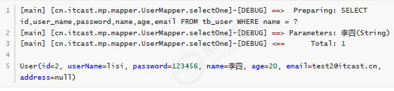

### 4.4.4 selectCount

* 方法定义

```java
/**
* 根据 Wrapper 条件，查询总记录数
*
* @param queryWrapper 实体对象封装操作类（可以为 null）
*/
Integer selectCount(@Param(Constants.WRAPPER) Wrapper<T> queryWrapper);
```

* 测试用例

```java
@RunWith(SpringRunner.class)
@SpringBootTest
public class UserMapperTest {
@Autowired
private UserMapper userMapper;
@Test
public void testSelectCount() {
QueryWrapper<User> wrapper = new QueryWrapper<User>();
wrapper.gt("age", 23); //年龄大于23岁
//根据条件查询数据条数
Integer count = this.userMapper.selectCount(wrapper);
System.out.println("count = " + count);
	}
}
```

* 结果

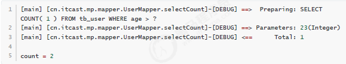

### 4.4.5 selectList

* 方法定义

```java
/**
* 根据 entity 条件，查询全部记录
*
* @param queryWrapper 实体对象封装操作类（可以为 null）
*/
List<T> selectList(@Param(Constants.WRAPPER) Wrapper<T> queryWrapper);
```

* 测试用例

```java
@RunWith(SpringRunner.class)
@SpringBootTest
public class UserMapperTest {
@Autowired
private UserMapper userMapper;
@Test
public void testSelectList() {
QueryWrapper<User> wrapper = new QueryWrapper<User>();
wrapper.gt("age", 23); //年龄大于23岁
//根据条件查询数据
List<User> users = this.userMapper.selectList(wrapper);
for (User user : users) {
System.out.println("user = " + user);
		}
	}
}
```

* 结果

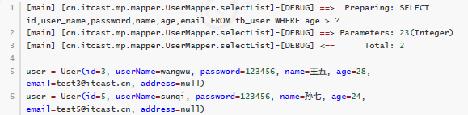

### 4.4.6 selectPage

* 方法定义

```java
/**
* 根据 entity 条件，查询全部记录（并翻页）
*
* @param page 分页查询条件（可以为 RowBounds.DEFAULT）
* @param queryWrapper 实体对象封装操作类（可以为 null）
*/
IPage<T> selectPage(IPage<T> page, @Param(Constants.WRAPPER) Wrapper<T> queryWrapper);
```

* 配置分页插件

```xml
<!--MybatisConfig-->
<plugins>
        <plugin interceptor="com.baomidou.mybatisplus.extension.plugins.PaginationInterceptor"/>
 </plugins>
```

* 测试用例

```java
@RunWith(SpringRunner.class)
@SpringBootTest
public class UserMapperTest {
@Autowired
private UserMapper userMapper;
@Test
public void testSelectPage() {
QueryWrapper<User> wrapper = new QueryWrapper<User>();
wrapper.gt("age", 20); //年龄大于20岁
Page<User> page = new Page<>(1,1);
//根据条件查询数据
IPage<User> iPage = this.userMapper.selectPage(page, wrapper);
System.out.println("数据总条数：" + iPage.getTotal());
System.out.println("总页数：" + iPage.getPages());
List<User> users = iPage.getRecords();
for (User user : users) {
System.out.println("user = " + user);
		}
	}
}
```

* 结果

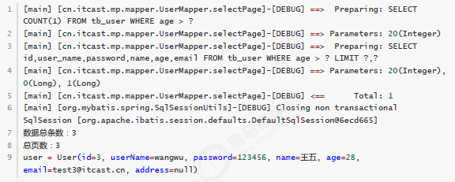

# 5. 条件构造器

## 5.1 allEq

* 方法定义

```java
allEq(Map<R, V> params)
allEq(Map<R, V> params, boolean null2IsNull)
allEq(boolean condition, Map<R, V> params, boolean null2IsNull)
```

* 测试

```java
@RunWith(SpringRunner.class)
@SpringBootTest
public class UserMapperTest {
@Autowired
private UserMapper userMapper;
@Test
public void testWrapper() {
QueryWrapper<User> wrapper = new QueryWrapper<>();
//设置条件
Map<String,Object> params = new HashMap<>();
params.put("name", "曹操");
params.put("age", "20");
params.put("password", null);
// wrapper.allEq(params);//SELECT * FROM tb_user WHERE password IS NULL ANDname = ? AND age = ?
// wrapper.allEq(params,false); //SELECT * FROM tb_user WHERE name = ? AND age= ?
// wrapper.allEq((k, v) -> (k.equals("name") || k.equals("age")),params);//SELECT * FROM tb_user WHERE name = ? AND age = ?
List<User> users = this.userMapper.selectList(wrapper);
for (User user : users) {
System.out.println(user);
		}
	}
}
```

## 5.2 基本比较操作

* eq
  * 等于 =
* ne
  *  不等于 ！=
* gt
  * 大于  >
* ge
  * 大于等于 >=
* lt 
  * 小于 <
* le
  * 小于等于 <=
* between
  * BETWEEN 值1 AND 值2
* notBetween
  * NOT BETWEEN 值1 AND 值2
* in
  * 字段 IN (value.get(0), value.get(1), ...)
* notIn
  * 字段 NOT IN (v0, v1, ...)

测试用例：

```java
@RunWith(SpringRunner.class)
@SpringBootTest
public class UserMapperTest {
@Autowired
private UserMapper userMapper;
@Test
public void testEq() {
QueryWrapper<User> wrapper = new QueryWrapper<>();
//SELECT id,user_name,password,name,age,email FROM tb_user WHERE password = ?
AND age >= ? AND name IN (?,?,?)
wrapper.eq("password", "123456")
.ge("age", 20)
.in("name", "李四", "王五", "赵六");
List<User> users = this.userMapper.selectList(wrapper);
for (User user : users) {
System.out.println(user);
		}
	}
}
```

## 5.3 模糊查询

* like
  * LIKE '%值%'
  * 例: like("name", "王") ---> name like '%王%'
* notLike
  * NOT LIKE '%值%'
  * 例: notLike("name", "王") ---> name not like '%王%'

* likeLeft
  * LIKE '%值'
  * 例: likeLeft("name", "王") ---> name like '%王'
* likeRight
  * LIKE '值%'
  * 例: likeRight("name", "王") ---> name like '王%'

测试用例:

```java
@RunWith(SpringRunner.class)
@SpringBootTest
public class UserMapperTest {
@Autowired
private UserMapper userMapper;
@Test
public void testWrapper() {
QueryWrapper<User> wrapper = new QueryWrapper<>();
//SELECT id,user_name,password,name,age,email FROM tb_user WHERE name LIKE ?
//Parameters: %曹%(String)
wrapper.like("name", "曹");
List<User> users = this.userMapper.selectList(wrapper);
for (User user : users) {
System.out.println(user);
			}	
		}
}
```

## 5.4 排序

* orderBy
  * 排序：ORDER BY 字段, ...
  * 例: orderBy(true, true, "id", "name") ---> order by id ASC,name ASC
* orderByAsc
  * 排序：ORDER BY 字段, ... ASC
  * 例: orderByAsc("id", "name") ---> order by id ASC,name ASC
* orderByDesc
  * 排序：ORDER BY 字段, ... DESC
  * 例: orderByDesc("id", "name") ---> order by id DESC,name DESC

测试用例

```java
@RunWith(SpringRunner.class)
@SpringBootTest
public class UserMapperTest {
@Autowired
private UserMapper userMapper;
@Test
public void testWrapper() {
QueryWrapper<User> wrapper = new QueryWrapper<>();
//SELECT id,user_name,password,name,age,email FROM tb_user ORDER BY age DESC
wrapper.orderByDesc("age");
List<User> users = this.userMapper.selectList(wrapper);
for (User user : users) {
System.out.println(user);
		}
	}
}
```

## 5.5 逻辑查询

* or
  * 拼接 OR
* and
  * AND 嵌套

测试用例：

```java
@RunWith(SpringRunner.class)
@SpringBootTest
public class UserMapperTest {
@Autowired
private UserMapper userMapper;
@Test
public void testWrapper() {
QueryWrapper<User> wrapper = new QueryWrapper<>();
//SELECT id,user_name,password,name,age,email FROM tb_user WHERE name = ? OR
age = ?
wrapper.eq("name","李四").or().eq("age", 24);
List<User> users = this.userMapper.selectList(wrapper);
for (User user : users) {
System.out.println(user);
		}	
	}
}
```

## 5.6 select

* 在MP查询中，默认查询所有的字段，如果有需要也可以通过select方法进行指定字段。

```java
@RunWith(SpringRunner.class)
@SpringBootTest
public class UserMapperTest {
@Autowired
private UserMapper userMapper;
@Test
public void testWrapper() {
QueryWrapper<User> wrapper = new QueryWrapper<>();
//SELECT id,name,age FROM tb_user WHERE name = ? OR age = ?
wrapper.eq("name", "李四")
.or()
.eq("age", 24)
.select("id", "name", "age");
List<User> users = this.userMapper.selectList(wrapper);
for (User user : users) {
System.out.println(user);
		}
	}
}
```

# 6. ActiveRecord

* ActiveRecord（简称AR）一直广受动态语言（ PHP 、 Ruby 等）的喜爱，而 Java 作为准静态语言，对于
  ActiveRecord 往往只能感叹其优雅，所以我们也在 AR 道路上进行了一定的探索，喜欢大家能够喜欢。

## 6.1 开启AR之旅

```java
//实体 只需要将实体对象继承Model即可
@Data
@NoArgsConstructor
@AllArgsConstructor
public class User extends Model<User> {
private Long id;
private String userName;
private String password;
private String name;
private Integer age;
private String email;
}

//测试 根据主键查询
@RunWith(SpringRunner.class)
@SpringBootTest
public class UserMapperTest {
	@Autowired
	private UserMapper userMapper;
    @Test
	public void testAR() {
		User user = new User();
		user.setId(2L);/*------------------------*/
		User user2 = user.selectById();/*------------------------*/
		System.out.println(user2);
	}
}

//测试 新增数据
@RunWith(SpringRunner.class)
@SpringBootTest
public class UserMapperTest {
@Autowired
private UserMapper userMapper;
@Test
public void testAR() {
        User user = new User();
        user.setName("刘备");
        user.setAge(30);
        user.setPassword("123456");
        user.setUserName("liubei");
        user.setEmail("liubei@itcast.cn");
        boolean insert = user.insert();
        System.out.println(insert);
	}	
}

//测试 更新操作
@RunWith(SpringRunner.class)
@SpringBootTest
public class UserMapperTest {
    @Autowired
    private UserMapper userMapper;
    @Test
    public void testAR() {
        User user = new User();
        user.setId(8L);
        user.setAge(35);
        boolean update = user.updateById();
        System.out.println(update);
    }
}

//测试 删除操作
@RunWith(SpringRunner.class)
@SpringBootTest
public class UserMapperTest {
    @Autowired
    private UserMapper userMapper;
    @Test
    public void testAR() {
        User user = new User();
        user.setId(7L);
        boolean delete = user.deleteById();
        System.out.println(delete);
    }
}

//测试 根据条件查询
@RunWith(SpringRunner.class)
@SpringBootTest
public class UserMapperTest {
    @Autowired
    private UserMapper userMapper;
    @Test
    public void testAR() {
        User user = new User();
        QueryWrapper<User> userQueryWrapper = new QueryWrapper<>();
        userQueryWrapper.le("age","20");
        List<User> users = user.selectList(userQueryWrapper);
        for (User user1 : users) {
            System.out.println(user1);
           }
    }
}

```

# 7. 插件

## 7.1 拦截器

```java
//实例
@Intercepts({@Signature(
type= Executor.class,
method = "update",
args = {MappedStatement.class,Object.class})})
public class MyInterceptor implements Interceptor {
    @Override
    public Object intercept(Invocation invocation) throws Throwable {
    //拦截方法，具体业务逻辑编写的位置
    return invocation.proceed();
    }
    @Override
    public Object plugin(Object target) {
    //创建target对象的代理对象,目的是将当前拦截器加入到该对象中
        return Plugin.wrap(target, this);
    }
    @Override
    public void setProperties(Properties properties) {
    	//属性设置
    }
}
```

* xml配置

```xml
<?xml version="1.0" encoding="UTF-8" ?>
<!DOCTYPE configuration
PUBLIC "-//mybatis.org//DTD Config 3.0//EN"
"http://mybatis.org/dtd/mybatis-3-config.dtd">
<configuration>
<plugins>
	<plugin interceptor="cn.itcast.mp.plugins.MyInterceptor"></plugin>
</plugins>
</configuration>
```

## 7.2 性能分析插件

* 配置

```xml
<?xml version="1.0" encoding="UTF-8" ?>
<!DOCTYPE configuration
PUBLIC "-//mybatis.org//DTD Config 3.0//EN"
"http://mybatis.org/dtd/mybatis-3-config.dtd">
<configuration>
<plugins>
<!-- SQL 执行性能分析，开发环境使用，线上不推荐。 maxTime 指的是 sql 最大执行时长 -->
<plugin
interceptor="com.baomidou.mybatisplus.extension.plugins.PerformanceInterceptor">
<property name="maxTime" value="100" />
<!--SQL是否格式化 默认false-->
<property name="format" value="true" />
</plugin>
</plugins>
</configuration>
```

## 7.3 乐观锁插件

* xml配置

```xml
<bean class="com.baomidou.mybatisplus.extension.plugins.OptimisticLockerInterceptor"/>
```

* 实体配置

```java
@Version
private Integer version;
```

* 数据库添加version字段

```sql
ALTER TABLE `tb_user`
ADD COLUMN `version` int(10) NULL AFTER `email`;
UPDATE `tb_user` SET `version`='1';
```

* 测试

```java
@Test
public void testUpdate(){
    User user = new User();
    user.setAge(30);
    user.setId(2L);
    user.setVersion(1); //获取到version为1
    int result = this.userMapper.updateById(user);
    System.out.println("result = " + result);
}
```

* 结果

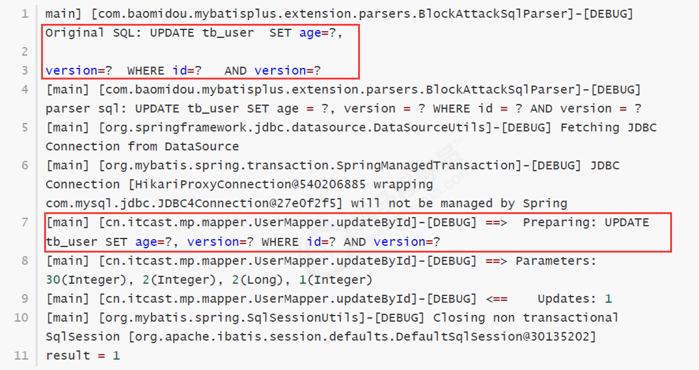

## 7.4 自动填充功能

* 添加@TableField注解

```java
@TableField(fill = FieldFill.INSERT) //插入数据时进行填充
private String password;
```

* 为password添加自动填充功能，在新增数据时有效。
* FieldFill提供了多种模式选择：

```java
public enum FieldFill {
    /**
    * 默认不处理
    */
    DEFAULT,
    /**
    * 插入时填充字段
    */
    INSERT,
    /**
    * 更新时填充字段
    */
    UPDATE,
    /**
    * 插入和更新时填充字段
    */
    INSERT_UPDATE
}
```

* 编写MyMetaObjectHandler

```java
@Component
public class MyMetaObjectHandler implements MetaObjectHandler {
    @Override
    public void insertFill(MetaObject metaObject) {
    Object password = getFieldValByName("password", metaObject);
    if(null == password){
    //字段为空，可以进行填充
    setFieldValByName("password", "123456", metaObject);
       	 }
    }
    @Override
    public void updateFill(MetaObject metaObject) {
	}
}
```

* 测试

```java
@Test
public void testInsert(){
    User user = new User();
    user.setName("关羽");
    user.setUserName("guanyu");
    user.setAge(30);
    user.setEmail("guanyu@itast.cn");
    user.setVersion(1);
    int result = this.userMapper.insert(user);
    System.out.println("result = " + result);
}
```

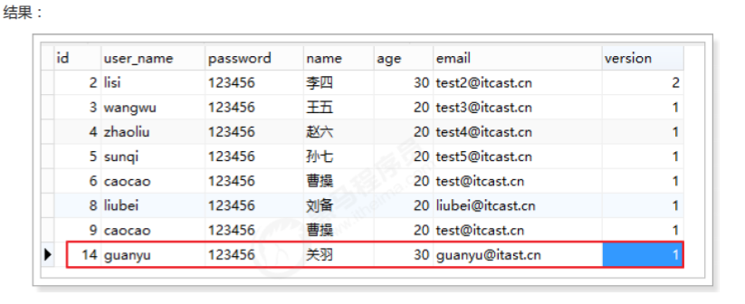

## 7.5 逻辑删除

* 开发系统时，有时候在实现功能时，删除操作需要实现逻辑删除，所谓逻辑删除就是将数据标记为删除，而并非真正
  的物理删除（非DELETE操作），查询时需要携带状态条件，确保被标记的数据不被查询到。这样做的目的就是避免
  数据被真正的删除。

```sql
`修改数据表`
ALTER TABLE `tb_user`
ADD COLUMN `deleted` int(1) NULL DEFAULT 0 COMMENT '1代表删除，0代表未删除' AFTER `version`;
```

```java
//实体
@TableLogic
private Integer deleted;
```

```properties
#applicaitonContext配置
# 逻辑已删除值(默认为 1)
mybatis-plus.global-config.db-config.logic-delete-value=1
# 逻辑未删除值(默认为 0)
mybatis-plus.global-config.db-config.logic-not-delete-value=0
```

```java
//测试
@Test
public void testDeleteById(){
    this.userMapper.deleteById(2L);
}
```

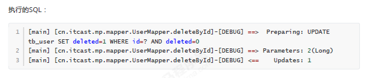

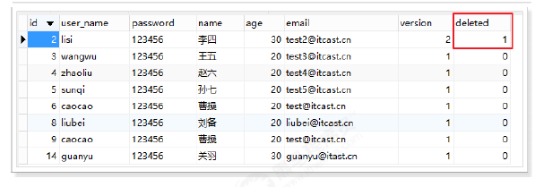

* 测试查询

```java
@Test
public void testSelectById(){
    User user = this.userMapper.selectById(2L);
    System.out.println(user);
}
```

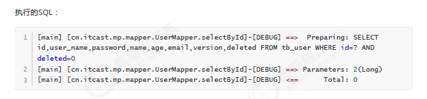

## 7.6 通用枚举

```sql
`修改表`
ALTER TABLE `tb_user`
ADD COLUMN `sex` int(1) NULL DEFAULT 1 COMMENT '1-男，2-女' AFTER `deleted`;
```

* 定义枚举

```java
public enum SexEnum implements IEnum<Integer> {
    MAN(1,"男"),WOMAN(2,"女");
    private int value;
    private String desc;
    SexEnum(int value, String desc) {
        this.value = value;
        this.desc = desc;
    }
    @Override
    public Integer getValue() {
            return this.value;
        }
    @Override
    public String toString() {
            return this.desc;
        }
}
```

```properties
#配置
# 枚举包扫描
mybatis-plus.type-enums-package=cn.itcast.mp.enums
```

```java
//修改实体
private SexEnum sex;
```

```java
//测试
@Test
public void testInsert(){
    User user = new User();
    user.setName("貂蝉");
    user.setUserName("diaochan");
    user.setAge(20);
    user.setEmail("diaochan@itast.cn");
    user.setVersion(1);
    user.setSex(SexEnum.WOMAN);
    int result = this.userMapper.insert(user);
    System.out.println("result = " + result);
}
```

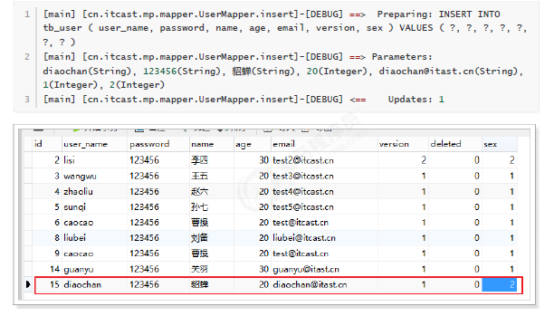

* 查询操作

```java
@Test
public void testSelectById(){
    User user = this.userMapper.selectById(2L);
    System.out.println(user);
}
```

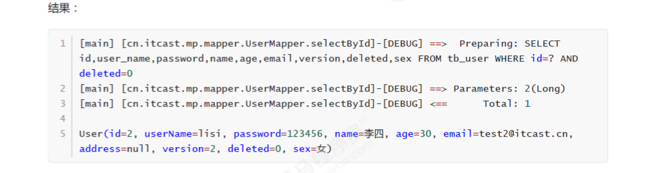
