# MySQL的数据目录

## MySQL8的主要目录结构

### 数据库文件的存放路径

~~~shell
mysql> show variables like 'datadir';
+---------------+-----------------+
| Variable_name | Value |
+---------------+-----------------+
| datadir | /var/lib/mysql/ |
+---------------+-----------------+
1 row in set (0.04 sec)
~~~

### 相关命令目录

相关命令目录：/usr/bin（mysqladmin、mysqlbinlog、mysqldump等命令）和/usr/sbin。

### 配置文件目录

配置文件目录：/usr/share/mysql-8.0（命令及配置文件），/etc/mysql（如my.cnf）

## 数据库和文件系统的关系

### 查看默认数据库

* `mysql`

MySQL 系统自带的核心数据库，它存储了MySQL的用户账户和权限信息，一些存储过程、事件的定 义信息，一些运行过程中产生的日志信息，一些帮助信息以及时区信息等。

* `information_schema`

MySQL 系统自带的数据库，这个数据库保存着MySQL服务器 维护的所有其他数据库的信息 ，比如有 哪些表、哪些视图、哪些触发器、哪些列、哪些索引。这些信息并不是真实的用户数据，而是一些 描述性信息，有时候也称之为 元数据 。在系统数据库 information_schema 中提供了一些以 innodb_sys 开头的表，用于表示内部系统表。

~~~shell
mysql> USE information_schema;
Database changed
mysql> SHOW TABLES LIKE 'innodb_sys%';
+--------------------------------------------+
| Tables_in_information_schema (innodb_sys%) |
+--------------------------------------------+
| INNODB_SYS_DATAFILES |
| INNODB_SYS_VIRTUAL |
| INNODB_SYS_INDEXES |
| INNODB_SYS_TABLES |
| INNODB_SYS_FIELDS |
| INNODB_SYS_TABLESPACES |
| INNODB_SYS_FOREIGN_COLS |
| INNODB_SYS_COLUMNS |
| INNODB_SYS_FOREIGN |
| INNODB_SYS_TABLESTATS |
+--------------------------------------------+
10 rows in set (0.00 sec)
~~~

* `performance_schema`

MySQL 系统自带的数据库，这个数据库里主要保存MySQL服务器运行过程中的一些状态信息，可以 用来 监控 MySQL 服务的各类性能指标 。包括统计最近执行了哪些语句，在执行过程的每个阶段都 花费了多长时间，内存的使用情况等信息。

* `sys`

MySQL 系统自带的数据库，这个数据库主要是通过 视图 的形式把 information_schema 和 performance_schema 结合起来，帮助系统管理员和开发人员监控 MySQL 的技术性能。

### 表在文件系统中的表示

**InnoDB存储引擎模式**

1. 表结构

为了保存表结构， InnoDB 在 数据目录 下对应的数据库子目录下创建了一个专门用于 描述表结构的文 件 ，文件名是这样：`表名.frm`

2. 表中数据和索引

**系统表空间（system tablespace）**

默认情况下，InnoDB会在数据目录下创建一个名为 ibdata1 、大小为 12M 的文件，这个文件就是对应 的 系统表空间 在文件系统上的表示。怎么才12M？注意这个文件是 自扩展文件 ，当不够用的时候它会自 己增加文件大小。

**独立表空间(file-per-table tablespace)**

在MySQL5.6.6以及之后的版本中，InnoDB并不会默认的把各个表的数据存储到系统表空间中，而是为 每 一个表建立一个独立表空间 ，也就是说我们创建了多少个表，就有多少个独立表空间。使用 独立表空间 来 存储表数据的话，会在该表所属数据库对应的子目录下创建一个表示该独立表空间的文件，文件名和表 名相同，只不过添加了一个 .ibd 的扩展名而已，所以完整的文件名称长这样：`表名.ibd`

### MyISAM存储引擎模式

1. 表结构

在存储表结构方面， MyISAM 和 InnoDB 一样，也是在 数据目录 下对应的数据库子目录下创建了一个专 门用于描述表结构的文件：`表名.frm`

2. 表中数据和索引

~~~mysql
test.frm 存储表结构
test.MYD 存储数据 (MYData)
test.MYI 存储索引 (MYIndex)
~~~

### 小结

举例： 数据库a ， 表b 。

1、如果表b采用 InnoDB ，data\a中会产生1个或者2个文件：

* b.frm ：描述表结构文件，字段长度等
* 如果采用 系统表空间 模式的，数据信息和索引信息都存储在 ibdata1 中
* 如果采用 独立表空间 存储模式，data\a中还会产生 b.ibd 文件（存储数据信息和索引信息）

此外：

① MySQL5.7 中会在data/a的目录下生成 db.opt 文件用于保存数据库的相关配置。比如：字符集、比较 规则。而MySQL8.0不再提供db.opt文件。 

② MySQL8.0中不再单独提供b.frm，而是合并在b.ibd文件中。

2、如果表b采用 MyISAM ，data\a中会产生3个文件：

*  MySQL5.7 中： b.frm ：描述表结构文件，字段长度等。 MySQL8.0 中 b.xxx.sdi ：描述表结构文件，字段长度等
*  b.MYD (MYData)：数据信息文件，存储数据信息(如果采用独立表存储模式)
*  b.MYI (MYIndex)：存放索引信息文件

# 用户与权限管理

## 用户管理

### 登录MySQL服务器

启动MySQL服务后，可以通过mysql命令来登录MySQL服务器，命令如下：

~~~shell
mysql –h hostname|hostIP –P port –u username –p DatabaseName –e "SQL语句"
~~~

下面详细介绍命令中的参数：

* -h参数 后面接主机名或者主机IP，hostname为主机，hostIP为主机IP。

* -P参数 后面接MySQL服务的端口，通过该参数连接到指定的端口。MySQL服务的默认端口是3306， 不使用该参数时自动连接到3306端口，port为连接的端口号。 

* -u参数 后面接用户名，username为用户名。 

* -p参数 会提示输入密码。 
* DatabaseName参数 指明登录到哪一个数据库中。如果没有该参数，就会直接登录到MySQL数据库 中，然后可以使用USE命令来选择数据库。
* -e参数 后面可以直接加SQL语句。登录MySQL服务器以后即可执行这个SQL语句，然后退出MySQL 服务器。

~~~shell
#举例
mysql -uroot -p -hlocalhost -P3306 mysql -e "select host,user from user"
~~~

### 创建用户

CREATE USER语句的基本语法形式如下：

~~~mysql
CREATE USER 用户名 [IDENTIFIED BY '密码'][,用户名 [IDENTIFIED BY '密码']];
~~~

* 用户名参数表示新建用户的账户，由 用户（User） 和 主机名（Host） 构成；

* “[ ]”表示可选，也就是说，可以指定用户登录时需要密码验证，也可以不指定密码验证，这样用户 可以直接登录。不过，不指定密码的方式不安全，不推荐使用。如果指定密码值，这里需要使用 IDENTIFIED BY指定明文密码值。 

* CREATE USER语句可以同时创建多个用户。

~~~mysql
#举例
CREATE USER zhang3 IDENTIFIED BY '123123'; # 默认host是 %

CREATE USER 'kangshifu'@'localhost' IDENTIFIED BY '123456';
~~~

###  修改用户

~~~mysql
UPDATE mysql.user SET USER='li4' WHERE USER='wang5';
FLUSH PRIVILEGES;
~~~

### 删除用户

使用DROP USER语句来删除用户时，必须用于DROP USER权限。DROP USER语句的基本语法形式如下：

~~~mysql
DROP USER user[,user]…;
~~~

举例

~~~mysql
DROP USER li4 ; # 默认删除host为%的用户

DROP USER 'kangshifu'@'localhost';
~~~

> mysql.user  表中 host和user为联合主键

### 设置当前用户密码

**使用SET语句来修改当前用户密码** 

使用root用户登录MySQL后，可以使用SET语句来修改密码，具体 SQL语句如下：

~~~mysql
SET PASSWORD='new_password';
~~~

### 修改其它用户密码

**使用SET命令来修改普通用户的密码**

使用root用户登录到MySQL服务器后，可以使用SET语句来修改普 通用户的密码。SET语句的代码如下：

~~~mysql
SET PASSWORD FOR 'username'@'hostname'='new_password';
~~~

## 权限管理

### 权限列表

​	（1） CREATE和DROP权限 ，可以创建新的数据库和表，或删除（移掉）已有的数据库和表。如果将 MySQL数据库中的DROP权限授予某用户，用户就可以删除MySQL访问权限保存的数据库。 

​	（2） SELECT、INSERT、UPDATE和DELETE权限 允许在一个数据库现有的表上实施操作。 

​	（3） SELECT权限 只有在它们真正从一个表中检索行时才被用到。 

​	（4） INDEX权限 允许创建或删除索引，INDEX适用于已 有的表。如果具有某个表的CREATE权限，就可以在CREATE TABLE语句中包括索引定义。

​	 （5） ALTER权 限 可以使用ALTER TABLE来更改表的结构和重新命名表。

​	 （6） CREATE ROUTINE权限 用来创建保存的 程序（函数和程序），ALTER ROUTINE权限用来更改和删除保存的程序， EXECUTE权限 用来执行保存的 程序。

​	 （7） GRANT权限 允许授权给其他用户，可用于数据库、表和保存的程序。

​	 （8） FILE权限 使用 户可以使用LOAD DATA INFILE和SELECT ... INTO OUTFILE语句读或写服务器上的文件，任何被授予FILE权 限的用户都能读或写MySQL服务器上的任何文件（说明用户可以读任何数据库目录下的文件，因为服务 器可以访问这些文件）。

**授予权限的原则**

权限控制主要是出于安全因素，因此需要遵循以下几个 经验原则 ：

 	1、只授予能 满足需要的最小权限 ，防止用户干坏事。比如用户只是需要查询，那就只给select权限就可 以了，不要给用户赋予update、insert或者delete权限。
 	
 	2、创建用户的时候 限制用户的登录主机 ，一般是限制成指定IP或者内网IP段。
 	
 	3、为每个用户 设置满足密码复杂度的密码 。 

​	4、 定期清理不需要的用户 ，回收权限或者删除用户。

### 授予权限

授权命令：

~~~mysql
GRANT 权限1,权限2,…权限n ON 数据库名称.表名称 TO 用户名@用户地址 [IDENTIFIED BY ‘密码口令’];
~~~

* 该权限如果发现没有该用户，则会直接新建一个用户。

例如：

* 给li4用户用本地命令行方式，授予atguigudb这个库下的所有表的插删改查的权限。

~~~mysql
GRANT SELECT,INSERT,DELETE,UPDATE ON atguigudb.* TO li4@localhost ;
~~~

* 授予通过网络方式登录的joe用户 ，对所有库所有表的全部权限，密码设为123。注意这里唯独不包 括grant的权限

~~~mysql
GRANT ALL PRIVILEGES ON *.* TO joe@'%' IDENTIFIED BY '123';
~~~

### 查看权限

* 查看当前用户

~~~mysql
SHOW GRANTS;
# 或
SHOW GRANTS FOR CURRENT_USER;
# 或
SHOW GRANTS FOR CURRENT_USER();
~~~

* 查看某用户的全局权限

~~~mysql
SHOW GRANTS FOR 'user'@'主机地址' ;
~~~

###  收回权限

~~~mysql
#语法
REVOKE 权限1,权限2,…权限n ON 数据库名称.表名称 FROM 用户名@用户地址;

#举例
#收回全库全表的所有权限
REVOKE ALL PRIVILEGES ON *.* FROM joe@'%';
#收回mysql库下的所有表的插删改查权限
REVOKE SELECT,INSERT,UPDATE,DELETE ON mysql.* FROM joe@localhost;

~~~

### 权限表

**user表**

user表是MySQL中最重要的一个权限表， 记录用户账号和权限信息 ，有49个字段。如下图：

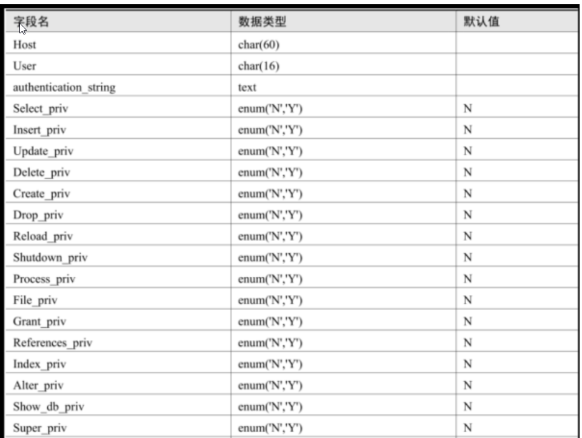

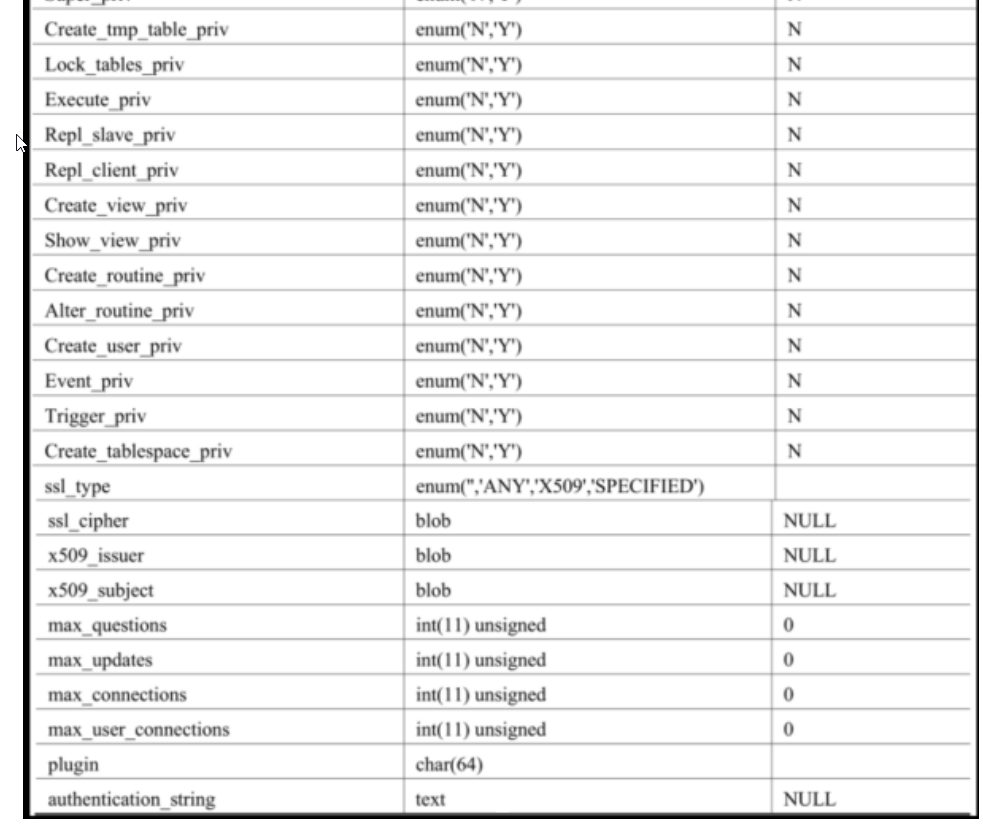

1.范围列（或用户列）

* host ： 表示连接类
  * `%` 表示所有远程通过 TCP方式的连接 
  * `IP 地址` 如 (192.168.1.2、127.0.0.1) 通过制定ip地址进行的TCP方式的连接
  * `机器名` 通过制定网络中的机器名进行的TCP方式的连接 
  * `::1` IPv6的本地ip地址，等同于IPv4的 127.0.0.1
  * ` localhost` 本地方式通过命令行方式的连接 ，比如mysql -u xxx -p xxx 方式的连接。

* user ： 表示用户名，同一用户通过不同方式链接的权限是不一样的。
* password ： 密码
  * 所有密码串通过 password(明文字符串) 生成的密文字符串。MySQL 8.0 在用户管理方面增加了 角色管理，默认的密码加密方式也做了调整，由之前的 SHA1 改为了 SHA2 ，不可逆 。同时 加上 MySQL 5.7 的禁用用户和用户过期的功能，MySQL 在用户管理方面的功能和安全性都较之 前版本大大的增强了。 
  * mysql 5.7 及之后版本的密码保存到 authentication_string 字段中不再使用password 字 段。

2. 权限列

*  Grant_priv字段 
   * 表示是否拥有GRANT权限 
*  Shutdown_priv字段 
   * 表示是否拥有停止MySQL服务的权限 
*  Super_priv字段 
   * 表示是否拥有超级权限 
*  Execute_priv字段
   * 表示是否拥有EXECUTE权限。拥有EXECUTE权限，可以执行存储过程和函数。
*  Select_priv , Insert_priv等 
   * 为该用户所拥有的权限。

3. 安全列

   安全列只有6个字段，其中两个是ssl相关的（ssl_type、ssl_cipher），用于 加密 ；两个是x509 相关的（x509_issuer、x509_subject），用于 标识用户 ；另外两个Plugin字段用于 验证用户身份 的插件， 该字段不能为空。如果该字段为空，服务器就使用内建授权验证机制验证用户身份。

4. 资源控制列 资源控制列的字段用来 限制用户使用的资源 ，包含4个字段，分别为：

   ①max_questions，用户每小时允许执行的查询操作次数；

    ②max_updates，用户每小时允许执行的更新 操作次数；

    ③max_connections，用户每小时允许执行的连接操作次数；

    ④max_user_connections，用户 允许同时建立的连接次数。

## 角色管理(MySQL8.0)

引入角色的目的是 方便管理拥有相同权限的用户 。恰当的权限设定，可以确保数据的安全性，这是至关 重要的。

### 创建角色

创建角色使用 CREATE ROLE 语句，语法如下：

~~~mysql
CREATE ROLE 'role_name'[@'host_name'] [,'role_name'[@'host_name']]...
# 举例
CREATE ROLE 'manager'@'localhost';
~~~

### 给角色赋予权限

创建角色之后，默认这个角色是没有任何权限的，我们需要给角色授权。给角色授权的语法结构是：

~~~mysql
GRANT privileges ON table_name TO 'role_name'[@'host_name'];	
#举例
GRANT SELECT ON demo.settlement TO 'manager';

GRANT SELECT ON demo.goodsmaster TO 'manager';

GRANT SELECT ON demo.invcount TO 'manager';
~~~

###  查看角色的权限

赋予角色权限之后，我们可以通过 SHOW GRANTS 语句，来查看权限是否创建成功了：

~~~shell
mysql> SHOW GRANTS FOR 'manager';
+-------------------------------------------------------+
| Grants for manager@% |
+-------------------------------------------------------+
| GRANT USAGE ON *.* TO `manager`@`%` |
| GRANT SELECT ON `demo`.`goodsmaster` TO `manager`@`%` |
| GRANT SELECT ON `demo`.`invcount` TO `manager`@`%` |
| GRANT SELECT ON `demo`.`settlement` TO `manager`@`%` |
+-------------------------------------------------------+
~~~

### 回收角色的权限

撤销角色权限的SQL语法如下：

~~~mysql
REVOKE privileges ON tablename FROM 'rolename';
~~~

练习1：撤销school_write角色的权限。 

使用如下语句撤销school_write角色的权限。

~~~mysql
REVOKE INSERT, UPDATE, DELETE ON school.* FROM 'school_write';
~~~

###  删除角色

当我们需要对业务重新整合的时候，可能就需要对之前创建的角色进行清理，删除一些不会再使用的角 色。删除角色的操作很简单，你只要掌握语法结构就行了。

~~~mysql
DROP ROLE role [,role2]...
~~~

>  注意， 如果你删除了角色，那么用户也就失去了通过这个角色所获得的所有权限 。

### 给用户赋予角色

角色创建并授权后，要赋给用户并处于 激活状态 才能发挥作用。给用户添加角色可使用GRANT语句，语 法形式如下：

~~~mysql
GRANT role [,role2,...] TO user [,user2,...];
~~~

练习：给kangshifu用户添加角色school_read权限。 

（1）使用GRANT语句给kangshifu添加school_read权 限，SQL语句如下。

~~~mysql
GRANT 'school_read' TO 'kangshifu'@'localhost';
~~~

（2）添加完成后使用SHOW语句查看是否添加成功，SQL语句如下。

~~~mysql
SHOW GRANTS FOR 'kangshifu'@'localhost';
~~~

（3）使用kangshifu用户登录，然后查询当前角色，如果角色未激活，结果将显示NONE。SQL语句如 下。

~~~mysql
SELECT CURRENT_ROLE();
~~~

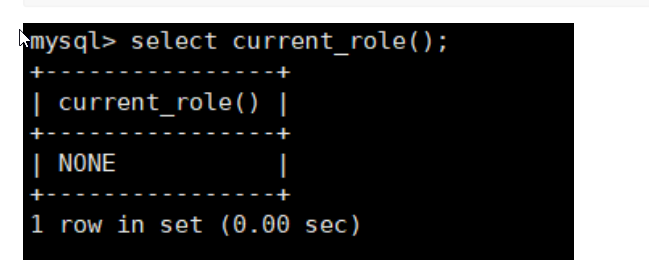

###  激活角色

使用`set default role` 命令激活角色

~~~mysql
SET DEFAULT ROLE ALL TO 'kangshifu'@'localhost';
~~~

举例：使用 SET DEFAULT ROLE 为下面4个用户默认激活所有已拥有的角色如下：

~~~mysql
SET DEFAULT ROLE ALL TO
'dev1'@'localhost',
'read_user1'@'localhost',
'read_user2'@'localhost',
'rw_user1'@'localhost';
~~~

### 撤销用户的角色

撤销用户角色的SQL语法如下：

~~~mysql
REVOKE role FROM user;
~~~

练习：撤销kangshifu用户的school_read角色。

撤销的SQL语句如下

~~~mysql
REVOKE 'school_read' FROM 'kangshifu'@'localhost';
~~~

# 逻辑架构

## 逻辑架构剖析

### 服务器处理客户端请求

那服务器进程对客户端进程发送的请求做了什么处理，才能产生最后的处理结果呢？这里以查询请求为 例展示：

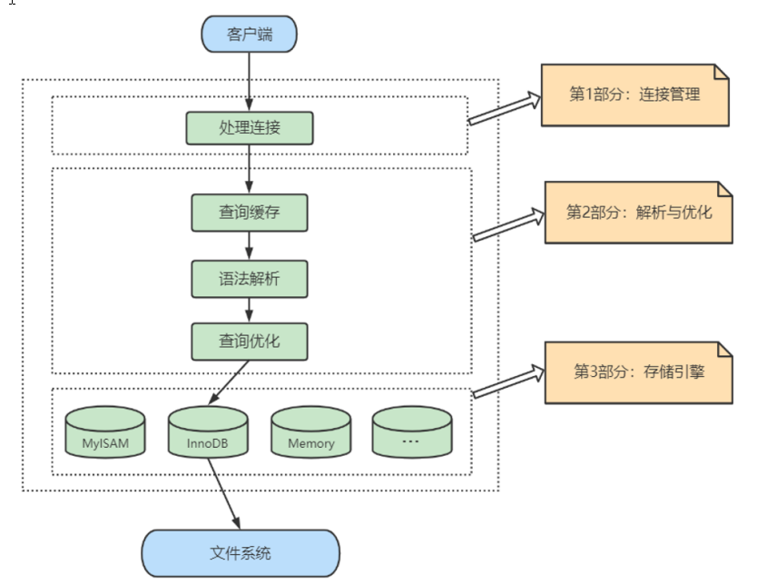

### 第1层：连接层

系统（客户端）访问 MySQL 服务器前，做的第一件事就是建立 TCP 连接。

经过三次握手建立连接成功后， MySQL 服务器对 TCP 传输过来的账号密码做身份认证、权限获取。

* 用户名或密码不对，会收到一个Access denied for user错误，客户端程序结束执行 
* 用户名密码认证通过，会从权限表查出账号拥有的权限与连接关联，之后的权限判断逻辑，都将依 赖于此时读到的权限

### 第2层：服务层

**SQL Interface: SQL接口**

* 接收用户的SQL命令，并且返回用户需要查询的结果。比如SELECT ... FROM就是调用SQL Interface 
* MySQL支持DML（数据操作语言）、DDL（数据定义语言）、存储过程、视图、触发器、自定义函数等多种SQL语言接口

**Parser: 解析器**

* 在解析器中对 SQL 语句进行语法分析、语义分析。将SQL语句分解成数据结构，并将这个结构 传递到后续步骤，以后SQL语句的传递和处理就是基于这个结构的。如果在分解构成中遇到错 误，那么就说明这个SQL语句是不合理的。 
* 在SQL命令传递到解析器的时候会被解析器验证和解析，并为其创建 语法树 ，并根据数据字 典丰富查询语法树，会 验证该客户端是否具有执行该查询的权限 。创建好语法树后，MySQL还 会对SQl查询进行语法上的优化，进行查询重写。

**Optimizer: 查询优化器**

* SQL语句在语法解析之后、查询之前会使用查询优化器确定 SQL 语句的执行路径，生成一个 执行计划 。 
* 这个执行计划表明应该 使用哪些索引 进行查询（全表检索还是使用索引检索），表之间的连 接顺序如何，最后会按照执行计划中的步骤调用存储引擎提供的方法来真正的执行查询，并将 查询结果返回给用户。
* 它使用“ 选取-投影-连接 ”策略进行查询。例如：

~~~mysql
SELECT id,name FROM student WHERE gender = '女';
~~~

这个SELECT查询先根据WHERE语句进行 选取 ，而不是将表全部查询出来以后再进行gender过 滤。 这个SELECT查询先根据id和name进行属性 投影 ，而不是将属性全部取出以后再进行过 滤，将这两个查询条件 连接 起来生成最终查询结果。

### 第3层：引擎层

插件式存储引擎层（ Storage Engines），真正的负责了MySQL中数据的存储和提取，对物理服务器级别 维护的底层数据执行操作，服务器通过API与存储引擎进行通信。不同的存储引擎具有的功能不同，这样 我们可以根据自己的实际需要进行选取。

MySQL 8.0.25默认支持的存储引擎如下：

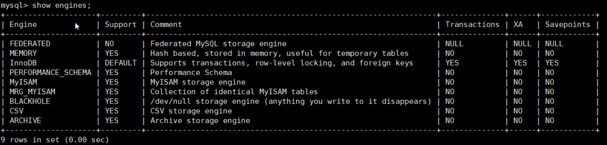

### 存储层

所有的数据，数据库、表的定义，表的每一行的内容，索引，都是存在 文件系统 上，以 文件 的方式存 在的，并完成与存储引擎的交互。当然有些存储引擎比如InnoDB，也支持不使用文件系统直接管理裸设 备，但现代文件系统的实现使得这样做没有必要了。在文件系统之下，可以使用本地磁盘，可以使用 DAS、NAS、SAN等各种存储系统。

### 小结

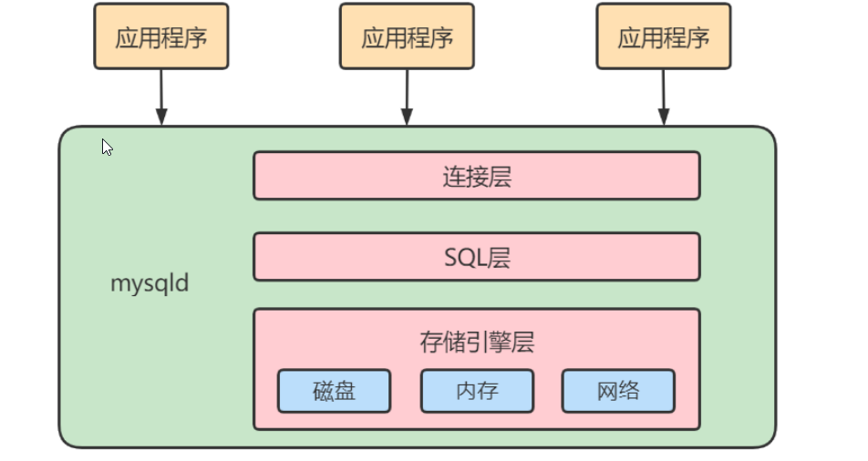

简化为三层结构：

1. 连接层：客户端和服务器端建立连接，客户端发送 SQL 至服务器端； 
2. SQL 层（服务层）：对 SQL 语句进行查询处理；与数据库文件的存储方式无关； 
3. 存储引擎层：与数据库文件打交道，负责数据的存储和读取。

## SQL执行流程

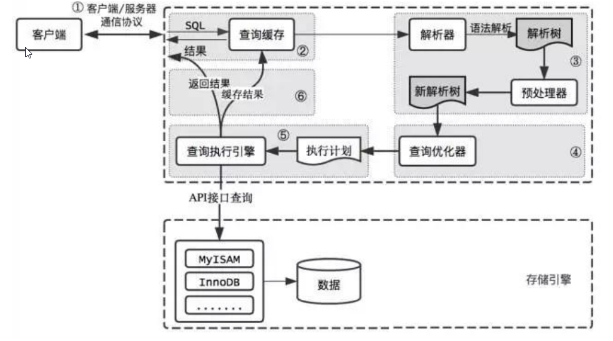

MySQL的查询流程：

1. 查询缓存：Server 如果在查询缓存中发现了这条 SQL 语句，就会直接将结果返回给客户端；如果没 有，就进入到解析器阶段。需要说明的是，因为查询缓存往往效率不高，所以在 MySQL8.0 之后就抛弃 了这个功能。

2. 解析器：在解析器中对 SQL 语句进行语法分析、语义分析。

   * 分析器先做“ 词法分析 ”。你输入的是由多个字符串和空格组成的一条 SQL 语句，MySQL 需要识别出里面 的字符串分别是什么，代表什么。 MySQL 从你输入的"select"这个关键字识别出来，这是一个查询语 句。它也要把字符串“T”识别成“表名 T”，把字符串“ID”识别成“列 ID”。

   * 接着，要做“ 语法分析 ”。根据词法分析的结果，语法分析器（比如：Bison）会根据语法规则，判断你输 入的这个 SQL 语句是否 满足 MySQL 语法 。

3. 优化器：在优化器中会确定 SQL 语句的执行路径，比如是根据 全表检索 ，还是根据 索引检索 等。 

   举例：如下语句是执行两个表的 join：

   ~~~mysql
   select * from test1 join test2 using(ID)
   where test1.name='zhangwei' and test2.name='mysql高级课程';
   
   方案1：可以先从表 test1 里面取出 name='zhangwei'的记录的 ID 值，再根据 ID 值关联到表 test2，再判
   断 test2 里面 name的值是否等于 'mysql高级课程'。
   
   方案2：可以先从表 test2 里面取出 name='mysql高级课程' 的记录的 ID 值，再根据 ID 值关联到 test1，
   再判断 test1 里面 name的值是否等于 zhangwei。
   
   这两种执行方法的逻辑结果是一样的，但是执行的效率会有不同，而优化器的作用就是决定选择使用哪一个方案。优化
   器阶段完成后，这个语句的执行方案就确定下来了，然后进入执行器阶段。
   如果你还有一些疑问，比如优化器是怎么选择索引的，有没有可能选择错等。后面讲到索引我们再谈。
   ~~~

   在查询优化器中，可以分为 逻辑查询 优化阶段和 物理查询 优化阶段。

4. 执行器： 截止到现在，还没有真正去读写真实的表，仅仅只是产出了一个执行计划。于是就进入了 执行器阶段 。

## SQL语法顺序

随着Mysql版本的更新换代，其优化器也在不断的升级，优化器会分析不同执行顺序产生的性能消耗不同 而动态调整执行顺序。

 需求：查询每个部门年龄高于20岁的人数且高于20岁人数不能少于2人，显示人数最多的第一名部门信息 下面是经常出现的查询顺序：

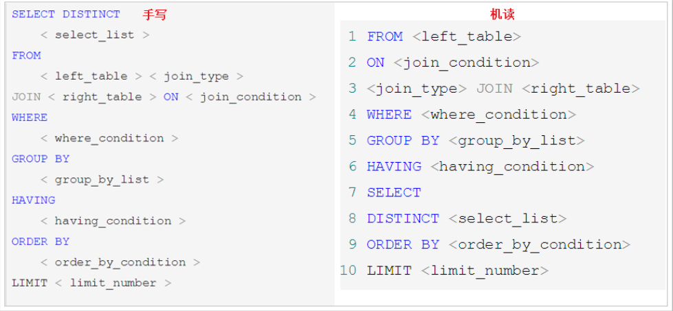

## 数据库缓冲池(buffer pool)

InnoDB 存储引擎是以页为单位来管理存储空间的，我们进行的增删改查操作其实本质上都是在访问页 面（包括读页面、写页面、创建新页面等操作）。而**磁盘 I/O 需要消耗的时间很多**，而在内存中进行操 作，效率则会高很多，为了能让数据表或者索引中的数据随时被我们所用，DBMS 会申请 占用内存来作为 数据缓冲池 ，在真正访问页面之前，需要把在磁盘上的页缓存到内存中的 Buffer Pool 之后才可以访 问。

这样做的好处是可以让磁盘活动最小化，从而 **减少与磁盘直接进行 I/O 的时间** 。要知道，这种策略对提 升 SQL 语句的查询性能来说至关重要。如果索引的数据在缓冲池里，那么访问的成本就会降低很多。

> 问题：缓冲池和查询缓存是一个东西吗？不是。

### 缓冲池 vs 查询缓存

**缓冲池（Buffer Pool）**

首先我们需要了解在 InnoDB 存储引擎中，缓冲池都包括了哪些。 在 InnoDB 存储引擎中有一部分数据会放到内存中，缓冲池则占了这部分内存的大部分，它用来存储各种 数据的缓存，如下图所示：

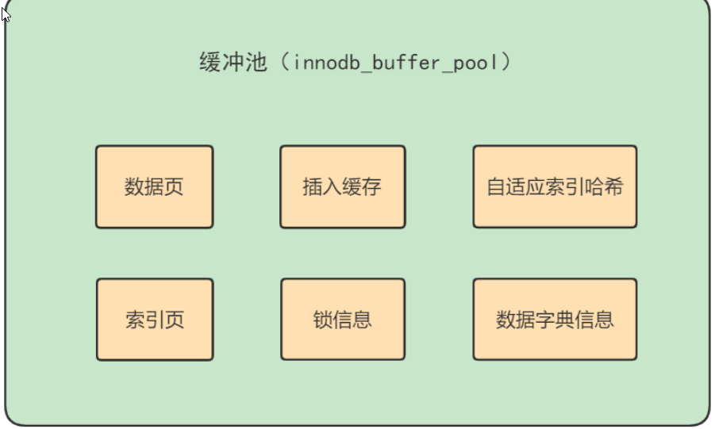

从图中，你能看到 InnoDB 缓冲池包括了数据页、索引页、插入缓冲、锁信息、自适应 Hash 和数据字典 信息等。

**缓存池的重要性：**

**缓存原则：**

“ 位置 * 频次 ”这个原则，可以帮我们对 I/O 访问效率进行优化。 

首先，位置决定效率，提供缓冲池就是为了在内存中可以直接访问数据。 其次，频次决定优先级顺序。

因为缓冲池的大小是有限的，比如磁盘有 200G，但是内存只有 16G，缓冲 池大小只有 1G，就无法将所有数据都加载到缓冲池里，这时就涉及到优先级顺序，会优先对使用频次高 的热数据进行加载 。

**查询缓存**

那么什么是查询缓存呢？ 

查询缓存是提前把 查询结果缓存 起来，这样下次不需要执行就可以直接拿到结果。

需要说明的是，在 MySQL 中的查询缓存，不是缓存查询计划，而是查询对应的结果。因为命中条件苛刻，而且只要数据表 发生变化，查询缓存就会失效，因此命中率低。

### 缓冲池如何读取数据

缓冲池管理器会尽量将经常使用的数据保存起来，在数据库进行页面读操作的时候，首先会判断该页面 是否在缓冲池中，如果存在就直接读取，如果不存在，就会通过内存或磁盘将页面存放到缓冲池中再进 行读取。

 缓存在数据库中的结构和作用如下图所示：

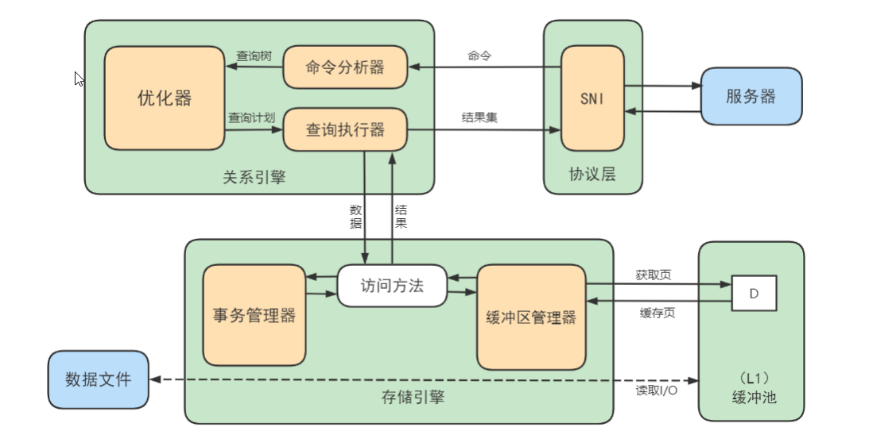

# 存储引擎

## 查看存储引擎

~~~mysql
show engines;
~~~

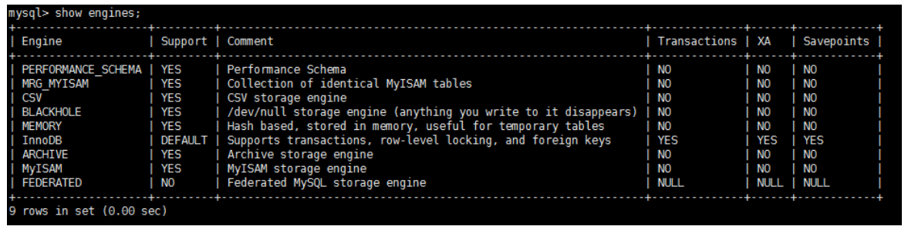

**查看默认的存储引擎：**

~~~mysql
show variables like '%storage_engine%';
#或
SELECT @@default_storage_engine;
~~~

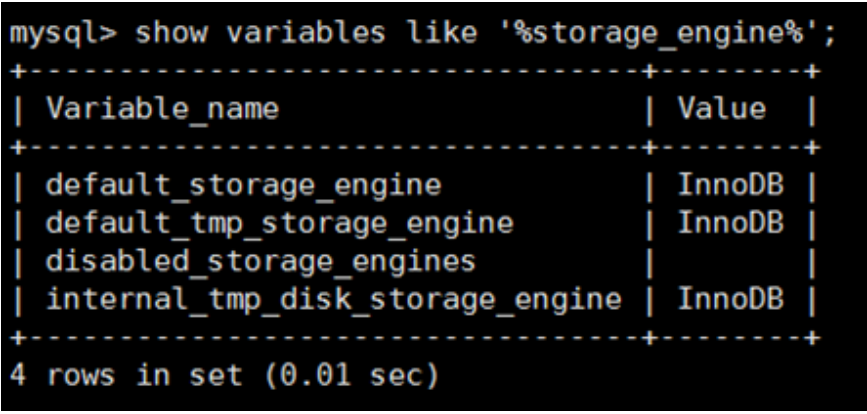

## 设置表的存储引擎

**创建表时指定存储引擎**

我们之前创建表的语句都没有指定表的存储引擎，那就会使用默认的存储引擎 InnoDB 。如果我们想显 式的指定一下表的存储引擎，那可以这么写：

~~~mysql
CREATE TABLE 表名(
建表语句;
) ENGINE = 存储引擎名称;
~~~

**修改表的存储引擎**

如果表已经建好了，我们也可以使用下边这个语句来修改表的存储引擎：

~~~mysql
ALTER TABLE 表名 ENGINE = 存储引擎名称;
~~~

比如我们修改一下 `engine_demo_table` 表的存储引擎：

~~~mysql
mysql> ALTER TABLE engine_demo_table ENGINE = InnoDB;
Query OK, 0 rows affected (0.05 sec)
Records: 0 Duplicates: 0 Warnings: 0
~~~

## 引擎介绍

### InnoDB 引擎：具备外键支持功能的事务存储引擎

* MySQL从3.23.34a开始就包含InnoDB存储引擎。 大于等于5.5之后，默认采用InnoDB引擎 。
* InnoDB是MySQL的 默认事务型引擎 ，它被设计用来处理大量的短期(short-lived)事务。可以确保事务 的完整提交(Commit)和回滚(Rollback)。 
* 除了增加和查询外，还需要更新、删除操作，那么，应优先选择InnoDB存储引擎。 
* 除非有非常特别的原因需要使用其他的存储引擎，否则应该优先考虑InnoDB引擎。 
* 数据文件结构：
  * 表名.frm 存储表结构（MySQL8.0时，合并在表名.ibd中） 
  * 表名.ibd 存储数据和索引 
* InnoDB是 为处理巨大数据量的最大性能设计 。
  * 在以前的版本中，字典数据以元数据文件、非事务表等来存储。现在这些元数据文件被删除 了。比如： .frm ， .par ， .trn ， .isl ， .db.opt 等都在MySQL8.0中不存在了。

* 对比MyISAM的存储引擎， InnoDB写的处理效率差一些 ，并且会占用更多的磁盘空间以保存数据和 索引。
* MyISAM只缓存索引，不缓存真实数据；InnoDB不仅缓存索引还要缓存真实数据， 对内存要求较 高 ，而且内存大小对性能有决定性的影响。

###  MyISAM 引擎：主要的非事务处理存储引擎

* MyISAM提供了大量的特性，包括全文索引、压缩、空间函数(GIS)等，但MyISAM 不支持事务、行级 锁、外键 ，有一个毫无疑问的缺陷就是 崩溃后无法安全恢复 。
* 5.5之前默认的存储引擎 
* 优势是访问的 速度快 ，对事务完整性没有要求或者以SELECT、INSERT为主的应用 
* 针对数据统计有额外的常数存储。故而 count(*) 的查询效率很高
* 数据文件结构：
  * 表名.frm 存储表结构 
  * 表名.MYD 存储数据 (MYData) 
  * 表名.MYI 存储索引 (MYIndex)

* 应用场景：只读应用或者以读为主的业务

# 索引的数据结构

## 为什么使用索引

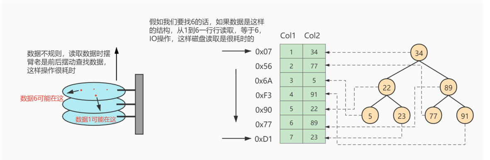

## InnoDB中索引的推演

先来看一个精确匹配的例子：

~~~mysql
SELECT [列名列表] FROM 表名 WHERE 列名 = xxx;
~~~

在没有索引的情况下，不论是根据主键列或者其他列的值进行查找，由于我们并不能快速的定位到记录 所在的页，所以只能 从第一个页 沿着 双向链表 一直往下找，在每一个页中根据我们上面的查找方式去查 找指定的记录。因为要遍历所有的数据页，所以这种方式显然是 超级耗时 的。如果一个表有一亿条记录 呢？此时 索引 应运而生。

### 一个简单的索引设计方案

我们在根据某个搜索条件查找一些记录时为什么要遍历所有的数据页呢？因为各个页中的记录并没有规 律，我们并不知道我们的搜索条件匹配哪些页中的记录，所以不得不依次遍历所有的数据页。所以如果 我们 想快速的定位到需要查找的记录在哪些数据页 中该咋办？我们可以为快速定位记录所在的数据页而 建 立一个目录 ，建这个目录必须完成下边这些事：

* 下一个数据页中用户记录的主键值必须大于上一个页中用户记录的主键值。
* 给所有的页建立一个目录项。

所以我们为上边几个页做好的目录就像这样子：

以 页28 为例，它对应 目录项2 ，这个目录项中包含着该页的页号 28 以及该页中用户记录的最小主 键值 5 。我们只需要把几个目录项在物理存储器上连续存储（比如：数组），就可以实现根据主键 值快速查找某条记录的功能了。比如：查找主键值为 20 的记录，具体查找过程分两步：

1. 先从目录项中根据 二分法 快速确定出主键值为 20 的记录在 目录项3 中（因为 12 < 20 < 209 ），它对应的页是 页9 。
2. 再根据前边说的在页中查找记录的方式去 页9 中定位具体的记录。

至此，针对数据页做的简易目录就搞定了。这个目录有一个别名，称为 **索引** 。

### InnoDB中的索引方案

**① 迭代1次：目录项纪录的页**

我们把前边使用到的目录项放到数据页中的样子就是这样：

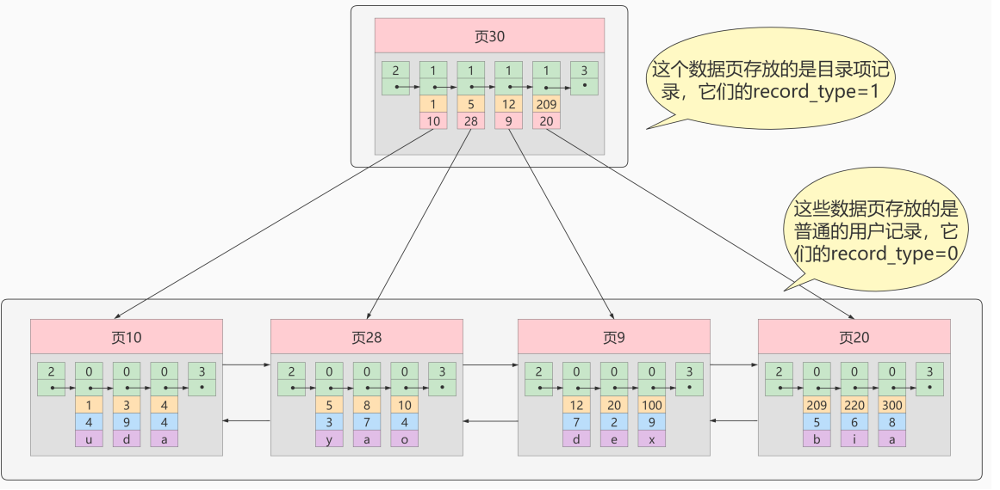

从图中可以看出来，我们新分配了一个编号为30的页来专门存储目录项记录。这里再次强调 目录项记录 和普通的 用户记录 的**不同点**：

* 目录项记录 的 record_type 值是1，而 普通用户记录 的 record_type 值是0。
* 目录项记录只有 主键值和页的编号 两个列，而普通的用户记录的列是用户自己定义的，可能包含 很 多列 ，另外还有InnoDB自己添加的隐藏列。

**相同点**：两者用的是一样的数据页，都会为主键值生成 Page Directory （页目录），从而在按照主键 值进行查找时可以使用 二分法 来加快查询速度。

现在以查找主键为 20 的记录为例，根据某个主键值去查找记录的步骤就可以大致拆分成下边两步：

1. 先到存储 目录项记录 的页，也就是页30中通过 二分法 快速定位到对应目录项，因为 12 < 20 < 209 ，所以定位到对应的记录所在的页就是页9。 
2. 再到存储用户记录的页9中根据 二分法 快速定位到主键值为 20 的用户记录。

**② 迭代2次：多个目录项纪录的页**

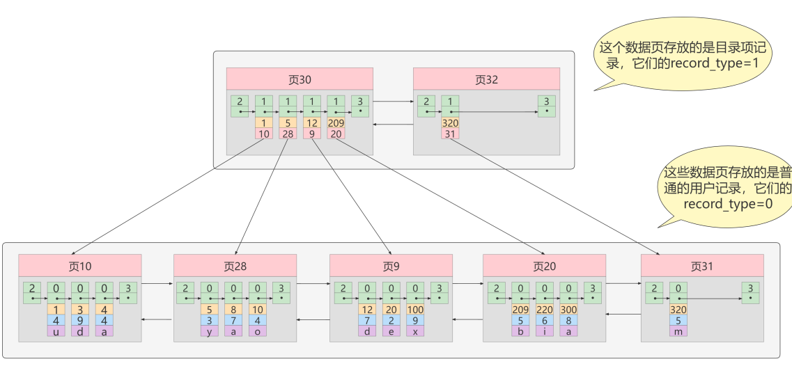

从图中可以看出，我们插入了一条主键值为320的用户记录之后需要两个新的数据页：

* 为存储该用户记录而新生成了 页31 。
* 因为原先存储目录项记录的 页30的容量已满 （我们前边假设只能存储4条目录项记录），所以不得 不需要一个新的 页32 来存放 页31 对应的目录项。

现在因为存储目录项记录的页不止一个，所以如果我们想根据主键值查找一条用户记录大致需要3个步 骤，以查找主键值为 20 的记录为例：

1. 确定 目录项记录页

   我们现在的存储目录项记录的页有两个，即 页30 和 页32 ，又因为页30表示的目录项的主键值的 范围是 [1, 320) ，页32表示的目录项的主键值不小于 320 ，所以主键值为 20 的记录对应的目 录项记录在 页30 中。

2. 通过目录项记录页 确定用户记录真实所在的页 。

   在一个存储 目录项记录 的页中通过主键值定位一条目录项记录的方式说过了。

3. 在真实存储用户记录的页中定位到具体的记录。

**③ 迭代3次：目录项记录页的目录页**

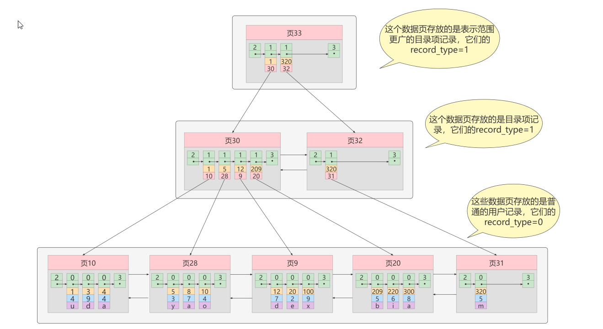

如图，我们生成了一个存储更高级目录项的 页33 ，这个页中的两条记录分别代表页30和页32，如果用 户记录的主键值在 [1, 320) 之间，则到页30中查找更详细的目录项记录，如果主键值 不小于320 的 话，就到页32中查找更详细的目录项记录。

我们可以用下边这个图来描述它：

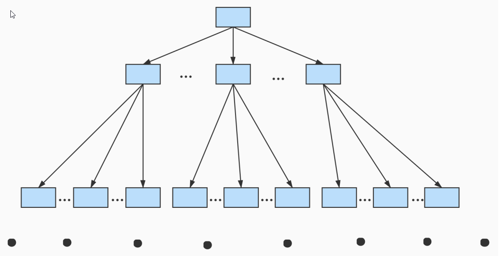

这个数据结构，它的名称是 **B+树 。**

**④ B+Tree**

 一个B+树的节点其实可以分成好多层，规定最下边的那层，也就是存放我们用户记录的那层为第 0 层， 之后依次往上加。之前我们做了一个非常极端的假设：存放用户记录的页 最多存放3条记录 ，存放目录项 记录的页 最多存放4条记录 。其实真实环境中一个页存放的记录数量是非常大的，假设所有存放用户记录 的叶子节点代表的数据页可以存放 100条用户记录 ，所有存放目录项记录的内节点代表的数据页可以存 放 1000条目录项记录 ，那么：

* 如果B+树只有1层，也就是只有1个用于存放用户记录的节点，最多能存放 100 条记录。 
* 如果B+树有2层，最多能存放 1000×100=10,0000 条记录。 
* 如果B+树有3层，最多能存放 1000×1000×100=1,0000,0000 条记录。 
* 如果B+树有4层，最多能存放 1000×1000×1000×100=1000,0000,0000 条记录。相当多的记 录！！！

你的表里能存放 100000000000 条记录吗？所以一般情况下，我们 用到的B+树都不会超过4层 ，那我们 通过主键值去查找某条记录最多只需要做4个页面内的查找（查找3个目录项页和一个用户记录页），又 因为在每个页面内有所谓的 Page Directory （页目录），所以在页面内也可以通过 二分法 实现快速 定位记录。

### 常见索引概念

索引按照物理实现方式，索引可以分为 2 种：聚簇（聚集）和非聚簇（非聚集）索引。我们也把非聚集 索引称为二级索引或者辅助索引。

**聚簇索引**

1. 使用记录主键值的大小进行记录和页的排序，这包括三个方面的含义：

   *  页内 的记录是按照主键的大小顺序排成一个 单向链表 。
   *  各个存放 用户记录的页 也是根据页中用户记录的主键大小顺序排成一个 双向链表 。 
   *  存放 目录项记录的页 分为不同的层次，在同一层次中的页也是根据页中目录项记录的主键 大小顺序排成一个 双向链表 。

2. B+树的 叶子节点 存储的是完整的用户记录。

   所谓完整的用户记录，就是指这个记录中存储了所有列的值（包括隐藏列）。

**二级索引（辅助索引、非聚簇索引）**

概念：**回表** 

我们根据这个以c2列大小排序的B+树只能确定我们要查找记录的主键值，所以如果我们想根 据c2列的值查找到完整的用户记录的话，仍然需要到 聚簇索引 中再查一遍，这个过程称为 **回表** 。也就 是根据c2列的值查询一条完整的用户记录需要使用到 2 棵B+树！

**联合索引**

我们也可以同时以多个列的大小作为排序规则，也就是同时为多个列建立索引，比方说我们想让B+树按 照 c2和c3列 的大小进行排序，这个包含两层含义：

* 先把各个记录和页按照c2列进行排序。
* 在记录的c2列相同的情况下，采用c3列进行排序

注意一点，以c2和c3列的大小为排序规则建立的B+树称为 联合索引 ，本质上也是一个二级索引。它的意 思与分别为c2和c3列分别建立索引的表述是不同的，不同点如下：

* 建立 联合索引 只会建立如上图一样的1棵B+树。
* 为c2和c3列分别建立索引会分别以c2和c3列的大小为排序规则建立2棵B+树。

> InnoDB的B+树索引的注意事项:
>
> 1. 根页面位置万年不动 
> 2. 内节点中目录项记录的唯一性
> 3. 一个页面最少存储2条记录

## MyISAM中的索引方案

MyISAM引擎使用 B+Tree 作为索引结构，叶子节点的data域存放的是 数据记录的地址 。

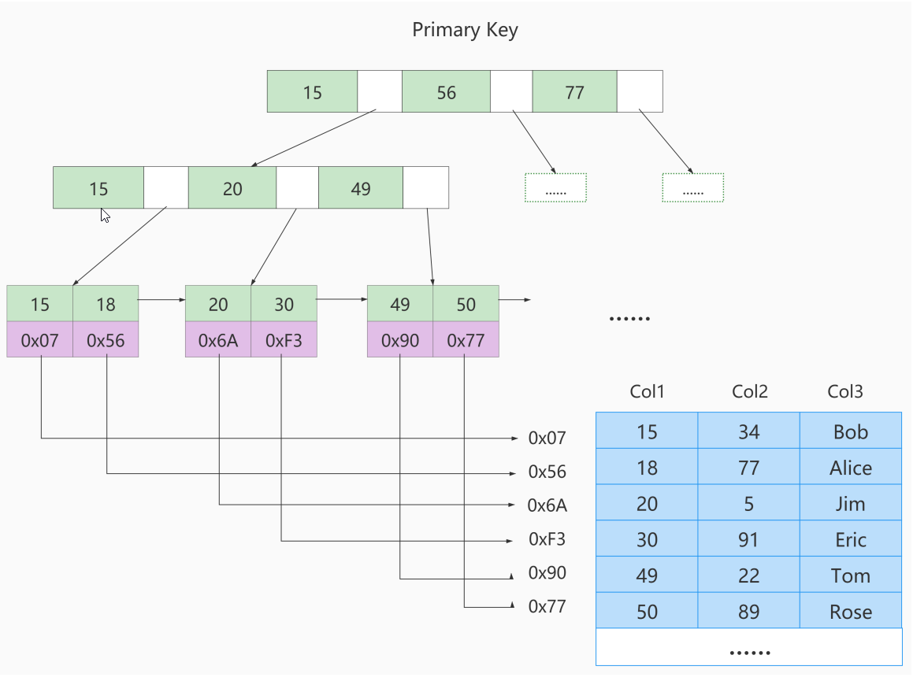

## MyISAM 与 InnoDB对比

**MyISAM的索引方式都是“非聚簇”的，与InnoDB包含1个聚簇索引是不同的。**

① 在InnoDB存储引擎中，我们只需要根据主键值对 聚簇索引 进行一次查找就能找到对应的记录，而在 MyISAM 中却需要进行一次 回表 操作，意味着MyISAM中建立的索引相当于全部都是 二级索引 。

② InnoDB的数据文件本身就是索引文件，而MyISAM索引文件和数据文件是 分离的 ，索引文件仅保存数 据记录的地址。 

③ InnoDB的非聚簇索引data域存储相应记录主键的值 ，而MyISAM索引记录的是 地址 。换句话说， InnoDB的所有非聚簇索引都引用主键作为data域。 

④ MyISAM的回表操作是十分 快速 的，因为是拿着地址偏移量直接到文件中取数据的，反观InnoDB是通 过获取主键之后再去聚簇索引里找记录，虽然说也不慢，但还是比不上直接用地址去访问。

⑤ InnoDB要求表 必须有主键 （ MyISAM可以没有 ）。如果没有显式指定，则MySQL系统会自动选择一个 可以非空且唯一标识数据记录的列作为主键。如果不存在这种列，则MySQL自动为InnoDB表生成一个隐 含字段作为主键，这个字段长度为6个字节，类型为长整型。

# InnoDB数据存储结构

## Innodb中页的概念

**页**，是InnoDB中数据管理的最小单位。当我们查询数据时，其是以页为单位，将磁盘中的数据加载到缓冲池中的。同理，更新数据也是以页为单位，将我们对数据的修改刷回磁盘。

Page是Innodb存储的最基本结构，也是Innodb磁盘管理的最小单位，与数据库相关的所有内容都存储在Page结构里。Page分为几种类型：

1. `数据页（B-Tree Node）`，
2. `Undo页（Undo Log Page）`，
3. `系统页（System Page）`，
4. `事务数据页（Transaction System Page）`

**页的大小**

每个数据页的大小为`16kb`，每个Page使用一个32位（一位表示的就是0或1）的int值来表示，正好对应Innodb最大64TB的存储容量(16kb * 2^32=64tib)

mysql中的具体数据是存储在行中的，而行是存储在页中的，每页的默认大小为16k（大小可以通过配置文件修改），页的结构如下图所示

**页的结构**

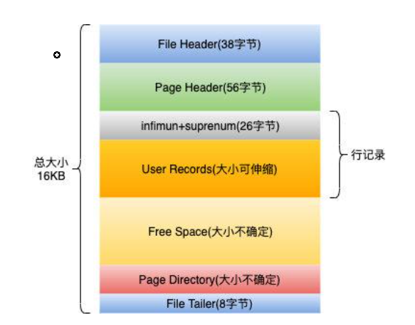

一开始生成页的时候并没有`User Records`这个部分.每当我们插⼊⼀条记录，都会从`Free Space`部分，也就是尚未使⽤的存储空间中申请⼀个记录⼤⼩的空间划分到`User Records`部分，当`Free Space`部分的空间全部被`User Records`部分替代掉之后，也就意味着这个页使⽤完了，如果还有新的记录插⼊的话，就需要去申请新的页了。

## 页的内部结构

### 第一部分：File Header（文件头部）和 File Trailer（文件尾部）

**File Header 构成** 

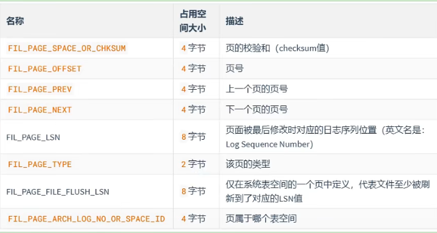

1. fil_page_offset:  记录数据页编号，类似主键；

2. fil_page_type: 数据页类型，例如：索引页，Undo日志页

3. fil_page_prv 和 file_page_next: 两个数据页逻辑相邻的标识

4. fil_page_space_or_chksum: 磁盘与内存数据交互之前计算一个校验和，交互完成后再计算一个校验和，如果两次校验和相同，表示传输正常；如何不相等，表示传输有问题。

   **校验和**是用于检测传输过程中可能产生的错误，将其置于数据后，随数据一同发送，接收端通过同样的算法进行检查，若正确就接受，错误就丢弃

### 第二部分：User Record（用户记录）、最大最小记录、Free Space（空闲空间）

第二部分是记录部分，页的主要作用是存储记录，所以“最大和最小记录”和“用户记录”部分占了页结构的主要空间。

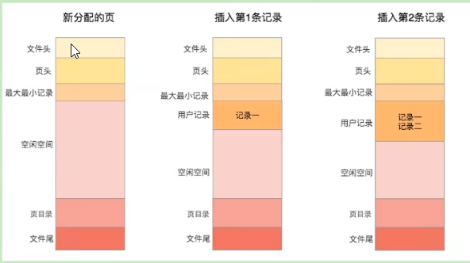

1. Free Space

   一开始生成页的时候并没有User Records这个部分.每当我们插⼊⼀条记录，都会从Free Space部分，也就是尚未使⽤的存储空间中申请⼀个记录⼤⼩的空间划分到User Records部分，当Free Space部分的空间全部被User Records部分替代掉之后，也就意味着这个页使⽤完了，如果还有新的记录插⼊的话，就需要去申请新的页了。

2. User Records

   User Records的记录按照指定的行格式列在User Records中，相互之间形成单链表

3. 最大最小记录（heap_no中）

如何形成单链表--> **记录头信息**

1. delete_mask: 

   是否被删除，1表示删除，0表示未删除；

2. min_rec_mask:

   记录是否为叶子结点，1不是 叶子几点，0表示 叶子结点 ；

3. record_type：

   0表示普通节点，1表示B+树非叶子节点，2表示最小记录，3表示最大记录

4. heap_no：

   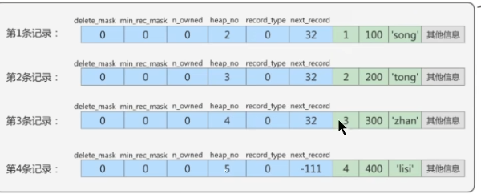

   表示记录的当前位置，0为最小记录，1为最大记录

5. n_owned（page_Directory）

   分组后的个数

   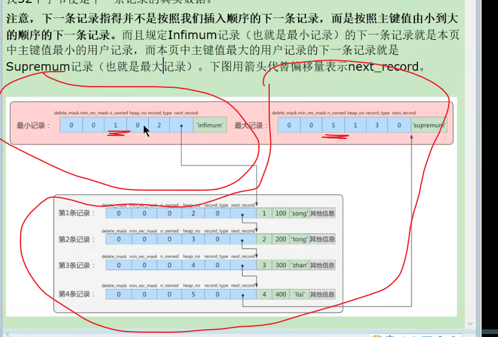

6. **next_record**

   记录下一条数据的地址偏移量

   删除操作：①删除记录的delete_mask设置为1，②被删除记录的**上一条记录**指向删除记录的**下一条记录**，③将第二组的n_owned修改；**如果删除多条记录，那么多被删除的记录也会形成单链表**（此单链表标识在页目录头部的字段中）

   添加操作：严格按照主键的大小进行插入，而不是按照添加的顺序插入（页目录的头部中page_direction字段记录当前插入主键的位置在前还是在后）

### 第三部分：Page Directory（页目录）、Page Header（页面头部）

**页目录**

为什么需要页目录？

在页中，记录是以单向链表的形成存储。单向链表特点是插入、删除方便，而查找效率不高。因此给记录做一个目录，通过二分法进行检索。

使用二分法查找记录：

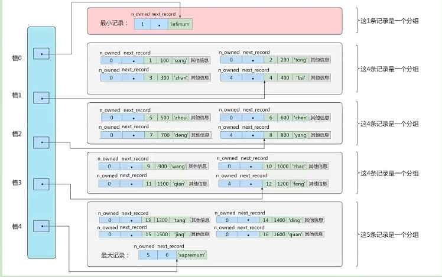

最小记录分为一组，其余记录尽量平分，并且记录每一组的最大值，作为每个槽位上的值。

**页面头部**

## Compact行格式

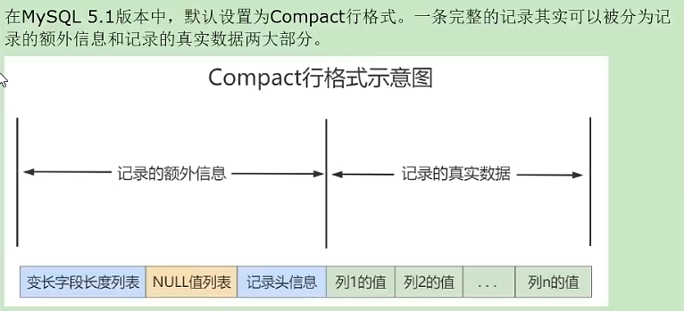

### 额外信息

**变长字段长度列表**

记录变长字段真实的长度

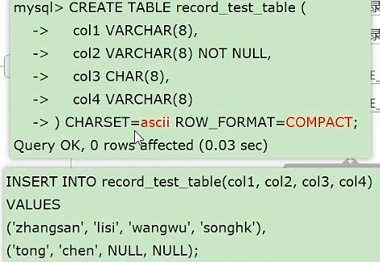

> 这里存储变长长度和字段顺序为反过来的

在变长字段中存储为060408

**null值列表**

Compact行格式会把可以为NULL的列统一管理起来，存在一个标记为NULL值列表中。如果表中没有允许存储 NULL 的列，则 NULL值列表也不存在了。

为什么使用null值列表？

之所以要存储NULL是因为数据都是需要对齐的，如果没有标注出来NULL值的位置，就有可能在查询数据的时候出现混乱。如果使用一个特定的符号放到相应的数据位表示空置的话，虽然能达到效果，但是这样很浪费空间，所以直接就在行数据得头部开辟出一块空间专门用来记录该行数据哪些是非空数据，哪些是空数据，格式如下:

1. 二进制位的值为1时，代表该列的值为NULL。

2. 二进制位的值为0时，代表该列的值不为NULL。

**记录头信息**（第二部分）

### 真实数据

三个隐藏列

例如：

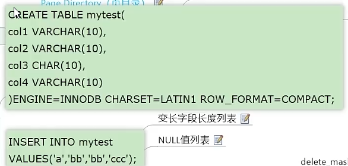

1. 变长字段，

   03：'ccc';

   02: 'bb';

   01: 'a'

   char为定长所以不用写入变长字段列表

2. 没有null所以为00。设置非空的字段不用记录null值

3. 记录头信息： 2c为下一个指针位置的偏移量

4. row_id：因为此表没有主键

5. transaction_id；

6. roll_pointer；

7. a

8. bb

9. bb 因为char为定长的，20是空的意思

10. ccc

## Dynamic行格式

dynamic基本与Compact一致；

只是在行溢出情况有不同的处理情况：

* Dynamic对于行溢出的数据全部转移到另一个位置
* 而Compact会将溢出的部分转移到另一个位置

## 区、段、碎片区

如果我们有大量的记录，那么表空间中页的数量就会非常的多，为了更好的管理这些页，设计者又提出了区的概念。对于16KB的页来说，连续的64个页（连续的）就是一个区，也就是说一个区的大小为1MB。（256个区被划分成一个组）

### 为什么要有区

通过页其实已经形成了完整的功能，我们查询数据时这样沿着双向链表就可以查到数据，但是页与页之间在物理位置上可能不是连续的，如果相隔太远，那么我们从一个页移动到另一个页的时候，磁盘就要重新定义磁头的位置，产生随机IO，影响性能，所以我们才要引入区的概念，一个区就是物理位置连续的64个页。区是属于某一个段的（或者是混合）。

### 什么是段

正常情况下，我们检索都是在叶子节点的双向链表进行的，也就是说我们会把区进行区分，如果不区分把叶子节点和非叶子结点混在一起，那么效果就会打大折扣，所以对于一个索引B+树来说，我们区别对待叶子节点的区和非叶子节点的区，并把存放叶子节点的区的集合称为一个段把存放非叶子节点区的集合也称为一个段，所以一个索引会生成两个段：**叶子节点段和非叶子节点段**。

### 碎片区

默认情况下，假如我们新建一个索引就会生成两个段（叶子节点段和非叶子节点段），而一个段中至少包含一个区，也就是需要2MB的空间，假如我们这个表压根没有多少数据，那么一次就要申请2MB的空间明显是浪费的。为了解决这个问题，设计者提出了碎片区的概念，碎片区中的页可能属于不同的段，也可以用于不同的目的，至于如何控制应不应该给一个段申请专属的区，会进行以下控制：

1. 刚开始向表插入数据，都是从某一个碎片区以页为单位来分配存储空间。
2. 当一个段占用的空间达到了32个碎片区的页之后，就会开始给这个段申请专属的区

# 索引的创建与设计原则

## 索引的分类

MySQL的索引包括普通索引、唯一性索引、全文索引、单列索引、多列索引和空间索引等。

*  从 功能逻辑 上说，索引主要有 4 种，分别是普通索引、唯一索引、主键索引、全文索引。 

*  按照 物理实现方式 ，索引可以分为 2 种：聚簇索引和非聚簇索引。 

*  按照 作用字段个数 进行划分，分成单列索引和联合索引。

**普通索引**、**唯一性索引** 、**主键索引** 、**单列索引** 、**多列(组合、联合)索引** 、**全文索引**、**空间索引**

### 创建表的时候创建索引

基本语法

~~~mysql
CREATE TABLE table_name [col_name data_type]
[UNIQUE | FULLTEXT | SPATIAL] [INDEX | KEY] [index_name] (col_name [length]) [ASC |
DESC]
~~~

* `UNIQUE` 、 `FULLTEXT` 和` SPATIAL` 为可选参数，分别表示唯一索引、全文索引和空间索引；
* `INDEX` 与 `KEY` 为同义词，两者的作用相同，用来指定创建索引； 
* `index_name` 指定索引的名称，为可选参数，如果不指定，那么MySQL默认`col_name`为索引名；
* `col_name` 为需要创建索引的字段列，该列必须从数据表中定义的多个列中选择； 
* `length `为可选参数，表示索引的长度，只有字符串类型的字段才能指定索引长度；
* `ASC` 或 `DESC `指定升序或者降序的索引值存储。

普通索引

~~~mysql
CREATE TABLE book(
book_id INT ,
book_name VARCHAR(100),
authors VARCHAR(100),
info VARCHAR(100) ,
comment VARCHAR(100),
year_publication YEAR,
INDEX(year_publication) #~
);
~~~

唯一索引

~~~mysql
CREATE TABLE test1(
id INT NOT NULL,
name varchar(30) NOT NULL,
UNIQUE INDEX uk_idx_id(id) #~
);
~~~

主键索引

设定为主键后数据库会自动建立索引，innodb为聚簇索引

~~~mysql
# 随表一起建索引：
CREATE TABLE student (
id INT(10) UNSIGNED AUTO_INCREMENT ,
student_no VARCHAR(200),
student_name VARCHAR(200),
PRIMARY KEY(id) #~
);
# 删除主键索引：
ALTER TABLE student
drop PRIMARY KEY ;
~~~

> 修改主键索引：必须先删除掉(drop)原索引，再新建(add)索引

单列索引

~~~mysql
CREATE TABLE test2(
id INT NOT NULL,
name CHAR(50) NULL,
INDEX single_idx_name(name(20)) #~
);
~~~

组合索引

~~~mysql
CREATE TABLE test3(
id INT(11) NOT NULL,
name CHAR(30) NOT NULL,
age INT(11) NOT NULL,
info VARCHAR(255),
INDEX multi_idx(id,name,age) #~
);
~~~

全文索引

~~~mysql
# 在表中的info字段上建立全文索引
CREATE TABLE test4(
id INT NOT NULL,
name CHAR(30) NOT NULL,
age INT NOT NULL,
info VARCHAR(255),
FULLTEXT INDEX futxt_idx_info(info) #~
) ENGINE=MyISAM;
# 创建了一个给title和body字段添加全文索引的表。
CREATE TABLE articles (
id INT UNSIGNED AUTO_INCREMENT PRIMARY KEY,
title VARCHAR (200),
body TEXT,
FULLTEXT index (title, body) #~
) ENGINE = INNODB ;
~~~

> 在MySQL5.7及之后版本中可以不指定最后的ENGINE了，因为在此版本中InnoDB支持全文索引。

~~~mysql
CREATE TABLE `papers` (
`id` int(10) unsigned NOT NULL AUTO_INCREMENT,
`title` varchar(200) DEFAULT NULL,
`content` text,
PRIMARY KEY (`id`),
FULLTEXT KEY `title` (`title`,`content`)#~
) ENGINE=MyISAM DEFAULT CHARSET=utf8;
#不同于like方式的的查询：
SELECT * FROM papers WHERE content LIKE ‘%查询字符串%’;
#全文索引用match+against方式查询：
SELECT * FROM papers WHERE MATCH(title,content) AGAINST (‘查询字符串’);
~~~

> 注意点 
>
> 1. 使用全文索引前，搞清楚版本支持情况； 
> 2. 全文索引比 like + % 快 N 倍，但是可能存在精度问题； 
> 3. 如果需要全文索引的是大量数据，建议先添加数据，再创建索引。

空间索引

~~~mysql
# 空间索引创建中，要求空间类型的字段必须为 非空 。
CREATE TABLE test5(
geo GEOMETRY NOT NULL,
SPATIAL INDEX spa_idx_geo(geo) #~
) ENGINE=MyISAM;
~~~

### 已经存在的表上创建索引

在已经存在的表中创建索引可以使用ALTER TABLE语句或者CREATE INDEX语句。

* 使用ALTER TABLE语句创建索引，基本语法

~~~mysql
ALTER TABLE table_name ADD [UNIQUE | FULLTEXT | SPATIAL] [INDEX | KEY]
[index_name] (col_name[length],...) [ASC | DESC]
~~~

* 使用CREATE INDEX创建索引，基本语法

~~~mysql
CREATE [UNIQUE | FULLTEXT | SPATIAL] INDEX index_name
ON table_name (col_name[length],...) [ASC | DESC]
~~~

###  删除索引

* 使用ALTER TABLE删除索引 ALTER TABLE删除索引的基本语法格式如下：

~~~mysql
ALTER TABLE table_name DROP INDEX index_name;
~~~

* 使用DROP INDEX语句删除索引 DROP INDEX删除索引的基本语法格式如下：

~~~mysql
DROP INDEX index_name ON table_name;
~~~

## 索引新特性MySQL8.0

### 降序索引

举例

~~~mysql
CREATE TABLE ts1(a int,b int,index idx_a_b(a,b desc));
~~~

执行计划：

~~~mysql
EXPLAIN SELECT * FROM ts1 ORDER BY a,b DESC LIMIT 5;
~~~

* mysql5.7
  * 从结果可以看出，执行计划中扫描数为799，而且使用了Using filesort。
* mysql8.0
  * 从结果可以看出，执行计划中扫描数为5，而且没有使用 Using filesort。

### 隐藏索引

从MySQL 8.x开始支持 隐藏索引（invisible indexes） ，只需要将待删除的索引设置为隐藏索引，使查询优化器不再使用这个索引（即使使用force index（强制使用索引），优化器也不会使用该索引）， 确认将索引设置为隐藏索引后系统不受任何响应，就可以彻底删除索引。 这种通过先将索引设置为隐藏索引，再删除索引的方式就是软删除 。

* **创建表时直接创建** 在MySQL中创建隐藏索引通过SQL语句INVISIBLE来实现，其语法形式如下：

~~~mysql
CREATE TABLE tablename(
propname1 type1[CONSTRAINT1],
propname2 type2[CONSTRAINT2],
……
propnamen typen,
INDEX [indexname](propname1 [(length)]) INVISIBLE
);
#上述语句比普通索引多了一个关键字INVISIBLE，用来标记索引为不可见索引。
~~~

* **在已经存在的表上创建**可以为已经存在的表设置隐藏索引，其语法形式如下：

~~~mysql
CREATE INDEX indexname
ON tablename(propname[(length)]) INVISIBLE;
~~~

* **切换索引可见状态** 已存在的索引可通过如下语句切换可见状态：

~~~mysql
ALTER TABLE tablename ALTER INDEX index_name INVISIBLE; #切换成隐藏索引
ALTER TABLE tablename ALTER INDEX index_name VISIBLE; #切换成非隐藏索引
~~~

> 注意 当索引被隐藏时，它的内容仍然是和正常索引一样实时更新的。如果一个索引需要长期被隐 藏，那么可以将其删除，因为索引的存在会影响插入、更新和删除的性能。

* **使隐藏索引对查询优化器可见**

在MySQL 8.x版本中，为索引提供了一种新的测试方式，可以通过查询优化器的一个开关 （use_invisible_indexes）来打开某个设置，使隐藏索引对查询优化器可见。如果 use_invisible_indexes 设置为off(默认)，优化器会忽略隐藏索引。如果设置为on，即使隐藏索引不可见，优化器在生成执行计 划时仍会考虑使用隐藏索引。

## 索引的设计原则

### 适合创建索引

1. **字段的数值有唯一性的限制**

   业务上具有唯一特性的字段，即使是组合字段，也必须建成唯一索引。

   说明：不要以为唯一索引影响了 insert 速度，这个速度损耗可以忽略，但提高查找速度是明显的。

2. **频繁作为 WHERE 查询条件的字段**

   某个字段在SELECT语句的 WHERE 条件中经常被使用到，那么就需要给这个字段创建索引了。尤其是在 数据量大的情况下，创建普通索引就可以大幅提升数据查询的效率。 

   例：比如student_info数据表（含100万条数据），假设我们想要查询 student_id=123110 的用户信息。

3. **经常 GROUP BY 和 ORDER BY 的列**

   索引就是让数据按照某种顺序进行存储或检索，因此当我们使用 GROUP BY 对数据进行分组查询，或者 使用 ORDER BY 对数据进行排序的时候，就需要对分组或者排序的字段进行索引 。如果待排序的列有多个，那么可以在这些列上建立组合索引 。

4. **UPDATE、DELETE 的 WHERE 条件列**

   对数据按照某个条件进行查询后再进行 UPDATE 或 DELETE 的操作，如果对 WHERE 字段创建了索引，就 能大幅提升效率。原理是因为我们需要先根据 WHERE 条件列检索出来这条记录，然后再对它进行更新或 删除。

   如果进行更新的时候，更新的字段是非索引字段，提升的效率会更明显，这是因为非索引字段更 新不需要对索引进行维护。

5. **DISTINCT 字段需要创建索引**

   有时候我们需要对某个字段进行去重，使用 DISTINCT，那么对这个字段创建索引，也会提升查询效率。

   

6. **多表 JOIN 连接操作时，创建索引注意事项**

   首先， <u>连接表的数量尽量不要超过 3 张</u> ，因为每增加一张表就相当于增加了一次嵌套的循环，数量级增 长会非常快，严重影响查询的效率。 

   其次， <u>对 WHERE 条件创建索引</u> ，因为 WHERE 才是对数据条件的过滤。如果在数据量非常大的情况下， 没有 WHERE 条件过滤是非常可怕的。 

   最后， <u>对用于连接的字段创建索引 ，并且该字段在多张表中的类型必须一致</u> 。比如 course_id 在 student_info 表和 course 表中都为 int(11) 类型，而不能一个为 int 另一个为 varchar 类型。

7. **使用列的类型小的创建索引**

   类型大小为该类型的范围大小。

   数据类型越小，在查询进行的比较操作快；数据类型越小，索引占用存储空间越小，在一个数据页内可以放下更多的数据，减少磁盘I/O。

8. **使用字符串前缀创建索引**

   创建一张商户表，因为地址字段比较长，在地址字段上建立前缀索引

   ~~~mysql
   create table shop(address varchar(120) not null);
   alter table shop add index(address(12));
   ~~~

   问题是，截取多少呢？截取得多了，达不到节省索引存储空间的目的；截取得少了，重复内容太多，字 段的散列度(选择性)会降低。怎么计算不同的长度的选择性呢？

   ~~~mysql
   #截取公式
   count(distinct left(列名, 索引长度))/count(*)
   ~~~

   【 强制 】在 varchar 字段上建立索引时，必须指定索引长度，没必要对全字段建立索引，根据实际文本 区分度决定索引长度。

   > 说明：索引的长度与区分度是一对矛盾体，一般对字符串类型数据，长度为 20 的索引，区分度会 高达 90% 以上 ，可以使用 count(distinct left(列名, 索引长度))/count(*)的区分度来确定。

9. **区分度高(散列性高)的列适合作为索引**

10. **使用最频繁的列放到联合索引的左侧**

11. **在多个字段都要创建索引的情况下，联合索引优于单值索引**

### 不适合创建索引

1. **在where中使用不到的字段，不要设置索引**

2. **数据量小的表最好不要使用索引**

   在数据表中的数据行数比较少的情况下，比如不到 1000 行，是不需要创建索引的。

3. **有大量重复数据的列上不要建立索引**

   当数据重复度大，比如 高于 10% 的时候，也不需要对这个字段使用索引。

4. **避免对经常更新的表创建过多的索引**

5. **不建议用无序的值作为索引**

   例如身份证、UUID(在索引比较时需要转为ASCII，并且插入时可能造成页分裂)、MD5、HASH、无序长字 符串等

6. **删除不再使用或者很少使用的索引**

7. **不要定义冗余或重复的索引**

   冗余： 我们知道，通过 idx_name_birthday_phone_number 索引就可以对 name 列进行快速搜索，再创建一 个专门针对 name 列的索引就算是一个 冗余索引 ，维护这个索引只会增加维护的成本，并不会对搜索有 什么好处。

   重复： col1 既是主键、又给它定义为一个唯一索引，还给它定义了一个普通索引，可是主键本身就 会生成聚簇索引，所以定义的唯一索引和普通索引是重复的，这种情况要避免。

# 性能分析工具使用

## 分析查询语句EXPLAIN

基本语法：

~~~mysql
EXPLAIN SELECT select_options
或者
DESCRIBE SELECT select_options
~~~

`EXPLAIN` 语句输出的各个列的作用如下：

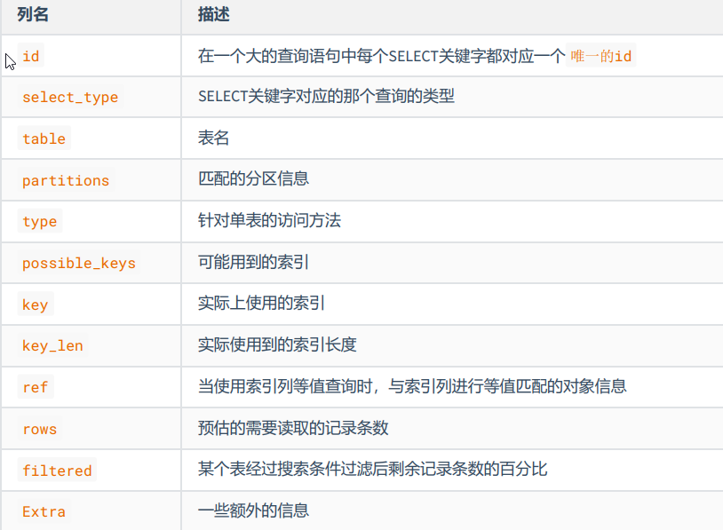

1. **table**

   不论我们的查询语句有多复杂，里边儿 包含了多少个表 ，到最后也是需要对每个表进行 单表访问 的，所 以MySQL规定EXPLAIN语句输出的每条记录都对应着某个单表的访问方法，该条记录的table列代表着该 表的表名（有时不是真实的表名字，可能是简称）。

2. **id**

   id如果相同，可以认为是一组，从上往下顺序执行 

   在所有组中，id值越大，优先级越高，越先执行 

   关注点：id号每个号码，表示一趟独立的查询, 一个sql的查询趟数越少越好

3. **select_type**

   SELECT关键字对应的那个查询的类型,确定小查询在整个大查询中扮演了一个什么角色

   * SIMPLE：查询语句中不包含`UNION`或者子查询的查询都算作是`SIMPLE`类型，连接查询也算是`SIMPLE`类型
   * PRIMARY：对于包含`UNION`或者`UNION ALL`或者子查询的大查询来说，它是由几个小查询组成的，其中最左边的那个询的`select_type`值就是`PRIMARY`
   * UNION：对于包含`UNION`或者`UNION ALL`的大查询来说，它是由几个小查询组成的，其中除了最左边的那个小查询以外，其余的小查询的`select_type`值就是`UNION`
   * SUBQUERY（子查询）：如果包含子查询的查询语句不能够转为对应的`semi-join`(子查询没有转换为多表连接)的形式，并且该子查询是不相关子查询。该子查询的第一个`SELECT`关键字代表的那个查询的`select_type`就是`SUBQUERY`
   * DEPENDENT SUBQUERY（相关子查询）： 如果包含子查询的查询语句不能够转为对应的`semi-join`的形式，并且该子查询是相关子查询，则该子查询的第一个`SELECT`关键字代表的那个查询的`select_type`就是`DEPENDENT SUBQUERY`
   * DEPENDENT UNION：在包含`UNION`或者`UNION ALL`的大查询中，如果各个小查询都依赖于外层查询的话，那除了最左边的那个小查询之外，其余的小查询的`select_type`的值就是`DEPENDENT UNION`。
   * DERIVED：用于 from 子句里有子查询的情况。MySQL 会递归执行这些子查询, 把结果放在临时表里
   * MATERIALIZED：当查询优化器在执行包含子查询的语句时，选择将子查询物化之后与外层查询进行连接查询时，该子查询对应的`select_type`属性就是`MATERIALIZED`

   > 特别关注 `DEPENDENT SUBQUERY `，会严重消耗性能，不会进行子查询，会先进行外部查询,生成结果集,再在内部进行关联查询。子查询的执行效率受制于外层查询的记录数

4. **type**

   常用的类型有： ALL、index、range、 ref、eq_ref、const、system(从左到右，性能从差到好)

   * ALL: MySQL将遍历全表以找到匹配的行
   * index: 遍历索引树
   * range: 只检索给定范围的行，使用索引来选择行
   * ref: 查找条件列使用了索引而且不为主键和unique。就是虽然使用了索引，但该索引列的值并不唯一，有重复。这样即使使用索引快速查找到了第一条数据，仍然不能停止，要进行目标值附近的小范围扫描
   * ref_eq: 使用了主键或者唯一性索引进行查找
   * const: 常量连接，表最多只有一行匹配，通用用于主键或者唯一索引比较时(where后面是逐渐或者唯一索引)
   * system: 表中只有一行

5. **possible_keys**

   预测用到的索引

6. **key**

   实际用到的索引

7. **key_len**

   表示索引中使用的字节数，可通过该列计算查询中使用的索引的长度

8. **ref**

   哪些列或者常量被用于查找索引列上的值(只有当type为ref的时候，ref这列才会有值)

9. **rows**

   估算的找到所需的记录所需要读取的行数

10. **Extra**

    包含MySQL解决查询的详细信息

    * Using filesort: mysql的排序方法主要分为两大类，一种是排序的字段是有索引的，因为索引是有序的，所以不需要另外排序，另一种是排序的字段没有索引，所以需要对结果进行排序，在这种情况下才会如上所示显示一个Using filesort
    * using temporary：性能损耗大，用到临时表(常见于group by)
    * using where：表明虽然用到了索引，但是没有索引覆盖，产生了回表。
    * using index：索引覆盖，查询的内容可以直接在索引中拿到
    * Using index condition：索引下推

# 索引优化与查询优化

## 索引失效

1. **最佳左前缀法则**

   索引文件具有 B-Tree 的最左前缀匹配特性，如果左边的值未确定，那么无法使用此索引。

2. **主键插入顺序**

   我们自定义的主键列 id 拥有 AUTO_INCREMENT 属性，在插入记录时存储引擎会自动为我们填入自增的 主键值。这样的主键占用空间小，顺序写入，减少页分裂。

3. **计算、函数、类型转换(自动或手动)导致索引失效**

   ~~~mysql
   #此语句比下一条要好！（能够使用上索引）
   EXPLAIN SELECT SQL_NO_CACHE * FROM student WHERE student.name LIKE 'abc%';
   #使用函数导致索引失效
   EXPLAIN SELECT SQL_NO_CACHE * FROM student WHERE LEFT(student.name,3) = 'abc'; 
   ~~~

4. **类型转换导致索引失效**

   ~~~mysql
   # name为Varchar的需要类型转换，失效
   EXPLAIN SELECT SQL_NO_CACHE * FROM student WHERE NAME = 123; 
   # 有效
   EXPLAIN SELECT SQL_NO_CACHE * FROM student WHERE NAME = '123'; 
   ~~~

5. **范围条件右边的列索引失效**

   ~~~mysql
   CREATE INDEX idx_age_classId_name ON student(age,classId,NAME);
   
   EXPLAIN SELECT SQL_NO_CACHE * FROM student 
   WHERE student.age=30 AND student.classId>20 AND student.name = 'abc' ; 
   ~~~

6. **不等于(!= 或者<>)索引失效**

7. **is null可以使用索引，is not null无法使用索引**

8. **like以通配符%开头索引失效**

   ~~~mysql
   EXPLAIN SELECT SQL_NO_CACHE * FROM student WHERE NAME LIKE 'ab%'; 
   
   EXPLAIN SELECT SQL_NO_CACHE * FROM student WHERE NAME LIKE '%ab%';
   ~~~

9. **OR 前后存在非索引的列，索引失效**

   ~~~mysql
   CREATE INDEX idx_age ON student(age);
   
   EXPLAIN SELECT SQL_NO_CACHE * FROM student WHERE age = 10 OR classid = 100;
   ~~~

10. **数据库和表的字符集统一使用utf8mb4**

## 关联查询优化

### 采用左外连接

~~~mysql
EXPLAIN SELECT SQL_NO_CACHE * FROM `type` LEFT JOIN book ON type.card = book.card;
# 结论：type 有All
~~~

添加索引优化

~~~mysql
ALTER TABLE book ADD INDEX Y ( card); #【被驱动表】，可以避免全表扫描

EXPLAIN SELECT SQL_NO_CACHE * FROM `type` LEFT JOIN book ON type.card = book.card;
~~~

LEFT JOIN 条件用于确定如何从右表搜索行，左边一定都有，所以 右边是我们的关键点,一定需要建立索引 。

### 采用内连接

~~~mysql
EXPLAIN SELECT SQL_NO_CACHE * FROM type INNER JOIN book ON type.card=book.card;
#结论：type 有All
~~~

添加索引优化

~~~mysql
ALTER TABLE book ADD INDEX Y ( card);

EXPLAIN SELECT SQL_NO_CACHE * FROM type INNER JOIN book ON type.card=book.card;
~~~

~~~mysql
ALTER TABLE type ADD INDEX X (card);

EXPLAIN SELECT SQL_NO_CACHE * FROM type INNER JOIN book ON type.card=book.card;
~~~

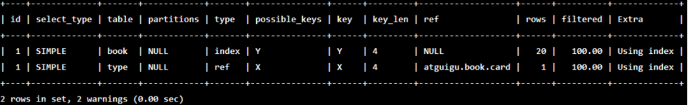

inner join 中，两张表权重一样，优化器会进行优化，数据量小的表作为驱动表，数据量大的作为被驱动表。

### join语句原理

* Index Nested-Loop Join

~~~mysql
EXPLAIN SELECT * FROM t1 STRAIGHT_JOIN t2 ON (t1.a=t2.a);
~~~

如果直接使用join语句，MySQL优化器可能会选择表t1或t2作为驱动表，这样会影响我们分析SQL语句的 执行过程。所以，为了便于分析执行过程中的性能问题，我改用 straight_join 让MySQL使用固定的 连接方式执行查询，这样优化器只会按照我们指定的方式去join。在这个语句里，t1 是驱动表，t2是被驱 动表。

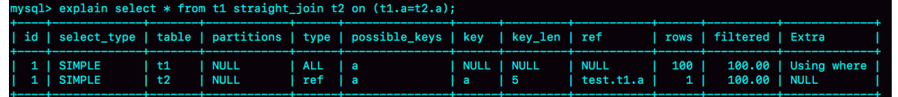

可以看到，在这条语句里，被驱动表t2的字段a上有索引，join过程用上了这个索引，因此这个语句的执 行流程是这样的：

1.  从表t1中读入一行数据 R； 
2.  从数据行R中，取出a字段到表t2里去查找； 
3.  取出表t2中满足条件的行，跟R组成一行，作为结果集的一部分； 
4.  重复执行步骤1到3，直到表t1的末尾循环结束。

这个过程是先遍历表t1，然后根据从表t1中取出的每行数据中的a值，去表t2中查找满足条件的记录。在 形式上，这个过程就跟我们写程序时的嵌套查询类似，并且可以用上被驱动表的索引，所以我们称之为 “Index Nested-Loop Join”，简称NLJ。

**小结**

1. 使用join语句，性能比强行拆成多个单表执行SQL语句的性能要好；
2. 如果使用join语句的话，需要让小表做驱动表。

* Block Nested-Loop Join

举个简单的例子：外层循环结果集有1000行数据，使用NLJ算法需要扫描内层表1000次，但如果使用BNL算法，则先取出外层表结果集的100行存放到join buffer, 然后用内层表的每一行数据去和这100行结果集做比较，可以一次性与100行数据进行比较，这样内层表其实只需要循环1000/100=10次，减少了9/10。

**总结**

* 保证被驱动表的JOIN字段已经创建了索引 
* 需要JOIN 的字段，数据类型保持绝对一致。
* LEFT JOIN 时，选择小表作为驱动表， 大表作为被驱动表 。减少外层循环的次数。 
* INNER JOIN 时，MySQL会自动将 小结果集的表选为驱动表 。选择相信MySQL优化策略。 
* 能够直接多表关联的尽量直接关联，不用子查询。(减少查询的趟数) 
* 不建议使用子查询，建议将子查询SQL拆开结合程序多次查询，或使用 JOIN 来代替子查询。 
* 衍生表建不了索引

## 排序优化

**问题**：在 WHERE 条件字段上加索引，但是为什么在 ORDER BY 字段上还要加索引呢？

**优化建议：**

1. SQL 中，可以在 WHERE 子句和 ORDER BY 子句中使用索引，目的是在 WHERE 子句中 避免**全表扫描** ，在 ORDER BY 子句 避免使用 **FileSort** 排序 。当然，某些情况下全表扫描，或者 FileSort 排 序不一定比索引慢。但总的来说，我们还是要避免，以提高查询效率。
2. 尽量使用 Index 完成 ORDER BY 排序。如果 WHERE 和 ORDER BY 后面是相同的列就使用单索引列； 如果不同就使用联合索引。 
3. 无法使用 Index 时，需要对 FileSort 方式进行调优。

~~~mysql
INDEX a_b_c(a,b,c)
order by 能使用索引最左前缀
- ORDER BY a
- ORDER BY a,b
- ORDER BY a,b,c
- ORDER BY a DESC,b DESC,c DESC
如果WHERE使用索引的最左前缀定义为常量，则order by 能使用索引
- WHERE a = const ORDER BY b,c
- WHERE a = const AND b = const ORDER BY c
- WHERE a = const ORDER BY b,c
- WHERE a = const AND b > const ORDER BY b,c
不能使用索引进行排序
- ORDER BY a ASC,b DESC,c DESC /* 排序不一致 */
- WHERE g = const ORDER BY b,c /*丢失a索引*/
- WHERE a = const ORDER BY c /*丢失b索引*/
- WHERE a = const ORDER BY a,d /*d不是索引的一部分*/
- WHERE a in (...) ORDER BY b,c /*对于排序来说，多个相等条件也是范围查询*/
~~~

### filesort算法：双路排序和单路排序

**双路排序 （慢）**

* MySQL 4.1之前是使用双路排序 ，字面意思就是两次扫描磁盘，最终得到数据， 读取行指针和 order by列 ，对他们进行排序，然后扫描已经排序好的列表，按照列表中的值重新从列表中读取 对应的数据输出 
* 从磁盘取排序字段，在buffer进行排序，再从 磁盘取其他字段 。

取一批数据，要对磁盘进行两次扫描，众所周知，IO是很耗时的，所以在mysql4.1之后，出现了第二种 改进的算法，就是单路排序。

**单路排序 （快）**

从磁盘读取查询需要的 所有列 ，按照order by列在buffer对它们进行排序，然后扫描排序后的列表进行输 出， 它的效率更快一些，避免了第二次读取数据。并且把随机IO变成了顺序IO，但是它会使用更多的空 间， 因为它把每一行都保存在内存中了。

## GROUP BY优化

* group by 使用索引的原则几乎跟order by一致 ，group by 即使没有过滤条件用到索引，也可以直接 使用索引。 
* group by 先排序再分组，遵照索引建的最佳左前缀法则 
* 当无法使用索引列，增大 max_length_for_sort_data 和 sort_buffer_size 参数的设置 
* where效率高于having，能写在where限定的条件就不要写在having中了
* 减少使用order by，和业务沟通能不排序就不排序，或将排序放到程序端去做。
* Order by、group by、distinct这些语句较为耗费CPU，数据库的CPU资源是极其宝贵的。 
* 包含了order by、group by、distinct这些查询的语句，where条件过滤出来的结果集请保持在1000行 以内，否则SQL会很慢。

## 优先考虑覆盖索引

什么是覆盖索引？

理解方式一：索引是高效找到行的一个方法，但是一般数据库也能使用索引找到一个列的数据，因此它 不必读取整个行。毕竟索引叶子节点存储了它们索引的数据；当能通过读取索引就可以得到想要的数 据，那就不需要读取行了。一个索引包含了满足查询结果的数据就叫做覆盖索引。 

理解方式二：非聚簇复合索引的一种形式，它包括在查询里的SELECT、JOIN和WHERE子句用到的所有列 （即建索引的字段正好是覆盖查询条件中所涉及的字段）。 

简单说就是， 索引列+主键 包含 SELECT 到 FROM之间查询的列 。

## 给字符串添加索引

如果使用的是index1（即email整个字符串的索引结构），执行顺序是这样的： 

1. 从index1索引树找到满足索引值是’ zhangssxyz@xxx.com ’的这条记录，取得ID2的值； 
2. 到主键上查到主键值是ID2的行，判断email的值是正确的，将这行记录加入结果集；
3. 取index1索引树上刚刚查到的位置的下一条记录，发现已经不满足email=' zhangssxyz@xxx.com ’的 条件了，循环结束。 这个过程中，只需要回主键索引取一次数据，所以系统认为只扫描了一行。

如果使用的是index2（即email(6)索引结构），执行顺序是这样的： 

1. 从index2索引树找到满足索引值是’zhangs’的记录，找到的第一个是ID1；

2. 到主键上查到主键值是ID1的行，判断出email的值不是’ zhangssxyz@xxx.com ’，这行记录丢弃； 

3. 取index2上刚刚查到的位置的下一条记录，发现仍然是’zhangs’，取出ID2，再到ID索引上取整行然 后判断，这次值对了，将这行记录加入结果集； 

4. 重复上一步，直到在idxe2上取到的值不是’zhangs’时，循环结束。 

也就是说使用前缀索引，定义好长度，就可以做到既节省空间，又不用额外增加太多的查询成本。前面 已经讲过区分度，区分度越高越好。因为区分度越高，意味着重复的键值越少。

> 结论： 使用前缀索引就用不上覆盖索引对查询性能的优化了，这也是你在选择是否使用前缀索引时需要考虑的一个因素.

## 索引下推

Index Condition Pushdown(ICP)是MySQL 5.6中新特性，是一种在存储引擎层使用索引过滤数据的一种优 化方式。ICP可以减少存储引擎访问基表的次数以及MySQL服务器访问存储引擎的次数。

**在不使用ICP索引扫描的过程：**

例： **select * from emp where X and Y;**

storage层：只将满足index key条件的索引记录对应的整行记录取出（X），返回给server层 

server 层：对返回的数据，使用后面的where条件过滤（Y），直至返回最后一行。

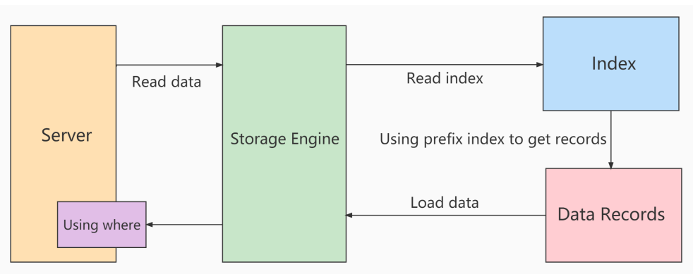

**使用ICP扫描的过程：**

* storage层：

首先将index key条件满足的索引记录区间确定，然后在索引上使用index filter进行过滤。将满足的index filter条件的索引记录才去回表取出整行记录返回server层。不满足index filter条件的索引记录丢弃，不回表、也不会返回server层。

* server 层：

对返回的数据，使用table filter条件做最后的过滤。

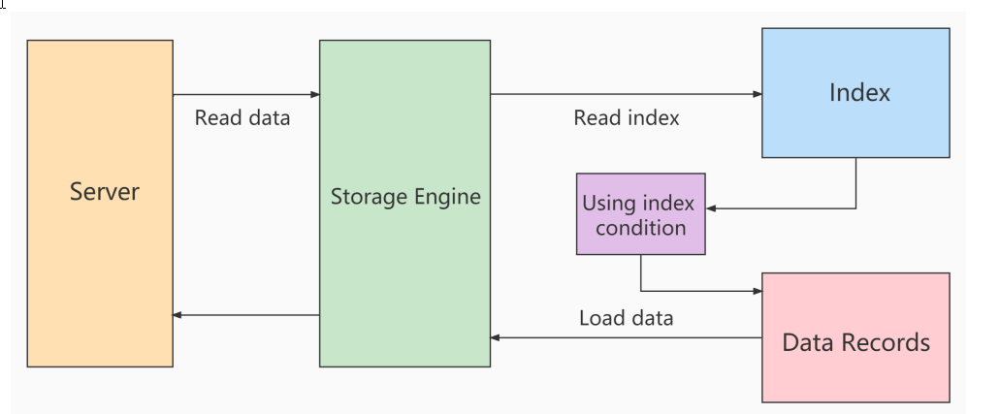

**使用前后的成本差别**

使用前，存储层多返回了需要被index filter过滤掉的整行记录 

使用ICP后，直接就去掉了不满足index filter条件的记录，省去了他们回表和传递到server层的成本。

ICP的 加速效果 取决于在存储引擎内通过 ICP筛选 掉的数据的比例。

**ICP的使用条件**

① 只能用于二级索引(secondary index) 

② 基本使用在联合索引上

③ 并非全部where条件都可以用ICP筛选，如果where条件的字段不在索引列中，还是要读取整表的记录 到server端做where过滤。 

④ ICP可以用于MyISAM和InnnoDB存储引擎

⑤ MySQL 5.6版本的不支持分区表的ICP功能，5.7版本的开始支持。

⑥ 当SQL使用覆盖索引时，不支持ICP优化方法

⑦explain显示的执行计划中type值（join 类型）为 range 、 ref 、 eq_ref 或者 ref_or_null 。 

案例：

~~~mysql
EXPLAIN SELECT * FROM s1 WHERE key1 > 'z' AND key1 LIKE '%a';
~~~

未使用ICP： 通过key1索引查找符合索引数据回表查询数据，再进行`key1 like '%a'`的条件过滤

使用ICP： 通过key1索引查找符合索引的数据，然后`key1 like '%a'`的条件过滤，再进行回表

# 数据库的设计规范

## 为什么需要数据库设计

**糟糕的数据库设计可能造成问题**：

1. 数据冗余、信息重复、存储空间浪费
2. 数据更新、插入、删除异常
3. 无法正常表示信息
4. 丢失有效信息
5. 程序性能差

**良好数据库设计优点：**

1. 节省数据库存储空间
2. 能保证数据的完整性
3. 方便进行数据库应用系统的开发

总之，为了建立冗余较小，结构合理的数据库，设计数据库必须遵循一定的规则。

## 范 式

**范式简介**

在关系型数据库中，<u>关于数据表设计的基本原则</u>、规则就称为范式。可以理解为，一张数据表的设计结 构需要满足的某种设计标准的 级别 。要想设计一个结构合理的关系型数据库，必须满足一定的范式。

目前关系型数据库有六种常见范式，按照范式级别，从低到高分别是：**第一范式**（1NF）、**第二范式** （2NF）、**第三范式**（3NF）、**巴斯-科德范式**（BCNF）、**第四范式**(4NF）和**第五范式**（5NF，又称完美 范式）。

**键和相关属性的概念**

举例：

这里有两个表： 

球员表(player) ：球员编号 | 姓名 | 身份证号 | 年龄 | 球队编号 

球队表(team) ：球队编号 | 主教练 | 球队所在地

* **超键** ：能唯一标识一条记录的属性集叫做超键。**属性集**就是多个属性的一个集合,如果有一个属性可以唯一的标识一条记录,这个属性和任何的属性组合到一起构成的属性集都能作为超键。
  * 对于球员表来说，超键就是包括球员编号或者身份证号的任意组合，比如（球员编号） （球员编号，姓名）（身份证号，年龄）等。
* **候选键**: 如果超键中不包括多余的属性,那么这个超键就是一个候选键。
  * 对于球员表来说，候选键就是（球员编号）或者（身份证号）。
* **主键**: 用户可以从候选键中选择一个作为主键
* **外键**: 如果数据表R1的某个属性不是R1的主键,而是另一个数据表R2的主键,那么这个属性就是数据表R1的外键。
  * 球员表中的球队编号。
* **主属性** 、 **非主属性** ：包含在任意候选键中的属性都称之为主属性。与主属性相对,指的是不包含在任何一个候选键中的属性。
  * 在球员表中，主属性是（球员编号）（身份证号），其他的属性（姓名） （年龄）（球队编号）都是非主属性。

### 第一范式

符合1NF的关系（你可以理解为数据表。“关系模式”和“关系”的区别，类似于面向对象程序设计中”类“与”对象“的区别。”关系“是”关系模式“的一个实例，你可以把”关系”理解为一张带数据的表，而“关系模式”是这张数据表的表结构。**1NF的定义为：符合1NF的关系中的每个属性都不可再分**，**表的每个属性必须具有原子（单个）值。第一范式针对解决属性。**

符合1NF的数据表

> 1NF中属性的原子性是 **主观的** 。

### 第二范式

**2NF在1NF的基础之上，消除了非主属性对于码（主键）的部分函数依赖。第二范式针对解决非主属性对主属性的依赖关系。**

举例1：

`成绩表 `（学号，课程号，成绩）关系中，（学号，课程号）可以决定成绩，但是学号不能决定成绩，课 程号也不能决定成绩，所以“（学号，课程号）→成绩”就是 `完全依赖关系` 。

举例2：

`比赛表 player_game` ，里面包含球员编号、姓名、年龄、比赛编号、比赛时间和比赛场地等属性，这 里候选键和主键都为（球员编号，比赛编号），我们可以通过候选键（或主键）来决定如下的关系：

~~~mysql
(球员编号, 比赛编号) → (姓名, 年龄, 比赛时间, 比赛场地，得分)
~~~

但是这个数据表不满足第二范式，因为数据表中的字段之间还存在着如下的对应关系：

对于非主属性来说，并非完全依赖候选键(主键)。

~~~mysql
(球员编号) → (姓名，年龄) 

(比赛编号) → (比赛时间, 比赛场地)
~~~

这样的话，每张数据表都符合第二范式，也就避免了异常情况的发生。

> 1NF 告诉我们字段属性需要是**原子性**的，而 2NF 告诉我们一张表就是一个**独立的对象**，一张表只表达一个意思。

### 第三范式

**3NF在2NF的基础之上，消除了非主属性对于码(候选码)的传递函数依赖。也就是说， 如果存在非主属性对于码的传递函数依赖，则不符合3NF的要求。所有非主属性之间不能存在依赖关系，必须相互独立。第三范式针对解决非主属性之间的依赖关系。**

举例1：

部门信息表 ：每个部门有部门编号（dept_id）、部门名称、部门简介等信息。

员工信息表 ：每个员工有员工编号、姓名、部门编号。列出部门编号后就不能再将部门名称、部门简介 等与部门有关的信息再加入员工信息表中。

如果不存在部门信息表，则根据第三范式（3NF）也应该构建它，否则就会有大量的数据冗余。

举例2：

球员player表 ：球员编号、姓名、球队名称和球队主教练。现在，我们把属性之间的依赖关系画出 来，如下图所示：

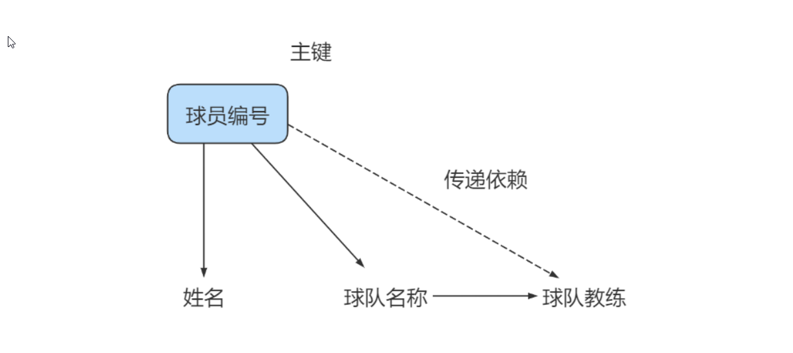

你能看到球员编号决定了球队名称，同时球队名称决定了球队主教练，非主属性球队主教练就会传递依 赖于球员编号，因此不符合 3NF 的要求。

如果要达到 3NF 的要求，需要把数据表拆成下面这样：

### 巴斯范式

**在3NF的基础上消除了主属性对候选键的部分依赖或者传递依赖。巴斯范式针对解决主属性之间的依赖关系。**

案例

在这个表中，一个仓库只有一个管理员，同时一个管理员也只管理一个仓库。我们先来梳理下这些属性 之间的依赖关系。 

仓库名决定了管理员，管理员也决定了仓库名，同时（仓库名，物品名）的属性集合可以决定数量这个 属性。这样，我们就可以找到数据表的候选键。

候选键 ：是（管理员，物品名）和（仓库名，物品名），然后我们从候选键中选择一个作为 主键 ，比 如（仓库名，物品名）。

主属性 ：包含在任一候选键中的属性，也就是仓库名，管理员和物品名。

非主属性 ：数量这个属性。

**是否符合三范式**

如何判断一张表的范式呢？我们需要根据范式的等级，从低到高来进行判断。 

首先，数据表每个属性都是原子性的，符合 1NF 的要求； 

其次，数据表中非主属性”数量“都与候选键全部依赖，（仓库名，物品名）决定数量，（管理员，物品 名）决定数量。因此，数据表符合 2NF 的要求； 

最后，数据表中的非主属性，不传递依赖于候选键，非主属性之间相互独立。因此符合 3NF 的要求。

**存在的问题**

既然数据表已经符合了 3NF 的要求，是不是就不存在问题了呢？我们来看下面的情况： 

1. 增加一个仓库，但是还没有存放任何物品。根据数据表实体完整性的要求，主键不能有空值，因此会出现插入异常 ；
2. 如果仓库更换了管理员，我们就可能会 修改数据表中的多条记录 ；
3. 如果仓库里的商品都卖空了，那么此时仓库名称和相应的管理员名称也会随之被删除。 你能看到，即便数据表符合 3NF 的要求，同样可能存在插入，更新和删除数据的异常情况。

**问题解决**

首先我们需要确认造成异常的原因：主属性仓库名对于候选键（管理员，物品名）是部分依赖的关系（对管理员有依赖，物品名没有）， 这样就有可能导致上面的异常情况。**因此引入BCNF，它在 3NF 的基础上消除了主属性对候选键的部分依 赖或者传递依赖关系。**

* 如果在关系R中，U为主键，A属性是主键的一个属性，若存在A->Y，Y为主属性，则该关系不属于 BCNF
* 巴斯范式针对解决主属性之间的依赖关系

### 总结 

1. 第一范式针对解决属性
2. 第二范式针对解决非主属性对主属性的依赖关系。
3. 第三范式针对解决非主属性之间的依赖关系。
4. 巴斯范式针对解决主属性之间的依赖关系。

### 反范式化

**规范化 vs 性能**

1. 为满足某种商业目标 , 数据库性能比规范化数据库更重要
2. 在数据规范化的同时 , 要综合考虑数据库的性能
3. 通过在给定的表中添加额外的字段，以大量减少需要从中搜索信息所需的时间
4. 通过在给定的表中插入计算列，以方便查询

举例1：

员工的信息存储在 `employees 表` 中，部门信息存储在 `departments 表` 中。通过 `employees 表`中的 `department_id`字段与 `departments表`建立关联关系。如果要查询一个员工所在部门的名称：

~~~mysql
select employee_id,department_name
from employees e join departments d
on e.department_id = d.department_id;
~~~

如果经常需要进行这个操作，连接查询就会浪费很多时间。可以在 `employees 表`中增加一个冗余字段` department_name`，这样就不用每次都进行连接操作了。

举例2：

反范式化的 `goods商品信息表` 设计如下：

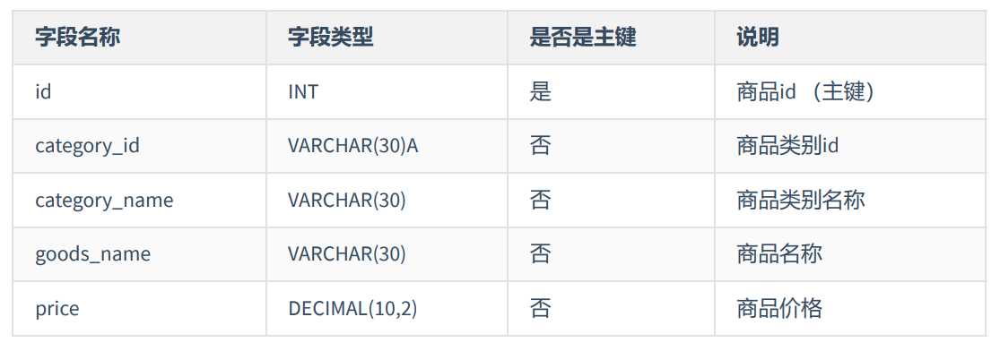

 **反范式的适用场景**

当冗余信息有价值或者能 `大幅度提高查询效率` 的时候，我们才会采取反范式的优化。

## 数据表的设计原则

综合以上内容，总结出数据表设计的一般原则："三少一多" 

1. 数据表的个数越少越好
2. 数据表中的字段个数越少越好
3. 数据表中联合主键的字段个数越少越好
4. 使用主键和外键越多越好

> 注意：这个原则并不是绝对的，有时候我们需要牺牲数据的冗余度来换取数据处理的效率。

## 数据库对象编写建议

### 关于库

1. 【强制】库的名称必须控制在32个字符以内，只能使用英文字母、数字和下划线，建议以英文字 母开头。
2. 【强制】库名中英文 一律小写 ，不同单词采用 下划线 分割。须见名知意。
3. 【强制】库的名称格式：业务系统名称_子系统名。
4. 【强制】库名禁止使用关键字（如type,order等）。
5. 【强制】创建数据库时必须 显式指定字符集 ，并且字符集只能是utf8或者utf8mb4。 创建数据库SQL举例：CREATE DATABASE crm_fund DEFAULT CHARACTER SET 'utf8' ;
6. 【建议】对于程序连接数据库账号，遵循 权限最小原则 使用数据库账号只能在一个DB下使用，不准跨库。程序使用的账号 原则上不准有drop权限 。 
7. 【建议】临时库以 tmp_ 为前缀，并以日期为后缀； 备份库以 bak_ 为前缀，并以日期为后缀。

### 关于表、列

1. 【强制】表和列的名称必须控制在32个字符以内，表名只能使用英文字母、数字和下划线，建议 以 英文字母开头 。
2. 【强制】 表名、列名一律小写 ，不同单词采用下划线分割。须见名知意。 
3. 【强制】表名要求有模块名强相关，同一模块的表名尽量使用 统一前缀 。比如：crm_fund_item 
4. 【强制】创建表时必须 显式指定字符集 为utf8或utf8mb4。 
5. 【强制】表名、列名禁止使用关键字（如type,order等）。
6. 【强制】创建表时必须 显式指定表存储引擎 类型。如无特殊需求，一律为InnoDB。
7. 【强制】建表必须有comment。
8. 【强制】字段命名应尽可能使用表达实际含义的英文单词或 缩写 。如：公司 ID，不要使用 corporation_id, 而用corp_id 即可。 
9. 【强制】布尔值类型的字段命名为 is_描述 。如member表上表示是否为enabled的会员的字段命 名为 is_enabled。_
10. 【强制】禁止在数据库中存储图片、文件等大的二进制数据 通常文件很大，短时间内造成数据量快速增长，数据库进行数据库读取时，通常会进行大量的随 机IO操作，文件很大时，IO操作很耗时。通常存储于文件服务器，数据库只存储文件地址信息。 
11. 【建议】建表时关于主键： 表必须有主键 (1)强制要求主键为id，类型为int或bigint，且为 auto_increment 建议使用unsigned无符号型。 (2)标识表里每一行主体的字段不要设为主键，建议 设为其他字段如user_id，order_id等，并建立unique key索引。因为如果设为主键且主键值为随机 插入，则会导致innodb内部页分裂和大量随机I/O，性能下降。
12. 【建议】核心表（如用户表）必须有行数据的 创建时间字段 （create_time）和 最后更新时间字段 （update_time），便于查问题。 
13. 【建议】表中所有字段尽量都是 NOT NULL 属性，业务可以根据需要定义 DEFAULT值 。 因为使用 NULL值会存在每一行都会占用额外存储空间、数据迁移容易出错、聚合函数计算结果偏差等问 题。 
14. 【建议】所有存储相同数据的 列名和列类型必须一致 （一般作为关联列，如果查询时关联列类型 不一致会自动进行数据类型隐式转换，会造成列上的索引失效，导致查询效率降低）。 
15. 【建议】中间表（或临时表）用于保留中间结果集，名称以 tmp_ 开头。 备份表用于备份或抓取源表快照，名称以 bak_ 开头。中间表和备份表定期清理。
16. 【示范】一个较为规范的建表语句：

~~~mysql
CREATE TABLE user_info (
    `id` int unsigned NOT NULL AUTO_INCREMENT COMMENT '自增主键',
    `user_id` bigint(11) NOT NULL COMMENT '用户id',
    `username` varchar(45) NOT NULL COMMENT '真实姓名',
    `email` varchar(30) NOT NULL COMMENT '用户邮箱',
    `nickname` varchar(45) NOT NULL COMMENT '昵称',
    `birthday` date NOT NULL COMMENT '生日',
    `sex` tinyint(4) DEFAULT '0' COMMENT '性别',
    `short_introduce` varchar(150) DEFAULT NULL COMMENT '一句话介绍自己，最多50个汉字',
    `user_resume` varchar(300) NOT NULL COMMENT '用户提交的简历存放地址',
    `user_register_ip` int NOT NULL COMMENT '用户注册时的源ip',
    `create_time` timestamp NOT NULL DEFAULT CURRENT_TIMESTAMP COMMENT '创建时间',
    `update_time` timestamp NOT NULL DEFAULT CURRENT_TIMESTAMP ON UPDATE
    CURRENT_TIMESTAMP COMMENT '修改时间',
    `user_review_status` tinyint NOT NULL COMMENT '用户资料审核状态，1为通过，2为审核中，3为未
    通过，4为还未提交审核',
    PRIMARY KEY (`id`),
    UNIQUE KEY `uniq_user_id` (`user_id`),
    KEY `idx_username`(`username`),
    KEY `idx_create_time_status`(`create_time`,`user_review_status`)
) ENGINE=InnoDB DEFAULT CHARSET=utf8 COMMENT='网站用户基本信息'
~~~

### 关于索引

1. 【强制】InnoDB表必须主键为id int/bigint auto_increment，且主键值 禁止被更新 。 
2. 【强制】InnoDB和MyISAM存储引擎表，索引类型必须为 BTREE 。 
3. 【建议】主键的名称以 pk_ 开头，唯一键以 uni_ 或 uk_ 开头，普通索引以 idx_ 开头，一律 使用小写格式，以字段的名称或缩写作为后缀。
4. 【建议】多单词组成的columnname，取前几个单词首字母，加末单词组成column_name。如: sample 表 member_id 上的索引：idx_sample_mid。 
5. 【建议】单个表上的索引个数 不能超过6个 。
6. 【建议】在建立索引时，多考虑建立 联合索引 ，并把区分度最高的字段放在最前面。 
7. 【建议】在多表 JOIN 的SQL里，保证被驱动表的连接列上有索引，这样JOIN 执行效率最高。 
8. 【建议】建表或加索引时，保证表里互相不存在 冗余索引 。 比如：如果表里已经存在key(a,b)， 则key(a)为冗余索引，需要删除。

### SQL编写

1. 【强制】程序端SELECT语句必须指定具体字段名称，禁止写成 *。
2. 【建议】程序端insert语句指定具体字段名称，不要写成INSERT INTO t1 VALUES(…)。 
3. 【建议】除静态表或小表（100行以内），DML语句必须有WHERE条件，且使用索引查找。 
4. 【建议】INSERT INTO…VALUES(XX),(XX),(XX).. 这里XX的值不要超过5000个。 值过多虽然上线很 快，但会引起主从同步延迟。
5. 【建议】SELECT语句不要使用UNION，推荐使用UNION ALL，并且UNION子句个数限制在5个以 内。
6. 【建议】线上环境，多表 JOIN 不要超过5个表。 
7. 【建议】减少使用ORDER BY，和业务沟通能不排序就不排序，或将排序放到程序端去做。ORDER BY、GROUP BY、DISTINCT 这些语句较为耗费CPU，数据库的CPU资源是极其宝贵的。
8. 【建议】包含了ORDER BY、GROUP BY、DISTINCT 这些查询的语句，WHERE 条件过滤出来的结果 集请保持在1000行以内，否则SQL会很慢。
9. 【建议】对单表的多次alter操作必须合并为一次 对于超过100W行的大表进行alter table，必须经过DBA审核，并在业务低峰期执行，多个alter需整 合在一起。 因为alter table会产生 表锁 ，期间阻塞对于该表的所有写入，对于业务可能会产生极 大影响。 
10. 【建议】批量操作数据时，需要控制事务处理间隔时间，进行必要的sleep。 
11. 【建议】事务里包含SQL不超过5个。 因为过长的事务会导致锁数据较久，MySQL内部缓存、连接消耗过多等问题。 
12. 【建议】事务里更新语句尽量基于主键或UNIQUE KEY，如UPDATE… WHERE id=XX;否则会产生间隙锁，内部扩大锁定范围，导致系统性能下降，产生死锁。

# 事务基础知识

## 数据库事务概述

**事务**：一组逻辑操作单元，使数据从一种状态变换到另一种状态。

**事务处理的原则**：保证所有事务都作为 一个工作单元 来执行，即使出现了故障，都不能改变这种执行方 式。当在一个事务中执行多个操作时，要么所有的事务都被提交( commit )，那么这些修改就 永久 地保 存下来；要么数据库管理系统将 放弃 所作的所有 修改 ，整个事务回滚( rollback )到最初状态。

**事务的ACID特性**：

* 原子性（atomicity）：原子性是指事务是一个不可分割的工作单位，要么全部提交，要么全部失败回滚。
* 一致性（consistency）：根据定义，一致性是指事务执行前后，数据从一个 合法性状态 变换到另外一个 合法性状态 。这种状态 是 语义上 的而不是语法上的，跟具体的业务有关。几个并行执行的事务，其执行结果必须与按某一顺序 串行执行的结果相一致。
* 隔离型（isolation）：事务的执行不受其他事务的干扰，事务执行的中间结果对其他事务必须是透明的。
* 持久性（durability）：持久性是指一个事务一旦被提交，它对数据库中数据的改变就是 永久性的 ，接下来的其他操作和数据库 故障不应该对其有任何影响。

**事务的状态：**

* 活动的（active）：事务对应的数据库操作正在执行过程中时，我们就说该事务处在 活动的 状态。
* 部分提交的（partially committed）： 当事务中的最后一个操作执行完成，但由于操作都在内存中执行，所造成的影响并 没有刷新到磁盘 时，我们就说该事务处在 部分提交的 状态。
* 失败的（failed）： 当事务处在 活动的 或者 部分提交的 状态时，可能遇到了某些错误（数据库自身的错误、操作系统 错误或者直接断电等）而无法继续执行，或者人为的停止当前事务的执行，我们就说该事务处在 失 败的 状态。
* 中止的（aborted）： 如果事务执行了一部分而变为 失败的 状态，那么就需要把已经修改的事务中的操作还原到事务执 行前的状态。换句话说，就是要撤销失败事务对当前数据库造成的影响。我们把这个撤销的过程称 之为 回滚 。当 回滚 操作执行完毕时，也就是数据库恢复到了执行事务之前的状态，我们就说该事务处在了中止的 状态。
* 提交的（committed）：当一个处在 部分提交的 状态的事务将修改过的数据都 同步到磁盘 上之后，我们就可以说该事务处 在了 提交的 状态。

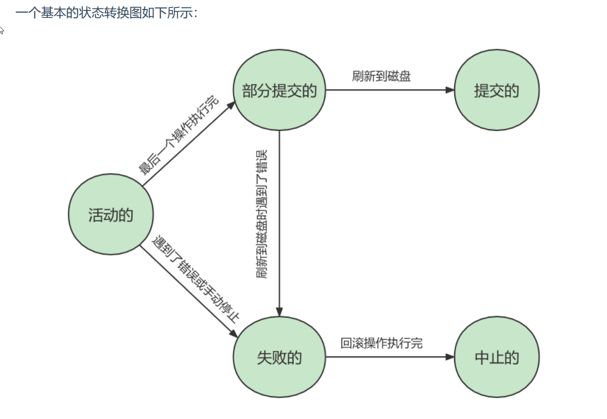

## 使用事务

### 显式事务

**步骤1**： START TRANSACTION 或者 BEGIN ，作用是显式开启一个事务。

~~~mysql
mysql> BEGIN;
#或者
mysql> START TRANSACTION; 
~~~

`START TRANSACTION` 语句相较于 `BEGIN` 特别之处在于，后边能跟随几个 修饰符 ：

① READ ONLY ：标识当前事务是一个 只读事务 ，也就是属于该事务的数据库操作只能读取数据，而不 能修改数据。 

② READ WRITE ：标识当前事务是一个 读写事务 ，也就是属于该事务的数据库操作既可以读取数据， 也可以修改数据。

③ WITH CONSISTENT SNAPSHOT ：启动一致性读。

**步骤2：**一系列事务中的操作（主要是DML，不含DDL）

**步骤3**：提交事务 或 中止事务（即回滚事务）

~~~mysql
# 提交事务。当提交事务后，对数据库的修改是永久性的。
mysql> COMMIT;
# 回滚事务。即撤销正在进行的所有没有提交的修改
mysql> ROLLBACK;
# 将事务回滚到某个保存点。
mysql> ROLLBACK TO [SAVEPOINT]
~~~

### 隐式事务

MySQL中有一个系统变量 autocommit ：

~~~mysql
mysql> SHOW VARIABLES LIKE 'autocommit';
+---------------+-------+
| Variable_name | Value |
+---------------+-------+
| autocommit | ON |
+---------------+-------+
1 row in set (0.01 sec)
~~~

当然，如果我们想关闭这种 自动提交 的功能，可以使用下边两种方法之一：

* 显式的的使用 START TRANSACTION 或者 BEGIN 语句开启一个事务。这样在本次事务提交或者回 滚前会暂时关闭掉自动提交的功能。 
* 把系统变量 autocommit 的值设置为 OFF ，就像这样：

~~~mysql
SET autocommit = OFF;
#或
SET autocommit = 0;
~~~

**隐式提交数据的情况**

* 数据定义语言（Data definition language，缩写为：DDL）

* 隐式使用或修改mysql数据库中的表 

* 事务控制或关于锁定的语句

  ① 当我们在一个事务还没提交或者回滚时就又使用 START TRANSACTION 或者 BEGIN 语句开启了 另一个事务时，会 隐式的提交 上一个事务。即： 

  ② 当前的 autocommit 系统变量的值为 OFF ，我们手动把它调为 ON 时，也会 隐式的提交 前边语 句所属的事务。 

  ③ 使用 LOCK TABLES 、 UNLOCK TABLES 等关于锁定的语句也会 隐式的提交 前边语句所属的事 务。

* 加载数据的语句 

* 关于MySQL复制的一些语句 

* 其它的一些语句

## 事务隔离级别

MySQL是一个 客户端／服务器 架构的软件，对于同一个服务器来说，可以有若干个客户端与之连接，每 个客户端与服务器连接上之后，就可以称为一个会话（ Session ）。每个客户端都可以在自己的会话中 向服务器发出请求语句，一个请求语句可能是某个事务的一部分，也就是对于服务器来说可能同时处理 多个事务。事务有 隔离性 的特性，理论上在某个事务 对某个数据进行访问 时，其他事务应该进行 排 队 ，当该事务提交之后，其他事务才可以继续访问这个数据。但是这样对 性能影响太大 ，我们既想保持 事务的隔离性，又想让服务器在处理访问同一数据的多个事务时 性能尽量高些 ，那就看二者如何权衡取 舍了。

### 数据并发问题

1. 脏写（ Dirty Write ）：对于两个事务 Session A、Session B，如果事务Session A 修改了 另一个 未提交 事务Session B 修改过 的数 据，那就意味着发生了 脏写
2. 脏读（ Dirty Read ）：对于两个事务 Session A、Session B，Session A 读取 了已经被 Session B 更新 但还 没有被提交 的字段。 之后若 Session B 回滚 ，Session A 读取 的内容就是 临时且无效 的。
3. 不可重复读（ Non-Repeatable Read ）： 对于两个事务Session A、Session B，Session A 读取 了一个字段，然后 Session B 更新 了该字段。 之后 Session A 再次读取 同一个字段， 值就不同了。那就意味着发生了不可重复读。
4. 幻读（ Phantom ）： 对于两个事务Session A、Session B, Session A 从一个表中读取了一个字段, 然后 Session B 在该表中 插 入 了一些新的行。之后, 如果 Session A 再次读取同一个表, 就会多出几行。那就意味着发生了幻读。

> 幻读的错误解释：
>
> 说幻读是 事务A 执行两次 select 操作得到不同的数据集，即 select 1 得到 10 条记录，select 2 得到 15 条记录。这其实并不是幻读，既然第一次和第二次读取的不一致，那不还是不可重复读吗，所以这是不可重复读的一种。
>
> 幻读的正确解释： 
>
> 幻读，并不是说两次读取获取的结果集不同，幻读侧重的方面是某一次的 select 操作得到的结果所表征的数据状态无法支撑后续的业务操作。更为具体一些：select 某记录是否存在，不存在，准备插入此记录，但执行 insert 时发现此记录已存在，无法插入，此时就发生了幻读。

### SQL中的四种隔离级别

上面介绍了几种并发事务执行过程中可能遇到的一些问题，这些问题有轻重缓急之分，我们给这些问题 按照严重性来排一下序：

~~~mysql
脏写 > 脏读 > 不可重复读 > 幻读
~~~

我们愿意舍弃一部分隔离性来换取一部分性能在这里就体现在：设立一些隔离级别，隔离级别越低，并 发问题发生的就越多。 SQL标准 中设立了4个 隔离级别 ：

* `READ UNCOMMITTED` ：读未提交，在该隔离级别，所有事务都可以看到其他未提交事务的执行结果。不能避免脏读、不可重复读、幻读。 
* `READ COMMITTED` ：读已提交，它满足了隔离的简单定义：一个事务只能看见已经提交事务所做 的改变。这是大多数数据库系统的默认隔离级别（但不是MySQL默认的）。可以避免脏读，但不可 重复读、幻读问题仍然存在。 
* `REPEATABLE READ` ：可重复读，事务A在读到一条数据之后，此时事务B对该数据进行了修改并提 交，那么事务A再读该数据，读到的还是原来的内容。可以避免脏读、不可重复读，但幻读问题仍 然存在。这是MySQL的默认隔离级别。 
* `SERIALIZABLE` ：可串行化，确保事务可以从一个表中读取相同的行。在这个事务持续期间，禁止 其他事务对该表执行插入、更新和删除操作。所有的并发问题都可以避免，但性能十分低下。能避 免脏读、不可重复读和幻读。

### 设置事务的隔离级别

通过下面的语句修改事务的隔离级别：

~~~mysql
SET [GLOBAL|SESSION] TRANSACTION ISOLATION LEVEL 隔离级别;
#其中，隔离级别格式：
> READ UNCOMMITTED
> READ COMMITTED
> REPEATABLE READ
> SERIALIZABLE
~~~

或者

~~~mysql
SET [GLOBAL|SESSION] TRANSACTION_ISOLATION = '隔离级别'
#其中，隔离级别格式：
> READ-UNCOMMITTED
> READ-COMMITTED
> REPEATABLE-READ
> SERIALIZABLE
~~~

关于设置时使用GLOBAL或SESSION的影响：

* 使用 GLOBAL 关键字（在全局范围影响）：

  ~~~mysql
  SET GLOBAL TRANSACTION ISOLATION LEVEL SERIALIZABLE;
  #或
  SET GLOBAL TRANSACTION_ISOLATION = 'SERIALIZABLE';
  ~~~

  * **当前已经存在的会话无效**
  * 只对执行完该语句之后产生的会话起作用

* 使用 SESSION 关键字（在会话范围影响）：

  ~~~mysql
  SET SESSION TRANSACTION ISOLATION LEVEL SERIALIZABLE;
  #或
  SET SESSION TRANSACTION_ISOLATION = 'SERIALIZABLE';
  ~~~

  * **对当前会话的所有后续的事务有效** 
  * 如果在事务之间执行，则对后续的事务有效 
  * 该语句可以在已经开启的事务中间执行，但不会影响当前正在执行的事务

### 不同隔离级别举例

**演示1. 读未提交之脏读**

脏读问题：

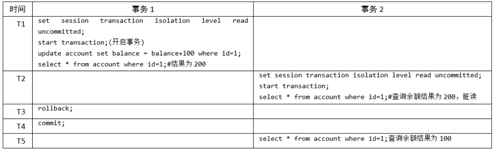

事务1修改的数据未提交，事务2就能够读到事务1未提交的修改数据，出现脏读。

读未提交，其实就是可以读到其他事务未提交的数据。

脏写问题：

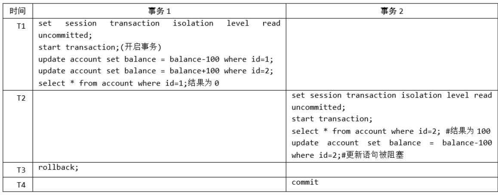

**演示2：读已提交**

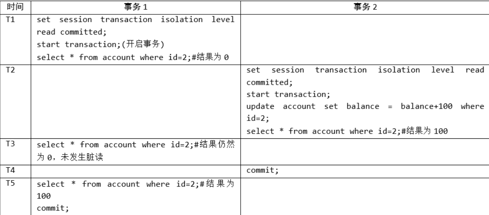

如果事务2进行了提交，id为2的余额修改为100。事务1再次进行查询就会出现余额为100，出现了不可重复读问题。

**演示3：可重复读**

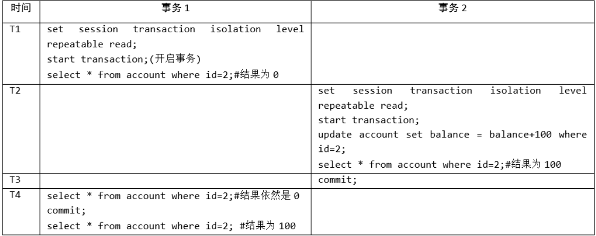

出现**演示4**问题

**演示4：幻读**

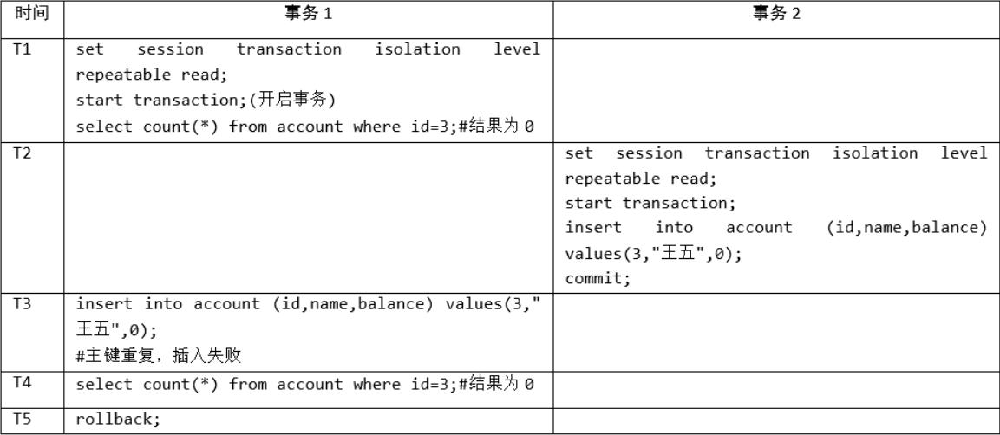

# MySQL事务日志

事务有4种特性：原子性、一致性、隔离性和持久性。那么事务的四种特性到底是基于什么机制实现呢？ 

* 事务的隔离性由 锁机制 实现。 
* 而事务的原子性、一致性和持久性由事务的 redo 日志和undo 日志来保证。 
  * REDO LOG 称为 重做日志 ，提供再写入操作，恢复提交事务修改的页操作，用来保证事务的持 久性。 
  * UNDO LOG 称为 回滚日志 ，回滚行记录到某个特定版本，用来保证事务的原子性、一致性。 

有的DBA或许会认为 UNDO 是 REDO 的逆过程，其实不然。    

## redo日志

为什么需要REDO日志？

一方面，缓冲池可以帮助我们消除CPU和磁盘之间的鸿沟，checkpoint机制可以保证数据的最终落盘，然 而由于checkpoint 并不是每次变更的时候就触发 的，而是master线程隔一段时间去处理的。所以最坏的情 况就是事务提交后，刚写完缓冲池，数据库宕机了，那么这段数据就是丢失的，无法恢复。

另一方面，事务包含 持久性 的特性，就是说对于一个已经提交的事务，在事务提交后即使系统发生了崩 溃，这个事务对数据库中所做的更改也不能丢失。 

那么如何保证这个持久性呢？ 一个简单的做法 ：在事务提交完成之前把该事务所修改的所有页面都刷新 到磁盘，但是这个简单粗暴的做法有些问题 

另一个解决的思路 ：我们只是想让已经提交了的事务对数据库中数据所做的修改永久生效，即使后来系 统崩溃，在重启后也能把这种修改恢复出来。所以我们其实没有必要在每次事务提交时就把该事务在内 存中修改过的全部页面刷新到磁盘，只需要把 修改 了哪些东西 记录一下 就好。比如，某个事务将系统 表空间中 第10号 页面中偏移量为 100 处的那个字节的值 1 改成 2 。我们只需要记录一下：将第0号表 空间的10号页面的偏移量为100处的值更新为 2 。

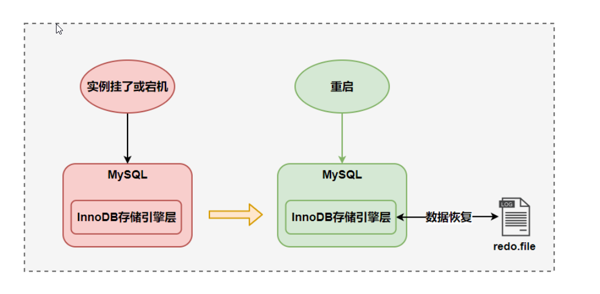

### REDO日志的好处、特点

1. 好处 
   * redo日志降低了刷盘频率 
   * redo日志占用的空间非常小 
2. 特点 
   * redo日志是顺序写入磁盘的 
   * 事务执行过程中，redo log不断记录

### redo的组成			

Redo log可以简单分为以下两个部分：

* 重做日志的缓冲 (redo log buffer) ，保存在内存中，是易失的。
* 重做日志文件 (redo log file) ，保存在硬盘中，是持久的。

### redo的整体流程

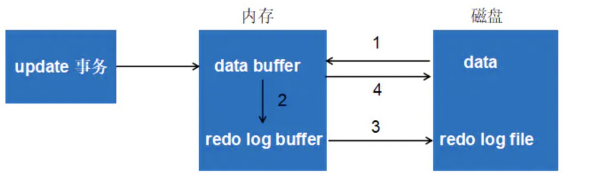

~~~mysql
第1步：先将原始数据从磁盘中读入内存中来，修改数据的内存拷贝
第2步：生成一条重做日志并写入redo log buffer，记录的是数据被修改后的值
第3步：当事务commit时，将redo log buffer中的内容刷新到 redo log file，对 redo log file采用追加
写的方式
第4步：定期将内存中修改的数据刷新到磁盘中
~~~

### redo log的刷盘策略

redo log的写入并不是直接写入磁盘的，InnoDB引擎会在写redo log的时候先写redo log buffer，之后以 一 定的频率 刷入到真正的redo log file 中。这里的一定频率怎么看待呢？这就是我们要说的刷盘策略。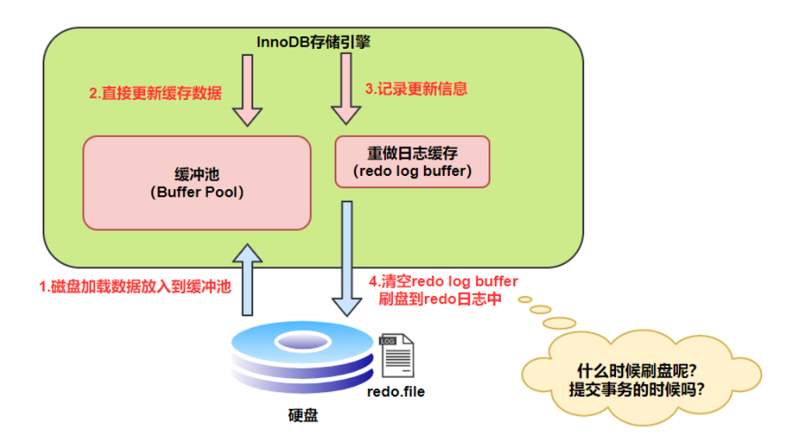

>  注意，redo log buffer刷盘到redo log file的过程并不是真正的刷到磁盘中去，只是刷入到 文件系统缓存 （page cache）中去（这是现代操作系统为了提高文件写入效率做的一个优化），真正的写入会交给系 统自己来决定（比如page cache足够大了）。那么对于InnoDB来说就存在一个问题，如果交给系统来同 步，同样如果系统宕机，那么数据也丢失了（虽然整个系统宕机的概率还是比较小的）。 

针对这种情况，InnoDB给出 innodb_flush_log_at_trx_commit 参数，该参数控制 commit提交事务 时，如何将 redo log buffer 中的日志刷新到 redo log file 中。它支持三种策略：

* 设置为0 ：表示每次事务提交时不进行刷盘操作。（系统默认master thread每隔1s进行一次重做日 志的同步） 
  * 第1步：先将原始数据从磁盘中读入内存中来，修改数据的内存拷贝 
  * 第2步：生成一条重做日志并写入redo log buffer，记录的是数据被修改后的值 
  * 第3步：当事务commit时，将redo log buffer中的内容刷新到 redo log file，对 redo log file采用追加 写的方式 
  * 第4步：定期将内存中修改的数据刷新到磁盘中 
* 设置为1 ：表示每次事务提交时都将进行同步，刷盘操作（ 默认值 ） 
* 设置为2 ：表示每次事务提交时都只把 redo log buffer 内容写入 page cache，不进行同步。由os自 己决定什么时候同步到磁盘文件。

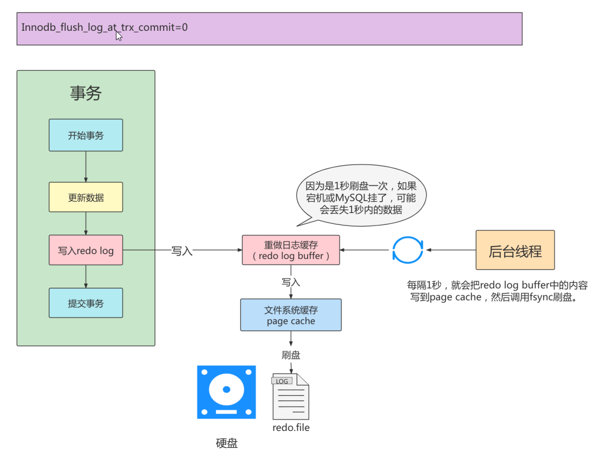

## Undo日志

redo log是事务持久性的保证，undo log是事务原子性的保证。在事务中 更新数据 的 前置操作 其实是要 先写入一个 undo log 。

### 如何理解Undo日志

事务需要保证 原子性 ，也就是事务中的操作要么全部完成，要么什么也不做。但有时候事务执行到一半 会出现一些情况，

* 比如： 情况一：事务执行过程中可能遇到各种错误，比如 服务器本身的错误 ， 操作系统错误 ，甚至是突 然 断电 导致的错误。
* 情况二：程序员可以在事务执行过程中手动输入 ROLLBACK 语句结束当前事务的执行。 

以上情况出现，我们需要把数据改回原先的样子，这个过程称之为 回滚 ，这样就可以造成一个假象：这 个事务看起来什么都没做，所以符合 **原子性** 要求。

### Undo日志的作用

* 作用1：回滚数据 
* 作用2：MVCC

###  undo的存储结构

1.  **回滚段与undo页**

InnoDB对undo log的管理采用段的方式，也就是 回滚段（rollback segment） 。每个回滚段记录了 1024 个 undo log segment ，而在每个undo log segment段中进行 undo页 的申请。 

* 在 InnoDB1.1版本之前 （不包括1.1版本），只有一个rollback segment，因此支持同时在线的事务 限制为 1024 。虽然对绝大多数的应用来说都已经够用。 
* 从1.1版本开始InnoDB支持最大 128个rollback segment ，故其支持同时在线的事务限制提高到 了 128*1024 。

2.  **回滚段与事务**

3.  每个事务只会使用一个回滚段，一个回滚段在同一时刻可能会服务于多个事务。
4.  当一个事务开始的时候，会制定一个回滚段，在事务进行的过程中，当数据被修改时，原始的数 据会被复制到回滚段。
5.  在回滚段中，事务会不断填充盘区，直到事务结束或所有的空间被用完。如果当前的盘区不够 用，事务会在段中请求扩展下一个盘区，如果所有已分配的盘区都被用完，事务会覆盖最初的盘 区或者在回滚段允许的情况下扩展新的盘区来使用。 
6.  回滚段存在于undo表空间中，在数据库中可以存在多个undo表空间，但同一时刻只能使用一个 undo表空间。 
7.  当事务提交时，InnoDB存储引擎会做以下两件事情： 
    * 将undo log放入列表中，以供之后的purge操作 
    * 判断undo log所在的页是否可以重用，若可以分配给下个事务使用

8.  **回滚段中的数据分类**

* 未提交的回滚数据(uncommitted undo information) 

* 已经提交但未过期的回滚数据(committed undo information)

* 事务已经提交并过期的数据(expired undo information)

4. **undo log的生命周期**

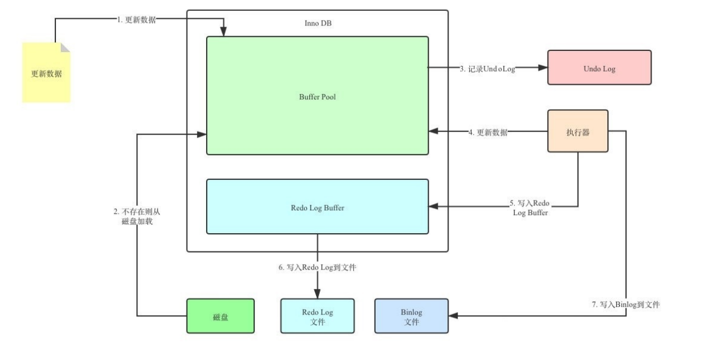

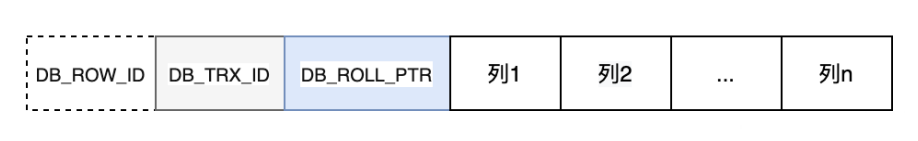

**当我们执行INSERT时：**

~~~mysql
begin;
INSERT INTO user (name) VALUES ("tom");
~~~

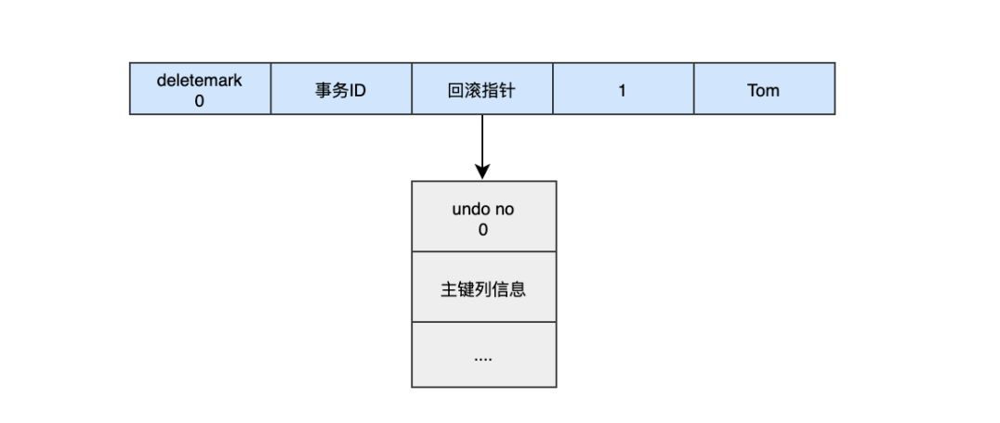

**当我们执行UPDATE时:**

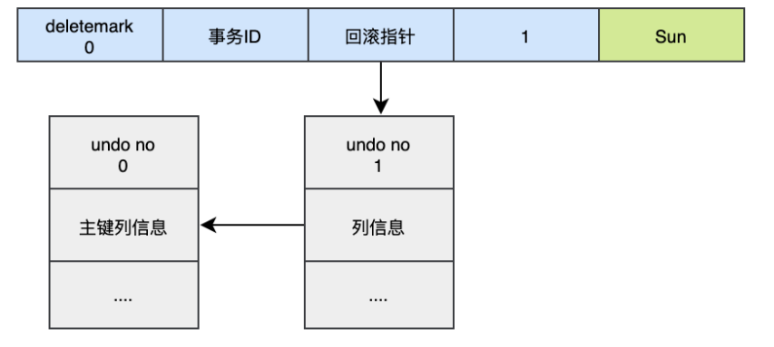

~~~mysql
UPDATE user SET id=2 WHERE id=1;
~~~

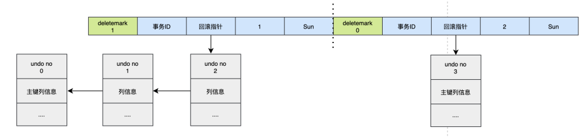

**undo log是如何回滚的**？

以上面的例子来说，假设执行rollback，那么对应的流程应该是这样： 

1. 通过undo no=3的日志把id=2的数据删除 
2. 通过undo no=2的日志把id=1的数据的deletemark还原成0 
3. 通过undo no=1的日志把id=1的数据的name还原成Tom 
4. 通过undo no=0的日志把id=1的数据删除

**undo log的删除**

* 针对于insert undo log 

  因为insert操作的记录，只对事务本身可见，对其他事务不可见。故该undo log可以在事务提交后直接删 除，不需要进行purge操作。

* 针对于update undo log

  该undo log可能需要提供MVCC机制，因此不能在事务提交时就进行删除。提交时放入undo log链表，等 待purge线程进行最后的删除。

purge线程是什么：

- 为了节省磁盘空间，InnoDB有专门的purge线程来清理deleted_bit为true的记录。
- 为了不影响MVCC的正常工作，purge线程自己也维护了一个read view(这个read view相当于系统中最老活跃事务的read view)；
  - 如果某个记录的deleted_bit为true，并且DB_TRX_ID相对于purge线程的read view可见，那么这条记录一定是可以被安全清除的。

## 总结

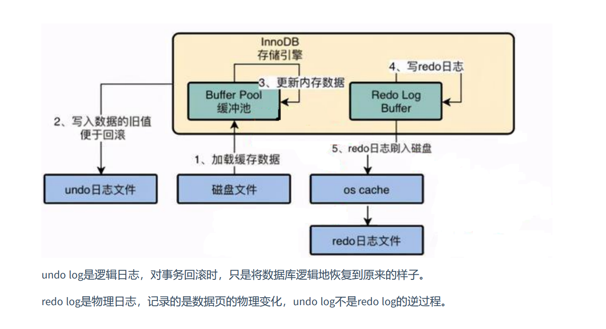

# 事务锁

事务的`隔离性`由这章讲述的 `锁` 来实现。

## MySQL并发事务访问相同记录

### 读-读情况

`读-读` 情况，即并发事务相继 `读取相同的记录` 。读取操作本身不会对记录有任何影响，并不会引起什么 问题，所以允许这种情况的发生。

### 写-写情况

`写-写` 情况，即并发事务相继对相同的记录做出改动。

在这种情况下会发生 `脏写` 的问题，任何一种隔离级别都不允许这种问题的发生。所以在多个未提交事务 相继对一条记录做改动时，需要让它们 `排队执行` ，这个排队的过程其实是通过 `锁 `来实现的。这个所谓 的锁其实是一个 `内存中的结构` ，在事务执行前本来是没有锁的，也就是说一开始是没有 `锁结构` 和记录进 行关联的，如图所示：

当一个事务想对这条记录做改动时，首先会看看内存中有没有与这条记录关联的 `锁结构` ，当没有的时候 就会在内存中生成一个 `锁结构 `与之关联。比如，事务 T1 要对这条记录做改动，就需要生成一个 `锁结构` 与之关联：

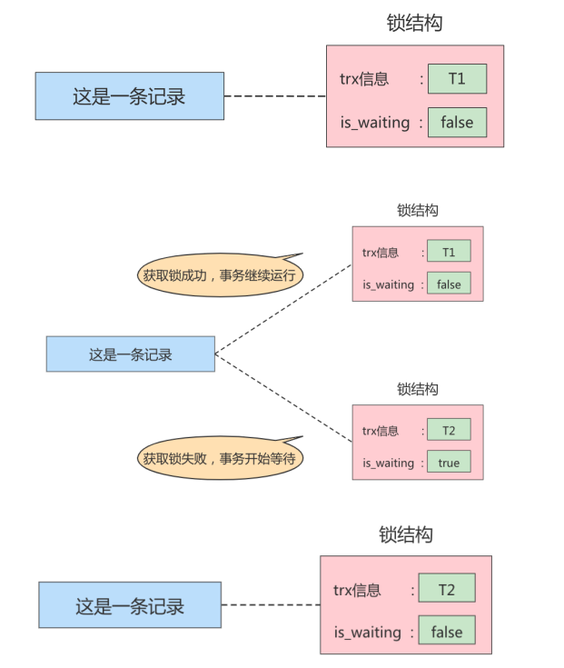

小结几种说法：

* 不加锁 
  意思就是不需要在内存中生成对应的锁结构 ，可以直接执行操作。 
* 获取锁成功，或者加锁成功 
  意思就是在内存中生成了对应的锁结构 ，而且锁结构的 is_waiting属性为 false ，也就是事务 可以继续执行操作。 
* 获取锁失败，或者加锁失败，或者没有获取到锁
  意思就是在内存中生成了对应的 锁结构 ，不过锁结构的 is_waiting 属性为 true ，也就是事务需要等待，不可以继续执行操作。

### 读-写或写-读情况

读-写 或 写-读 ，即一个事务进行读取操作，另一个进行改动操作。这种情况下可能发生 脏读 、 不可重 复读 、 幻读 的问题。

各个数据库厂商对 SQL标准 的支持都可能不一样。比如MySQL在 REPEATABLE READ 隔离级别上就已经 解决了 幻读 问题。

### 并发问题的解决方案

怎么解决 脏读 、 不可重复读 、 幻读 这些问题呢？其实有两种可选的解决方案：

* 方案一：读操作利用多版本并发控制（ MVCC ），写操作进行 加锁 。

> 普通的SELECT语句在READ COMMITTED和REPEATABLE READ隔离级别下会使用到MVCC读取记录。
>
> * 在 READ COMMITTED (读已提交)隔离级别下，一个事务在执行过程中每次执行SELECT操作时都会生成一 个ReadView，ReadView的存在本身就保证了 事务不可以读取到未提交的事务所做的更改 ，也就 是避免了脏读现象；
> * 在 REPEATABLE READ(可重复读) 隔离级别下，一个事务在执行过程中只有 第一次执行SELECT操作 才会 生成一个ReadView，之后的SELECT操作都 复用 这个ReadView，这样也就避免了不可重复读 和幻读的问题。

* 方案二：读、写操作都采用 加锁 的方式。
* 小结对比发现：
  * 采用 MVCC 方式的话， 读-写 操作彼此并不冲突， 性能更高 。 
  * 采用 加锁 方式的话， 读-写 操作彼此需要 排队执行 ，影响性能。

一般情况下我们当然愿意采用 MVCC 来解决 读-写 操作并发执行的问题，但是业务在某些特殊情况 下，要求必须采用 加锁 的方式执行。下面就讲解下MySQL中不同类别的锁。

## 锁的不同角度分类

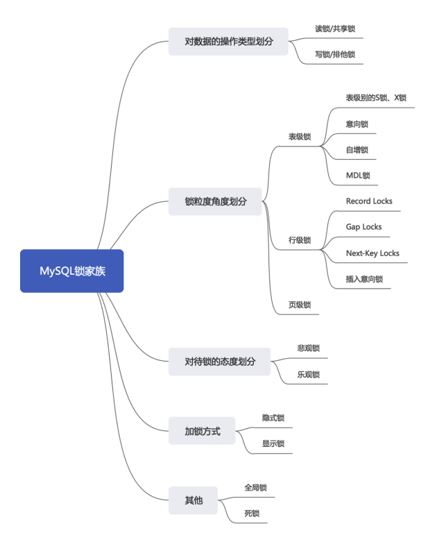

### 从数据操作的类型划分：读锁、写锁

* 读锁 ：也称为 共享锁 、英文用 S 表示。针对同一份数据，多个事务的读操作可以同时进行而不会 互相影响，相互不阻塞的。
* 写锁 ：也称为 排他锁 、英文用 X 表示。当前写操作没有完成前，它会阻断其他写锁和读锁。这样 就能确保在给定的时间里，只有一个事务能执行写入，并防止其他用户读取正在写入的同一资源。

> 需要注意的是对于 InnoDB 引擎来说，读锁和写锁可以加在表上，也可以加在行上。

### 从数据操作的粒度划分：表级锁、页级锁、行锁

#### 表锁（Table Lock）

① 表级别的S锁、X锁

MySQL的表级锁有两种模式：（以MyISAM表进行操作的演示，因为innodb有更强大的行级锁）

* 表共享读锁（Table Read Lock）

* 表独占写锁（Table Write Lock）

| 锁类型 | 自己可读 | 自己可写 | 自己可操作其他表 | 他人可读 | 他人可写 |
| ------ | -------- | -------- | ---------------- | -------- | -------- |
| 读锁   | 是       | 否       | 否               | 是       | 否       |
| 写锁   | 是       | 是       | 否               | 否       | 否       |

② 意向锁 （intention lock）

InnoDB 支持 `多粒度锁（multiple granularity locking）` ，它允许 行级锁 与 表级锁 共存，而意向 锁就是其中的一种 `表锁` 。

意向锁分为两种：

* 意向共享锁（intention shared lock, IS）：事务有意向对表中的某些行加共享锁（S锁）

  ~~~mysql
  -- 事务要获取某些行的 S 锁，必须先获得表的 IS 锁。
  SELECT column FROM table ... LOCK IN SHARE MODE;
  ~~~

* 意向排他锁（intention exclusive lock, IX）：事务有意向对表中的某些行加排他锁（X锁）

  ~~~mysql
  -- 事务要获取某些行的 X 锁，必须先获得表的 IX 锁。
  SELECT column FROM table ... FOR UPDATE;
  ~~~

即：意向锁是由存储引擎 自己维护的 ，用户无法手动操作意向锁，在为数据行加共享 / 排他锁之前， InooDB 会先获取该数据行 所在数据表的对应意向锁 。

作用：如果另一个任务试图在该表级别上应用共享或排它锁，则受到由第一个任务控制的表级别意向锁的阻塞。第二个任务在锁定该表前不必检查各个页或行锁，而只需检查表上的意向锁。解决表锁与之前可能存在的行锁冲突，避免为了判断表是否存在行锁而去扫描全表的系统消耗。

**意向锁的并发性**

意向锁不会与行级的共享 / 排他锁互斥！正因为如此，意向锁并不会影响到多个事务对不同数据行加排 他锁时的并发性。

**结论**

1. InnoDB 支持 多粒度锁 ，特定场景下，行级锁可以与表级锁共存。 
2. 意向锁之间互不排斥，但除了 IS 与 S 兼容外， 意向锁会与 共享锁 / 排他锁 互斥 。 
3. IX，IS是表级锁，不会和行级的X，S锁发生冲突。只会和表级的X，S发生冲突。 
4. 意向锁在保证并发性的前提下，实现了 行锁和表锁共存 且 满足事务隔离性 的要求。

③ 自增锁（AUTO-INC锁）

InnoDB 是如何保证主键值正确的进行自增的？自增锁解决！

自增锁是一种比较特殊的`表级锁`。并且在事务向包含了 `AUTO_INCREMENT` 列的表中新增数据时就会去持有自增锁，假设事务 A 正在做这个操作，如果另一个事务 B 尝试执行 `INSERT`语句，事务 B 会被阻塞住，直到事务 A 释放自增锁。

④ 元数据锁（MDL锁）

MySQL5.5引入了meta data lock，简称MDL锁，属于表锁范畴。MDL 的作用是，保证读写的正确性。比 如，如果一个查询正在遍历一个表中的数据，而执行期间另一个线程对这个 表结构做变更 ，增加了一 列，那么查询线程拿到的结果跟表结构对不上，肯定是不行的。 **因此，当对一个表做增删改查操作的时候，加 MDL读锁；当要对表做结构变更操作的时候，加 MDL 写 锁。**

#### InnoDB中的行锁

① 记录锁（Record Locks）

记录锁也就是仅仅把一条记录锁上，官方的类型名称为： LOCK_REC_NOT_GAP 。比如我们把id值为8的 那条记录加一个记录锁的示意图如图所示。仅仅是锁住了id值为8的记录，对周围的数据没有影响。

记录锁是有S锁和X锁之分的，称之为 S型记录锁 和 X型记录锁 。

* 当一个事务获取了一条记录的S型记录锁后，其他事务也可以继续获取该记录的S型记录锁，但不可 以继续获取X型记录锁；
* 当一个事务获取了一条记录的X型记录锁后，其他事务既不可以继续获取该记录的S型记录锁，也不 可以继续获取X型记录锁。

② 间隙锁（Gap Locks）

MySQL 在 `REPEATABLE READ` 隔离级别下是可以解决幻读问题的，解决方案有两种，可以使用 `MVCC` 方 案解决，也可以采用 加锁 方案解决。但是在使用加锁方案解决时有个大问题，就是事务在第一次执行读 取操作时，那些幻影记录尚不存在，我们无法给这些 幻影记录 加上 记录锁 。InnoDB提出了一种称之为 `Gap Locks` 的锁，官方的类型名称为： `LOCK_GAP` ，我们可以简称为 gap锁 。比如，把id值为8的那条 记录加一个gap锁的示意图如下。

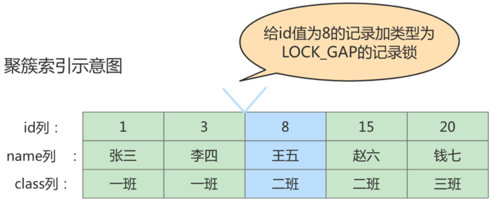

图中id值为8的记录加了gap锁，意味着 `不允许别的事务在id值为8的记录前边的间隙插入新记录` ，其实就是 id列的值(3, 8)这个区间的新记录是不允许立即插入的。比如，有另外一个事务再想插入一条id值为4的新 记录，它定位到该条新记录的下一条记录的id值为8，而这条记录上又有一个gap锁，所以就会阻塞插入 操作，直到拥有这个gap锁的事务提交了之后，id列的值在区间(3, 8)中的新记录才可以被插入。

> **gap锁的提出仅仅是为了防止插入幻影记录而提出的。**

③ 临键锁（Next-Key Locks）

有时候我们既想 锁住某条记录 ，又想 阻止 其他事务在该记录前边的 间隙插入新记录 ，所以InnoDB就提 出了一种称之为 Next-Key Locks 的锁，官方的类型名称为： LOCK_ORDINARY ，我们也可以简称为 next-key锁 。Next-Key Locks是在存储引擎 innodb 、事务级别在 可重复读 的情况下使用的数据库锁， innodb默认的锁就是Next-Key locks。

~~~mysql
begin;
select * from student where id <=8 and id > 3 for update;
~~~

例：间隙锁在（3，8）区间内，3,8都不可取。如果我们想要保证8也进行加锁，那就需要用到临键锁。

临键锁兼具记录锁与间隙锁的特征。

④ 插入意向锁（Insert Intention Locks）

`插入意向锁`是`间隙锁`的一种。

我们说一个事务在 插入 一条记录时需要判断一下插入位置是不是被别的事务加了 gap锁 （ next-key锁 也包含 gap锁 ），如果有的话，插入操作需要等待，直到拥有 gap锁 的那个事务提交。但是InnoDB规 定事务在等待的时候也需要在内存中生成一个锁结构，表明有事务想在某个 间隙 中 插入 新记录，但是 现在在等待。InnoDB就把这种类型的锁命名为 Insert Intention Locks ，官方的类型名称为： LOCK_INSERT_INTENTION ，我们称为 插入意向锁 。插入意向锁是一种 Gap锁 ，不是意向锁，在insert 操作时产生。

插入意向锁是在插入一条记录行前，由 INSERT 操作产生的一种间隙锁 。

事实上插入意向锁并不会阻止别的事务继续获取该记录上任何类型的锁。

#### 页锁

页锁就是在 页的粒度 上进行锁定，锁定的数据资源比行锁要多，因为一个页中可以有多个行记录。当我 们使用页锁的时候，会出现数据浪费的现象，但这样的浪费最多也就是一个页上的数据行。页锁的开销 介于表锁和行锁之间，会出现死锁。锁定粒度介于表锁和行锁之间，并发度一般。 

每个层级的锁数量是有限制的，因为锁会占用内存空间， 锁空间的大小是有限的 。当某个层级的锁数量 超过了这个层级的阈值时，就会进行 锁升级 。锁升级就是用更大粒度的锁替代多个更小粒度的锁，比如 InnoDB 中行锁升级为表锁，这样做的好处是占用的锁空间降低了，但同时数据的并发度也下降了。

### 从对待锁的态度划分:乐观锁、悲观锁

从对待锁的态度来看锁的话，可以将锁分成乐观锁和悲观锁，从名字中也可以看出这两种锁是两种看待 数据并发的思维方式 。需要注意的是，乐观锁和悲观锁并不是锁，而是锁的 设计思想 。

#### 悲观锁（Pessimistic Locking）

悲观锁总是假设最坏的情况，每次去拿数据的时候都认为别人会修改，所以每次在拿数据的时候都会上 锁，这样别人想拿这个数据就会 阻塞 直到它拿到锁（共享资源每次只给一个线程使用，其它线程阻塞， 用完后再把资源转让给其它线程）。<u>比如行锁，表锁等，读锁，写锁等，都是在做操作之前先上锁，当 其他线程想要访问数据时，都需要阻塞挂起</u>。Java中 synchronized 和 ReentrantLock 等独占锁就是 悲观锁思想的实现。

#### 乐观锁（Optimistic Locking）

乐观锁认为对同一数据的并发操作不会总发生，属于小概率事件，不用每次都对数据上锁，但是在更新 的时候会判断一下在此期间别人有没有去更新这个数据，也就是不采用数据库自身的锁机制，而是通过 程序来实现。在程序上，我们可以采用 版本号机制 或者 CAS机制 实现。乐观锁适用于多读的应用类型， 这样可以提高吞吐量。在Java中 java.util.concurrent.atomic 包下的原子变量类就是使用了乐观锁 begin; select * from student where id <=8 and id > 3 for update; 的一种实现方式：CAS实现的。

①乐观锁的版本号机制

在表中设计一个 版本字段 version ，第一次读的时候，会获取 version 字段的取值。然后对数据进行更 新或删除操作时，会执行 UPDATE ... SET version=version+1 WHERE version=version 。此时 如果已经有事务对这条数据进行了更改，修改就不会成功。

②乐观锁的时间戳机制

时间戳和版本号机制一样，也是在更新提交的时候，将当前数据的时间戳和更新之前取得的时间戳进行 比较，如果两者一致则更新成功，否则就是版本冲突。 

你能看到乐观锁就是程序员自己控制数据并发操作的权限，基本是通过给数据行增加一个戳（版本号或 者时间戳），从而证明当前拿到的数据是否最新。

从这两种锁的设计思想中，我们总结一下乐观锁和悲观锁的适用场景：

1. 乐观锁 适合 读操作多 的场景，相对来说写的操作比较少。它的优点在于 程序实现 ， 不存在死锁 问题，不过适用场景也会相对乐观，因为它阻止不了除了程序以外的数据库操作。
2. 悲观锁 适合 写操作多 的场景，因为写的操作具有 排它性 。采用悲观锁的方式，可以在数据库层 面阻止其他事务对该数据的操作权限，防止 读 - 写 和 写 - 写 的冲突。

### 按加锁的方式划分：显式锁、隐式锁

#### 隐式锁

* 情景一：对于聚簇索引记录来说，有一个 trx_id 隐藏列，该隐藏列记录着最后改动该记录的 事务 id 。那么如果在当前事务中新插入一条聚簇索引记录后，该记录的 trx_id 隐藏列代表的的就是 当前事务的 事务id ，如果其他事务此时想对该记录添加 S锁 或者 X锁 时，首先会看一下该记录的 trx_id 隐藏列代表的事务是否是当前的活跃事务，如果是的话，那么就帮助当前事务创建一个 X 锁 （也就是为当前事务创建一个锁结构， is_waiting 属性是 false ），然后自己进入等待状态 （也就是为自己也创建一个锁结构， is_waiting 属性是 true ）。
* 情景二：对于二级索引记录来说，本身并没有 trx_id 隐藏列，但是在二级索引页面的 Page Header 部分有一个 PAGE_MAX_TRX_ID 属性，该属性代表对该页面做改动的最大的 事务id ，如 果 PAGE_MAX_TRX_ID 属性值小于当前最小的活跃 事务id ，那么说明对该页面做修改的事务都已 经提交了，否则就需要在页面中定位到对应的二级索引记录，然后回表找到它对应的聚簇索引记 录，然后再重复 情景一 的做法。

隐式锁的逻辑过程如下：

A. InnoDB的每条记录中都一个隐含的trx_id字段，这个字段存在于聚簇索引的B+Tree中。 

B. 在操作一条记录前，首先根据记录中的trx_id检查该事务是否是活动的事务(未提交或回滚)。如果是活 动的事务，首先将 隐式锁 转换为 显式锁 (就是为该事务添加一个锁)。 

C. 检查是否有锁冲突，如果有冲突，创建锁，并设置为waiting状态。如果没有冲突不加锁，跳到E。 

D. 等待加锁成功，被唤醒，或者超时。 

E. 写数据，并将自己的trx_id写入trx_id字段。

#### 显式锁

通过特定的语句进行加锁，我们一般称之为显示加锁，例如：

显示加共享锁： 

~~~mysql
select .... lock in share mode
~~~

显示加排它锁：

~~~mysql
select .... for update
~~~

### 其它锁之：全局锁、死锁

#### 全局锁

全局锁就是对 整个数据库实例 加锁。当你需要让整个库处于 只读状态 的时候，可以使用这个命令，之后 其他线程的以下语句会被阻塞：数据更新语句（数据的增删改）、数据定义语句（包括建表、修改表结 构等）和更新类事务的提交语句。全局锁的典型使用 场景 是：做 全库逻辑备份 。 全局锁的命令：

#### 死锁

死锁是指两个或多个事务在同一资源上相互占用，并请求锁定对方占用的资源，从而导致恶性循环。

死锁示例：

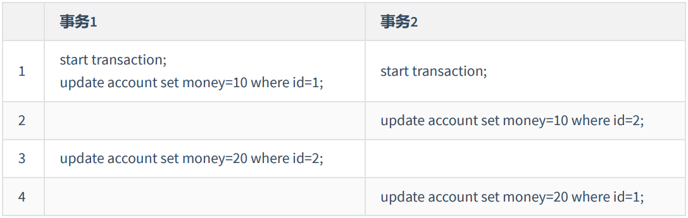

这时候，事务1在等待事务2释放id=2的行锁，而事务2在等待事务1释放id=1的行锁。 事务1和事务2在互 相等待对方的资源释放，就是进入了死锁状态。当出现死锁以后，有 两种策略 ：

* 一种策略是，直接进入等待，直到超时。这个超时时间可以通过参数 innodb_lock_wait_timeout 来设置。
* 另一种策略是，发起死锁检测，发现死锁后，主动回滚死锁链条中的某一个事务（将持有最少行级 排他锁的事务进行回滚），让其他事务得以继续执行。将参数 innodb_deadlock_detect 设置为 on ，表示开启这个逻辑。

## 锁的内存结构

InnoDB 存储引擎中的 锁结构 如下：

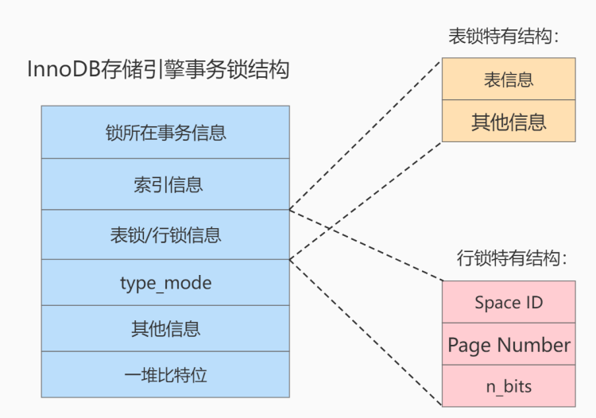

结构解析：

1. 锁所在的事务信息 ：

不论是 表锁 还是 行锁 ，都是在事务执行过程中生成的，哪个事务生成了这个 锁结构 ，这里就记录这个 事务的信息。

此 锁所在的事务信息 在内存结构中只是一个指针，通过指针可以找到内存中关于该事务的更多信息，比 方说事务id等。

2. 索引信息 ：

对于 行锁 来说，需要记录一下加锁的记录是属于哪个索引的。这里也是一个指针。

3. 表锁／行锁信息 ：

表锁结构 和 行锁结构 在这个位置的内容是不同的：

* 表锁

  记载着是对哪个表加的锁，还有其他的一些信息。

* 行锁

  记载了三个重要的信息：

  * Space ID ：记录所在表空间。
  * Page Number ：记录所在页号。
  * n_bits ：对于行锁来说，一条记录就对应着一个比特位，一个页面中包含很多记录，用不同 的比特位来区分到底是哪一条记录加了锁。为此在行锁结构的末尾放置了一堆比特位，这个 n_bits 属性代表使用了多少比特位。

4. type_mode ：

这是一个32位的数，被分成了 lock_mode 、 lock_type 和 rec_lock_type 三个部分，如图所示：

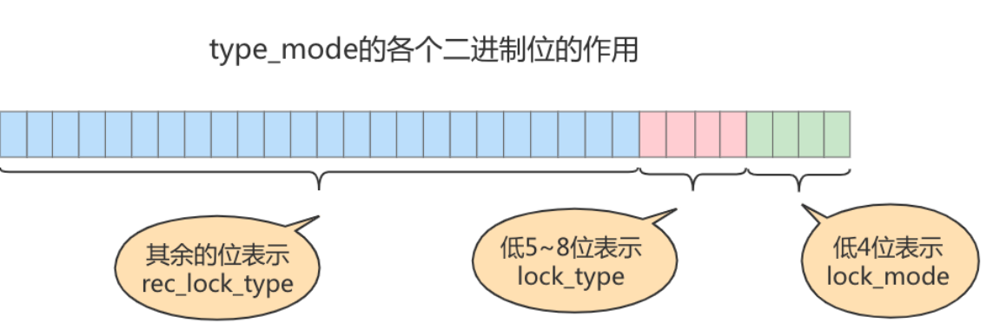

* 锁的模式（ lock_mode ），占用低4位，可选的值如下：

  * LOCK_IS （十进制的 0 ）：表示共享意向锁，也就是 IS锁 。
  * LOCK_IX （十进制的 1 ）：表示独占意向锁，也就是 IX锁 。
  * LOCK_S （十进制的 2 ）：表示共享锁，也就是 S锁 。
  * LOCK_X （十进制的 3 ）：表示独占锁，也就是 X锁 。
  * LOCK_AUTO_INC （十进制的 4 ）：表示 AUTO-INC锁 。

  在InnoDB存储引擎中，LOCK_IS，LOCK_IX，LOCK_AUTO_INC都算是表级锁的模式，LOCK_S和 LOCK_X既可以算是表级锁的模式，也可以是行级锁的模式。

* 锁的类型（ lock_type ），占用第5～8位，不过现阶段只有第5位和第6位被使用：

  * LOCK_TABLE （十进制的 16 ），也就是当第5个比特位置为1时，表示表级锁。
  * LOCK_REC （十进制的 32 ），也就是当第6个比特位置为1时，表示行级锁。

* 行锁的具体类型（ rec_lock_type ），使用其余的位来表示。只有在 lock_type 的值为 LOCK_REC 时，也就是只有在该锁为行级锁时，才会被细分为更多的类型：

  * LOCK_ORDINARY （十进制的 0 ）：表示 next-key锁 。 
  * LOCK_GAP （十进制的 512 ）：也就是当第10个比特位置为1时，表示 gap锁 。 
  * LOCK_REC_NOT_GAP （十进制的 1024 ）：也就是当第11个比特位置为1时，表示正经 记录 锁 。 
  * LOCK_INSERT_INTENTION （十进制的 2048 ）：也就是当第12个比特位置为1时，表示插入 意向锁。

* is_waiting 属性呢？基于内存空间的节省，所以把 is_waiting 属性放到了 type_mode 这个32 位的数字中：

  * LOCK_WAIT （十进制的 256 ） ：当第9个比特位置为 1 时，表示 is_waiting 为 true ，也 就是当前事务尚未获取到锁，处在等待状态；当这个比特位为 0 时，表示 is_waiting 为 false ，也就是当前事务获取锁成功。

# 多版本并发控制

## 什么是MVCC

`MVCC （Multiversion Concurrency Control）`，多版本并发控制。顾名思义，`MVCC` 是通过数据行的多个版本管理来实现数据库的 并发控制 。这项技术使得在InnoDB的事务隔离级别下执行 一致性读 操作有了保 证。换言之，就是为了查询一些正在被另一个事务更新的行，并且可以看到它们被更新之前的值，这样 在做查询的时候就不用等待另一个事务释放锁。

## 快照读与当前读

MVCC在MySQL InnoDB中的实现主要是为了提高数据库并发性能，用更好的方式去处理 读-写冲突 ，做到 即使有读写冲突时，也能做到 不加锁 ， 非阻塞并发读 ，而这个读指的就是 快照读 , 而非 当前读 。当前 读实际上是一种加锁的操作，是悲观锁的实现。而MVCC本质是采用乐观锁思想的一种方式。

### 快照读

快照读又叫一致性读，读取的是快照数据。不加锁的简单的 SELECT 都属于快照读，即不加锁的非阻塞 读；

~~~mysql
select * from user where ...;
~~~

之所以出现快照读的情况，是基于提高并发性能的考虑，快照读的实现是基于MVCC，它在很多情况下， 避免了加锁操作，降低了开销。 既然是基于多版本，那么快照读可能读到的并不一定是数据的最新版本，而有可能是之前的历史版本。 

快照读的前提是隔离级别不是串行级别，串行级别下的快照读会退化成当前读。

### 当前读

当前读读取的是记录的最新版本（最新数据，而不是历史版本的数据），读取时还要保证其他并发事务 不能修改当前记录，会对读取的记录进行加锁。加锁的 SELECT，或者对数据进行增删改都会进行当前 读。比如：

~~~mysql
SELECT * FROM student LOCK IN SHARE MODE; # 共享锁

SELECT * FROM student FOR UPDATE; # 排他锁

INSERT INTO student values ... # 排他锁

DELETE FROM student WHERE ... # 排他锁

UPDATE student SET ... # 排他锁
~~~

## 前文复习

### 隔离级别

我们知道事务有 4 个隔离级别，可能存在三种并发问题：

另图：

### 隐藏字段、Undo Log版本链

回顾一下undo日志的版本链，对于使用 InnoDB 存储引擎的表来说，它的聚簇索引记录中都包含两个必 要的隐藏列。

* trx_id ：每次一个事务对某条聚簇索引记录进行改动时，都会把该事务的 事务id 赋值给 trx_id 隐藏列。 
* roll_pointer ：每次对某条聚簇索引记录进行改动时，都会把旧的版本写入到 undo日志 中，然 后这个隐藏列就相当于一个指针，可以通过它来找到该记录修改前的信息。

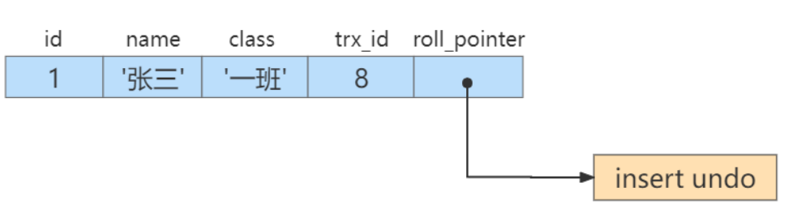

> insert undo只在事务回滚时起作用，当事务提交后，该类型的undo日志就没用了，它占用的Undo Log Segment也会被系统回收（也就是该undo日志占用的Undo页面链表要么被重用，要么被释 放）。

假设之后两个事务id分别为 10 、 20 的事务对这条记录进行 UPDATE 操作，操作流程如下：

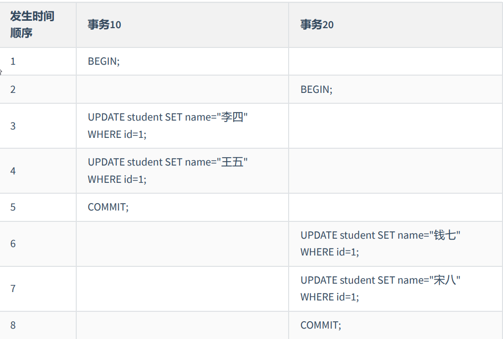

每次对记录进行改动，都会记录一条undo日志，每条undo日志也都有一个 roll_pointer 属性 （ INSERT 操作对应的undo日志没有该属性，因为该记录并没有更早的版本），可以将这些 undo日志 都连起来，串成一个链表：

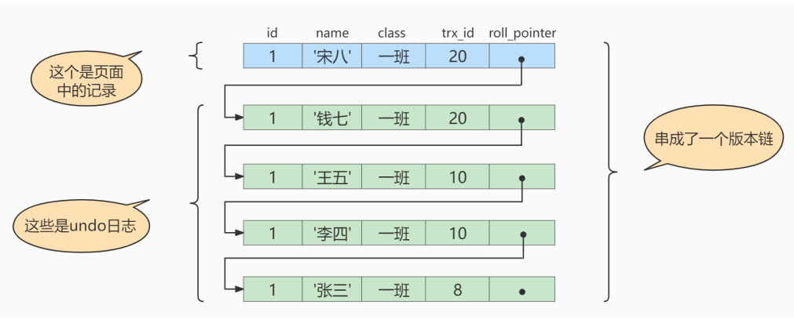

对该记录每次更新后，都会将旧值放到一条 undo日志 中，就算是该记录的一个旧版本，随着更新次数 的增多，所有的版本都会被 roll_pointer 属性连接成一个链表，我们把这个链表称之为 版本链 ，版 本链的头节点就是当前记录最新的值。 

每个版本中还包含生成该版本时对应的 事务id 。

## MVCC实现原理之ReadView

MVCC 的实现依赖于：**隐藏字段、Undo Log、Read View。**

### 什么是ReadView

使用 `READ COMMITTED` 和 `REPEATABLE READ` 隔离级别的事务，都必须保证读到 已经提交了的 事务修改 过的记录。假如另一个事务已经修改了记录但是尚未提交，是不能直接读取最新版本的记录的，核心问 题就是需要判断一下版本链中的哪个版本是当前事务可见的，这是ReadView要解决的主要问题。

这个ReadView中主要包含4个比较重要的内容，分别如下：

1. creator_trx_id ，创建这个 Read View 的事务 ID。

   > 说明：只有在对表中的记录做改动时（执行INSERT、DELETE、UPDATE这些语句时）才会为 事务分配事务id，否则在一个只读事务中的事务id值都默认为0。

2. trx_ids ，表示在生成ReadView时当前系统中活跃的读写事务的 事务id列表 。

3. up_limit_id ，活跃的事务中最小的事务 ID

4. low_limit_id ，表示生成ReadView时系统中应该分配给下一个事务的 id 值。low_limit_id 是系 统最大的事务id值，这里要注意是系统中的事务id，需要区别于正在活跃的事务ID。

   > 注意：low_limit_id并不是trx_ids中的最大值，事务id是递增分配的。比如，现在有id为1， 2，3这三个事务，之后id为3的事务提交了。那么一个新的读事务在生成ReadView时， trx_ids就包括1和2，up_limit_id的值就是1，low_limit_id的值就是4。

### ReadView的规则

有了这个ReadView，这样在访问某条记录时，只需要按照下边的步骤判断记录的某个版本是否可见。

* 如果被访问版本的trx_id属性值与ReadView中的 creator_trx_id 值相同，意味着当前事务在访问 它自己修改过的记录，所以该版本可以被当前事务访问。
* 如果被访问版本的trx_id属性值小于ReadView中的 up_limit_id 值，表明生成该版本的事务在当前 事务生成ReadView前已经提交，所以该版本可以被当前事务访问。
* 如果被访问版本的trx_id属性值大于或等于ReadView中的 low_limit_id 值，表明生成该版本的事 务在当前事务生成ReadView后才开启，所以该版本不可以被当前事务访问。
* 如果被访问版本的trx_id属性值在ReadView的 up_limit_id 和 low_limit_id 之间，那就需要判 断一下trx_id属性值是不是在 trx_ids 列表中。
  * 如果在，说明创建ReadView时生成该版本的事务还是活跃的，该版本不可以被访问。
  * 如果不在，说明创建ReadView时生成该版本的事务已经被提交，该版本可以被访问。

### MVCC整体操作流程

了解了这些概念之后，我们来看下当查询一条记录的时候，系统如何通过MVCC找到它：

1. 首先获取事务自己的版本号，也就是事务 ID；
2. 获取 ReadView；
3. 查询得到的数据，然后与 ReadView 中的事务版本号进行比较；
4. 如果不符合 ReadView 规则，就需要从 Undo Log 中获取历史快照；
5. 最后返回符合规则的数据。

在隔离级别为读已提交（Read Committed）时，一个事务中的每一次 SELECT 查询都会重新获取一次 Read View。如表所示：

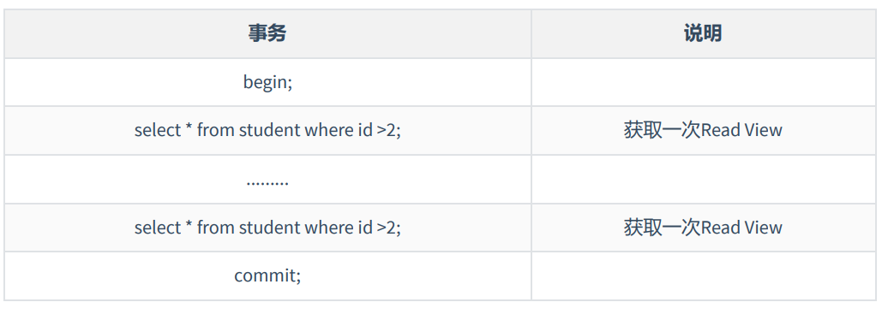

> 注意，此时同样的查询语句都会重新获取一次 Read View，这时如果 Read View 不同，就可能产生 不可重复读或者幻读的情况。

当隔离级别为可重复读的时候，就避免了不可重复读，这是因为一个事务只在第一次 SELECT 的时候会 获取一次 Read View，而后面所有的 SELECT 都会复用这个 Read View，如下表所示：

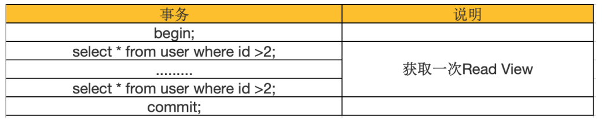

## 举例说明

### READ COMMITTED隔离级别下

READ COMMITTED ：每次读取数据前都生成一个ReadView。

现在有两个 事务id 分别为 10 、 20 的事务在执行：

~~~mysql
# Transaction 10
BEGIN;
UPDATE student SET name="李四" WHERE id=1;
UPDATE student SET name="王五" WHERE id=1;
# Transaction 20
BEGIN;
# 更新了一些别的表的记录
...
~~~

此刻，表student 中 id 为 1 的记录得到的版本链表如下所示：

假设现在有一个使用 READ COMMITTED 隔离级别的事务开始执行：

~~~mysql
# 使用READ COMMITTED隔离级别的事务
BEGIN;
# SELECT1：Transaction 10、20未提交
SELECT * FROM student WHERE id = 1; # 得到的列name的值为'张三'
~~~

之后，我们把 事务id 为 10 的事务提交一下：

~~~mysql
# Transaction 10
BEGIN;
UPDATE student SET name="李四" WHERE id=1;
UPDATE student SET name="王五" WHERE id=1;
COMMIT;
~~~

然后再到 事务id 为 20 的事务中更新一下表 student 中 id 为 1 的记录：

~~~mysql
# Transaction 20
BEGIN;
# 更新了一些别的表的记录
...
UPDATE student SET name="钱七" WHERE id=1;
UPDATE student SET name="宋八" WHERE id=1;
~~~

此刻，表student中 id 为 1 的记录的版本链就长这样：

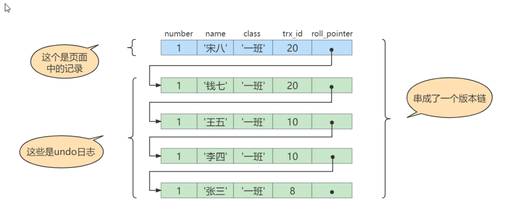

然后再到刚才使用 READ COMMITTED 隔离级别的事务中继续查找这个 id 为 1 的记录，如下：

~~~mysql
# 使用READ COMMITTED隔离级别的事务
BEGIN;
# SELECT1：Transaction 10、20均未提交
SELECT * FROM student WHERE id = 1; # 得到的列name的值为'张三'
# SELECT2：Transaction 10提交，Transaction 20未提交
SELECT * FROM student WHERE id = 1; # 得到的列name的值为'王五'
~~~

### REPEATABLE READ隔离级别下

使用 REPEATABLE READ 隔离级别的事务来说，只会在第一次执行查询语句时生成一个 ReadView ，之 后的查询就不会重复生成了。

比如，系统里有两个 事务id 分别为 10 、 20 的事务在执行：

~~~mysql
# Transaction 10
BEGIN;
UPDATE student SET name="李四" WHERE id=1;
UPDATE student SET name="王五" WHERE id=1;
# Transaction 20
BEGIN;
# 更新了一些别的表的记录
...
~~~

此刻，表student 中 id 为 1 的记录得到的版本链表如下所示：

假设现在有一个使用 REPEATABLE READ 隔离级别的事务开始执行：

~~~mysql
# 使用REPEATABLE READ隔离级别的事务
BEGIN;
# SELECT1：Transaction 10、20未提交
SELECT * FROM student WHERE id = 1; # 得到的列name的值为'张三'
~~~

之后，我们把 事务id 为 10 的事务提交一下，就像这样：

~~~mysql
# Transaction 10
BEGIN;
UPDATE student SET name="李四" WHERE id=1;
UPDATE student SET name="王五" WHERE id=1;
COMMIT;
~~~

然后再到 事务id 为 20 的事务中更新一下表 student 中 id 为 1 的记录：

~~~mysql
# Transaction 20
BEGIN;
# 更新了一些别的表的记录
...
UPDATE student SET name="钱七" WHERE id=1;
UPDATE student SET name="宋八" WHERE id=1;
~~~

此刻，表student 中 id 为 1 的记录的版本链长这样：

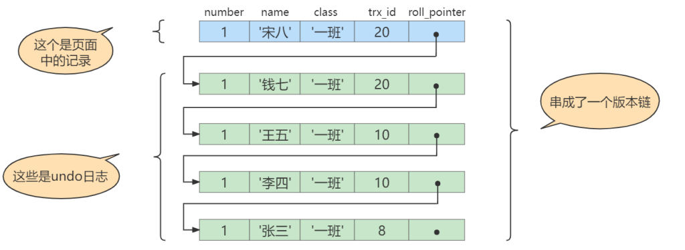

然后再到刚才使用 REPEATABLE READ 隔离级别的事务中继续查找这个 id 为 1 的记录，如下：

~~~mysql
# 使用REPEATABLE READ隔离级别的事务
BEGIN;
# SELECT1：Transaction 10、20均未提交
SELECT * FROM student WHERE id = 1; # 得到的列name的值为'张三'
# SELECT2：Transaction 10提交，Transaction 20未提交
SELECT * FROM student WHERE id = 1; # 得到的列name的值仍为'张三'
~~~

### 总结

这里介绍了 MVCC 在 READ COMMITTD 、 REPEATABLE READ 这两种隔离级别的事务在执行快照读操作时 访问记录的版本链的过程。这样使不同事务的 读-写 、 写-读 操作并发执行，从而提升系统性能。

核心点在于 ReadView 的原理， READ COMMITTD 、 REPEATABLE READ 这两个隔离级别的一个很大不同 就是生成ReadView的时机不同：

* READ COMMITTD 在每一次进行普通SELECT操作前都会生成一个ReadView 
* REPEATABLE READ 只在第一次进行普通SELECT操作前生成一个ReadView，之后的查询操作都重复 使用这个ReadView就好了

# 其他数据库日志

## MySQL支持的日志

MySQL有不同类型的日志文件，用来存储不同类型的日志，分为 二进制日志 、 错误日志 、 通用查询日志 和 慢查询日志 ，这也是常用的4种。MySQL 8又新增两种支持的日志： 中继日志 和 数据定义语句日志 。使 用这些日志文件，可以查看MySQL内部发生的事情。

这6类日志分别为：

* 慢查询日志：记录所有执行时间超过long_query_time的所有查询，方便我们对查询进行优化。 
* 通用查询日志：记录所有连接的起始时间和终止时间，以及连接发送给数据库服务器的所有指令， 对我们复原操作的实际场景、发现问题，甚至是对数据库操作的审计都有很大的帮助。 
* 错误日志：记录MySQL服务的启动、运行或停止MySQL服务时出现的问题，方便我们了解服务器的 状态，从而对服务器进行维护。 
* 二进制日志：记录所有更改数据的语句，可以用于主从服务器之间的数据同步，以及服务器遇到故 障时数据的无损失恢复。 
* 中继日志：用于主从服务器架构中，从服务器用来存放主服务器二进制日志内容的一个中间文件。 从服务器通过读取中继日志的内容，来同步主服务器上的操作。 
* 数据定义语句日志：记录数据定义语句执行的元数据操作。

除二进制日志外，其他日志都是 文本文件 。默认情况下，所有日志创建于 MySQL数据目录 中。

## 慢查询日志(slow query log)

### 开启慢查询日志参数

1. 开启slow_query_log

~~~mysql
mysql > set global slow_query_log='ON';
~~~

然后我们再来查看下慢查询日志是否开启，以及慢查询日志文件的位置：

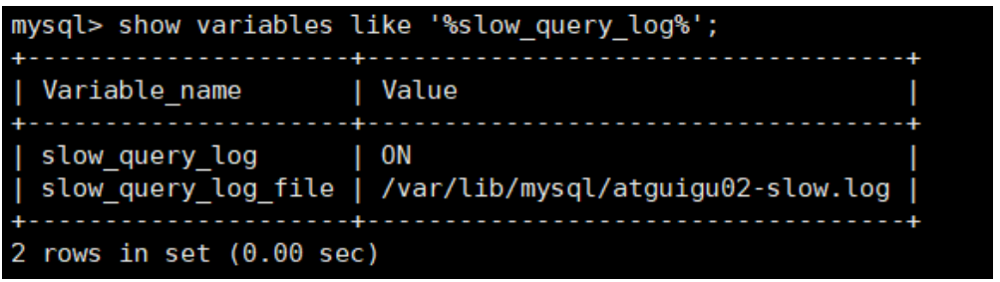

你能看到这时慢查询分析已经开启，同时文件保存在 /var/lib/mysql/atguigu02-slow.log 文件 中。

2. 修改long_query_time阈值

接下来我们来看下慢查询的时间阈值设置，使用如下命令：

~~~mysql
mysql > show variables like '%long_query_time%';
~~~

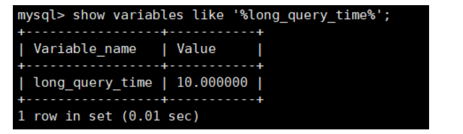

这里如果我们想把时间缩短，比如设置为 1 秒，可以这样设置：

~~~mysql
#测试发现：设置global的方式对当前session的long_query_time失效。对新连接的客户端有效。所以可以一并
执行下述语句
mysql > set global long_query_time = 1;
mysql> show global variables like '%long_query_time%';
mysql> set long_query_time=1;
mysql> show variables like '%long_query_time%';
~~~

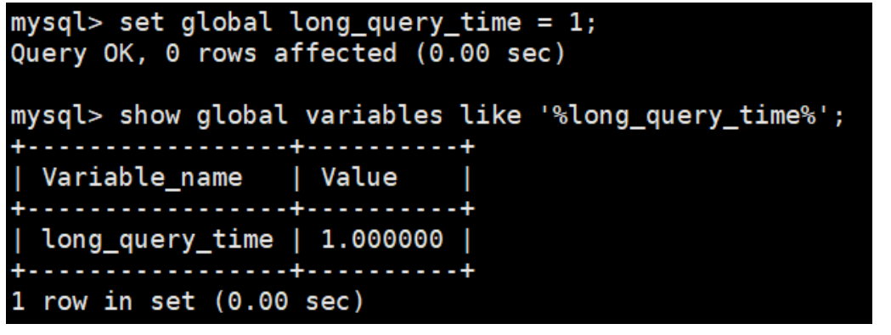

### 查看慢查询数目

查询当前系统中有多少条慢查询记录

~~~mysql
SHOW GLOBAL STATUS LIKE '%Slow_queries%';
~~~

### 慢查询日志分析工具：mysqldumpslow

在生产环境中，如果要手工分析日志，查找、分析SQL，显然是个体力活，MySQL提供了日志分析工具 mysqldumpslow 。

查看mysqldumpslow的帮助信息

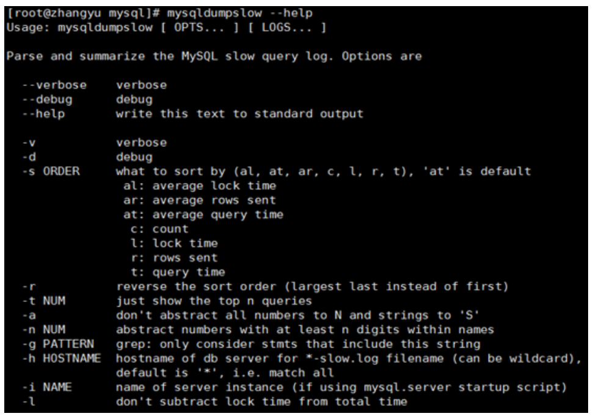

mysqldumpslow 命令的具体参数如下：

* -a: 不将数字抽象成N，字符串抽象成S 
* -s: 是表示按照何种方式排序：
  * c: 访问次数 
  * l: 锁定时间 
  * r: 返回记录 
  * t: 查询时间 
  * al:平均锁定时间 
  * ar:平均返回记录数 
  * at:平均查询时间 （默认方式） 
  * ac:平均查询次数
* -t: 即为返回前面多少条的数据；
* -g: 后边搭配一个正则匹配模式，大小写不敏感的；

**工作常用参考：**

~~~mysql
#得到返回记录集最多的10个SQL
mysqldumpslow -s r -t 10 /var/lib/mysql/atguigu-slow.log
#得到访问次数最多的10个SQL
mysqldumpslow -s c -t 10 /var/lib/mysql/atguigu-slow.log
#得到按照时间排序的前10条里面含有左连接的查询语句
mysqldumpslow -s t -t 10 -g "left join" /var/lib/mysql/atguigu-slow.log
#另外建议在使用这些命令时结合 | 和more 使用 ，否则有可能出现爆屏情况
mysqldumpslow -s r -t 10 /var/lib/mysql/atguigu-slow.log | more
~~~

### 关闭慢查询日志

方式1：永久性方式

~~~properties
[mysqld]
slow_query_log=OFF
#或者，把slow_query_log一项注释掉 或 删除
[mysqld]
#slow_query_log =OFF
~~~

重启MySQL服务，执行如下语句查询慢日志功能

~~~mysql
SHOW VARIABLES LIKE '%slow%'; #查询慢查询日志所在目录
SHOW VARIABLES LIKE '%long_query_time%'; #查询超时时长
~~~

方式2：临时性方式

使用SET语句来设置。 

（1）停止MySQL慢查询日志功能，具体SQL语句如下。

~~~mysql
SET GLOBAL slow_query_log=off
~~~

（2）重启MySQL服务，使用SHOW语句查询慢查询日志功能信息，具体SQL语句如下

~~~mysql
SHOW VARIABLES LIKE '%slow%';
#以及
SHOW VARIABLES LIKE '%long_query_time%';
~~~

## 通用查询日志(general query log)

通用查询日志用来 记录用户的所有操作 ，包括启动和关闭MySQL服务、所有用户的连接开始时间和截止 时间、发给 MySQL 数据库服务器的所有 SQL 指令等。当我们的数据发生异常时，查看通用查询日志， 还原操作时的具体场景，可以帮助我们准确定位问题。

### 查看当前状态

~~~shell
mysql> SHOW VARIABLES LIKE '%general%';
+------------------+------------------------------+
| Variable_name | Value |
+------------------+------------------------------+
| general_log | OFF 							| #通用查询日志处于关闭状态
| general_log_file | /var/lib/mysql/atguigu01.log | #通用查询日志文件的名称是atguigu01.log
+------------------+------------------------------+
2 rows in set (0.03 sec)
~~~

### 启动日志

方式1：永久性方式

修改my.cnf或者my.ini配置文件来设置。在[mysqld]组下加入log选项，并重启MySQL服务。格式如下：

~~~properties
[mysqld]
general_log=ON
general_log_file=[path[filename]] #日志文件所在目录路径，filename为日志文件名
~~~

如果不指定目录和文件名，通用查询日志将默认存储在MySQL数据目录中的hostname.log文件中， hostname表示主机名。

方式2：临时性方式

~~~mysql
SET GLOBAL general_log=on; # 开启通用查询日志
SET GLOBAL general_log_file=’path/filename’; # 设置日志文件保存位置
~~~

对应的，关闭操作SQL命令如下：

~~~mysql
SET GLOBAL general_log=off; # 关闭通用查询日志
SHOW VARIABLES LIKE 'general_log%'; # 查看设置后的状态
~~~

### 查看日志

通用查询日志是以 文本文件 的形式存储在文件系统中的，可以使用 文本编辑器 直接打开日志文件。每台 MySQL服务器的通用查询日志内容是不同的。

~~~mysql
SHOW VARIABLES LIKE 'general_log%';
~~~

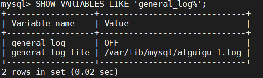

### 删除\刷新日志

如果数据的使用非常频繁，那么通用查询日志会占用服务器非常大的磁盘空间。数据管理员可以删除很 长时间之前的查询日志，以保证MySQL服务器上的硬盘空间。 **手动删除文件**

使用如下命令重新生成查询日志文件，具体命令如下。刷新MySQL数据目录，发现创建了新的日志文 件。前提一定要开启通用日志。

~~~mysql
mysqladmin -uroot -p flush-logs
~~~

## 错误日志(error log)

### 启动日志

在MySQL数据库中，错误日志功能是 默认开启 的。而且，错误日志 无法被禁止 。 默认情况下，错误日志存储在MySQL数据库的数据文件夹下，名称默认为 mysqld.log （Linux系统）或 hostname.err （mac系统）。如果需要制定文件名，则需要在my.cnf或者my.ini中做如下配置：

~~~properties
[mysqld]
log-error=[path/[filename]] #path为日志文件所在的目录路径，filename为日志文件名
~~~

### 查看日志

MySQL错误日志是以文本文件形式存储的，可以使用文本编辑器直接查看。 查询错误日志的存储路径：

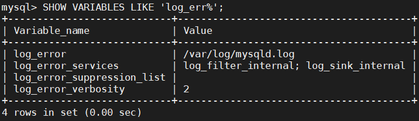

### 删除\刷新日志

对于很久以前的错误日志，数据库管理员查看这些错误日志的可能性不大，可以将这些错误日志删除， 以保证MySQL服务器上的 硬盘空间 。MySQL的错误日志是以文本文件的形式存储在文件系统中的，可以 直接删除 。

~~~sh
[root@atguigu01 log]# mysqladmin -uroot -p flush-logs
Enter password:
mysqladmin: refresh failed; error: 'Could not open file '/var/log/mysqld.log' for
error logging.'
~~~

## 二进制日志(bin log)

binlog可以说是MySQL中比较 重要 的日志了，在日常开发及运维过程中，经常会遇到。 binlog即binary log，二进制日志文件，也叫作变更日志（update log）。它记录了数据库所有执行的 DDL 和 DML 等数据库更新事件的语句，但是不包含没有修改任何数据的语句（如数据查询语句select、 show等）。

binlog主要应用场景：

* 一是用于 数据恢复 
* 二是用于 数据复制

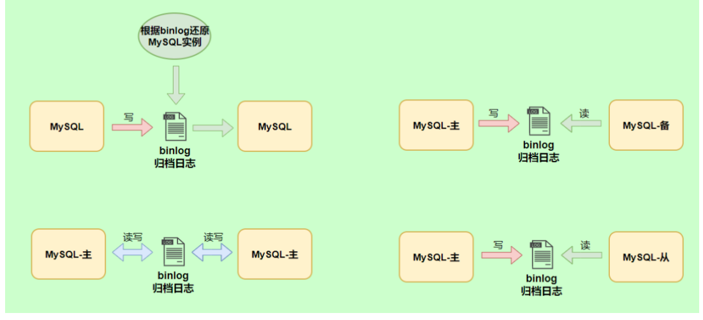

### 查看默认情况

查看记录二进制日志是否开启：在MySQL8中默认情况下，二进制文件是开启的。

~~~mysql
mysql> show variables like '%log_bin%';
+---------------------------------+----------------------------------+
| Variable_name | Value |
+---------------------------------+----------------------------------+
| log_bin | ON |
| log_bin_basename | /var/lib/mysql/binlog |
| log_bin_index | /var/lib/mysql/binlog.index |
| log_bin_trust_function_creators | OFF |
| log_bin_use_v1_row_events | OFF |
| sql_log_bin | ON |
+---------------------------------+----------------------------------+
6 rows in set (0.00 sec)
~~~

### 日志参数设置

方式1：永久性方式

~~~properties
[mysqld]
#启用二进制日志
log-bin=atguigu-bin
binlog_expire_logs_seconds=600
max_binlog_size=100M
~~~

重新启动MySQL服务，查询二进制日志的信息，执行结果：

~~~mysql
mysql> show variables like '%log_bin%';
+---------------------------------+----------------------------------+
| Variable_name 					| Value |
+---------------------------------+----------------------------------+
| log_bin 							| ON |
| log_bin_basename 					| /var/lib/mysql/atguigu-bin |
| log_bin_index 					| /var/lib/mysql/atguigu-bin.index |
| log_bin_trust_function_creators 	| OFF |
| log_bin_use_v1_row_events 		| OFF |
| sql_log_bin 						| ON |
+---------------------------------+----------------------------------+
6 rows in set (0.00 sec)
~~~

如果想改变日志文件的目录和名称，可以对my.cnf或my.ini中的log_bin参数修改如下：

~~~properties
[mysqld]
log-bin="/var/lib/mysql/binlog/atguigu-bin"
# 注意：新建的文件夹需要使用mysql用户，使用下面的命令即可。
chown -R -v mysql:mysql binlog
~~~

方式2：临时性方式

~~~mysql
# global 级别
mysql> set global sql_log_bin=0;
ERROR 1228 (HY000): Variable 'sql_log_bin' is a SESSION variable and can`t be used
with SET GLOBAL
# session级别
mysql> SET sql_log_bin=0;
Query OK, 0 rows affected (0.01 秒)
~~~

### 查看日志

查看当前的二进制日志文件列表及大小。指令如下：

~~~mysql
mysql> SHOW BINARY LOGS;
+--------------------+-----------+-----------+
| Log_name | File_size | Encrypted |
+--------------------+-----------+-----------+
| atguigu-bin.000001 | 156 | No |
+--------------------+-----------+-----------+
1 行于数据集 (0.02 秒)
~~~

binlog格式查看

~~~mysql
mysql> show variables like 'binlog_format';
+---------------+-------+
| Variable_name | Value |
+---------------+-------+
| binlog_format | ROW |
+---------------+-------+
1 行于数据集 (0.02 秒)
~~~

除此之外，binlog还有2种格式，分别是Statement和Mixed

* Statement

每一条会修改数据的sql都会记录在binlog中。 优点：不需要记录每一行的变化，减少了binlog日志量，节约了IO，提高性能。

* Row

5.1.5版本的MySQL才开始支持row level 的复制，它不记录sql语句上下文相关信息，仅保存哪条记录被修 改。 优点：row level 的日志内容会非常清楚的记录下每一行数据修改的细节。而且不会出现某些特定情况下 的存储过程，或function，以及trigger的调用和触发无法被正确复制的问题。

* Mixed

从5.1.8版本开始，MySQL提供了Mixed格式，实际上就是Statement与Row的结合。

### 使用日志恢复数据

mysqlbinlog恢复数据的语法如下：

~~~mysql
mysqlbinlog [option] filename|mysql –uuser -ppass;
~~~

这个命令可以这样理解：使用mysqlbinlog命令来读取filename中的内容，然后使用mysql命令将这些内容 恢复到数据库中。

* filename ：是日志文件名。 
* option ：可选项，比较重要的两对option参数是--start-date、--stop-date 和 --start-position、-- stop-position。
  * --start-date 和 --stop-date ：可以指定恢复数据库的起始时间点和结束时间点。 
  * --start-position和--stop-position ：可以指定恢复数据的开始位置和结束位置。

> 注意：使用mysqlbinlog命令进行恢复操作时，必须是编号小的先恢复，例如atguigu-bin.000001必 须在atguigu-bin.000002之前恢复。

### 删除二进制日志

MySQL的二进制文件可以配置自动删除，同时MySQL也提供了安全的手动删除二进制文件的方法。 PURGE MASTER LOGS 只删除指定部分的二进制日志文件， RESET MASTER 删除所有的二进制日志文 件。具体如下：

PURGE MASTER LOGS：删除指定日志文件

~~~mysql
PURGE {MASTER | BINARY} LOGS TO ‘指定日志文件名’
PURGE {MASTER | BINARY} LOGS BEFORE ‘指定日期’
~~~

## 再谈二进制日志(binlog)

### 写入机制

binlog的写入时机也非常简单，事务执行过程中，先把日志写到 binlog cache ，事务提交的时候，再 把binlog cache写到binlog文件中。因为一个事务的binlog不能被拆开，无论这个事务多大，也要确保一 次性写入，所以系统会给每个线程分配一个块内存作为binlog cache。

write和fsync的时机，可以由参数 sync_binlog 控制，默认是 0 。为0的时候，表示每次提交事务都只 write，由系统自行判断什么时候执行fsync。虽然性能得到提升，但是机器宕机，page cache里面的 binglog 会丢失。如下图：

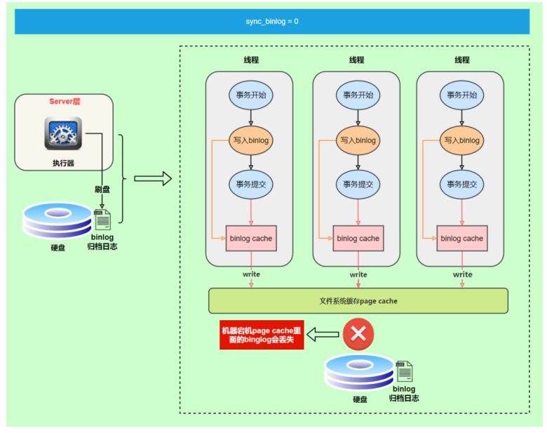

为了安全起见，可以设置为 1 ，表示每次提交事务都会执行fsync，就如同redo log 刷盘流程一样。 最后还有一种折中方式，可以设置为N(N>1)，表示每次提交事务都write，但累积N个事务后才fsync。

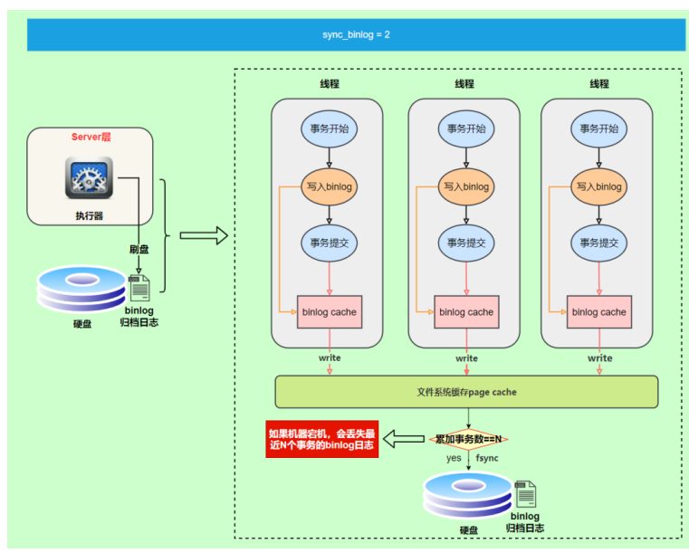

在出现IO瓶颈的场景里，将sync_binlog设置成一个比较大的值，可以提升性能。同样的，如果机器宕 机，会丢失最近N个事务的binlog日志。

### binlog与redolog对比

* redo log 它是 <u>物理日志</u> ，记录内容是“在某个数据页上做了什么修改”，属于 InnoDB 存储引擎层产生 的。 
* 而 binlog 是 <u>逻辑日志</u> ，记录内容是语句的原始逻辑，类似于“给 ID=2 这一行的 c 字段加 1”，属于 MySQL Server 层。

### 两阶段提交

在执行更新语句过程，会记录redo log与binlog两块日志，以基本的事务为单位，redo log在事务执行过程 中可以不断写入，而binlog只有在提交事务时才写入，所以redo log与binlog的 写入时机 不一样。

redo log与binlog两份日志之间的逻辑不一致，会出现什么问题？

由于binlog没写完就异常，这时候binlog里面没有对应的修改记录。

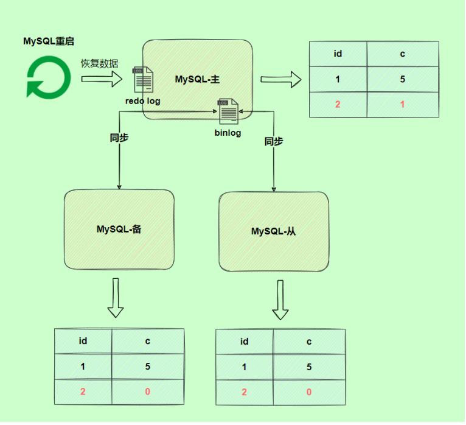

为了解决两份日志之间的逻辑一致问题，InnoDB存储引擎使用两阶段提交方案。

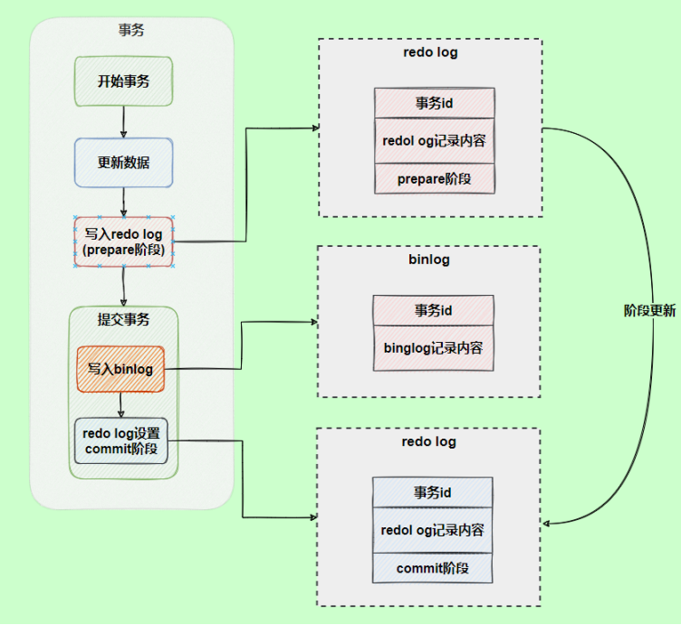

使用两阶段提交后，写入binlog时发生异常也不会有影响

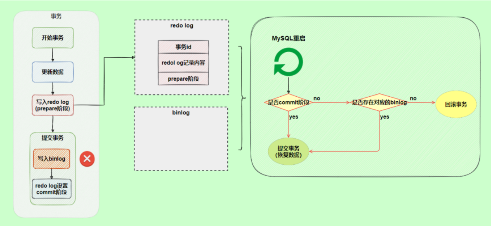

另一个场景，redo log设置commit阶段发生异常，那会不会回滚事务呢？

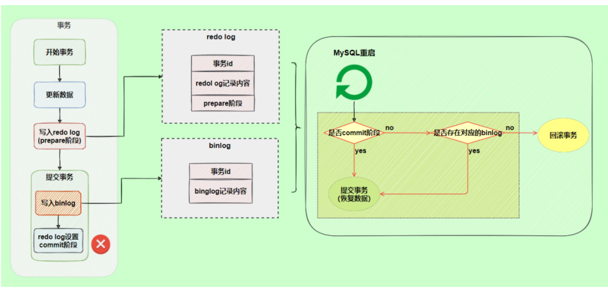

并不会回滚事务，它会执行上图框住的逻辑，虽然redo log是处于prepare阶段，但是能通过事务id找到对 应的binlog日志，所以MySQL认为是完整的，就会提交事务恢复数据。

## 中继日志(relay log)

**中继日志只在主从服务器架构的从服务器上存在**。从服务器为了与主服务器保持一致，要从主服务器读 取二进制日志的内容，并且把读取到的信息写入 本地的日志文件 中，这个从服务器本地的日志文件就叫 中继日志 。然后，从服务器读取中继日志，并根据中继日志的内容对从服务器的数据进行更新，完成主 从服务器的 数据同步 。

文件名的格式是： 从服务器名 -relay-bin.序号 。中继日志还有一个索引文件： 从服务器名 -relaybin.index ，用来定位当前正在使用的中继日志。

# 主从复制

## 主从复制概述

此外，一般应用对数据库而言都是“ 读多写少 ”，也就说对数据库读取数据的压力比较大，有一个思路就 是采用数据库集群的方案，做 主从架构 、进行 读写分离 ，这样同样可以提升数据库的并发处理能力。但 并不是所有的应用都需要对数据库进行主从架构的设置，毕竟设置架构本身是有成本的。 如果我们的目的在于提升数据库高并发访问的效率，那么首先考虑的是如何 优化SQL和索引 ，这种方式 简单有效；其次才是采用 缓存的策略 ，比如使用 Redis将热点数据保存在内存数据库中，提升读取的效 率；最后才是对数据库采用 主从架构 ，进行读写分离。

## 主从复制的作用

**第1个作用：读写分离**

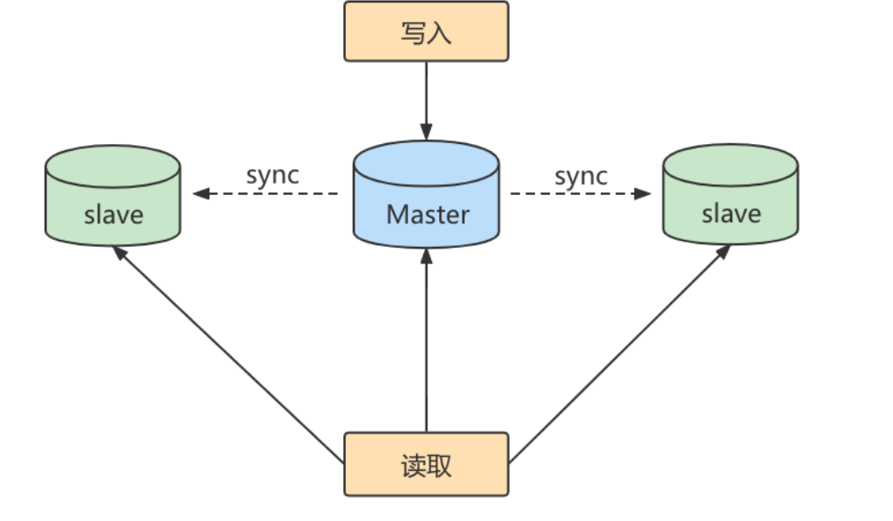

**第2个作用就是数据备份。** 

**第3个作用是具有高可用性。**

## 主从复制的原理

Slave 会从 Master 读取 binlog 来进行数据同步。

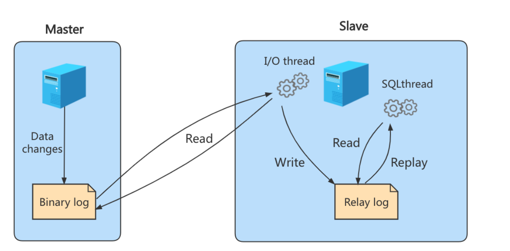

复制三步骤 

步骤1： Master 将写操作记录到二进制日志（ binlog ）。 

步骤2： Slave 将 Master 的binary log events拷贝到它的中继日志（ relay log ）； 

步骤3： Slave 重做中继日志中的事件，将改变应用到自己的数据库中。 MySQL复制是异步的且串行化 的，而且重启后从 接入点 开始复制。

> 复制的最大问题： 延时

**复制的基本原则**

* 每个 Slave 只有一个 Master 
* 每个 Slave 只能有一个唯一的服务器ID 
* 每个 Master 可以有多个 Slave

## 同步数据一致性问题

**主从同步的要求：** 

* 读库和写库的数据一致(最终一致)； 

* 写数据必须写到写库； 

* 读数据必须到读库(不一定)；

**主从延迟问题:**

进行主从同步的内容是二进制日志，它是一个文件，在进行 网络传输 的过程中就一定会 存在主从延迟 （比如 500ms），这样就可能造成用户在从库上读取的数据不是最新的数据，也就是主从同步中的 数据 不一致性 问题。

**主从延迟问题原因:**

在网络正常的时候，日志从主库传给从库所需的时间是很短的，即T2-T1的值是非常小的。即，网络正常 情况下，主备延迟的主要来源是备库接收完binlog和执行完这个事务之间的时间差。

主备延迟最直接的表现是，从库消费中继日志（relay log）的速度，比主库生产binlog的速度要慢。造 成原因：

1、从库的机器性能比主库要差 

2、从库的压力大 

3、大事务的执行

**如何减少主从延迟**:

若想要减少主从延迟的时间，可以采取下面的办法： 

1. 降低多线程大事务并发的概率，优化业务逻辑 
2. 优化SQL，避免慢SQL， 减少批量操作 ，建议写脚本以update-sleep这样的形式完成。 
3. 提高从库机器的配置 ，减少主库写binlog和从库读binlog的效率差。 
4. 尽量采用 短的链路 ，也就是主库和从库服务器的距离尽量要短，提升端口带宽，减少binlog传输 的网络延时。
5. 实时性要求的业务读强制走主库，从库只做灾备，备份。

**如何解决一致性问题:**

如果操作的数据存储在同一个数据库中，那么对数据进行更新的时候，可以对记录加写锁，这样在读取 的时候就不会发生数据不一致的情况。但这时从库的作用就是 备份 ，并没有起到 读写分离 ，分担主库 读压力 的作用。

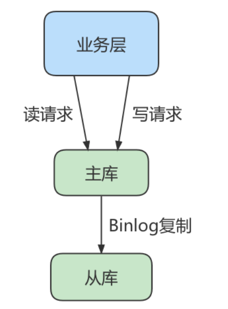

读写分离情况下，解决主从同步中数据不一致的问题， 就是解决主从之间 数据复制方式 的问题，如果按 照数据一致性 从弱到强 来进行划分，有以下 3 种复制方式。

**方法 1：异步复制**

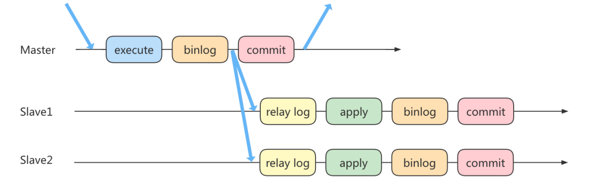

**方法 2：半同步复制**

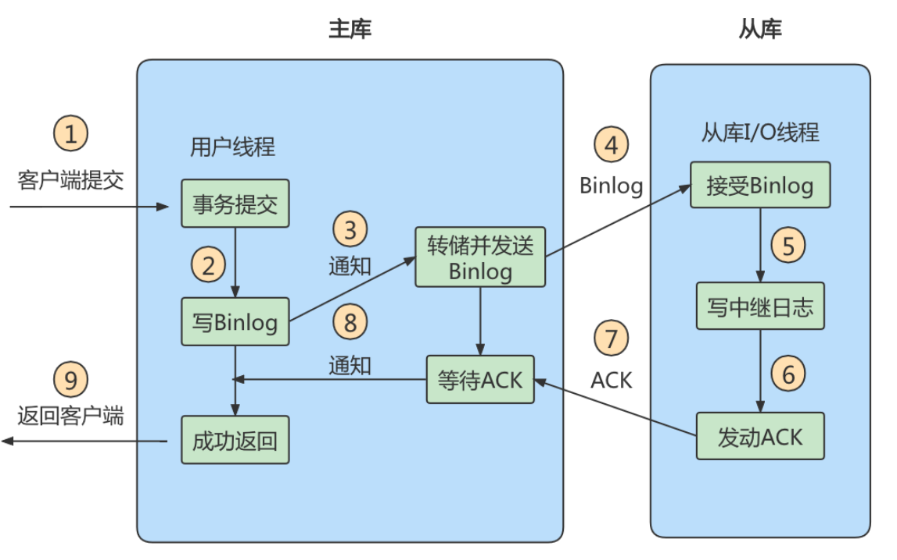

**方法 3：组复制**

异步复制和半同步复制都无法最终保证数据的一致性问题，半同步复制是通过判断从库响应的个数来决 定是否返回给客户端，虽然数据一致性相比于异步复制有提升，但仍然无法满足对数据一致性要求高的 场景，比如金融领域。MGR 很好地弥补了这两种复制模式的不足。 组复制技术，简称 MGR（MySQL Group Replication）。是 MySQL 在 5.7.17 版本中推出的一种新的数据复 制技术，这种复制技术是基于 Paxos 协议的状态机复制。

MGR 是如何工作的:

首先我们将多个节点共同组成一个复制组，在 执行读写（RW）事务 的时候，需要通过一致性协议层 （Consensus 层）的同意，也就是读写事务想要进行提交，必须要经过组里“大多数人”（对应 Node 节 点）的同意，大多数指的是同意的节点数量需要大于 （N/2+1），这样才可以进行提交，而不是原发起 方一个说了算。而针对 只读（RO）事务 则不需要经过组内同意，直接 COMMIT 即可。

在一个复制组内有多个节点组成，它们各自维护了自己的数据副本，并且在一致性协议层实现了原子消 息和全局有序消息，从而保证组内数据的一致性。

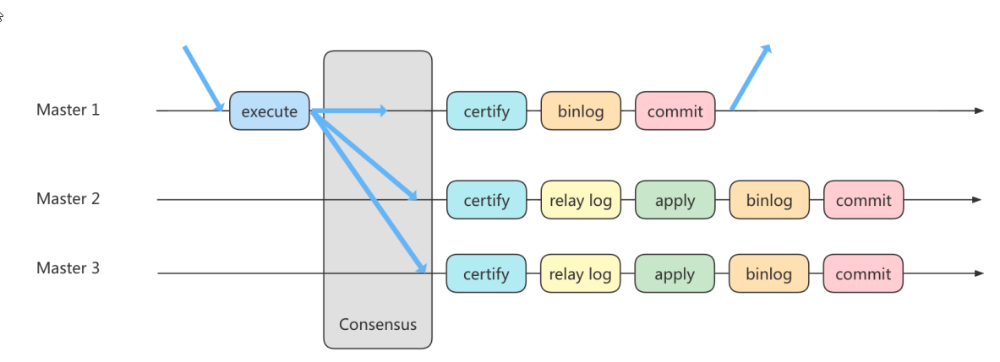

MGR 将 MySQL 带入了数据强一致性的时代，是一个划时代的创新，其中一个重要的原因就是MGR 是基 于 Paxos 协议的。Paxos 算法是由 2013 年的图灵奖获得者 Leslie Lamport 于 1990 年提出的，有关这个算 法的决策机制可以搜一下。事实上，Paxos 算法提出来之后就作为 分布式一致性算法 被广泛应用，比如 Apache 的 ZooKeeper 也是基于 Paxos 实现的。

# 数据库备份与恢复

## 物理备份与逻辑备份

物理备份：备份数据文件，转储数据库物理文件到某一目录。物理备份恢复速度比较快，但占用空间比 较大，MySQL中可以用 xtrabackup 工具来进行物理备份。 

逻辑备份：对数据库对象利用工具进行导出工作，汇总入备份文件内。逻辑备份恢复速度慢，但占用空 间小，更灵活。MySQL 中常用的逻辑备份工具为 mysqldump 。逻辑备份就是 备份sql语句 ，在恢复的 时候执行备份的sql语句实现数据库数据的重现。

### mysqldump实现逻辑备份

**备份一个数据库**

~~~shell
mysqldump –u 用户名称 –h 主机名称 –p密码 待备份的数据库名称[tbname, [tbname...]]> 备份文件名
称.sql
~~~

> 说明： 备份的文件并非一定要求后缀名为.sql，例如后缀名为.txt的文件也是可以的。

举例：使用root用户备份atguigu数据库：

~~~mysql
mysqldump -uroot -p atguigu>atguigu.sql #备份文件存储在当前目录下
mysqldump -uroot -p atguigudb1 > /var/lib/mysql/atguigu.sql
~~~

**备份全部数据库**

若想用mysqldump备份整个实例，可以使用 --all-databases 或 -A 参数：

~~~mysql
mysqldump -uroot -pxxxxxx --all-databases > all_database.sql
mysqldump -uroot -pxxxxxx -A > all_database.sql
~~~

**备份部分数据库**

使用 --databases 或 -B 参数了，该参数后面跟数据库名称，多个数据库间用空格隔开。如果指定 databases参数，备份文件中会存在创建数据库的语句，如果不指定参数，则不存在。语法如下：

~~~mysql
mysqldump –u user –h host –p --databases [数据库的名称1 [数据库的名称2...]] > 备份文件名
称.sql
~~~

举例：

~~~mysql
mysqldump -uroot -p --databases atguigu atguigu12 >two_database.sql
#或者
mysqldump -uroot -p -B atguigu atguigu12 > two_database.sql
~~~

 **备份部分表**

比如，在表变更前做个备份。语法如下：

~~~mysql
mysqldump –u user –h host –p 数据库的名称 [表名1 [表名2...]] > 备份文件名称.sql
~~~

举例：备份atguigu数据库下的book表

~~~mysql
mysqldump -uroot -p atguigu book> book.sql
~~~

可以看到，book文件和备份的库文件类似。不同的是，book文件只包含book表的DROP、CREATE和 INSERT语句。

备份多张表使用下面的命令，比如备份book和account表：

~~~mysql
#备份多张表
mysqldump -uroot -p atguigu book account > 2_tables_bak.sql
~~~

**备份单表的部分数据**

有些时候一张表的数据量很大，我们只需要部分数据。这时就可以使用 --where 选项了。where后面附 带需要满足的条件。

举例：备份student表中id小于10的数据：

~~~mysql
mysqldump -uroot -p atguigu student --where="id < 10 " > student_part_id10_low_bak.sql
~~~

**只备份结构或只备份数据**

只备份结构的话可以使用 --no-data 简写为 -d 选项；只备份数据可以使用 --no-create-info 简写为 -t 选项

* 只备份结构

~~~mysql
mysqldump -uroot -p atguigu --no-data > atguigu_no_data_bak.sql
#使用grep命令，没有找到insert相关语句，表示没有数据备份。
[root@node1 ~]# grep "INSERT" atguigu_no_data_bak.sql
~~~

* 只备份数据

~~~mysql
mysqldump -uroot -p atguigu --no-create-info > atguigu_no_create_info_bak.sql
#使用grep命令，没有找到create相关语句，表示没有数据结构。
[root@node1 ~]# grep "CREATE" atguigu_no_create_info_bak.sql
~~~

**备份中包含存储过程、函数、事件**

mysqldump备份默认是不包含存储过程，自定义函数及事件的。可以使用 --routines 或 -R 选项来备 份存储过程及函数，使用 --events 或 -E 参数来备份事件。

举例：备份整个atguigu库，包含存储过程及事件：

* 使用下面的SQL可以查看当前库有哪些存储过程或者函数

~~~mysql
mysql> SELECT SPECIFIC_NAME,ROUTINE_TYPE ,ROUTINE_SCHEMA FROM information_schema.Routines WHERE ROUTINE_SCHEMA="atguigudb1";
~~~

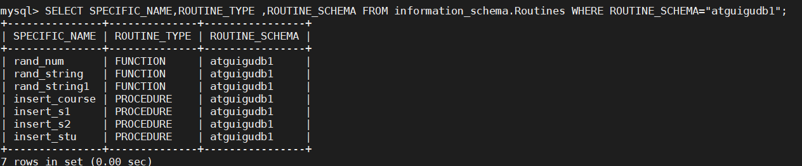

~~~mysql
mysqldump -uroot -p -R -E --databases atguigu > fun_atguigu_bak.sql
~~~

## mysql命令恢复数据

基本语法：

~~~mysql
mysql –u root –p [dbname] < backup.sql
~~~

**单库备份中恢复单库**

使用root用户，将之前练习中备份的atguigu.sql文件中的备份导入数据库中，命令如下： 如果备份文件中包含了创建数据库的语句，则恢复的时候不需要指定数据库名称，如下所示

~~~mysql
mysql -uroot -p < atguigu.sql
~~~

否则需要指定数据库名称，如下所示

~~~mysql
mysql -uroot -p atguigu4< atguigu.sql
~~~

**全量备份恢复**

如果我们现在有昨天的全量备份，现在想整个恢复，则可以这样操作：

~~~mysql
mysql –u root –p < all.sql
mysql -uroot -pxxxxxx < all.sql
~~~

**从全量备份中恢复单库**

可能有这样的需求，比如说我们只想恢复某一个库，但是我们有的是整个实例的备份，这个时候我们可 以从全量备份中分离出单个库的备份。

举例：

~~~mysql
sed -n '/^-- Current Database: `atguigu`/,/^-- Current Database: `/p' all_database.sql
> atguigu.sql
#分离完成后我们再导入atguigu.sql即可恢复单个库
~~~

##  表的导出与导入

### 表的导出

**使用SELECT…INTO OUTFILE导出文本文件**

举例：使用SELECT…INTO OUTFILE将atguigu数据库中account表中的记录导出到文本文件。 

（1）选择数 据库atguigu，并查询account表，执行结果如下所示。

~~~mysql
use atguigu;
select * from account;
mysql> select * from account;
+----+--------+---------+
| id | name | balance |
+----+--------+---------+
| 1 | 张三 | 90 |
| 2 | 李四 | 100 |
| 3 | 王五 | 0 |
+----+--------+---------+
3 rows in set (0.01 sec)
~~~

（2）mysql默认对导出的目录有权限限制，也就是说使用命令行进行导出的时候，需要指定目录进行操 作。

 查询secure_file_priv值：

~~~mysql
mysql> SHOW GLOBAL VARIABLES LIKE '%secure%';
+--------------------------+-----------------------+
| Variable_name | Value |
+--------------------------+-----------------------+
| require_secure_transport | OFF |
| secure_file_priv | /var/lib/mysql-files/ |
+--------------------------+-----------------------+
2 rows in set (0.02 sec)
~~~

（3）上面结果中显示，secure_file_priv变量的值为/var/lib/mysql-files/，导出目录设置为该目录，SQL语 句如下。

~~~mysql
SELECT * FROM account INTO OUTFILE "/var/lib/mysql-files/account.txt";
~~~

（4）查看 /var/lib/mysql-files/account.txt`文件。

~~~
1 张三 90
2 李四 100
3 王五 0
~~~

### 表的导入

**使用LOAD DATA INFILE方式导入文本文件**

举例：

使用SELECT...INTO OUTFILE将atguigu数据库中account表的记录导出到文本文件

~~~mysql
SELECT * FROM atguigu.account INTO OUTFILE '/var/lib/mysql-files/account_0.txt';
~~~

删除account表中的数据：

~~~mysql
DELETE FROM atguigu.account;
~~~

从文本文件account.txt中恢复数据：

~~~mysql
LOAD DATA INFILE '/var/lib/mysql-files/account_0.txt' INTO TABLE atguigu.account;
~~~

查询account表中的数据：

~~~mysql
mysql> select * from account;
+----+--------+---------+
| id | name | balance |
+----+--------+---------+
| 1 | 张三 | 90 |
| 2 | 李四 | 100 |
| 3 | 王五 | 0 |
+----+--------+---------+
3 rows in set (0.00 sec)
~~~

# MySQL常用命令

##  mysql

该mysql不是指mysql服务，而是指mysql的客户端工具。

**连接选项**

~~~mysql
#参数 ：
-u, --user=name 指定用户名
-p, --password[=name] 指定密码
-h, --host=name 指定服务器IP或域名
-P, --port=# 指定连接端口
#示例 ：
mysql -h 127.0.0.1 -P 3306 -u root -p
mysql -h127.0.0.1 -P3306 -uroot -p密码
~~~

**执行选项**

~~~mysql
-e, --execute=name 执行SQL语句并退出
~~~

此选项可以在Mysql客户端执行SQL语句，而不用连接到MySQL数据库再执行，对于一些批处理脚本，这 种方式尤其方便。

~~~mysql
#示例：
mysql -uroot -p db01 -e "select * from tb_book";
~~~

## mysqladmin

mysqladmin 是一个执行管理操作的客户端程序。可以用它来检查服务器的配置和当前状态、创建并删除 数据库等。

可以通过 ： mysqladmin --help 指令查看帮助文档

~~~mysql
#示例 ：
mysqladmin -uroot -p create 'test01';
mysqladmin -uroot -p drop 'test01';
mysqladmin -uroot -p version;
~~~

## mysqlbinlog

由于服务器生成的二进制日志文件以二进制格式保存，所以如果想要检查这些文本的文本格式，就会使 用到mysqlbinlog 日志管理工具。

语法 ：

~~~mysql
mysqlbinlog [options] log-files1 log-files2 ...
#选项：
-d, --database=name : 指定数据库名称，只列出指定的数据库相关操作。
-o, --offset=# : 忽略掉日志中的前n行命令。
-r,--result-file=name : 将输出的文本格式日志输出到指定文件。
-s, --short-form : 显示简单格式， 省略掉一些信息。
--start-datatime=date1 --stop-datetime=date2 : 指定日期间隔内的所有日志。
--start-position=pos1 --stop-position=pos2 : 指定位置间隔内的所有日志。	
~~~

## mysqldump

mysqldump 客户端工具用来备份数据库或在不同数据库之间进行数据迁移。备份内容包含创建表，及插 入表的SQL语句。

语法 ：

~~~mysql
mysqldump [options] db_name [tables]
mysqldump [options] --database/-B db1 [db2 db3...]
mysqldump [options] --all-databases/-A
~~~

**连接选项**

~~~mysql
#参数 ：
-u, --user=name 指定用户名
-p, --password[=name] 指定密码
-h, --host=name 指定服务器IP或域名
-P, --port=# 指定连接端口

~~~

**输出内容选项**

~~~mysql
#参数：
--add-drop-database 在每个数据库创建语句前加上 Drop database 语句
--add-drop-table 在每个表创建语句前加上 Drop table 语句 , 默认开启 ; 不开启 (--
skip-add-drop-table)
-n, --no-create-db 不包含数据库的创建语句
-t, --no-create-info 不包含数据表的创建语句
-d --no-data 不包含数据
-T, --tab=name 自动生成两个文件：一个.sql文件，创建表结构的语句；
一个.txt文件，数据文件，相当于select into outfile
#示例 ：
mysqldump -uroot -p db01 tb_book --add-drop-database --add-drop-table > a
mysqldump -uroot -p -T /tmp test city
~~~

## mysqlimport/source

mysqlimport 是客户端数据导入工具，用来导入mysqldump 加 -T 参数后导出的文本文件。

语法：

~~~mysql
mysqlimport [options] db_name textfile1 [textfile2...]
~~~

实例：

~~~mysql
mysqlimport -uroot -p test /tmp/city.txt
# 如果需要导入sql文件,可以使用mysql中的source 指令 
source /root/tb_book.sql
~~~

## mysqlshow

mysqlshow 客户端对象查找工具，用来很快地查找存在哪些数据库、数据库中的表、表中的列或者索 引。

语法：

~~~mysql
mysqlshow [options] [db_name [table_name [col_name]]]
#参数
--count 显示数据库及表的统计信息（数据库，表 均可以不指定）
-i 显示指定数据库或者指定表的状态信息
~~~

示例：

~~~mysql
#查询每个数据库的表的数量及表中记录的数量
mysqlshow -uroot -p --count
[root@node1 atguigu2]# mysqlshow -uroot -p --count
Enter password:
+--------------------+--------+--------------+
| Databases | Tables | Total Rows |
+--------------------+--------+--------------+
| atguigu | 24 | 30107483 |
| atguigu12 | 1 | 1 |
| atguigu14 | 6 | 14 |
| atguigu17 | 1 | 1 |
| atguigu18 | 0 | 0 |
| atguigu2 | 1 | 3 |
| atguigu_myisam | 1 | 4 |
| information_schema | 79 | 34034 |
| mysql | 38 | 4029 |
| performance_schema | 110 | 399957 |
| sys | 101 | 7028 |
+--------------------+--------+--------------+
11 rows in set.
#查询test库中每个表中的字段书，及行数
mysqlshow -uroot -p atguigu --count
[root@node1 atguigu2]# mysqlshow -uroot -p atguigu --count
Enter password:
Database: atguigu
+------------+----------+------------+
| Tables | Columns | Total Rows |
+------------+----------+------------+
| account | 3 | 3 |
| book | 3 | 100 |
| dept | 3 | 3 |
| emp | 8 | 10 |
| order1 | 2 | 5715448 |
| order2 | 2 | 8000327 |
| order_test | 2 | 8000327 |
| salgrade | 3 | 0 |
| stu2 | 6 | 5 |
| student | 5 | 8100010 |
| t1 | 3 | 210000 |
| t_class | 3 | 0 |
| test | 2 | 0 |
| test_frm | 2 | 0 |
| test_paper | 1 | 0 |
| ts1 | 2 | 79999 |
| type | 2 | 240 |
| undo_demo | 3 | 1 |
| user | 1 | 1 |
| user1 | 4 | 1000 |
+------------+----------+------------+
20 rows in set.
#查询test库中book表的详细情况
mysqlshow -uroot -p atguigu book --count
[root@node1 atguigu2]# mysqlshow -uroot -p atguigu book --count
Enter password:
Database: atguigu Table: book Rows: 100
+--------+--------------+-----------+------+-----+---------+----------------+---------
------------------------+---------+
| Field | Type | Collation | Null | Key | Default | Extra |
Privileges | Comment |
+--------+--------------+-----------+------+-----+---------+----------------+---------
------------------------+---------+
| bookid | int unsigned | | NO | PRI | | auto_increment |
select,insert,update,references | |
| card | int unsigned | | NO | MUL | | |
select,insert,update,references | |
| test | varchar(255) | utf8_bin | YES | | | |
select,insert,update,references | |
+--------+--------------+-----------+------+-----+---------+----------------+---------
------------------------+---------
~~~
