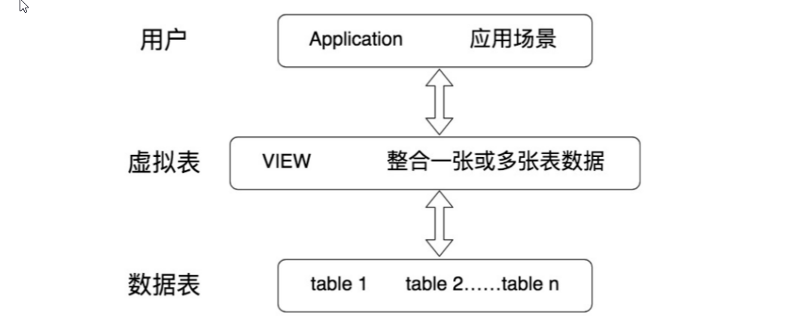

# 常见的数据库对象

| 对象                 | 描述                                                         |
| -------------------- | ------------------------------------------------------------ |
| 表（TABLE）          | 表是存储数据的逻辑单元，以行和列的形式存在，列就是字段，行就是记录 |
| 数据字典             | 就是系统表，存放数据库相关信息的表。系统表的数据通常由数据库系统维护， 程序员通常不应该修改，只可查看 |
| 约束 (CONSTRAINT)    | 执行数据校验的规则，用于保证数据完整性的规则                 |
| 视图(VIEW)           | 一个或者多个数据表里的数据的逻辑显示，视图并不存储数据       |
| 索引(INDEX)          | 用于提高查询性能，相当于书的目录                             |
| 存储过程 (PROCEDURE) | 用于完成一次完整的业务处理，没有返回值，但可通过传出参数将多个值传给调用环境 |
| 存储函数 (FUNCTION)  | 用于完成一次特定的计算，具有一个返回值                       |
| 触发器 (TRIGGER)     | 相当于一个事件监听器，当数据库发生特定事件后，触发器被触发，完成相应的 处理 |

# 视图

## 为什么使用视图？

视图一方面可以帮我们使用表的一部分而不是所有的表，另一方面也可以针对不同的用户制定不同的查 询视图。

比如，针对一个公司的销售人员，我们只想给他看部分数据，而某些特殊的数据，比如采购的 价格，则不会提供给他。

再比如，人员薪酬是个敏感的字段，那么只给某个级别以上的人员开放，其他 人的查询视图中则不提供这个字段。

## 视图的理解 

* 视图是一种 虚拟表 ，本身是 不具有数据 的，占用很少的内存空间，它是 SQL 中的一个重要概念。

* 视图建立在已有表的基础上, 视图赖以建立的这些表称为基表。

* 视图的创建和删除只影响视图本身，不影响对应的基表。但是当对视图中的数据进行增加、删除和 修改操作时，数据表中的数据会相应地发生变化，反之亦然。

* 视图，是向用户提供基表数据的另一种表现形式。通常情况下，小型项目的数据库可以不使用视 图，但是在大型项目中，以及数据表比较复杂的情况下，视图的价值就凸显出来了，它可以帮助我 们把经常查询的结果集放到虚拟表中，提升使用效率。理解和使用起来都非常方便。

## 视图的创建

### 基本视图

~~~mysql
CREATE [OR REPLACE]
[ALGORITHM = {UNDEFINED | MERGE | TEMPTABLE}]
VIEW 视图名称 [(字段列表)]
AS 查询语句
[WITH [CASCADED|LOCAL] CHECK OPTION]
~~~

举例

~~~mysql
CREATE VIEW empvu80
AS
SELECT employee_id, last_name, salary
FROM employees
WHERE department_id = 80;
~~~

### 多表联合视图

举例：

~~~mysql
CREATE VIEW empview
AS
SELECT employee_id emp_id,last_name NAME,department_name
FROM employees e,departments d
WHERE e.department_id = d.department_id;
~~~

* 利用视图对数据进行格式化

我们经常需要输出某个格式的内容，比如我们想输出员工姓名和对应的部门名，对应格式为 emp_name(department_name)，就可以使用视图来完成数据格式化的操作：

~~~mysql
CREATE VIEW emp_depart
AS
# concat连接参数
SELECT CONCAT(last_name,'(',department_name,')') AS emp_dept 
FROM employees e JOIN departments d
WHERE e.department_id = d.department_id
~~~

## 更新视图的数据

MySQL支持使用INSERT、UPDATE和DELETE语句对视图中的数据进行插入、更新和删除操作。当视图中的 数据发生变化时，数据表中的数据也会发生变化，反之亦然。

举例：UPDATE操作

~~~shell
# 视图 emp_tel
mysql> SELECT ename,tel FROM emp_tel WHERE ename = '孙洪亮';
+---------+-------------+
| ename | tel |
+---------+-------------+
| 孙洪亮 | 13789098765 |
+---------+-------------+
1 row in set (0.01 sec)
mysql> UPDATE emp_tel SET tel = '13789091234' WHERE ename = '孙洪亮';
Query OK, 1 row affected (0.01 sec)
Rows matched: 1 Changed: 1 Warnings: 0
+---------+-------------+
| ename | tel |
+---------+-------------+
| 孙洪亮 | 13789091234 |
+---------+-------------+
1 row in set (0.00 sec)
# 表 t_employee
mysql> SELECT ename,tel FROM t_employee WHERE ename = '孙洪亮';
+---------+-------------+
| ename | tel |
+---------+-------------+
| 孙洪亮 | 13789091234 |
+---------+-------------+
1 row in set (0.00 sec)
~~~

## 不可更新的视图

要使视图可更新，视图中的行和底层基本表中的行之间必须存在 一对一 的关系。另外当视图定义出现如 下情况时，视图不支持更新操作：

* 在定义视图的时候指定了“ALGORITHM = TEMPTABLE”，视图将不支持INSERT和DELETE操作；
* 视图中不包含基表中所有被定义为非空又未指定默认值的列，视图将不支持INSERT操作；
* 在定义视图的SELECT语句中使用了 JOIN联合查询 ，视图将不支持INSERT和DELETE操作；
* 在定义视图的SELECT语句后的字段列表中使用了 数学表达式 或 子查询 ，视图将不支持INSERT，也 不支持UPDATE使用了数学表达式、子查询的字段值；
* 在定义视图的SELECT语句后的字段列表中使用 DISTINCT 、 聚合函数 、 GROUP BY 、 HAVING 、 UNION 等，视图将不支持INSERT、UPDATE、DELETE；
* 在定义视图的SELECT语句中包含了子查询，而子查询中引用了FROM后面的表，视图将不支持 INSERT、UPDATE、DELETE；
* 视图定义基于一个 不可更新视图 ；
* 常量视图。

举例：

~~~shell
mysql> CREATE OR REPLACE VIEW emp_dept
-> (ename,salary,birthday,tel,email,hiredate,dname)
-> AS SELECT ename,salary,birthday,tel,email,hiredate,dname
-> FROM t_employee INNER JOIN t_department
-> ON t_employee.did = t_department.did ;
Query OK, 0 rows affected (0.01 sec)
mysql> INSERT INTO emp_dept(ename,salary,birthday,tel,email,hiredate,dname)
-> VALUES('张三',15000,'1995-01-08','18201587896',
-> 'zs@atguigu.com','2022-02-14','新部门');
#ERROR 1393 (HY000): Can not modify more than one base table through a join view 'atguigu_chapter9.emp_dept'
~~~

从上面的SQL执行结果可以看出，在定义视图的SELECT语句中使用了JOIN联合查询，视图将不支持更新 操作。

> 虽然可以更新视图数据，但总的来说，视图作为 虚拟表 ，主要用于 方便查询 ，不建议更新视图的 数据。对视图数据的更改，都是通过对实际数据表里数据的操作来完成的。

## 修改、删除视图

### 修改视图

使用CREATE OR REPLACE VIEW 子句修改视图

~~~mysql
CREATE OR REPLACE VIEW empvu80
(id_number, name, sal, department_id)
AS
SELECT employee_id, first_name || ' ' || last_name, salary, department_id
FROM employees
WHERE department_id = 80;
~~~

### 删除视图

* 删除视图只是删除视图的定义，并不会删除基表的数据。 
* 删除视图的语法是：

~~~mysql
DROP VIEW IF EXISTS 视图名称;
~~~

> 说明：基于视图a、b创建了新的视图c，如果将视图a或者视图b删除，会导致视图c的查询失败。这 样的视图c需要手动删除或修改，否则影响使用。

## 总结

视图的优点

1. 操作简单

将经常使用的查询操作定义为视图，可以使开发人员不需要关心视图对应的数据表的结构、表与表之间 的关联关系，也不需要关心数据表之间的业务逻辑和查询条件，而只需要简单地操作视图即可，极大简 化了开发人员对数据库的操作。

2. 减少数据冗余

视图跟实际数据表不一样，它存储的是查询语句。所以，在使用的时候，我们要通过定义视图的查询语 句来获取结果集。而视图本身不存储数据，不占用数据存储的资源，减少了数据冗余。

3. 数据安全

MySQL将用户对数据的 访问限制 在某些数据的结果集上，而这些数据的结果集可以使用视图来实现。用 户不必直接查询或操作数据表。这也可以理解为视图具有 隔离性 。视图相当于在用户和实际的数据表之 间加了一层虚拟表。

# 存储过程与函数

## 存储过程的理解

含义：存储过程的英文是 Stored Procedure 。它的思想很简单，就是一组经过 预先编译 的 SQL 语句 的封装。

执行过程：存储过程预先存储在 MySQL 服务器上，需要执行的时候，客户端只需要向服务器端发出调用 存储过程的命令，服务器端就可以把预先存储好的这一系列 SQL 语句全部执行。

## 存储过程的创建

~~~mysql
CREATE PROCEDURE 存储过程名(IN|OUT|INOUT 参数名 参数类型,...)
[characteristics ...]
BEGIN
存储过程体
END
~~~

说明：

1. 参数前面的符号的意思	

   * `IN`：当前参数为输入参数，也就是表示入参； 存储过程只是读取这个参数的值。如果没有定义参数种类， 默认就是 `IN` ，表示输入参数。
   * `OUT` ：当前参数为输出参数，也就是表示出参； 执行完成之后，调用这个存储过程的客户端或者应用程序就可以读取这个参数返回的值了。
   * `INOUT` ：当前参数既可以为输入参数，也可以为输出参数。

2. 形参类型可以是 MySQL数据库中的任意类型。

3. 需要设置新的结束标记

   ~~~mysql
   DELIMITER 新的结束标记
   ~~~

语法格式：

~~~mysql
DELIMITER $
CREATE PROCEDURE 存储过程名(IN|OUT|INOUT 参数名 参数类型,...)
[characteristics ...]
BEGIN
sql语句1;
sql语句2;
END $
~~~

举例：创建存储过程select_all_data()，查看 emps 表的所有数据

~~~mysql
DELIMITER $
CREATE PROCEDURE select_all_data()
BEGIN
	SELECT * FROM emps;
END $
DELIMITER ;
~~~

调用

~~~mysql
CALL select_all_data('值');
~~~

## 存储函数的使用 

前面学习了很多函数，使用这些函数可以对数据进行的各种处理操作，极大地提高用户对数据库的管理 效率。MySQL支持自定义函数，定义好之后，调用方式与调用MySQL预定义的系统函数一样。

语法格式：

~~~mysql
CREATE FUNCTION 函数名(参数名 参数类型,...)
RETURNS 返回值类型
[characteristics ...]
BEGIN
函数体 #函数体中肯定有 RETURN 语句
END
~~~

说明：

1. 参数列表：指定参数为IN、OUT或INOUT只对PROCEDURE是合法的，FUNCTION中总是默认为IN参 数。
2. RETURNS type 语句表示函数返回数据的类型；
3. RETURNS子句只能对FUNCTION做指定，对函数而言这是 强制 的。它用来指定函数的返回类型，而且函 数体必须包含一个 RETURN value 语句。
4. characteristic 创建函数时指定的对函数的约束。取值与创建存储过程时相同，这里不再赘述。
5. 函数体也可以用BEGIN…END来表示SQL代码的开始和结束。如果函数体只有一条语句，也可以省略 BEGIN…END。

调用存储函数:

~~~mysql
SELECT 函数名(实参列表)
~~~

举例： 创建存储函数，名称为email_by_name()，参数定义为空，该函数查询Abel的email，并返回，数据类型为 字符串型。

~~~mysql
DELIMITER //
CREATE FUNCTION email_by_name()
RETURNS VARCHAR(25)
DETERMINISTIC
CONTAINS SQL
BEGIN
RETURN (SELECT email FROM employees WHERE last_name = 'Abel');
END //
DELIMITER ;

# 调用
SELECT email_by_name();
~~~

## 对比存储函数和存储过程

|          | 关键字    | 调用语法       | 返回值            | 应用场景                         |
| -------- | --------- | -------------- | ----------------- | -------------------------------- |
| 存储过程 | PROCEDURE | CALL存储过程() | 理解为有0个或多个 | 一般用于更新                     |
| 存储函数 | FUNCTION  | SELECT函数()   | 只能是一个        | 一般用于查询结果为一个值并返回时 |

> 此外，存储函数可以放在查询语句中使用，存储过程不行。反之，存储过程的功能更加强大，包括能够 执行对表的操作（比如创建表，删除表等）和事务操作，这些功能是存储函数不具备的。	

## 存储过程和函数的查看、修改、删除

### 查看

1. 使用SHOW CREATE语句查看存储过程和函数的创建信息

~~~mysql
SHOW CREATE {PROCEDURE | FUNCTION} 存储过程名或函数名

# 举例
SHOW CREATE FUNCTION test_db.CountProc \G
~~~

2. 使用SHOW STATUS语句查看存储过程和函数的状态信息

~~~mysql
SHOW {PROCEDURE | FUNCTION} STATUS [LIKE 'pattern']
~~~

### 修改

修改存储过程或函数，不影响存储过程或函数功能，只是修改相关特性。使用ALTER语句实现。

~~~mysql
ALTER {PROCEDURE | FUNCTION} 存储过程或函数的名 [characteristic ...]
~~~

其中，characteristic指定存储过程或函数的特性，其取值信息与创建存储过程、函数时的取值信息略有 不同

~~~mysql
{ CONTAINS SQL | NO SQL | READS SQL DATA | MODIFIES SQL DATA }
| SQL SECURITY { DEFINER | INVOKER }
| COMMENT 'string'

~~~

* `CONTAINS SQL` ，表示子程序包含`SQL`语句，但不包含读或写数据的语句。
* `NO SQL `，表示子程序中不包含`SQL`语句。
* `READS SQL DATA` ，表示子程序中包含读数据的语句。
* `MODIFIES SQL DATA` ，表示子程序中包含写数据的语句。
* `SQL SECURITY { DEFINER | INVOKER } `，指明谁有权限来执行。
  * `DEFINER` ，表示只有定义者自己才能够执行。
  * `INVOKER` ，表示调用者可以执行。
* `COMMENT 'string'` ，表示注释信息。

举例：

修改存储过程CountProc的定义。将读写权限改为MODIFIES SQL DATA，并指明调用者可以执行，代码如 下：

~~~mysql 
ALTER PROCEDURE CountProc
MODIFIES SQL DATA
SQL SECURITY INVOKER ;
~~~

查询修改后的信息：

~~~mysql
SELECT specific_name,sql_data_access,security_type
FROM information_schema.`ROUTINES`
WHERE routine_name = 'CountProc' AND routine_type = 'PROCEDURE';
~~~

结果显示，存储过程修改成功。从查询的结果可以看出，访问数据的权限（SQL_DATA_ ACCESS）已经变 成MODIFIES SQL DATA，安全类型（SECURITY_TYPE）已经变成INVOKER。

### 删除	

删除存储过程和函数，可以使用DROP语句，其语法结构如下：

~~~mysql
DROP {PROCEDURE | FUNCTION} [IF EXISTS] 存储过程或函数的名
~~~

# 变量、流程控制与游标

## 变量

在MySQL数据库的存储过程和函数中，可以使用变量来存储查询或计算的中间结果数据，或者输出最终 的结果数据。

在 MySQL 数据库中，变量分为 `系统变量` 以及 `用户自定义变量` 。

### 系统变量

系统变量分为全局系统变量（需要添加 global 关键字）以及会话系统变量（需要添加 session 关键 字），有时也把全局系统变量简称为全局变量；

有时也把会话系统变量称为local变量。如果不写，默认 会话级别。静态变量（在 MySQL 服务实例运行期间它们的值不能使用 set 动态修改）属于特殊的全局系 统变量。

**查看所有或部分系统变量**

~~~mysql
#查看所有全局变量
SHOW GLOBAL VARIABLES;
#查看所有会话变量
SHOW SESSION VARIABLES;
#或
SHOW VARIABLES;
#查看满足条件的部分系统变量。
SHOW GLOBAL VARIABLES LIKE '%标识符%';
#查看满足条件的部分会话变量
SHOW SESSION VARIABLES LIKE '%标识符%';
#举例
SHOW GLOBAL VARIABLES LIKE 'admin_%';
~~~

**查看指定系统变量**

~~~mysql
#查看指定的系统变量的值
SELECT @@global.变量名;
#查看指定的会话变量的值
SELECT @@session.变量名;
#或者
SELECT @@变量名;
~~~

**修改系统变量的值**

方式1：修改MySQL 配置文件 ，继而修改MySQL系统变量的值（该方法需要重启MySQL服务） 

方式2：在MySQL服务运行期间，使用“set”命令重新设置系统变量的值

~~~mysql
SET @@global.变量名=变量值;
#方式2：
SET GLOBAL 变量名=变量值;
#为某个会话变量赋值
#方式1：
SET @@session.变量名=变量值;
#方式2：
SET SESSION 变量名=变量值;
#举例：
SELECT @@global.autocommit;
SET GLOBAL autocommit=0;

SELECT @@session.tx_isolation;
SET @@session.tx_isolation='read-uncommitted';

SET GLOBAL max_connections = 1000;
SELECT @@global.max_connections;
~~~

### 用户变量

用户变量是用户自己定义的，作为 MySQL 编码规范，MySQL 中的用户变量以 一个“@” 开头。

根据作用范围不同，又分为 `会话用户变量` 和 `局部变量` 。

**会话用户变量**

~~~mysql
#方式1：“=”或“:=”
SET @用户变量 = 值;
SET @用户变量 := 值;
#方式2：“:=” 或 INTO关键字
SELECT @用户变量 := 表达式 [FROM 等子句];
SELECT 表达式 INTO @用户变量 [FROM 等子句];
#查看用户变量
SELECT @用户变量
~~~

**局部变量**

定义：可以使用 DECLARE 语句定义一个局部变量 

作用域：仅仅在定义它的 BEGIN ... END 中有效 

位置：只能放在 BEGIN ... END 中，而且只能放在第一句

~~~mysql
BEGIN
    #声明局部变量
    DECLARE 变量名1 变量数据类型 [DEFAULT 变量默认值];
    DECLARE 变量名2,变量名3,... 变量数据类型 [DEFAULT 变量默认值];
    #为局部变量赋值
    SET 变量名1 = 值;
    SELECT 值 INTO 变量名2 [FROM 子句];
    #查看局部变量的值
    SELECT 变量1,变量2,变量3;
END
~~~

## 流量控制

解决复杂问题不可能通过一个 SQL 语句完成，我们需要执行多个 SQL 操作。流程控制语句的作用就是控 制存储过程中 SQL 语句的执行顺序，是我们完成复杂操作必不可少的一部分。只要是执行的程序，流程 就分为三大类：

* 顺序结构 ：程序从上往下依次执行
* 分支结构 ：程序按条件进行选择执行，从两条或多条路径中选择一条执行
* 循环结构 ：程序满足一定条件下，重复执行一组语句

针对于MySQL 的流程控制语句主要有 3 类。注意：只能用于存储程序。

* 条件判断语句 ：IF 语句和 CASE 语句
* 循环语句 ：LOOP、WHILE 和 REPEAT 语句
* 跳转语句 ：ITERATE 和 LEAVE 语句

### 分支结构之 IF

IF 语句的语法结构是：

~~~mysql
IF 表达式1 THEN 操作1
[ELSEIF 表达式2 THEN 操作2]……
# else后不需要使用THEN
[ELSE 操作N]
END IF

#举例 
IF val IS NULL
THEN SELECT 'val is null';
ELSE SELECT 'val is not null';
END IF;
~~~

### 分支结构之 CASE

CASE 语句的语法结构1：

~~~mysql
#情况一：类似于switch
CASE 表达式
WHEN 值1 THEN 结果1或语句1(如果是语句，需要加分号)
WHEN 值2 THEN 结果2或语句2(如果是语句，需要加分号)
...
ELSE 结果n或语句n(如果是语句，需要加分号)
END [case]（如果是放在begin end中需要加上case，如果放在select后面不需要）
~~~

CASE 语句的语法结构2：

~~~mysql
#情况二：类似于多重if
CASE
WHEN 条件1 THEN 结果1或语句1(如果是语句，需要加分号)
WHEN 条件2 THEN 结果2或语句2(如果是语句，需要加分号)
...
ELSE 结果n或语句n(如果是语句，需要加分号)
END [case]（如果是放在begin end中需要加上case，如果放在select后面不需要）
~~~

举例：

~~~mysql
#使用CASE流程控制语句的第1种格式，判断val值等于1、等于2，或者两者都不等。

CASE val
WHEN 1 THEN SELECT 'val is 1';
WHEN 2 THEN SELECT 'val is 2';
ELSE SELECT 'val is not 1 or 2';
END CASE;
#使用CASE流程控制语句的第2种格式，判断val是否为空、小于0、大于0或者等于0。
CASE
WHEN val IS NULL THEN SELECT 'val is null';
WHEN val < 0 THEN SELECT 'val is less than 0';
WHEN val > 0 THEN SELECT 'val is greater than 0';
ELSE SELECT 'val is 0';
END CASE;
~~~

###  循环结构之LOOP

LOOP循环语句用来重复执行某些语句。LOOP内的语句一直重复执行直到循环被退出（使用LEAVE子 句），跳出循环过程。

LOOP语句的基本格式如下：

~~~mysql
[loop_label:] LOOP
循环执行的语句
END LOOP [loop_label]
~~~

举例

~~~mysql
DECLARE id INT DEFAULT 0;
    add_loop:LOOP
    SET id = id +1;
    IF id >= 10 THEN LEAVE add_loop;
    END IF;
END LOOP add_loop;
~~~

### 循环结构之WHILE

WHILE语句的基本格式如下：

~~~mysql
[while_label:] WHILE 循环条件 DO
	循环体
END WHILE [while_label];
~~~

举例：市场环境不好时，公司为了渡过难关，决定暂时降低大家的薪资。声明存储过程 “update_salary_while()”，声明OUT参数num，输出循环次数。存储过程中实现循环给大家降薪，薪资降 为原来的90%。直到全公司的平均薪资达到5000结束。并统计循环次数。

~~~mysql
DELIMITER //
    CREATE PROCEDURE update_salary_while(OUT num INT)
    BEGIN
        DECLARE avg_sal DOUBLE ;
        DECLARE while_count INT DEFAULT 0;
        SELECT AVG(salary) INTO avg_sal FROM employees;
        
        WHILE avg_sal > 5000 DO
        UPDATE employees SET salary = salary * 0.9;
        SET while_count = while_count + 1;
        SELECT AVG(salary) INTO avg_sal FROM employees;
        END WHILE;
        
        SET num = while_count;
    END //
DELIMITER ;
~~~

### 循环结构之REPEAT

REPEAT语句的基本格式如下：

~~~mysql
[repeat_label:] REPEAT
循环体的语句
UNTIL 结束循环的条件表达式
END REPEAT [repeat_label]
~~~

举例：

~~~mysql
DELIMITER //
CREATE PROCEDURE test_repeat()
    BEGIN
        DECLARE i INT DEFAULT 0;
        
        REPEAT
        SET i = i + 1;
        UNTIL i >= 10
        END REPEAT;
        
        SELECT i;
    END //
DELIMITER ;
~~~

### 跳转语句之LEAVE语

LEAVE语句：可以用在循环语句内，或者以 BEGIN 和 END 包裹起来的程序体内，表示跳出循环或者跳出 程序体的操作。如果你有面向过程的编程语言的使用经验，**你可以把 LEAVE 理解为 break**。

~~~mysql
#举例
DELIMITER //
CREATE PROCEDURE leave_begin(IN num INT)
begin_label: BEGIN
IF num<=0
THEN LEAVE begin_label;
ELSEIF num=1
THEN SELECT AVG(salary) FROM employees;
ELSEIF num=2
THEN SELECT MIN(salary) FROM employees;
ELSE
SELECT MAX(salary) FROM employees;
END IF;
SELECT COUNT(*) FROM employees;
END //
DELIMITER ;
~~~

### 跳转语句之ITERATE语句

ITERATE语句：只能用在循环语句（LOOP、REPEAT和WHILE语句）内，表示重新开始循环，将执行顺序 转到语句段开头处。如果你有面向过程的编程语言的使用经验，**你可以把 ITERATE 理解为 continue**，意 思为“再次循环”。

~~~mysql
#举例
DELIMITER //
CREATE PROCEDURE test_iterate()
    BEGIN
    DECLARE num INT DEFAULT 0;
    my_loop:LOOP
    SET num = num + 1;
    IF num < 10
    THEN ITERATE my_loop;
    ELSEIF num > 15
    END IF;
    SELECT '尚硅谷：让天下没有难学的技术';
    END LOOP my_loop;
    END //
DELIMITER ;
~~~

## 游标

虽然我们也可以通过筛选条件 WHERE 和 HAVING，或者是限定返回记录的关键字 LIMIT 返回一条记录， 但是，却无法在结果集中像指针一样，向前定位一条记录、向后定位一条记录，或者是 随意定位到某一 条记录 ，并对记录的数据进行处理。

这个时候，就可以用到游标。游标，提供了一种灵活的操作方式，让我们能够对结果集中的每一条记录 进行定位，并对指向的记录中的数据进行操作的数据结构。**游标让 SQL 这种面向集合的语言有了面向过 程开发的能力。**

如果我们想要使用游标，一般需要经历四个步骤。

1. 声明游标

~~~mysql
DECLARE cursor_name CURSOR FOR select_statement;
~~~

2. 打开游标

~~~mysql
OPEN cursor_name
~~~

3. 使用游标（从游标中取得数据）

~~~mysql
FETCH cursor_name INTO var_name [, var_name] ...

~~~

这句的作用是使用 cursor_name 这个游标来读取当前行，并且将数据保存到 var_name 这个变量中，游 标指针指到下一行。如果游标读取的数据行有多个列名，则在 INTO 关键字后面赋值给多个变量名即可。

>  注意：var_name必须在声明游标之前就定义好。

~~~mysql
FETCH cur_emp INTO emp_id, emp_sal ;
~~~

> 注意：游标的查询结果集中的字段数，必须跟 INTO 后面的变量数一致，否则，在存储过程执行的时 候，MySQL 会提示错误。

4. 关闭游标

~~~mysql
CLOSE cursor_name
~~~

举例:

创建存储过程“get_count_by_limit_total_salary()”，声明IN参数 limit_total_salary，DOUBLE类型；声明 OUT参数total_count，INT类型。函数的功能可以实现累加薪资最高的几个员工的薪资值，直到薪资总和 达到limit_total_salary参数的值，返回累加的人数给total_count。

~~~mysql
DELIMITER //
CREATE PROCEDURE get_count_by_limit_total_salary(IN limit_total_salary DOUBLE,OUT
total_count INT)
BEGIN
    DECLARE sum_salary DOUBLE DEFAULT 0; #记录累加的总工资
    DECLARE cursor_salary DOUBLE DEFAULT 0; #记录某一个工资值
    DECLARE emp_count INT DEFAULT 0; #记录循环个数
    #定义游标
    DECLARE emp_cursor CURSOR FOR SELECT salary FROM employees ORDER BY salary DESC;
    #打开游标
    OPEN emp_cursor;
    
    REPEAT
    #使用游标（从游标中获取数据）
    FETCH emp_cursor INTO cursor_salary;
    SET sum_salary = sum_salary + cursor_salary;
    SET emp_count = emp_count + 1;
    UNTIL sum_salary >= limit_total_salary
    END REPEAT;
    
    SET total_count = emp_count;
    #关闭游标
    CLOSE emp_cursor;
END //
DELIMITER ;
~~~

