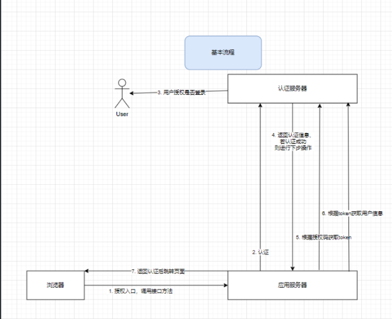

# 再次理解OAuth2.0

## 授权码模式

**模拟一种场景：**

用户输入地址跳转应用服务器，应用服务器入口拦截器无法解析到cookie中用户信息，则直接跳转到认证服务器；用户在认证服务器页面输入正确的用户信息，登录成功后，跳转到认证服务器的工作台页面；工作台页面导航栏处有跳转应用服务器的按钮，点击后进行<u>授权码授权</u>，授权成功后应用服务器用户登录认证成功，正常访问业务内容。

> 对于用户来说，只是点击了按钮即可对不同系统服务进行登录操作。其中的实现流程如下图所示。



属性分为三大部分：用户、认证服务器、应用服务器。 浏览器作为载体。

### 一、用户在工作台点击按钮跳转调用应用服务器接口方法

`CustomClientPassportController#loginRedirect()`

```java
    public void loginRedirect(String redirect) throws IOException {
        String state = RandomStringUtils.randomAlphanumeric(8);
        this.session.setAttribute("state", state);
        this.session.setAttribute("redirect", redirect);
        String contextPath = ServletUtils.getFullContextPath(this.request);
        String callbackRedirectUri = contextPath + "/custom-client-passport/login-redirect-callback";
        String url = getCloudServer() + "/oauth/authorize?response_type=code&client_id="
                + this.cloudClientProperties.getOauth().getClientId() + "&state=" + state + "&redirect_uri=" + callbackRedirectUri;
        this.response.sendRedirect(url);
    }
```

应用服务器调用认证接口`/oauth/authorize`，需要传入重要的参数有：

1. `client_id` - 认证此值是否为可授权服务。
2. `redirect_uri` - 认证成功后回调地址。
3. `state` - 随机数，回调时原封不变返回此值，保证认证的过程是在一次会话，可以把state理解为会话ID。
4. `response_type` - 参数值为`code`。

### 二、认证服务器进行认证

访问认证接口`/oauth/authorize`接口会调用`OAuth2AuthorizationEndpointFilter#doFilterInternal()`，这里的访问接口是可以自定义的。

根据`ProviderSettings.authorizationEndpoint()`配置的认证路径，访问此过滤器进行`client_id`认证。

`OAuth2AuthorizationEndpointFilter#doFilterInternal()`方法中核心的动作为以下调用的代码。

`OAuth2AuthorizationCodeRequestAuthenticationProvider#authenticateAuthorizationRequest()`

重要的几个步骤：

1. 自定义认证校验client_id
2. 自定义认证其他参数是否正确，比如入参时的回调地址是否与配置中的一致
3. 自定义白名单授权范围
4. 校验用户是否授权登录
5. 生成code
6. 保存code到缓存中
7. <u>封装返回值，关键是code即授权码</u>

```java
private Authentication authenticateAuthorizationRequest(Authentication authentication) throws AuthenticationException {
   OAuth2AuthorizationCodeRequestAuthenticationToken authorizationCodeRequestAuthentication =
         (OAuth2AuthorizationCodeRequestAuthenticationToken) authentication;
    // 1
   RegisteredClient registeredClient = this.registeredClientRepository.findByClientId(
         authorizationCodeRequestAuthentication.getClientId());
   if (registeredClient == null) {
      throwError(OAuth2ErrorCodes.INVALID_REQUEST, OAuth2ParameterNames.CLIENT_ID,
            authorizationCodeRequestAuthentication, null);
   }

   Map<Object, Object> context = new HashMap<>();
   context.put(RegisteredClient.class, registeredClient);
   OAuth2AuthenticationContext authenticationContext = new OAuth2AuthenticationContext(
         authorizationCodeRequestAuthentication, context);

   OAuth2AuthenticationValidator redirectUriValidator = resolveAuthenticationValidator(OAuth2ParameterNames.REDIRECT_URI);
    // 2
   redirectUriValidator.validate(authenticationContext);

   if (!registeredClient.getAuthorizationGrantTypes().contains(AuthorizationGrantType.AUTHORIZATION_CODE)) {
      throwError(OAuth2ErrorCodes.UNAUTHORIZED_CLIENT, OAuth2ParameterNames.CLIENT_ID,
            authorizationCodeRequestAuthentication, registeredClient);
   }
    // 3
   OAuth2AuthenticationValidator scopeValidator = resolveAuthenticationValidator(OAuth2ParameterNames.SCOPE);
   scopeValidator.validate(authenticationContext);


   String codeChallenge = (String) authorizationCodeRequestAuthentication.getAdditionalParameters().get(PkceParameterNames.CODE_CHALLENGE);
   if (StringUtils.hasText(codeChallenge)) {
      String codeChallengeMethod = (String) authorizationCodeRequestAuthentication.getAdditionalParameters().get(PkceParameterNames.CODE_CHALLENGE_METHOD);
      if (!StringUtils.hasText(codeChallengeMethod) || !"S256".equals(codeChallengeMethod)) {
         throwError(OAuth2ErrorCodes.INVALID_REQUEST, PkceParameterNames.CODE_CHALLENGE_METHOD, PKCE_ERROR_URI,
               authorizationCodeRequestAuthentication, registeredClient, null);
      }
   } else if (registeredClient.getClientSettings().isRequireProofKey()) {
      throwError(OAuth2ErrorCodes.INVALID_REQUEST, PkceParameterNames.CODE_CHALLENGE, PKCE_ERROR_URI,
            authorizationCodeRequestAuthentication, registeredClient, null);
   }

    // 4
   Authentication principal = (Authentication) authorizationCodeRequestAuthentication.getPrincipal();
   if (!isPrincipalAuthenticated(principal)) {
      return authorizationCodeRequestAuthentication;
   }

   OAuth2AuthorizationRequest authorizationRequest = OAuth2AuthorizationRequest.authorizationCode()
         .authorizationUri(authorizationCodeRequestAuthentication.getAuthorizationUri())
         .clientId(registeredClient.getClientId())
         .redirectUri(authorizationCodeRequestAuthentication.getRedirectUri())
         .scopes(authorizationCodeRequestAuthentication.getScopes())
         .state(authorizationCodeRequestAuthentication.getState())
         .additionalParameters(authorizationCodeRequestAuthentication.getAdditionalParameters())
         .build();

   OAuth2AuthorizationConsent currentAuthorizationConsent = this.authorizationConsentService.findById(
         registeredClient.getId(), principal.getName());

   if (requireAuthorizationConsent(registeredClient, authorizationRequest, currentAuthorizationConsent)) {
      String state = DEFAULT_STATE_GENERATOR.generateKey();
      OAuth2Authorization authorization = authorizationBuilder(registeredClient, principal, authorizationRequest)
            .attribute(OAuth2ParameterNames.STATE, state)
            .build();
      this.authorizationService.save(authorization);

      Set<String> currentAuthorizedScopes = currentAuthorizationConsent != null ?
            currentAuthorizationConsent.getScopes() : null;

      return OAuth2AuthorizationCodeRequestAuthenticationToken.with(registeredClient.getClientId(), principal)
            .authorizationUri(authorizationRequest.getAuthorizationUri())
            .scopes(currentAuthorizedScopes)
            .state(state)
            .consentRequired(true)
            .build();
   }

   OAuth2TokenContext tokenContext = createAuthorizationCodeTokenContext(
         authorizationCodeRequestAuthentication, registeredClient, null, authorizationRequest.getScopes());
    // 5
   OAuth2AuthorizationCode authorizationCode = this.authorizationCodeGenerator.generate(tokenContext);
   if (authorizationCode == null) {
      OAuth2Error error = new OAuth2Error(OAuth2ErrorCodes.SERVER_ERROR,
            "The token generator failed to generate the authorization code.", ERROR_URI);
      throw new OAuth2AuthorizationCodeRequestAuthenticationException(error, null);
   }

   OAuth2Authorization authorization = authorizationBuilder(registeredClient, principal, authorizationRequest)
         .token(authorizationCode)
         .attribute(OAuth2Authorization.AUTHORIZED_SCOPE_ATTRIBUTE_NAME, authorizationRequest.getScopes())
         .build();
    // 6
   this.authorizationService.save(authorization);

   String redirectUri = authorizationRequest.getRedirectUri();
   if (!StringUtils.hasText(redirectUri)) {
      redirectUri = registeredClient.getRedirectUris().iterator().next();
   }
    // 7
   return OAuth2AuthorizationCodeRequestAuthenticationToken.with(registeredClient.getClientId(), principal)
         .authorizationUri(authorizationRequest.getAuthorizationUri())
         .redirectUri(redirectUri)
         .scopes(authorizationRequest.getScopes())
         .state(authorizationRequest.getState())
         .authorizationCode(authorizationCode)
         .build();
}
```

### 三、认证成功，调用回调方法，返回授权码

`CustomClientPassportController#loginRedirectCallback`

关键步骤：

1. 校验state，确保认证是在一次会话中。
2. <u>根据授权码code获取用户token。</u>
3. 根据token获取用户信息，认证成功。
4. 登录成功。

请求中几个重要的参数：

1. `code`- 获取`access_token`的授权码
2. `grant_type`- 为`authorization_code`表示授权码模式
3. `client_id` - 认证服务器通过 `client_id` 验证客户端的身份
4. `client_secret` - 认证服务器通过 `client_secret` 验证客户端是否可信
5. `redirect_uri` - 认证服务器在验证 `code` 时，会检查该 `redirect_uri` 是否匹配已注册的地址。

```java
public void loginRedirectCallback(@RequestParam Map<String, String> parameters) throws Exception {
   String state = parameters.get("state");
   String error = parameters.get("error");
   String errorDescription = parameters.get("error_description");
   if (StringUtils.isNotBlank(error)) {
      throw new BadCredentialsException(error + ": " + errorDescription);
   } else if (this.session == null || !state.equals(this.session.getAttribute("state"))) {
      throw new BadCredentialsException("invalid request");
   }
   String code = parameters.get("code");
   String tokenUrl = this.cloudClientProperties.getServer() + "/oauth/token";
   HttpHeaders headers = new HttpHeaders();
   headers.setContentType(MediaType.MULTIPART_FORM_DATA);
   MultiValueMap<String, String> map = new LinkedMultiValueMap<>();
   String tokenRedirectUri = ServletUtils.getFullContextPath(this.request) + "/custom-client-passport/login-redirect-callback";
   map.add("code", code);
   map.add("grant_type", "authorization_code");
   map.add("client_id", this.cloudClientProperties.getOauth().getClientId());
   map.add("client_secret", this.cloudClientProperties.getOauth().getClientSecret());
   map.add("redirect_uri", tokenRedirectUri);
   HttpEntity<MultiValueMap<String, String>> requestEntity = new HttpEntity<>(map, headers);
   String responseString = new RestTemplate().postForObject(tokenUrl, requestEntity, String.class);
   JSONObject result = new JSONObject(responseString);
   this.session.setAttribute("op_sid", result.getString("sid"));
   String accessToken = result.getString("access_token");
   User user = getUserByAccessToken(accessToken);
   autoLogin(user);
   this.response.sendRedirect((String) this.session.getAttribute("redirect"));
}
```

认证code后获取access_token主要步骤为下。

### 四、根据授权码获取`access_token`

**1. 首先访问此方法进行密钥`client_secret`的校验，如果不通过，则直接返回错误**

`org.springframework.security.oauth2.server.authorization.authentication.ClientSecretAuthenticationProvider#authenticate`

```java
public Authentication authenticate(Authentication authentication) throws AuthenticationException {
   OAuth2ClientAuthenticationToken clientAuthentication =
         (OAuth2ClientAuthenticationToken) authentication;

   if (!ClientAuthenticationMethod.CLIENT_SECRET_BASIC.equals(clientAuthentication.getClientAuthenticationMethod()) &&
         !ClientAuthenticationMethod.CLIENT_SECRET_POST.equals(clientAuthentication.getClientAuthenticationMethod())) {
      return null;
   }

   String clientId = clientAuthentication.getPrincipal().toString();
   RegisteredClient registeredClient = this.registeredClientRepository.findByClientId(clientId);
   if (registeredClient == null) {
      throwInvalidClient(OAuth2ParameterNames.CLIENT_ID);
   }

   if (!registeredClient.getClientAuthenticationMethods().contains(
         clientAuthentication.getClientAuthenticationMethod())) {
      throwInvalidClient("authentication_method");
   }

   if (clientAuthentication.getCredentials() == null) {
      throwInvalidClient("credentials");
   }
    // 校验密钥
   String clientSecret = clientAuthentication.getCredentials().toString();
   if (!this.passwordEncoder.matches(clientSecret, registeredClient.getClientSecret())) {
      throwInvalidClient(OAuth2ParameterNames.CLIENT_SECRET);
   }

   // Validate the "code_verifier" parameter for the confidential client, if available
   this.codeVerifierAuthenticator.authenticateIfAvailable(clientAuthentication, registeredClient);

   return new OAuth2ClientAuthenticationToken(registeredClient,
         clientAuthentication.getClientAuthenticationMethod(), clientAuthentication.getCredentials());
}
```

**2. 校验认证`code`授权码，然后生成`access_token`**

`OAuth2TokenEndpointFilter`过滤器调用`code`授权码认证器`OAuth2AuthorizationCodeAuthenticationProvider`

> `org.springframework.security.oauth2.server.authorization.web.OAuth2TokenEndpointFilter#doFilterInternal`

```java
public Authentication authenticate(Authentication authentication) throws AuthenticationException {
   // 1
   OAuth2Authorization authorization = this.authorizationService.findByToken(
         authorizationCodeAuthentication.getCode(), AUTHORIZATION_CODE_TOKEN_TYPE);
   if (authorization == null) {
      throw new OAuth2AuthenticationException(OAuth2ErrorCodes.INVALID_GRANT);
   }
    // 2 
   if (!registeredClient.getClientId().equals(authorizationRequest.getClientId())) {
      if (!authorizationCode.isInvalidated()) {
         // Invalidate the authorization code given that a different client is attempting to use it
         authorization = OAuth2AuthenticationProviderUtils.invalidate(authorization, authorizationCode.getToken());
         this.authorizationService.save(authorization);
      }
      throw new OAuth2AuthenticationException(OAuth2ErrorCodes.INVALID_GRANT);
   }
    // 3
   if (StringUtils.hasText(authorizationRequest.getRedirectUri()) &&
         !authorizationRequest.getRedirectUri().equals(authorizationCodeAuthentication.getRedirectUri())) {
      throw new OAuth2AuthenticationException(OAuth2ErrorCodes.INVALID_GRANT);
   }
    // 4
   if (!authorizationCode.isActive()) {
      throw new OAuth2AuthenticationException(OAuth2ErrorCodes.INVALID_GRANT);
   }

   // ----- Access token -----
   OAuth2TokenContext tokenContext = tokenContextBuilder.tokenType(OAuth2TokenType.ACCESS_TOKEN).build();

    // 5
   OAuth2Token generatedAccessToken = this.tokenGenerator.generate(tokenContext);
   authorization = authorizationBuilder.build();
   // Invalidate the authorization code as it can only be used once
   authorization = OAuth2AuthenticationProviderUtils.invalidate(authorization, authorizationCode.getToken());
    //  6 
   this.authorizationService.save(authorization);

   return new OAuth2AccessTokenAuthenticationToken(
         registeredClient, clientPrincipal, accessToken, refreshToken, additionalParameters);
}
```

1. 校验`code`是否存在
2. 校验`client_id` 是否存在
3. 校验`redirect_uri` 是否与配置一致
4. 校验`code` 是否过期
5. 生成`access_token`
6. 保存`access_token`在认证服务器的缓存中

最后返回`access_token`给应用服务器端。

### 五、根据`access_token`获取用户信息

这里不再过多解释，请看源代码

```java
public ResponseEntity userInfo() {
   String header = this.request.getHeader("Authorization");
   String jwtToken = StrUtil.subAfter(header, "Bearer ", false);
   if (StringUtils.isBlank(jwtToken)) {
      return new ResponseEntity<>(JusticeCloudApiErrors.BEARER_TOKEN_ERROR, HttpStatus.BAD_REQUEST);
   }
   Claims claims;
   try {
      claims = this.jwtHelper.verifyAndGetClaims(jwtToken);
   } catch (JwtException e) {
      return new ResponseEntity<>(JusticeCloudApiErrors.BEARER_TOKEN_ERROR, HttpStatus.BAD_REQUEST);
   }
   String userId = claims.get("uid", String.class);
   User user = null;
   if (StringUtils.isNotBlank(userId)) {
      user = this.userService.getOne(userId).orElse(null);
   } else {
       // 获取上一步access_token保存的缓存，获取认证信息
      OAuth2Authorization authorization = this.oAuth2AuthorizationService.findByToken(jwtToken, OAuth2TokenType.ACCESS_TOKEN);
      if (authorization != null) {
         String username = authorization.getPrincipalName();
         user = this.userService.findByAccountLoginId(username).orElse(null);
      }
   }
   if (user == null) {
      log.debug("Oauth2 user not found, access_token: {}", jwtToken);
      return new ResponseEntity<>(JusticeCloudApiErrors.PERSON_NOT_FOUND, HttpStatus.NOT_FOUND);
   }
   return new ResponseEntity<>(new JSONTransformer().transformToStandardJsonString(user), HttpStatus.OK);
}
```
