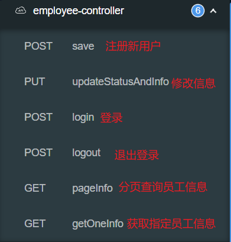
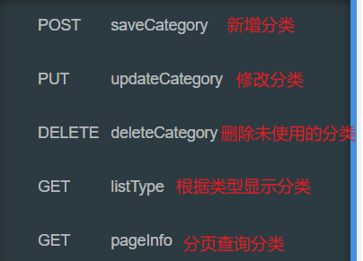
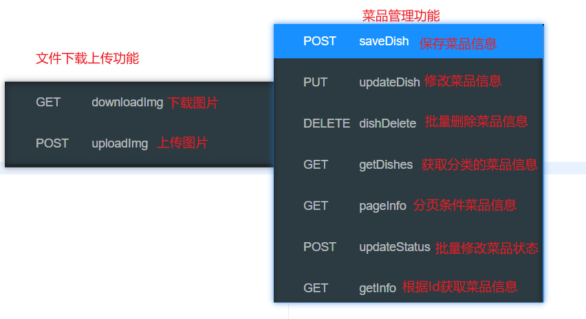
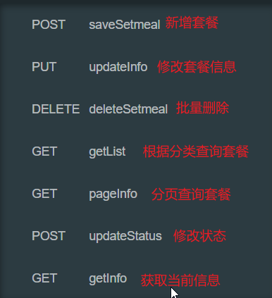
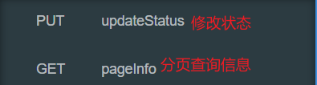
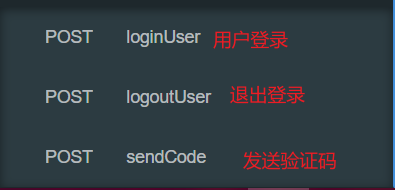
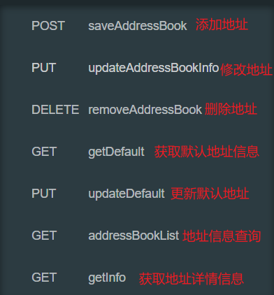
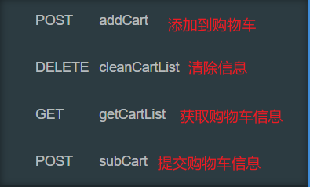

# 1.项目总体功能

## 项目模块：

后台管理：

* 员工管理模块
* 菜品管理模块
* 套餐管理模块
* 订单明细模块

前台管理：

* 用户登录模块
* 地址管理模块

* 菜品首页展示模块
* 购物车模块
* 用户下单模块

## 项目技术：

后端：

`SpringBoot` + `MybatisPlus`+`Redis`

前端：

`Vue` + `ElementUI`

# 2. 后台管理

## 员工管理模块：




**Login（登录功能逻辑层）**

```java
public R login(HttpServletRequest request, Employee employee) {
    // md5加密
    String password = employee.getPassword();
    password = DigestUtils.md5DigestAsHex(password.getBytes());
    // 密码校验
    LambdaQueryWrapper<Employee> queryWrapper = new LambdaQueryWrapper<>();
    queryWrapper.eq(Employee::getUsername, employee.getUsername());
    Employee one = getOne(queryWrapper);
    if (one == null) {
        return R.error("登录失败");
    }

    if (!password.equals(one.getPassword())) {
        return R.error("登录失败");
    }
    // 员工状态校验
    if (one.getStatus() == 0) {
        return R.error("用户已被禁用");
    }
    // 员工id存入session
    request.getSession().setAttribute("employee", one.getId());
    //返回结果
    return R.success(one);
}
```

1. 密码通过MD5加密
2. 将查询到的用户Id存入到Session中（以便过滤器校验）

**LoginCheckFilter（登录校验过滤器）**

```java
@Slf4j
@WebFilter(filterName = "loginCheck",urlPatterns = "/*")
public class LoginCheckFilter implements Filter {


    public static final AntPathMatcher PATH_MATCHER = new AntPathMatcher();

    /**
     * 主要拦截未登录的数据访问请求
     * @param servletRequest
     * @param servletResponse
     * @param filterChain
     * @throws IOException
     * @throws ServletException
     */
    @Override
    public void doFilter(ServletRequest servletRequest, ServletResponse servletResponse, FilterChain filterChain) throws IOException, ServletException {
        HttpServletRequest request = (HttpServletRequest) servletRequest;
        HttpServletResponse response = (HttpServletResponse) servletResponse;
        //判断请求是否处理
        String uri = request.getRequestURI();
        log.info("拦截的请求：{}",uri);
        //不需要处理的请求
        String[] urls = new String[]{
          "/employee/login",
          "/employee/logout",
          "/backend/**",
          "/front/**",
          "/common/**",
          "/user/login",
          "/user/sendCode",
          "/doc.html",
          "/webjars/**",
          "/swagger-resources",
          "/v2/api-docs"
        };
        boolean flag = checkUrl(urls,uri);

        if(flag){
            log.info("不处理的请求：{}",uri);
            filterChain.doFilter(request,response);
            return;
        }

        //访问数据的请求
        //判断emp是否登录
        if((request.getSession().getAttribute("employee"))!= null){
            Long empId = (Long) request.getSession().getAttribute("employee");
            log.info("登录后台用户id为：{}",empId);
            BaseContext.set(empId);
            filterChain.doFilter(request,response);
            return;
        }
        //判断user是否登录
        if((request.getSession().getAttribute("user"))!= null){
            Long userId = (Long) request.getSession().getAttribute("user");
            log.info("登录前台用户id为：{}",userId);
            BaseContext.set(userId);
            filterChain.doFilter(request,response);
            return;
        }
        log.info("未登录，拦截！！！");
        response.getWriter().write(JSON.toJSONString(R.error("NOTLOGIN")));
        return;


    }
	//校验字符串
    private boolean checkUrl(String[] urls, String uri) {
        for (String url : urls) {
            if (PATH_MATCHER.match(url,uri)) {
                return true;
            }
        }
        return false;
    }
}
```

1. `SpringBootApplication` 启动类上使用`@ServletComponentScan` 注解后；`Servlet`可以直接通过@WebServlet注解自动注册；
   `Filter`可以直接通过`@WebFilter`注解自动注册；`Listener`可以直接通过`@WebListener `注解自动注册
2. `new AntPathMatcher()`进行字符串的校验
3. 未登录的请求进行拦截，登录通过Session进行校验
4. 登录成功的用户Id存入`ThreadLocal`中

## 分类管理模块



**deleteCategory（删除分类，分类未被使用）**

```java
public R deleteCategory(Long ids) {
    //判断当前分类是否有套餐或者其他菜品
    LambdaQueryWrapper<Dish> dishLambdaQueryWrapper = new LambdaQueryWrapper<>();
    dishLambdaQueryWrapper.eq(Dish::getCategoryId, ids);
    int dishCount = dishService.count(dishLambdaQueryWrapper);
    if (dishCount > 0) {
        return R.error("此分类存在菜品，禁止删除");
    }
    LambdaQueryWrapper<Setmeal> setmealLambdaQueryWrapper = new LambdaQueryWrapper<>();
    setmealLambdaQueryWrapper.eq(Setmeal::getCategoryId, ids);
    int setmealCount = setmealService.count(setmealLambdaQueryWrapper);
    if (setmealCount > 0) {
        return R.error("此分类存在套餐，禁止删除");
    }
    //删除分类
    removeById(ids);
    //返回响应
    return R.success(null);
}
```

1. 如果当前分类存在菜品或者套餐，禁止删除

**listType（根据类型查询分类）类型：菜品，套餐**

```java
public R listType(Integer type) {
    //根据type查询分类
    LambdaQueryWrapper<Category> queryWrapper = new LambdaQueryWrapper<>();
    queryWrapper.eq(type != null, Category::getType, type);
    queryWrapper.orderByAsc(Category::getSort).orderByDesc(Category::getUpdateTime);
    List<Category> categoryList = list(queryWrapper);
    //返回数据
    return R.success(categoryList);
}
```

## 菜品管理模块：



### 文件上传下载功能

**upload（上传图片）**

```java
public R uploadImg(MultipartFile file) {
    String originalFilename = file.getOriginalFilename();
    if(StringUtils.hasText(originalFilename)){
        //重命名图片
        String suffix = originalFilename.substring(originalFilename.lastIndexOf("."));
        String fileName = UUID.randomUUID().toString() + suffix;
        try {
            //path为本地路径
            File basePath = new File(path);
            if(!basePath.exists()){
                basePath.mkdirs();
            }
            //将图片转存到本地磁盘
            file.transferTo(new File(path + fileName));
        } catch (IOException e) {
            e.printStackTrace();
        }
        return R.success(fileName);
    }

    return R.error("图片上传失败");
}
```

1. 修改图片文件名称
2. 转存至本地

**download（下载图片）**

```java
public void downloadImg(String name, HttpServletResponse response) {
    try {
        //获取图片输入流
        FileInputStream inputStream = new FileInputStream(new File(path + name));
        ServletOutputStream outputStream = response.getOutputStream();
        //设置响应格式
        response.setContentType("image/jpeg");
        int len = 0;
        //输出到页面
        byte[] bytes = new byte[1024];
        while ((len = inputStream.read(bytes)) != -1){
            outputStream.write(bytes,0,len);
            outputStream.flush();
        }
        //关闭资源
        outputStream.close();
        inputStream.close();
    } catch (Exception e) {
        e.printStackTrace();
    }
}
```

1. 获取本地图片文件转为输入流
2. 修改响应格式
3. 输入流传输到页面输出

### 菜品管理功能

**saveDish（保存菜品以及口味）**

```java
@Override
@Transactional
public R saveDish(DishDto dishDto) {
    String key = "dishes:" + dishDto.getCategoryId();
    //保存dish
    save(dishDto);
    //保存favor
    Long dishId = dishDto.getId();
    List<DishFlavor> flavors = dishDto.getFlavors();
    for (DishFlavor flavor : flavors) {
        flavor.setDishId(dishId);
    }
    dishFlavorService.saveBatch(flavors);

    redisTemplate.delete(key);
    //响应
    return R.success("新增菜品成功");
}
```

1. 批量保存菜品口味
2. 新增菜品成功后清除redis缓存

**updateDish（修改菜品以及口味）**

```java
@Transactional
@Override
public R updateDish(DishDto dishDto) {
    String key = "dishes:" + dishDto.getCategoryId();
    //修改菜品信息
    updateById(dishDto);

    //将菜品口味删除
    List<DishFlavor> flavors = dishDto.getFlavors();
    LambdaQueryWrapper<DishFlavor> queryWrapper = new LambdaQueryWrapper<>();
    Long dishId = dishDto.getId();
    queryWrapper.eq(DishFlavor::getDishId, dishId);
    dishFlavorService.remove(queryWrapper);

    flavors.forEach(dishFlavor -> {
                dishFlavor.setDishId(dishId);
                dishFlavor.setId(null);
                }
			);

    	//将修改后的菜品信息存入数据库
        dishFlavorService.saveBatch(flavors);

        redisTemplate.delete(key);

        return R.success("修改成功");
    }
```

1. 修改口味进行先删除，再添加的方式修改菜品口味
2. 修改后清除redis缓存

**pageInfo（查询菜品信息）**

```java
@Override
@Transactional
public R pageInfo(Long page, Long pageSize, String name) {
    Page<Dish> dishPage = new Page<>(page, pageSize);
    LambdaQueryWrapper<Dish> queryWrapper = new LambdaQueryWrapper<>();
    queryWrapper.like(name != null, Dish::getName, name);
    queryWrapper.orderByDesc(Dish::getUpdateTime);

    page(dishPage, queryWrapper);

    Page<DishDto> dishDtoPage = new Page<>();
    //拷贝除Records的属性
    BeanUtils.copyProperties(dishPage, dishDtoPage,"records");

    ArrayList<DishDto> dishDtos = new ArrayList<>();
    //拷贝Records属性
    for (Dish dishList : dishPage.getRecords()) {
        DishDto dishDto = new DishDto();
        //分类名称设置
        Long categoryId = dishList.getCategoryId();
        Category category = categoryService.getById(categoryId);
        if (category != null) {
            dishDto.setCategoryName(category.getName());
        }
        //dish其他属性设置
        BeanUtils.copyProperties(dishList, dishDto);
        dishDtos.add(dishDto);
    }
    dishDtoPage.setRecords(dishDtos);
    return R.success(dishDtoPage);
}
```

1. 查询菜品信息并且分页
2. 进行分页拷贝基本数据，但是不拷贝分页菜品信息
3. 设置分类名称后，将菜品信息存入分页菜品信息中

> 如果分页拷贝records，再设置`CategoryName`会出错；
>
> 拷贝后，`records`类型不是`DishDto`而是`Dish`，无法设置categoryName

**dishDelete（批量删除菜品）**

```java
public R dishDelete(Long[] ids) {
    //删除dish_favor
    LambdaQueryWrapper<DishFlavor> queryWrapper = new LambdaQueryWrapper<>();
    queryWrapper.in(DishFlavor::getDishId, ids);
    dishFlavorService.remove(queryWrapper);
    //删除dish
    removeByIds(Arrays.asList(ids));
    //返回响应
    return R.success(null);

}
```

**dishDelete（根据分类Id查询菜品详情信息）**

```java
public R getDishes(Long categoryId) {
    String key = "dishes:" + categoryId;

    List<DishDto> dishDtos = null;
    //查询缓存
    dishDtos = (List<DishDto>) redisTemplate.opsForValue().get(key);

    if(dishDtos != null){
       return R.success(dishDtos);
    }
    //查询数据库
    // 条件
    LambdaQueryWrapper<Dish> queryWrapper = new LambdaQueryWrapper<>();
    //通过categoryId查询
    queryWrapper.eq(Dish::getCategoryId, categoryId);
    //status为1的菜品
    queryWrapper.eq(Dish::getStatus,1);
    //更新时间排序
    queryWrapper.orderByDesc(Dish::getUpdateTime);
    //查询dish集合
    List<Dish> dishList = list(queryWrapper);
    //设置dishDTO中categoryName和favor属性
    dishDtos = dishList.stream()
            .map(dish -> {
                DishDto dishDto = new DishDto();
                BeanUtils.copyProperties(dish, dishDto);
                Category category = categoryService.getById(dish.getCategoryId());
                if (category != null) {
                    dishDto.setCategoryName(category.getName());
                }
                Long dishId = dish.getId();
                LambdaQueryWrapper<DishFlavor> dishFlavorLambdaQueryWrapper = new LambdaQueryWrapper<>();
                dishFlavorLambdaQueryWrapper.eq(DishFlavor::getDishId, dishId);
                List<DishFlavor> dishFlavors = dishFlavorService.list(dishFlavorLambdaQueryWrapper);
                dishDto.setFlavors(dishFlavors);
                return dishDto;
            }).collect(Collectors.toList());

    //存入Redis
    redisTemplate.opsForValue().set(key,dishDtos,60, TimeUnit.MINUTES);

    //返回dishDTO数据
    return R.success(dishDtos);
}
```

1. 查询菜品基本信息
2. 根据菜品Id查询菜品口味信息
3. 根据CategoryId查询分类名称

## 套餐管理模块：



**saveSetmeal（新增套餐）**

```java
@CacheEvict(value = "setmeal",key = "#setmealDto.categoryId + ':' + #setmealDto.status")
@Transactional
@Override
public R saveSetmeal(SetmealDto setmealDto) {
    //保存setmeal
    save(setmealDto);
    //保存setmealDishes
    Long setmealId = setmealDto.getId();
    List<SetmealDish> setmealDishes = setmealDto.getSetmealDishes();
    setmealDishes.forEach(setmealDish -> setmealDish.setSetmealId(setmealId));
    setmealDishService.saveBatch(setmealDishes);
    log.info("套餐信息：{}", setmealDto);
    //返回响应
    return R.success(null);

}
```

1. 将套餐信息以及套餐菜品信息存入数据库
2. 使用`SpringCache`中`@CacheEvict`将新增套餐分类下的Redis缓存清除

**getList（获取当前套餐信息）**

```java
@Cacheable(value = "setmeal", key = "#setmeal.categoryId + ':'+ #setmeal.status")
@Override
public R getList(Setmeal setmeal) {
    Long categoryId = setmeal.getCategoryId();
    LambdaQueryWrapper<Setmeal> queryWrapper = new LambdaQueryWrapper<>();
    queryWrapper.eq(Setmeal::getCategoryId, categoryId);
    queryWrapper.eq(Setmeal::getStatus, setmeal.getStatus());
    queryWrapper.orderByDesc(Setmeal::getUpdateTime);
    List<Setmeal> list = list(queryWrapper);
    return R.success(list);
}
```

1. 获取套餐基本信息
2. 如果Redis中存在套餐信息，直接返回；否则查询数据库并且存入Redis中

## 订单明细模块



**pageInfo（根据条件分页查询）**

```java
@Transactional
@Override
public R pageInfo(Integer page, Integer pageSize, Long number, String beginTime, String endTime) {
    //分页对象
    Page<Orders> ordersPage = new Page<>(page, pageSize);
    //条件查询
    LambdaQueryWrapper<Orders> queryWrapper = new LambdaQueryWrapper<>();
    //转换日期类型
    if (StringUtils.hasText(beginTime) && StringUtils.hasText(endTime)) {
        LocalDateTime begin = parse(beginTime);
        LocalDateTime end = parse(endTime);
        queryWrapper.between(Orders::getOrderTime,begin,end);
    }

    queryWrapper.like(number != null, Orders::getNumber, number);

    page(ordersPage, queryWrapper);

    ordersPage.getRecords().forEach(orders -> {
                Long userId = orders.getUserId();
                String userName = userService.getById(userId).getName();
                if(StringUtils.hasText(userName)){
                    orders.setUserName(userName);
                }
            });
    //返回数据
    return R.success(ordersPage);
}
    /**
     * String转LocalDateTime
     *
     * @param str
     * @return
     */
    private LocalDateTime parse(String str) {
        DateTimeFormatter df = DateTimeFormatter.ofPattern("yyyy-MM-dd HH:mm:ss");
        return LocalDateTime.parse(str, df);
    }
```

1. 将`String`类型转为`DateLocalTime`类型

# 3. 前台管理

## 用户登录模块：




**sendCode（发送验证码）**

```java
public R sendCode(User user) {
    String code = ValidateCodeUtils.generateValidateCode4String(4);
    log.info("验证码为：{}",code);
    stringRedisTemplate.opsForValue().set(user.getPhone(),code,5, TimeUnit.MINUTES);
    return R.success("获取验证码成功");
}
```

1. 发送验证码，并且将验证码存入Redis中

**login（登录）**

```java
@Transactional
@Override
public R loginUser(User user, HttpSession session) {
    //获取手机号
    String phone = user.getPhone();

    //校验验证码
    String code = stringRedisTemplate.opsForValue().get(phone);
    if(!StringUtils.hasText(code)){
        return R.error("验证码失效，请重新发送！");
    }
    if(!code.equals(user.getCode())){
        return R.error("验证码有误！");
    }
    //判断数据库中是否存在此用户
    LambdaQueryWrapper<User> queryWrapper = new LambdaQueryWrapper<>();
    queryWrapper.eq(User::getPhone,phone);
    User newUser = getOne(queryWrapper);
    if(ObjectUtils.isEmpty(newUser)){
        //不存在进行注册
        newUser = new User();
        newUser.setPhone(phone);
        newUser.setStatus(1);
        save(newUser);
    }
    //设置session
    session.setAttribute("user",newUser.getId());
    stringRedisTemplate.delete(phone);
    return R.success(newUser);
}
```

1. 通过Redis校验验证码
2. 查询数据库用户信息
3. 如果用户不存在，注册用户

## 地址管理模块：




## 菜品首页展示模块：

**getDishes（根据分类查询菜品详情信息）**

```java
public R getDishes(Long categoryId) {
    String key = "dishes:" + categoryId;

    List<DishDto> dishDtos = null;
    //查询缓存
    dishDtos = (List<DishDto>) redisTemplate.opsForValue().get(key);

    if(dishDtos != null){
       return R.success(dishDtos);
    }
    //查询数据库
    // 条件
    LambdaQueryWrapper<Dish> queryWrapper = new LambdaQueryWrapper<>();
    //通过categoryId查询
    queryWrapper.eq(Dish::getCategoryId, categoryId);
    //status为1的菜品
    queryWrapper.eq(Dish::getStatus,1);
    //更新时间排序
    queryWrapper.orderByDesc(Dish::getUpdateTime);
    //查询dish集合
    List<Dish> dishList = list(queryWrapper);
    //设置dishDTO中categoryName和favor属性
    dishDtos = dishList.stream()
            .map(dish -> {
                DishDto dishDto = new DishDto();
                BeanUtils.copyProperties(dish, dishDto);
                Category category = categoryService.getById(dish.getCategoryId());
                if (category != null) {
                    dishDto.setCategoryName(category.getName());
                }
                Long dishId = dish.getId();
                LambdaQueryWrapper<DishFlavor> dishFlavorLambdaQueryWrapper = new LambdaQueryWrapper<>();
                dishFlavorLambdaQueryWrapper.eq(DishFlavor::getDishId, dishId);
                List<DishFlavor> dishFlavors = dishFlavorService.list(dishFlavorLambdaQueryWrapper);
                dishDto.setFlavors(dishFlavors);
                return dishDto;
            }).collect(Collectors.toList());

    //存入Redis
    redisTemplate.opsForValue().set(key,dishDtos,60, TimeUnit.MINUTES);

    //返回dishDTO数据
    return R.success(dishDtos);
}
```

1. 查询Redis中是否存在菜品信息
2. 根据分类Id查询菜品基本信息
3. 设置菜品分类名称，口味
4. 存入Redis

## 购物车模块：



**addCart（添加购物车）**

```java
@Transactional
@Override
public R addCart(ShoppingCart shoppingCart) {
    Long userId = BaseContext.get();
    //条件
    Long dishId = shoppingCart.getDishId();
    LambdaQueryWrapper<ShoppingCart> queryWrapper = new LambdaQueryWrapper<>();
    queryWrapper.eq(ShoppingCart::getUserId, userId);
    //判断是套餐还是菜品
    if (dishId != null) {
        queryWrapper.eq(ShoppingCart::getDishId, dishId);
    } else {
        queryWrapper.eq(ShoppingCart::getSetmealId, shoppingCart.getSetmealId());
    }
    ShoppingCart one = getOne(queryWrapper);
    //数据库中存在数量加一
    if (one != null) {
        one.setNumber(one.getNumber() + 1);

        updateById(one);
    } else {
        //不存在直接保存数据库
        //设置基本属性
        shoppingCart.setUserId(userId);
        shoppingCart.setCreateTime(LocalDateTime.now());
        shoppingCart.setNumber(1);
        save(shoppingCart);
        one = shoppingCart;
    }

    //返回购物车数据
    return R.success(one);
}
```

1. 查询数据库中是否存在当前添加的菜品或者套餐
2. 不存在，数据库的购物车中新增菜品信息
3. 存在，菜品数量加一

## 用户下单模块：


**submi（提交订单）**

```java
@Transactional
@Override
public R submit(Orders orders) {
    //获取userId
    Long userId = BaseContext.get();
    //查询购物车数据
    LambdaQueryWrapper<ShoppingCart> queryWrapper = new LambdaQueryWrapper<>();
    queryWrapper.eq(ShoppingCart::getUserId, userId);
    List<ShoppingCart> shoppingCarts = shoppingCartService.list(queryWrapper);
    if (shoppingCarts.isEmpty()) {
        return R.error("购物车为空，下单失败！");
    }
    User user = userService.getById(userId);

    AddressBook addressBook = addressBookService.getById(orders.getAddressBookId());

    if (addressBook == null) {
        return R.error("地址有误，下单失败！");
    }

    //订单表中插入一条数据
    long orderId = IdWorker.getId();

    AtomicInteger amount = new AtomicInteger(0);

    List<OrderDetail> orderDetails = shoppingCarts.stream().map((item) -> {
        OrderDetail orderDetail = new OrderDetail();
        orderDetail.setOrderId(orderId);
        orderDetail.setNumber(item.getNumber());
        orderDetail.setDishFlavor(item.getDishFlavor());
        orderDetail.setDishId(item.getDishId());
        orderDetail.setSetmealId(item.getSetmealId());
        orderDetail.setName(item.getName());
        orderDetail.setImage(item.getImage());
        orderDetail.setAmount(item.getAmount());
        amount.addAndGet(item.getAmount().multiply(new BigDecimal(item.getNumber())).intValue());
        return orderDetail;
    }).collect(Collectors.toList());

    orders.setId(orderId);
    orders.setOrderTime(LocalDateTime.now());
    orders.setCheckoutTime(LocalDateTime.now());
    orders.setStatus(2);
    orders.setAmount(new BigDecimal(amount.get()));//总金额
    orders.setUserId(userId);
    orders.setNumber(String.valueOf(orderId));
    orders.setUserName(user.getName());
    orders.setConsignee(addressBook.getConsignee());
    orders.setPhone(addressBook.getPhone());
    orders.setAddress(addressBook.getDetail());
    //向订单表插入数据，一条数据
    this.save(orders);
    //订单明细中插入多条数据
    orderDetailService.saveBatch(orderDetails);
    //清空购物车
    shoppingCartService.remove(queryWrapper);
    //相应前端
    return R.success(null);
}
```

1. 查询购物车信息
2. 设置订单详情信息
3. 设置订单信息
4. 保存订单信息，订单详情信息，删除购物车信息
