# 基础篇

基本类型：

* String	hello world
* Hash     {name: "Jack", age: 21}
* List        [A -> B -> C -> C]
* Set         {A, B, C}
* SortedSet   {A: 1, B: 2, C: 3}

特殊类型

* GEO {A:（120.3， 30.5）}
* BigMap  0110110101110101011
* HepyerLog  0110110101110101011

## 通用命令

* KEYS：查看符合模板的所有key
* DEL：删除一个指定的key

* EXISTS：判断key是否存在
* EXPIRE：给一个key设置有效期，有效期到期时该key会被自动删除
* TTL：查看一个KEY的剩余有效期

## String类型

* SET：添加或者修改已经存在的一个String类型的键值对

* GET：根据key获取String类型的value

* MSET：批量添加多个String类型的键值对

* MGET：根据多个key获取多个String类型的value

* INCR：让一个整型的key自增1

  

* INCRBY:让一个整型的key自增并指定步长

  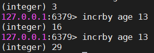

* INCRBYFLOAT：让一个浮点类型的数字自增并指定步长

* SETNX：添加一个String类型的键值对，前提是这个key不存在，否则不执行

* SETEX：添加一个String类型的键值对，并且指定有效期  setex [key] [seconds] [value]

## Hash类型

* HSET key field value：添加或者修改hash类型key的field的值

* HGET key field：获取一个hash类型key的field的值

* HMSET：批量添加多个hash类型key的field的值(弃用,HSET 同样可以设置多个field value)

* HMGET：批量获取多个hash类型key的field的值

* HGETALL：获取一个hash类型的key中的所有的field和value

* HKEYS：获取一个hash类型的key中的所有的field

* HVALS：获取一个hash类型的key中的所有的value

* HINCRBY:让一个hash类型key的字段值自增并指定步长  hincrby [key] [field] [increment]

  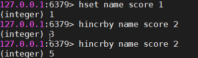

* HSETNX：添加一个hash类型的key的field值，前提是这个field不存在，否则不执行

## List类型

* LPUSH key element ... ：向列表左侧插入一个或多个元素

* LPOP key：移除并返回列表左侧的第一个元素，没有则返回nil

* RPUSH key element ... ：向列表右侧插入一个或多个元素

* RPOP key：移除并返回列表右侧的第一个元素

* LRANGE key star end：返回一段角标范围内的所有元素

* BLPOP和BRPOP：与LPOP和RPOP类似，只不过在没有元素时等待指定时间，而不是直接返回nil

## Set类型

* SADD key member ... ：向set中添加一个或多个元素

* SREM key member ... : 移除set中的指定元素

* SCARD key： 返回set中元素的个数

* SISMEMBER key member：判断一个元素是否存在于set中

* SMEMBERS：获取set中的所有元素

* SINTER key1 key2 ... ：求key1与key2的交集
* SDIFF key1 key2 ... ：求key1与key2的差集
* SUNION key1 key2 ..：求key1和key2的并集

## SortedSet类型

* ZADD key score member：添加一个或多个元素到sorted set ，如果已经存在则更新其score值

* ZREM key member：删除sorted set中的一个指定元素

* ZSCORE key member : 获取sorted set中的指定元素的score值

* ZRANK key member：获取sorted set 中的指定元素的排名

* ZCARD key：获取sorted set中的元素个数

* ZCOUNT key min max：统计score值在给定范围内的所有元素的个数

* ZINCRBY key increment member：让sorted set中的指定元素自增，步长为指定的increment值

* ZRANGE key min max：按照score排序后，获取指定排名范围内的元素

* ZRANGEBYSCORE key min max：按照score排序后，获取指定score范围内的元素

* ZDIFF、ZINTER、ZUNION：求差集、交集、并集

# 实战篇

## 主动更新策略

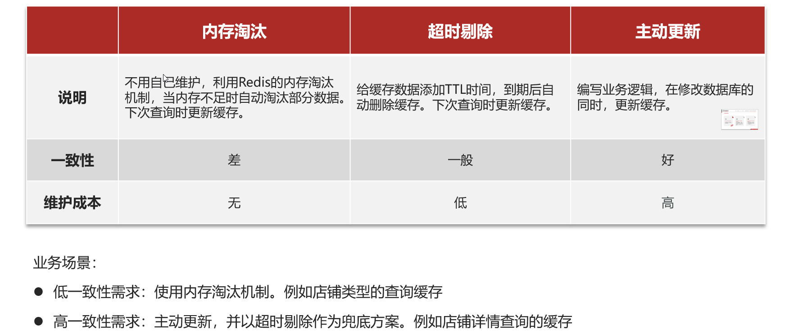

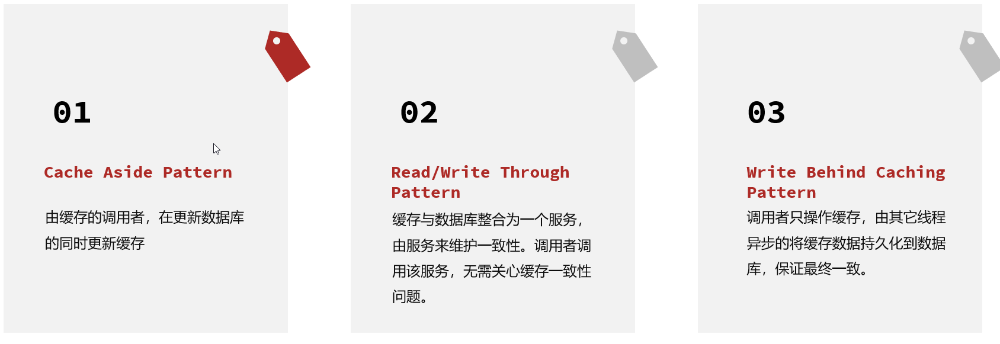

操作缓存和数据库时有三个问题需要考虑：

1. 删除缓存还是更新缓存？

   ​	更新缓存：每次更新数据库都更新缓存，无效写操作较多

   ​	删除缓存：更新数据库时让缓存失效，查询时再更新缓存

2. 如何保证缓存与数据库的操作的同时成功或失败？

   ​	单体系统，将缓存与数据库操作放在一个事务

   ​	分布式系统，利用TCC等分布式事务方案

3. 先操作缓存还是先操作数据库？

   ​	先删除缓存，再操作数据库

   ​	先操作数据库，再删除缓存

问题三进行选择解释：

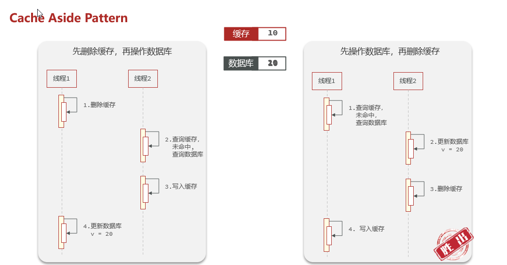


先删除缓存： 更新数据库操作比较慢，在更新的过程中另一个线程趁虚而入。

先查询数据库： 写入缓存的时间很快，在这之间新的线程进行更新数据库，删除缓存。而更新数据库的速度是很慢的，因此不易发生。

总结：

1. 低一致性需求： 使用Redis自带的内存淘汰机制
2. 高一致性需求： 主动更新，并以超时剔除作为兜底

* 读操作： 
  * 缓存命中则直接返回
  * 缓存未命中，查询数据库并写入缓存，设定超时时间
* 写操作：
  * 先修改数据库，再删除缓存
  * 确保数据库与缓存的原子性

## 缓存穿透

**缓存穿透**是指客户端请求的数据在缓存中和数据库中都不存在，这样缓存永远不会生效，这些请求都会打到数据库。

常见的解决方案有两种：

* 缓存空对象

  * 优点：实现简单，维护方便

  * 缺点：

    ​			额外的内存消耗

    ​			可能造成短期的不一致

* 布隆过滤

  * 优点：内存占用较少，没有多余key

  * 缺点：

    ​			实现复杂

    ​			存在误判可能

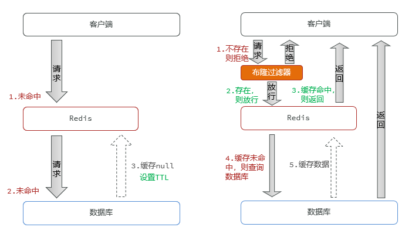

案例：

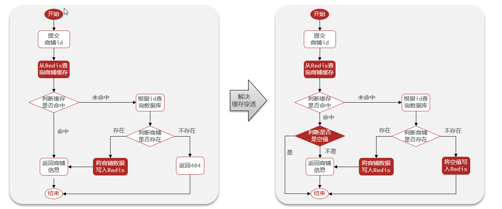

```java
/**
 * 缓存空值解决缓存穿透问题
 * @param prefixKey
 * @param id
 * @param type
 * @param function
 * @param time
 * @param unit
 * @param <R>
 * @return
 */
public  <R> R queryWithPassThrough(String prefixKey, Long id, Class<R> type, Function<Long, R> function,
                                   Long time, TimeUnit unit) {
    //从Redis查询信息
    String json = stringRedisTemplate.opsForValue().get(prefixKey + id);
    //存在返回数据
    if (StringUtils.hasText(json)) {
        return JSONUtil.toBean(json, type);
    }
    if (json != null) {
        return null;
    }
    //不存在查询数据库
    R r = function.apply(id);
    //存在先写入redis
    if (!ObjectUtils.isEmpty(r)) {
        this.setWithExpire(prefixKey, id, r, time, unit);
        //再返回给用户
        return r;
    }
    //不存在返回错误
    stringRedisTemplate.opsForValue().set(prefixKey + id, ""
            , 2L, TimeUnit.MINUTES);
    return null;
}
		//调用
     Shop shop = cacheClient.queryWithPassThrough(CACHE_SHOP_KEY, id, Shop.class,
           						this::getById, CACHE_SHOP_TTL, TimeUnit.MINUTES);
```

总结：

缓存穿透产生的原因是什么？

•	用户请求的数据在缓存中和数据库中都不存在，不断发起这样的请求，给数据库带来巨大压力

缓存穿透的解决方案有哪些？

•	缓存null值

•	布隆过滤

•	增强id的复杂度，避免被猜测id规律

•	做好数据的基础格式校验

•	加强用户权限校验

•	做好热点参数的限流

## 缓存雪崩

**缓存雪崩**是指在同一时段大量的缓存key同时失效或者Redis服务宕机，导致大量请求到达数据库，带来巨大压力。

**解决方案：**

* 给不同的Key的TTL添加随机值

* 利用Redis集群提高服务的可用性

* 给缓存业务添加降级限流策略

* 给业务添加多级缓存

## 缓存击穿

**缓存击穿问题**也叫热点Key问题，就是一个被**高并发访问**并且**缓存重建业务较复杂**的key突然失效了，无数的请求访问会在瞬间给数据库带来巨大的冲击。

常见的解决方案有两种：

1. 互斥锁
2. 逻辑过期

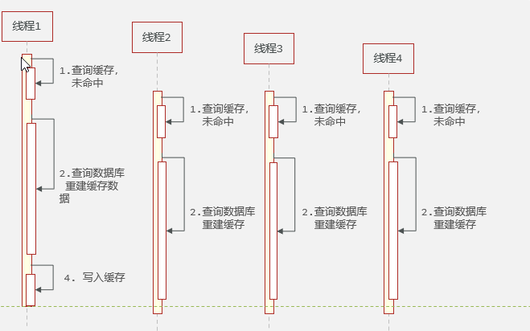

无数的线程同时访问缓存未命中，都访问数据库给数据库带来巨大压力

### 互斥锁


案例分析：

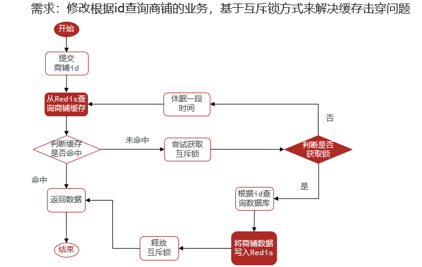

```java
private Shop queryWithLock(Long id) {
    //从Redis查询信息
    String shopInfo = stringRedisTemplate.opsForValue().get(RedisConstants.CACHE_SHOP_KEY + id);
    //存在返回数据
    if (StringUtils.hasText(shopInfo)) {
        Shop shop = JSONUtil.toBean(shopInfo, Shop.class);
        return shop;
    }
    if (shopInfo != null) {
        return null;
    }
    String lockKey = LOCK_SHOP_KEY + id;
    try {
        //获取锁
        Boolean flag = tryLock(lockKey);
        //获取失败 休眠一会 再次查询redis缓存
        if (!flag) {
            Thread.sleep(5000);
            return queryWithLock(id);
        }
        //获取成功 查询数据库 写入redis 释放锁
        //不存在查询数据库
        Shop shopInfoTwo = getById(id);
        Thread.sleep(200);
        //存在先写入redis
        if (!ObjectUtils.isEmpty(shopInfoTwo)) {
            String json = JSONUtil.toJsonStr(shopInfoTwo);
            stringRedisTemplate.opsForValue().set(RedisConstants.CACHE_SHOP_KEY + id, json
                    , CACHE_SHOP_TTL, TimeUnit.MINUTES);
            //再返回给用户
            return shopInfoTwo;
        }
    } catch (InterruptedException e) {
        e.printStackTrace();
    } finally {
        unlock(lockKey);
    }
    //不存在返回错误
    stringRedisTemplate.opsForValue().set(RedisConstants.CACHE_SHOP_KEY + id, ""
            , RedisConstants.CACHE_NULL_TTL, TimeUnit.MINUTES);
    return null;
}
/**
 * 设置锁
 *
 * @param lockKey
 * @return
 */
private Boolean tryLock(String lockKey) {
    Boolean isTrue = stringRedisTemplate.opsForValue().setIfAbsent(lockKey, "1", 10L, TimeUnit.SECONDS);
    return BooleanUtil.isTrue(isTrue);
}
/**
 * 释放锁
 */
private void unlock(String lockKey) {
    stringRedisTemplate.delete(lockKey);
}
```

### 逻辑过期

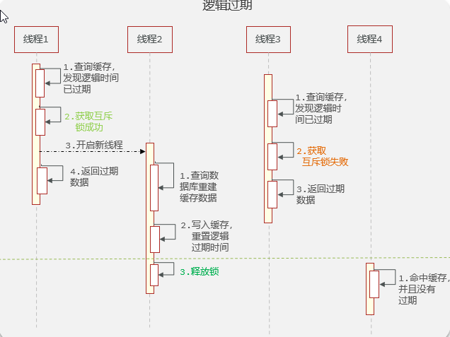

案例分析：

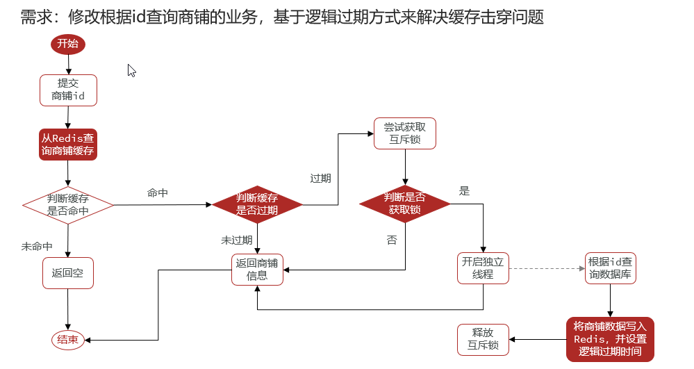

```java
/**
     * 逻辑过期解决缓存穿透问题
     * @param prefixKey
     * @param id
     * @param type
     * @param function
     * @param time
     * @param unit
     * @param <R>
     * @return
     */
    public <R> R queryWithLogicExpire(String prefixKey, Long id, Class<R> type, Function<Long,R> function,
                                      Long time, TimeUnit unit) {
        //从Redis查询信息
        String json = stringRedisTemplate.opsForValue().get(prefixKey + id);
        //不存在返回null
        if (StringUtils.isEmpty(json)) {
            return null;
        }
        //封装对象       -->data属性为商品对象；expireTime为逻辑过期时间
        RedisData redisData = JSONUtil.toBean(json, RedisData.class);
        R r = JSONUtil.toBean((JSONObject) redisData.getData(), type);
        //判断是否过期
        LocalDateTime expireTime = redisData.getExpireTime();
        boolean flag = expireTime.isAfter(LocalDateTime.now());
        //未过期返回数据
        if (flag) {
            return r;
        }
        //过期获取互斥锁
        String lockKey = "lock:object:" + id;
        Boolean isTrue = tryLock(lockKey);
        if (isTrue) {
            //获取到了开启独立线程返回数据
            CACHE_REBUILD_EXECUTOR.submit(() ->{
                R apply = function.apply(id);
                this.setWithLogicalExpire(prefixKey,id,apply,time,unit);
                unlock(lockKey);
            });
        }
        //没获取或者获取到锁都返回旧的数据
        return r;
    }
    /**
     * 设置逻辑时间到redis
     * RedisData 属性
     * Object data ， LocalDateTime expireTime;
     *
     * @param prefixKey
     * @param id
     * @param object
     * @param time
     * @param unit
     */
    private void setWithLogicalExpire(String prefixKey, Long id, Object object, Long time, TimeUnit unit) {
        String key = prefixKey + id;
        RedisData redisData = new RedisData();
        redisData.setData(object);
        redisData.setExpireTime(LocalDateTime.now().plusSeconds(unit.toSeconds(time)));
        stringRedisTemplate.opsForValue().set(key, JSONUtil.toJsonStr(redisData));
    }
//	方法调用
Shop shop = cacheClient.queryWithLogicExpire(CACHE_SHOP_KEY,id,Shop.class,this::getById,20L,
        TimeUnit.SECONDS);
```

## 超卖问题

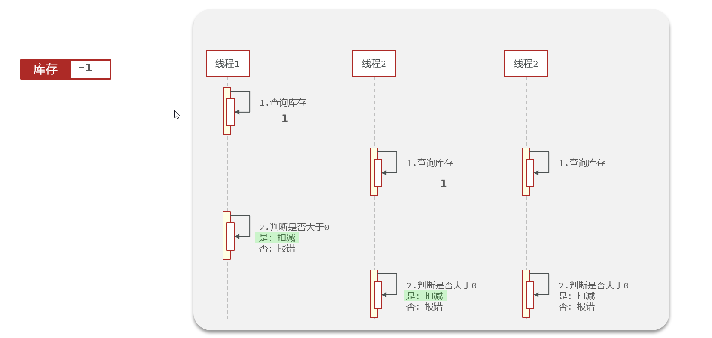

超卖问题是典型的多线程安全问题，针对这一问题的常见解决方案就是加锁：

1. 悲观锁

   1. 认为线程安全问题一定会发生，因此在操作数据之前先获取锁，确保线程串行执行。

      例如Synchronized、Lock都属于悲观锁

2. 乐观锁

   1. 认为线程安全问题不一定会发生，因此不加锁，只是在更新数据时去判断有没有其它线程对数据做了修改。

      如果没有修改则认为是安全的，自己才更新数据。

      如果已经被其它线程修改说明发生了安全问题，此时可以重试或异常。

乐观锁案例：

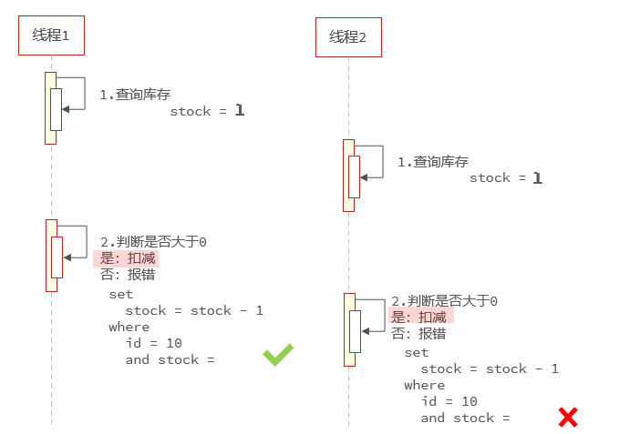


```java
@Transactional
public Result createOrder(Long voucherId){

    Long userId = UserHolder.getUser().getId();
        LambdaUpdateWrapper<SeckillVoucher> wrapper = new LambdaUpdateWrapper<>();
        wrapper.setSql("stock = stock - 1");
        wrapper.eq(SeckillVoucher::getVoucherId,voucherId);
        wrapper.ge(SeckillVoucher::getStock,1);

        boolean flag = iVoucherService.update(wrapper);
        if(!flag){
            return Result.fail("库存不足!");
        }
        //充足减少库存，添加订单
        VoucherOrder voucherOrder = new VoucherOrder();
        long orderId = redisIdWorker.nextId("order");
        voucherOrder.setId(orderId);
        voucherOrder.setVoucherId(voucherId);
        voucherOrder.setUserId(userId);
        save(voucherOrder);
        //返回订单信息
        return Result.ok(orderId);
}
```

## 一人一单

一人一单的并发安全问题

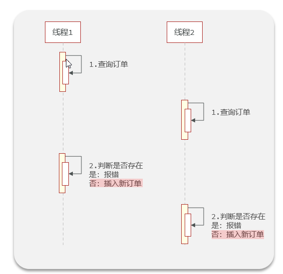

问题解决：

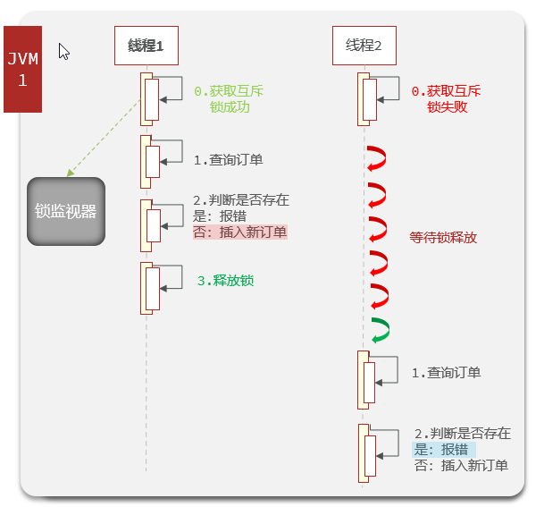

```java
    @Transactional
    public Result createOrder(Long voucherId){

        Long userId = UserHolder.getUser().getId();
        //获取jvm锁
        //intern（）:
        // 当调用 intern() 方法时，编译器会将字符串添加到常量池中（stringTable维护），并返回指向该常量的引用。
        synchronized (userId.toString().intern()){

            Integer count = query().eq("user_id", userId).eq("voucher_id", voucherId).count();
            if(count > 0){
                return Result.fail("用户已抢购过！");
            }

            LambdaUpdateWrapper<SeckillVoucher> wrapper = new LambdaUpdateWrapper<>();
            wrapper.setSql("stock = stock - 1");
            wrapper.eq(SeckillVoucher::getVoucherId,voucherId);
            wrapper.ge(SeckillVoucher::getStock,1);

            boolean flag = iVoucherService.update(wrapper);
            if(!flag){
                return Result.fail("库存不足!");
            }
            //充足减少库存，添加订单
            VoucherOrder voucherOrder = new VoucherOrder();
            long orderId = redisIdWorker.nextId("order");
            voucherOrder.setId(orderId);
            voucherOrder.setVoucherId(voucherId);
            voucherOrder.setUserId(userId);
            save(voucherOrder);
            //返回订单信息
            return Result.ok(orderId);
        }
    }
```

> 不同的jvm存在不同的锁，当访问同一个服务时，又一次出现线程安全问题。**因此使用分布式锁进行问题解决。**

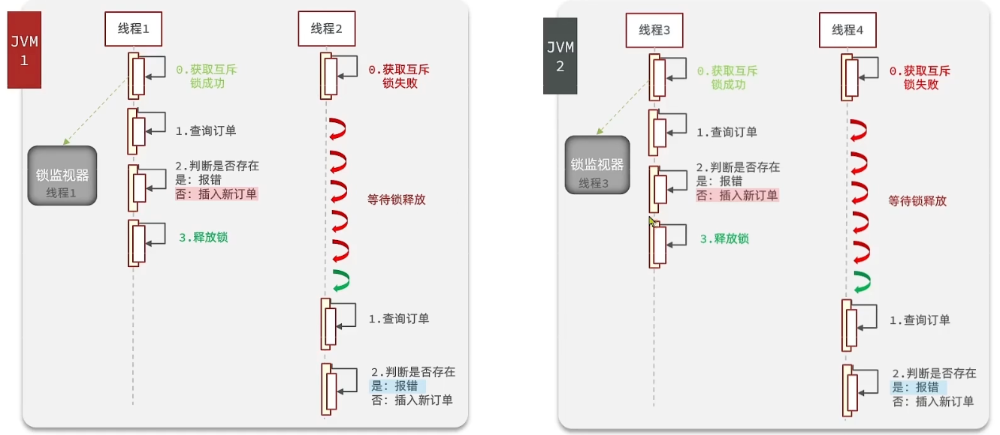

## 分布式锁

解决分布式集群模式的线程安全问题

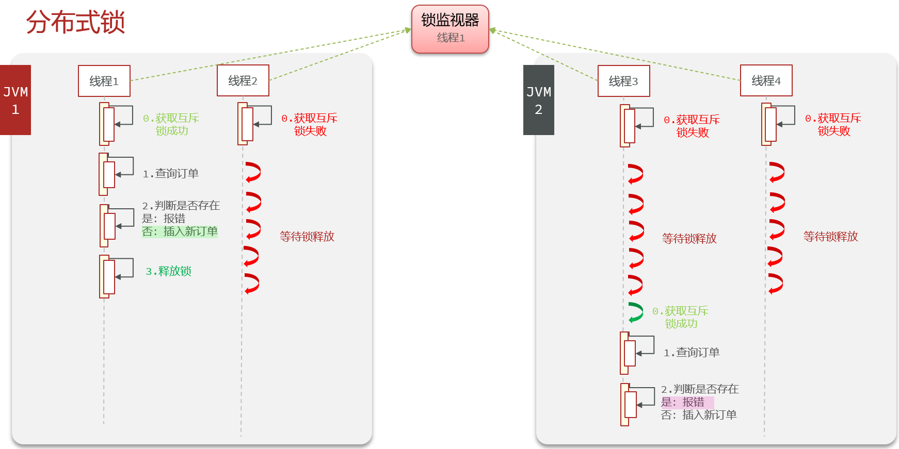

分布式锁： 满足分布式系统或集群模式下多进程可见并且互斥的锁。

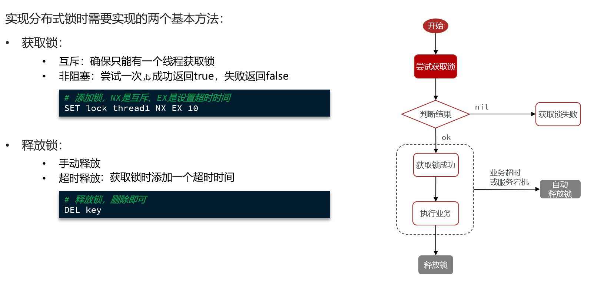

### 简单版

```java
@Transactional
public Result createOrder(Long voucherId) {

    Long userId = UserHolder.getUser().getId();
    SimpleRedisLock lock = new SimpleRedisLock("order:" + userId, stringRedisTemplate);
    Boolean isLock = lock.tryLock(1200L);
    if (!isLock) {
        return Result.fail("不允许重复订单！");
    }
    try {
        Integer count = query().eq("user_id", userId).eq("voucher_id", voucherId).count();
        if (count > 0) {
            return Result.fail("用户已抢购过！");
        }

        LambdaUpdateWrapper<SeckillVoucher> wrapper = new LambdaUpdateWrapper<>();
        wrapper.setSql("stock = stock - 1");
        wrapper.eq(SeckillVoucher::getVoucherId, voucherId);
        wrapper.ge(SeckillVoucher::getStock, 1);

        boolean flag = iVoucherService.update(wrapper);
        if (!flag) {
            return Result.fail("库存不足!");
        }
        //充足减少库存，添加订单
        VoucherOrder voucherOrder = new VoucherOrder();
        long orderId = redisIdWorker.nextId("order");
        voucherOrder.setId(orderId);
        voucherOrder.setVoucherId(voucherId);
        voucherOrder.setUserId(userId);
        save(voucherOrder);
        //返回订单信息
        return Result.ok(orderId);
    } finally {
        lock.unlock();
    }

}
	
 /**
  *  尝试获取锁
  * @param timeout
  * @return
  */
 @Override
 public Boolean tryLock(Long timeout) {
     long threadId = Thread.currentThread().getId();
     String lockValue = ID_LOCK + threadId ;
     Boolean isLock = stringRedisTemplate.opsForValue()
             .setIfAbsent(PREFIX_LOCK + name, lockValue, timeout, TimeUnit.SECONDS);
     return Boolean.TRUE.equals(isLock);
 }

 /**
  * 释放锁
  */
 @Override
 public void unlock() {
     stringRedisTemplate.execute(UNLOCK_SCRIPT,
             Collections.singletonList(PREFIX_LOCK + name),
             ID_LOCK + Thread.currentThread().getId()
             );
 }
```

> 问题： 当线程一获取锁并且正在执行业务的时候，**业务阻塞**导致锁到期自动释放了；
>
> 而线程二获取线程一释放的锁执行业务的时候，**线程一执行业务成功释放了线程二的锁**，出现误删问题。

### 误删问题解决

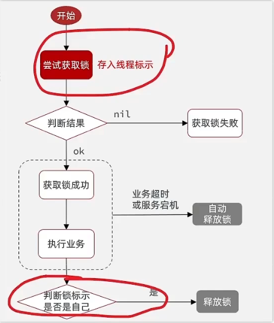

```java
 @Override
    public void unlock() {
        //获取 redis存入的线程标识
        String id = stringRedisTemplate.opsForValue().get(PREFIX_LOCK + name);
        //获取当前线程标识
        String lockValue = ID_LOCK + Thread.currentThread().getId();
        //判断是否一致
        if(lockValue.equals(id)){
            stringRedisTemplate.delete(PREFIX_LOCK + name);
        }
    }
```

> 问题： 线程一判断锁是否是自己的成功后，进行释放锁之前出现了阻塞问题，又一次超时释放了锁。
>
> 而其他线程拿到锁后，线程一才进行了释放锁的动作，再次 出现误删的问题。

### Lua解决原子性问题

释放锁的业务流程是这样的：

1.获取锁中的线程标示

2.判断是否与指定的标示（当前线程标示）一致

3.如果一致则释放锁（删除）

4.如果不一致则什么都不做

lua脚本

```lua
if(redis.call("get",KEYS[1]) == ARGV[1]) then

    redis.call("del",KEYS[1])

end

return 0
```

释放锁

```java
public void unlock() {
    stringRedisTemplate.execute(
        	//脚本文件
        	UNLOCK_SCRIPT,
        	//keys[] 为数组
            Collections.singletonList(PREFIX_LOCK + name),
        	//参数可以填入多个
            ID_LOCK + Thread.currentThread().getId()
            );
}
```

### 总结

基于Redis的分布式锁实现思路：

•	利用set nx ex获取锁，并设置过期时间，保存线程标示

•	释放锁时先判断线程标示是否与自己一致，一致则删除锁

特性：

•	利用set nx满足互斥性

•	利用set ex保证故障时锁依然能释放，避免死锁，提高安全性

•	利用Redis集群保证高可用和高并发特性

> 基于setnx实现的分布式锁存在下面的问题：
>
> 1. 不可重入： 同一个线程无法多次获取同一把锁
> 2. 不可重试： 获取锁只尝试一次就返回false，没有重试机制
> 3. 超时释放： 锁超时释放虽然可以避免死锁，但如果是业务执行耗时较长，也会导致锁释放，存在安全隐患
> 4. 主从一致性： 如果Redis提供了主从集群，主从同步存在延迟，当主宕机时，如果从并同步主中的锁数据，则会出现锁实现

## Redisson

### 可重用

redis采用hash结构

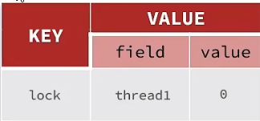

可重用锁的流程图：

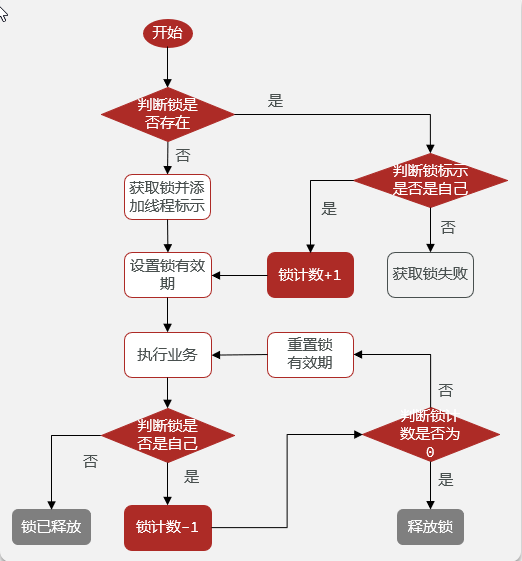

源码部分

```java
<T> RFuture<T> tryLockInnerAsync(long waitTime, long leaseTime, TimeUnit unit, long threadId, RedisStrictCommand<T> command) {
    internalLockLeaseTime = unit.toMillis(leaseTime);

    return evalWriteAsync(getName(), LongCodec.INSTANCE, command,
            "if (redis.call('exists', KEYS[1]) == 0) then " +
                    "redis.call('hincrby', KEYS[1], ARGV[2], 1); " +
                    "redis.call('pexpire', KEYS[1], ARGV[1]); " +
                    "return nil; " +
                    "end; " +
                    "if (redis.call('hexists', KEYS[1], ARGV[2]) == 1) then " +
                    "redis.call('hincrby', KEYS[1], ARGV[2], 1); " +
                    "redis.call('pexpire', KEYS[1], ARGV[1]); " +
                    "return nil; " +
                    "end; " +
                    "return redis.call('pttl', KEYS[1]);",
            Collections.singletonList(getName()), internalLockLeaseTime, getLockName(threadId));
}
```

lua脚本(获取锁)

```lua
local key = KEYS[1]; -- 锁的key
local threadId = ARGV[1]; -- 线程唯一标识
local releaseTime = ARGV[2]; -- 锁的自动释放时间


if(redis.call("exist",key) == 0) then
    -- 不存在获取锁
    redis.call("HSET",key,threadId,'1');
    -- 设置有效期限
    redis.call("expire",key,releaseTime);
    return 1
end

-- 判断是否是当前的锁
if(redis.call("hexists",key,threadId) == 1) then
    -- 是当前的锁
    redis.call("hincrby",key,threadId,'1');
    -- 设置有效期限
    redis.call("expire",key,releaseTime);
    return 1
end
-- 不是当前锁
return 0
```

lua脚本（释放锁）

```lua
local key = KEYS[1]; -- 锁的key
local threadId = ARGV[1]; -- 线程唯一标识
local releaseTime = ARGV[2]; -- 锁的自动释放时间
-- 判断当前锁的主人
if(redis.call("hexists",key,threadId) == 1) then
    -- 是的话
    local count = redis.call("hincrby",key,threadId,'-1');
    -- 判断当前锁是否已经到 0
    if(count > 0) then
        redis.call("expire",key,releaseTime);
        return nil;
    else
        redis.call("del",key);
        return nil;
    end
end

return nil;
```

### 可重试和超时续约

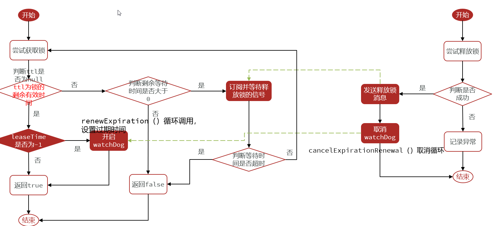

获取锁：

判断ttl == null ，是的话获取锁成功，并且leaseTime = -1 触发看门狗机制，一直更新Redis超时释放时间

```java
public boolean tryLock(long waitTime, long leaseTime, TimeUnit unit) throws InterruptedException {
    long time = unit.toMillis(waitTime);
    long current = System.currentTimeMillis();
    long threadId = Thread.currentThread().getId();
    Long ttl = tryAcquire(waitTime, leaseTime, unit, threadId);
    // lock acquired
    if (ttl == null) {
        return true;
}
    
        private RFuture<Boolean> tryAcquireOnceAsync(long waitTime, 
                                                     long leaseTime, TimeUnit unit, long threadId) {
        if (leaseTime != -1) {
            return tryLockInnerAsync(waitTime, leaseTime, unit, threadId, RedisCommands.EVAL_NULL_BOOLEAN);
        }
        RFuture<Boolean> ttlRemainingFuture = tryLockInnerAsync(waitTime,
     //leaseTime = -1 触发看门狗机制
 commandExecutor.getConnectionManager().getCfg().getLockWatchdogTimeout(),
 TimeUnit.MILLISECONDS, threadId, RedisCommands.EVAL_NULL_BOOLEAN);
```

ttl不是null的话判断等待时间是否大于0，不大于0 获取锁失败

```java
public boolean tryLock(long waitTime, long leaseTime, TimeUnit unit) throws InterruptedException {
	...
    time -= System.currentTimeMillis() - current;
    if (time <= 0) {
        acquireFailed(waitTime, unit, threadId);
        return false;
    }
    ...
}
```

剩余时间大于0时，订阅并且等待释放锁的信号，等待时间超过最大等待时间后还没有释放锁

```java
RFuture<RedissonLockEntry> subscribeFuture = subscribe(threadId);
   if (!subscribeFuture.await(time, TimeUnit.MILLISECONDS)) {
       if (!subscribeFuture.cancel(false)) {
           subscribeFuture.onComplete((res, e) -> {
               if (e == null) {
                   unsubscribe(subscribeFuture, threadId);
               }
           });
       }
       acquireFailed(waitTime, unit, threadId);
       return false;
   }
```

释放锁发出信号时，判断等待时间是否已经超时，超时的话获取锁失败

```java
time -= System.currentTimeMillis() - current;
if (time <= 0) {
    acquireFailed(waitTime, unit, threadId);
    return false;
}
```

等待时间没有超时的话重新尝试获取锁，判断ttl是否为null

```java
    while (true) {
        long currentTime = System.currentTimeMillis();
        ttl = tryAcquire(waitTime, leaseTime, unit, threadId);
        // lock acquired
        if (ttl == null) {
            return true;
        }

        time -= System.currentTimeMillis() - currentTime;
        if (time <= 0) {
            acquireFailed(waitTime, unit, threadId);
            return false;
        }

        // waiting for message
        currentTime = System.currentTimeMillis();
        if (ttl >= 0 && ttl < time) {
            //等待释放时间
            subscribeFuture.getNow().getLatch().tryAcquire(ttl, TimeUnit.MILLISECONDS);
        } else {
            //等待最大剩余时间
            subscribeFuture.getNow().getLatch().tryAcquire(time, TimeUnit.MILLISECONDS);
        }

        time -= System.currentTimeMillis() - currentTime;
        if (time <= 0) {
            acquireFailed(waitTime, unit, threadId);
            return false;
        }
    }
} finally {
    unsubscribe(subscribeFuture, threadId);
}
```

获取锁成功后：

```java
// lock acquired
if (ttlRemaining) {
    //更新过期时间
    scheduleExpirationRenewal(threadId);
}

private void scheduleExpirationRenewal(long threadId) {
    ExpirationEntry entry = new ExpirationEntry();
    ExpirationEntry oldEntry = EXPIRATION_RENEWAL_MAP.putIfAbsent(getEntryName(), entry);
    if (oldEntry != null) {
        oldEntry.addThreadId(threadId);
    } else {
        entry.addThreadId(threadId);
        // 循环调用更新有效期
        renewExpiration();
    }
}
private void renewExpiration() {
    ExpirationEntry ee = EXPIRATION_RENEWAL_MAP.get(getEntryName());
    if (ee == null) {
        return;
    }
    
    Timeout task = commandExecutor.getConnectionManager().newTimeout(new TimerTask() {
        @Override
        public void run(Timeout timeout) throws Exception {
            ExpirationEntry ent = EXPIRATION_RENEWAL_MAP.get(getEntryName());
            if (ent == null) {
                return;
            }
            Long threadId = ent.getFirstThreadId();
            if (threadId == null) {
                return;
            }
            
            RFuture<Boolean> future = renewExpirationAsync(threadId);
            future.onComplete((res, e) -> {
                if (e != null) {
                    log.error("Can't update lock " + getName() + " expiration", e);
                    return;
                }
                
                if (res) {
                    // reschedule itself ------------------------------
                    renewExpiration();
                }
            });
        }
    }, internalLockLeaseTime / 3, TimeUnit.MILLISECONDS);
    
    ee.setTimeout(task);
}
```

释放锁：

尝试释放锁，失败的话记录异常信息，成功释放锁后，发送释放锁信息给订阅信号的线程

```java
@Override
public RFuture<Void> unlockAsync(long threadId) {
    RPromise<Void> result = new RedissonPromise<Void>();
    RFuture<Boolean> future = unlockInnerAsync(threadId);
}
protected RFuture<Boolean> unlockInnerAsync(long threadId) {
    return evalWriteAsync(getName(), LongCodec.INSTANCE, RedisCommands.EVAL_BOOLEAN,
            "if (redis.call('hexists', KEYS[1], ARGV[3]) == 0) then " +
                    "return nil;" +
                    "end; " +
                    "local counter = redis.call('hincrby', KEYS[1], ARGV[3], -1); " +
                    "if (counter > 0) then " +
                    "redis.call('pexpire', KEYS[1], ARGV[2]); " +
                    "return 0; " +
                    "else " +
                    "redis.call('del', KEYS[1]); " +
                     //发送订阅信息
                    "redis.call('publish', KEYS[2], ARGV[1]); " +
                    "return 1; " +
                    "end; " +
                    "return nil;",
            Arrays.asList(getName(), getChannelName()), LockPubSub.UNLOCK_MESSAGE, internalLockLeaseTime, getLockName(threadId));
}
```

取消看门狗机制 结束

```java
@Override
public RFuture<Void> unlockAsync(long threadId) {
    RPromise<Void> result = new RedissonPromise<Void>();
    RFuture<Boolean> future = unlockInnerAsync(threadId);

    future.onComplete((opStatus, e) -> {
        //取消循环更新过期时间
        cancelExpirationRenewal(threadId);

        if (e != null) {
            result.tryFailure(e);
            return;
        }

        if (opStatus == null) {
            IllegalMonitorStateException cause = new IllegalMonitorStateException("attempt to unlock lock, not locked by current thread by node id: "
                    + id + " thread-id: " + threadId);
            result.tryFailure(cause);
            return;
        }
        result.trySuccess(null);
    });

    return result;
}
```

总结：

Redisson分布式锁原理：

•	**可重入**：利用hash结构记录线程id和重入次数

•	**可重试**：利用信号量和PubSub功能实现等待、唤醒，获取锁失败的重试机制

•	**超时续约**：利用watchDog，每隔一段时间（releaseTime / 3），重置超时时间

### 主从一致性

Redisson分布式锁主从一致性问题

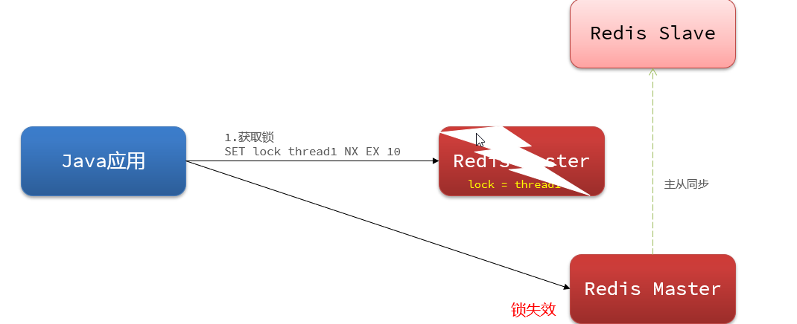

```java
 @Override
    public boolean tryLock(long waitTime, long leaseTime, TimeUnit unit) throws InterruptedException {
        long newLeaseTime = -1;
        if (leaseTime != -1) {
            if (waitTime == -1) {
                newLeaseTime = unit.toMillis(leaseTime);
            } else {
                newLeaseTime = unit.toMillis(waitTime)*2;
            }
        }
        
        long time = System.currentTimeMillis();
        long remainTime = -1;
        if (waitTime != -1) {
            remainTime = unit.toMillis(waitTime);
        }
        long lockWaitTime = calcLockWaitTime(remainTime);
        
        int failedLocksLimit = failedLocksLimit();
        //创建可用锁的集合
        List<RLock> acquiredLocks = new ArrayList<>(locks.size());
        //遍历当前所有Redis的锁 
        for (ListIterator<RLock> iterator = locks.listIterator(); iterator.hasNext();) {
            RLock lock = iterator.next();
            boolean lockAcquired;
            try {
                if (waitTime == -1 && leaseTime == -1) {
                    lockAcquired = lock.tryLock();
                } else {
                    long awaitTime = Math.min(lockWaitTime, remainTime);
                    //尝试获取锁
                    lockAcquired = lock.tryLock(awaitTime, newLeaseTime, TimeUnit.MILLISECONDS);
                }
            } catch (RedisResponseTimeoutException e) {
                //获取锁失败的话，清除所有已经获取到的锁
                unlockInner(Arrays.asList(lock));
                lockAcquired = false;
            } catch (Exception e) {
                lockAcquired = false;
            }
            
            if (lockAcquired) {
                //获取锁成功
                acquiredLocks.add(lock);
            } else {
                //获取锁失败，判断当前可用锁的个数是否已经等于Redis锁
                if (locks.size() - acquiredLocks.size() == failedLocksLimit()) {
                    //等于，结束循环
                    break;
                }
				//不等于 清空可用锁
                if (failedLocksLimit == 0) {
                    unlockInner(acquiredLocks);
                    //不进行重试 直接结束
                    if (waitTime == -1) {
                        return false;
                    }
                    //重试 清空可用锁
                    failedLocksLimit = failedLocksLimit();
                    acquiredLocks.clear();
                    // reset iterator
                    //将迭代器指针指向第一，重新获取锁
                    while (iterator.hasPrevious()) {
                        iterator.previous();
                    }
                } else {
                    failedLocksLimit--;
                }
            }
            
            if (remainTime != -1) {
                remainTime -= System.currentTimeMillis() - time;
                time = System.currentTimeMillis();
                if (remainTime <= 0) {
                    unlockInner(acquiredLocks);
                    return false;
                }
            }
        }

        if (leaseTime != -1) {
            List<RFuture<Boolean>> futures = new ArrayList<>(acquiredLocks.size());
            //遍历所有可用锁重新设置使用时间
            for (RLock rLock : acquiredLocks) {
                RFuture<Boolean> future = ((RedissonLock) rLock).expireAsync(unit.toMillis(leaseTime), TimeUnit.MILLISECONDS);
                futures.add(future);
            }
            
            for (RFuture<Boolean> rFuture : futures) {
                rFuture.syncUninterruptibly();
            }
        }
        
        return true;
    }
```

## 消息队列

**消息队列**（**M**essage **Q**ueue），字面意思就是存放消息的队列。最简单的消息队列模型包括3个角色：

* 消息队列：存储和管理消息，也被称为消息代理（Message Broker）

* 生产者：发送消息到消息队列

* 消费者：从消息队列获取消息并处理消息

Redis提供了三种不同的方式来实现消息队列：

* list结构：基于List结构模拟消息队列

* PubSub：基本的点对点消息模型

* Stream：比较完善的消息队列模型

### Stream

**Stream** 是 Redis 5.0 引入的一种新数据类型，可以实现一个功能非常完善的消息队列。

**发送消息**：

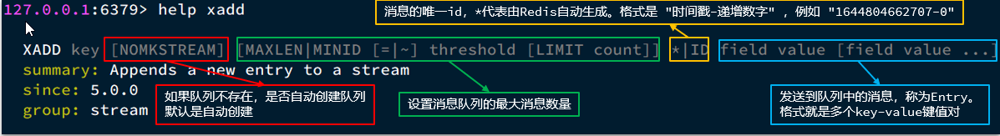

例如：

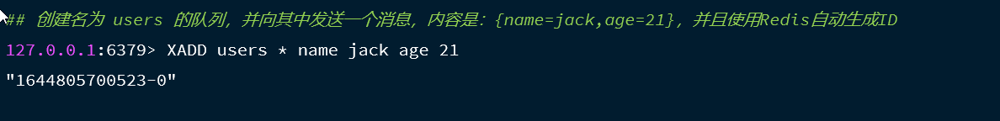

读取消息：

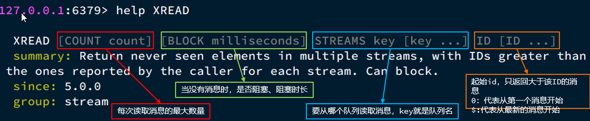

例如，使用XREAD读取第一个消息：

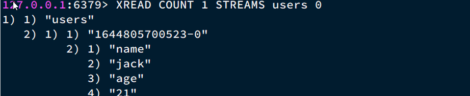

XREAD阻塞方式，读取最新的消息：


> 当我们指定起始ID为$时，代表读取最新的消息，如果我们处理一条消息的过程中，又有超过1条以上的消息到达队列，则下次获取时也只能获取到最新的一条，会出现**漏读消息**的问题。

因此使用消费者组更加灵活。

### 消费者组

**消费者组**（Consumer Group）：将多个消费者划分到一个组中，监听同一个队列。具备下列特点：

1. 消息分流： 队列中的消息会分流给组内的不同消费者，而不是重复消费，从而加快消息处理的速度；
2. 消息标示：消费者组会维护一个标示，记录最后一个被处理的消息，哪怕消费者宕机重启，还会从标示之后读取消息。确保每一个消息都会被消费；
3. 消息确认： 消费者获取消息后，消息处于pending状态，并存入一个pending-list。当处理完成后需要通过XACK来确认消息，标记消息为已处理，才会从pending-list移除。

创建消费者组：


* key：队列名称

* groupName：消费者组名称

* ID：起始ID标示，$代表队列中最后一个消息，0则代表队列中第一个消息

* MKSTREAM：队列不存在时自动创建队列

从消费者组读取消息：


* group：消费组名称

* consumer：消费者名称，如果消费者不存在，会自动创建一个消费者

* count：本次查询的最大数量

* BLOCK milliseconds：当没有消息时最长等待时间

* NOACK：无需手动ACK，获取到消息后自动确认

* STREAMS key：指定队列名称

* ID：获取消息的起始ID：

* ">"：从下一个未消费的消息开始

* 其它：根据指定id从pending-list中获取已消费但未确认的消息，例如0，是从pending-list中的第一个消息开始

**总结**

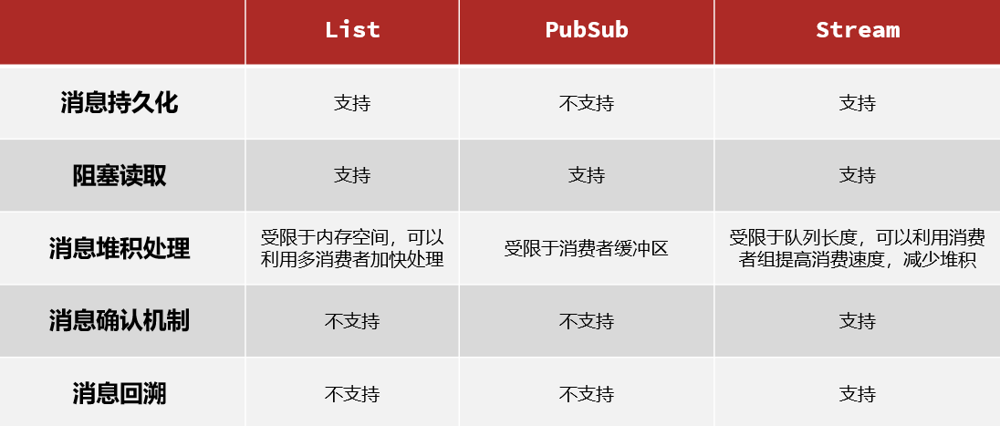

### 异步秒杀

需求：

①	创建一个Stream类型的消息队列，名为stream.orders

②	修改之前的秒杀下单Lua脚本，在认定有抢购资格后，直接向stream.orders中添加消息，内容包含voucherId、userId、orderId

③	项目启动时，开启一个线程任务，尝试获取stream.orders中的消息，完成下单

业务逻辑代码：

```java
@Override
public Result seckillVoucher(Long voucherId) {
    Long userId = UserHolder.getUser().getId();
    Long orderId = redisIdWorker.nextId("order");
    //执行lua
    Long result = stringRedisTemplate.execute(
            SECKILL_SCRIPT,
            Collections.emptyList(),
            voucherId.toString(), userId.toString(), orderId.toString()
    );
    //判断结果 不为 0 返回异常信息
    int r = result.intValue();
    if (r != 0) {
        return Result.fail(r == 1 ? "库存不足！" : "不能重复购买！");
    }
    //为0 将优惠券存入stream队列
    //返回订单ID
    return Result.ok(orderId);
}
```

1. 创建队列和消费者组


2. 修改lua脚本 

```lua
-- 1 参数
local voucherId = ARGV[1]
local userId = ARGV[2]
-- 订单Id
local id = ARGV[3]
-- 2 判断库存是否充足
local stockKey = "seckill:stock:" .. voucherId
local orderKey = "seckill:order:" ..  userId
if(tonumber(redis.call("get",stockKey)) <= 0) then
    return 1
end
--判断用户是否下单
if(redis.call("SISMEMBER",orderKey,userId) == 1) then
    return 2
end
-- 扣减库存
redis.call("incrby",stockKey,-1)
redis.call("sadd",orderKey,userId)
-- 推送订单到队列 实现异步更新数据库
-- 向队列 中添加消息
redis.call("xadd","stream.orders","*","userId",userId,"voucherId",voucherId,"id",id)
return 0
```

消费者监听消息：

```java
private class VoucherHandler implements Runnable {
    @Override
    public void run() {
        while (true) {
            try {
                // 读取队列消息
                List<MapRecord<String, Object, Object>> list = stringRedisTemplate.opsForStream().read(
                        Consumer.from("g1", "c1"),
                        StreamReadOptions.empty().count(1).block(Duration.ofSeconds(2)),
                        StreamOffset.create("stream.orders", 
											//	读取未读取的消息
                                            ReadOffset.lastConsumed())
                );
                // 如果为空表示队列中没消息，再次读取
                if (list == null || list.isEmpty()) {
                    continue;
                }
                // 如果不为空封装队列信息
                MapRecord<String, Object, Object> record = list.get(0);

                Map<Object, Object> value = record.getValue();

                VoucherOrder voucherOrder = BeanUtil.fillBeanWithMap(value, new VoucherOrder(), true);
                // 创建订单
                creatOrder(voucherOrder);
                // ACK确认机制 没确认成功或者出现异常，则处理pending-list
                stringRedisTemplate.opsForStream().acknowledge("stream.orders", "g1", record.getId());
            } catch (InterruptedException e) {
                e.printStackTrace();
                handlerPendingList();
            }
        }
    }

    private void handlerPendingList() {
        //取出订单出现异常
        while (true) {
            try {
                // 读取队列消息 从pending-list的第一个数据 开始处理
                List<MapRecord<String, Object, Object>> list = stringRedisTemplate.opsForStream().read(
                        Consumer.from("g1", "c1"),
                        StreamReadOptions.empty().count(1),
                        StreamOffset.create("stream.orders", ReadOffset.from("0"))
                );
                // 如果为空继续没有问题
                if (list == null || list.isEmpty()) {
                    break;
                }
                // 如果不为空 进行封装
                MapRecord<String, Object, Object> record = list.get(0);
                Map<Object, Object> value = record.getValue();
                VoucherOrder voucherOrder = BeanUtil.fillBeanWithMap(value, new VoucherOrder(), true);
                // 创建订单
                creatOrder(voucherOrder);
            } catch (InterruptedException e) {
                e.printStackTrace();
            }

        }
    }
}
```

## 达人探店

### 点赞

需求：

•	同一个用户只能点赞一次，再次点击则取消点赞

•	如果当前用户已经点赞，则点赞按钮高亮显示（前端已实现，判断字段Blog类的isLike属性）

业务逻辑：

```java
@Override
public Result likeBlog(Long id) {
    Long userId = UserHolder.getUser().getId();
    String key = "blog:liked:" + id;
    Double score = stringRedisTemplate.opsForZSet().score(key, userId.toString());
    if (score != null) {
        // 数据库存在 用户点过赞，取消点赞
        boolean flag1 = update().setSql("liked = liked -1").eq("id", id).update();
        if (flag1) {
            stringRedisTemplate.opsForZSet().remove(key, userId.toString());
        }
    } else {
        // 不存在 点赞
        boolean flag2 = update().setSql("liked = liked + 1").eq("id", id).update();
        if (flag2) {
            stringRedisTemplate.opsForZSet().add(key, userId.toString(), System.currentTimeMillis());
        }
    }
    return Result.ok();
}
```

1. 点赞，修改数据库信息，向redis中插入当前blog的点赞用户id
2. 取消点赞，修改数据库信息，删除redis中blog的点赞用户id

> 使用ZSet为点赞排行榜使用

### 点赞排行榜

需求：按照点赞时间先后排序，返回Top5的用户

```java
@Override
public Result blogLikes(Long id) {
    String key = "blog:liked:" + id;
    //查询前五名点赞userId
    Set<String> userIds = stringRedisTemplate.opsForZSet().range(key, 0, 4);
    if (userIds == null || userIds.isEmpty()) {
        return Result.ok();
    }
    List<String> ids = userIds.stream().map(String::valueOf).collect(Collectors.toList());
    //查询点赞人数据
    LambdaQueryWrapper<User> queryWrapper = new LambdaQueryWrapper<>();
    queryWrapper.in(User::getId, ids);
    //ids集合为排序后的用户id，通过‘，’拼接成字符串
    String join = StrUtil.join(",", ids);
    //使用field 进行手动排序
    queryWrapper.last("order by field(id," + join + ")");
    List<User> users = userService.list(queryWrapper);
    //升序排列
    List<UserDTO> userDTOS = users.stream().map(user -> BeanUtil.copyProperties(user, UserDTO.class)).collect(Collectors.toList());

    return Result.ok(userDTOS);
}
```

1. Redis中SortedSet用时间做排序，先点赞的显示在前
2. 在查询数据库中使用listByIds时SQL语句为in，没有进行排序；因此需要修改SQL语句。

## 好友关注

### 关注和取关

**需求**：基于该表数据结构，实现两个接口：

①	关注和取关接口

②	判断是否关注的接口

```java
@Override
public Result follow(String id, Boolean isFollow) {
    Long userId = UserHolder.getUser().getId();
    String key = "follow:" + userId;
    // 判断是否关注
    if (!isFollow) {
        //关注删除 数据
        LambdaQueryWrapper<Follow> queryWrapper = new LambdaQueryWrapper<>();
        queryWrapper.eq(Follow::getUserId,userId).eq(Follow::getFollowUserId,id);
        boolean flag = remove(queryWrapper);
        if (flag) {
            stringRedisTemplate.opsForSet().remove(key,id);
        }
    }else {
        //未关注插入数据
        Follow follow = new Follow();
        follow.setUserId(userId);
        follow.setFollowUserId(Long.valueOf(id));
        boolean flag = save(follow);
        if (flag) {
            stringRedisTemplate.opsForSet().add(key,id);
        }
    }
    return Result.ok();
}
```

1. 取关，删除数据库数据，删除Redis数据
2. 关注，新增数据库数据，新增Redis数据
3. 数据库表为中间表，关注是多对多
4. 以当前用户id为key，关注着id为value存储在Redis

> set集合有并交集功能，为共同关注使用

### 共同关注

**需求**：利用Redis中恰当的数据结构，实现共同关注功能。在博主个人页面展示出当前用户与博主的共同好友

```java
@Override
public Result common(Long id) {
    Long userId = UserHolder.getUser().getId();
    //当前用户id
    String key1 = "follow:" + userId;
    String key2 = "follow:" + id;
    // 查询当前用户关注id的交集
    Set<String> intersect = stringRedisTemplate.opsForSet().intersect(key1, key2);
    if(intersect == null || intersect.isEmpty()){
        return Result.ok(Collections.emptyList());
    }
    List<Long> ids = intersect.stream().map(Long::valueOf).collect(Collectors.toList());
    List<UserDTO> userDTOS = userService.listByIds(ids).stream()
            .map(user -> BeanUtil.copyProperties(user, UserDTO.class))
            .collect(Collectors.toList());

    return Result.ok(userDTOS);
}
```

1. 当前用户存储的关注者Id与访问用户存储的关注者Id做交集，得到共同好友

### 关注推送

关注推送也叫做Feed流，直译为投喂。为用户持续的提供“沉浸式”的体验，通过无限下拉刷新获取新的信息。

Feed流产品有两种常见模式：

* **Timeline**：不做内容筛选，简单的按照内容发布时间排序，常用于好友或关注。例如朋友圈

  Ø	优点：信息全面，不会有缺失。并且实现也相对简单

  Ø	缺点：信息噪音较多，用户不一定感兴趣，内容获取效率低

* **智能排序**：利用智能算法屏蔽掉违规的、用户不感兴趣的内容。推送用户感兴趣信息来吸引用户

  Ø	优点：投喂用户感兴趣信息，用户粘度很高，容易沉迷

  Ø	缺点：如果算法不精准，可能起到反作用

**推模式：**

使用**SortedSet**类型。发送的消息直接推送到粉丝的收件箱中。

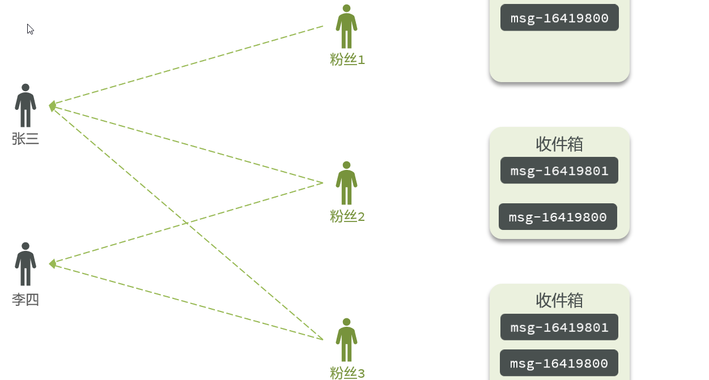 

**需求**：

①	修改新增探店笔记的业务，在保存blog到数据库的同时，推送到粉丝的收件箱

②	收件箱满足可以根据时间戳排序，必须用Redis的数据结构实现

③	查询收件箱数据时，可以实现分页查询

> Feed流的滚动分页：
>
> Feed流中的数据会不断更新，所以数据的角标也在变化，因此不能采用传统的分页模式。

1. 修改发布blog接口

```java
@Override
public Result saveBlog(Blog blog) {
    // 获取登录用户
    UserDTO user = UserHolder.getUser();
    Long userId = user.getId();
    blog.setUserId(userId);
    // 保存探店博文
    boolean flag = save(blog);
    if (flag) {
        //获取当前用户所有粉丝ID
        LambdaQueryWrapper<Follow> queryWrapper = new LambdaQueryWrapper<>();
        queryWrapper.eq(Follow::getFollowUserId,userId);
        List<Follow> followList = followService.list(queryWrapper);
        for (Follow follow : followList) {
            Long fansId = follow.getUserId();
            String key = "feed:" + fansId;
            //每个粉丝的收件箱中保存当前blogId
            stringRedisTemplate.opsForZSet().add(key,blog.getId().toString(),System.currentTimeMillis());
        }
    }
    // 返回id
    return Result.ok(blog.getId());
}
```

2. 数据会自动通过时间排序，实现滚动分页查询

```java
@Override
public Result queryByScroll(Long max, Long offset) {
    Long userId = UserHolder.getUser().getId();
    String key = "feed:" + userId;
    //查询收件箱 通过时间排序
    Set<ZSetOperations.TypedTuple<String>> typedTuples = stringRedisTemplate.opsForZSet()
        					// 默认一页两条数据
            .reverseRangeByScoreWithScores(key, 0, max, offset, 2);
    if(typedTuples == null || typedTuples.isEmpty()){
        return Result.ok();
    }
    //解析： blogId，minTime，offset
    ArrayList<String> ids = new ArrayList<>(typedTuples.size());
    Double minTime = 0D;
    int os = 1;
    //遍历收件箱信息
    for (ZSetOperations.TypedTuple<String> typedTuple : typedTuples) {
        String id = typedTuple.getValue();
        ids.add(id);
        Double score = typedTuple.getScore();
        // 出现相同score 偏移量加一
        if( minTime.equals(score)){
            os++;
        }else {
            // 将最后一条数据设置为最小值 重新计算偏移量
            minTime = typedTuple.getScore();
            os = 1;
        }
    }
    //查询blog信息
    LambdaQueryWrapper<Blog> queryWrapper = new LambdaQueryWrapper<>();
    queryWrapper.in(Blog::getId, ids);
    String join = StrUtil.join(",", ids);
    queryWrapper.last("order by field(id," + join + ")");
    List<Blog> blogs = list(queryWrapper);
    for (Blog blog : blogs) {
        Long userId1 = blog.getUserId();
        User user = userService.getById(userId1);
        blog.setName(user.getNickName());
        blog.setIcon(user.getIcon());
        blog.setIsLike(isLiked(blog.getId()));
    }
    //封装Scroll
    ScrollResult scrollResult = new ScrollResult();
    scrollResult.setList(blogs);
    scrollResult.setMinTime(minTime.longValue());
    scrollResult.setOffset(os);
    return Result.ok(scrollResult);
}
```

## 附近店铺

GEO就是Geolocation的简写形式，代表地理坐标。Redis在3.2版本中加入了对GEO的支持，允许存储地理坐标信息，帮助我们根据经纬度来检索数据。常见的命令有：

[GEOADD](https://redis.io/commands/geoadd)：添加一个地理空间信息，包含：经度（longitude）、纬度（latitude）、值（member）

[GEODIST](https://redis.io/commands/geodist)：计算指定的两个点之间的距离并返回

[GEOHASH](https://redis.io/commands/geohash)：将指定member的坐标转为hash字符串形式并返回

[GEOPOS](https://redis.io/commands/geopos)：返回指定member的坐标

[GEORADIUS](https://redis.io/commands/georadius)：指定圆心、半径，找到该圆内包含的所有member，并按照与圆心之间的距离排序后返回。6.2以后已废弃

[GEOSEARCH](https://redis.io/commands/geosearch)：在指定范围内搜索member，并按照与指定点之间的距离排序后返回。范围可以是圆形或矩形。6.2.新功能

[GEOSEARCHSTORE](https://redis.io/commands/geosearchstore)：与GEOSEARCH功能一致，不过可以把结果存储到一个指定的key。 6.2.新功能

### 附近店铺搜索

将附近店铺分类并且存入Redis

```java
@Test
void test2() {
    List<Shop> shopList = shopService.list();
    //类型分组
    Map<Long, List<Shop>> map = shopList.stream().collect(Collectors.groupingBy(Shop::getTypeId));
    Set<Map.Entry<Long, List<Shop>>> entries = map.entrySet();
    //遍历每个类型的集合
    for (Map.Entry<Long, List<Shop>> entry : entries) {
        //获取当前类型id
        Long typeId = entry.getKey();
        //当前类型商店数
        List<Shop> shops = entry.getValue();
        String key = "shop:geo:" + typeId;
        //储存地理坐标对象的创建
        List<RedisGeoCommands.GeoLocation<String>> locations  = new ArrayList<>(shops.size());
        //所有商店转换为地理坐标对象
        for (Shop shop : shops) {
            locations.add(new RedisGeoCommands.GeoLocation<>(
                    shop.getId().toString(),
                    new Point(shop.getX(),shop.getY())
            ));
        }
        //当前类型所有商店的地理坐标对象存入redis的Geo类型中
        stringRedisTemplate.opsForGeo().add(key,locations);
    }
}
```

Redis底层会将坐标转换为score值

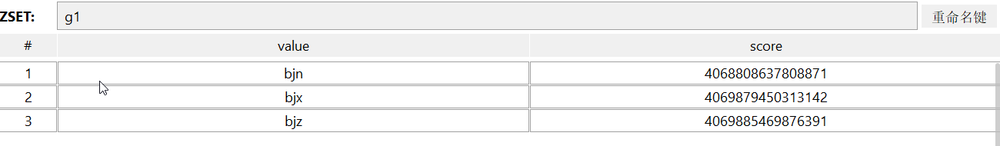

案例：

搜索附近商店

```java
@Override
public Result queryShopByType(Integer typeId, Integer current, Double x, Double y) {
    // 判断是否需要以坐标查询

    if (x == null || y == null) {
        // 根据类型分页查询
        Page<Shop> page = query()
                .eq("type_id", typeId)
                .page(new Page<>(current, SystemConstants.DEFAULT_PAGE_SIZE));
        // 返回数据
        return Result.ok(page.getRecords());
    }
    //计算分页参数
    int from = (current - 1) * SystemConstants.DEFAULT_PAGE_SIZE;
    int end = current * SystemConstants.DEFAULT_PAGE_SIZE;
    //查询redis 按照距离排序、分页
    String key = "shop:geo:" + typeId;
    GeoResults<RedisGeoCommands.GeoLocation<String>> search = stringRedisTemplate.opsForGeo()
            .search(
                    key,
        			//当前位置坐标
                    GeoReference.fromCoordinate(x, y),
        			//5000米为半径
                    new Distance(5000),
        			//获取距离数据，一页限制数量
                    RedisGeoCommands.GeoSearchCommandArgs.newGeoSearchArgs().includeDistance().limit(end)
    );
    if(search == null){
        return Result.ok();
    }
    //解析出id
    List<GeoResult<RedisGeoCommands.GeoLocation<String>>> list = search.getContent();
    ArrayList<Long> ids = new ArrayList<>(list.size());
    HashMap<String, Distance> map = new HashMap<>(list.size());
    // 当前数据个数小于开始读取的数据位置，表示数据已经加载完
    if(list.size() <= from){
        return Result.ok(Collections.emptyList());
    }
    //跳过前面获取过的数据
    list.stream().skip(from).forEach(result ->{
        String id = result.getContent().getName();
        ids.add(Long.valueOf(id));
        @NonNull Distance distance = result.getDistance();
        map.put(id,distance);
    });
    //根据id查询shop
    LambdaQueryWrapper<Shop> queryWrapper = new LambdaQueryWrapper<>();
    queryWrapper.in(Shop::getId, ids);
    String join = StrUtil.join(",", ids);
    queryWrapper.last("order by field(id," + join + ")");
    List<Shop> shops = list(queryWrapper);
    shops.forEach(shop -> shop.setDistance(map.get(shop.getId().toString()).getValue()));
    return Result.ok(shops);
}
```

## 用户签到

### BitMap用法

把每一个bit位对应当月的每一天，形成了映射关系。用0和1标示业务状态，这种思路就称为位图（**BitMap**）。

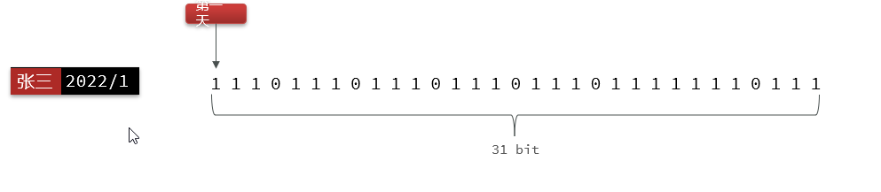

**Redis**是利用string类型数据结构实现**BitMap**，因此最大上限是512M，转换为bit则是 2^32个bit位。

BitMap的操作命令有：

[SETBIT](https://redis.io/commands/setbit)：向指定位置（offset）存入一个0或1

[GETBIT](https://redis.io/commands/getbit) ：获取指定位置（offset）的bit值

[BITCOUNT](https://redis.io/commands/bitcount) ：统计BitMap中值为1的bit位的数量

[BITFIELD](https://redis.io/commands/bitfield) ：操作（查询、修改、自增）BitMap中bit数组中的指定位置（offset）的值

[BITFIELD_RO](https://redis.io/commands/bitfield_ro) ：获取BitMap中bit数组，并以十进制形式返回

[BITOP](https://redis.io/commands/bitop) ：将多个BitMap的结果做位运算（与 、或、异或）

[BITPOS](https://redis.io/commands/bitpos) ：查找bit数组中指定范围内第一个0或1出现的位置

### 签到功能

需求：实现签到接口，将当前用户当天签到信息保存到Redis中

```java
@Override
public Result sign() {
    //获取当前用户
    Long userId = UserHolder.getUser().getId();
    //获取当前时间
    LocalDateTime now = LocalDateTime.now();
    String keySuffix = now.format(DateTimeFormatter.ofPattern(":yyyyMM"));
    String key ="sign:" + userId + keySuffix;
    //添加签到
    stringRedisTemplate.opsForValue().setBit(key,now.getDayOfMonth() - 1,true);
    return Result.ok();
}
```

BitMap底层为String类型

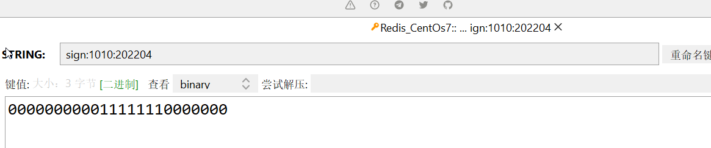

### 签到统计

1. 连续签到：

   从最后一次签到开始向前统计，直到遇到第一次未签到为止，计算总的签到次数，就是连续签到天数

2. 得到当月截止今天的所有签到次数：

   ~~~shell
   BITFIELD key GET u[dayOfMonth] 0
   ~~~

3. 从后向前遍历每个bit位：

   与 1 做与运算，就能得到最后一个bit位。随后右移1位，下一个bit位就成为了最后一个bit位。

**需求**：实现下面接口，统计当前用户截止当前时间在本月的连续签到天数

```java
@Override
public Result signCount() {
    //获取当前用户
    Long userId = UserHolder.getUser().getId();
    //获取当前时间
    LocalDateTime now = LocalDateTime.now();
    String keySuffix = now.format(DateTimeFormatter.ofPattern(":yyyyMM"));
    String key ="sign:" + userId + keySuffix;
    //获取当天
    int dayOfMonth = now.getDayOfMonth();
    List<Long> nums = stringRedisTemplate.opsForValue()
        .bitField(key,
                  BitFieldSubCommands.create().
                  //获取当天以前的数据
                  get(BitFieldSubCommands.BitFieldType.unsigned(dayOfMonth)).valueAt(0)

    );
    if(nums == null || nums.isEmpty()){
        return Result.ok(0);
    }
    // 十进制数据
    Long num = nums.get(0);
    if(num == null || num == 0){
        return Result.ok(0);
    }
    int count = 0;
    while (true){
        //最低位与1与运算
        if((num & 1)  == 0){
            break;
        }else {
            count++;
        }
        //将二进制数据向右移动一位
        num >>>= 1;
    }
    return Result.ok(count);
}
```

# 高级篇

## Redis持久化

* RDB持久化
  * RDB全称Redis Database Backup file（Redis数据备份文件），也被叫做Redis数据快照。简单来说就是把内存中的所有数据都记录到磁盘中。当Redis实例故障重启后，从磁盘读取快照文件，恢复数据。快照文件称为RDB文件，默认是保存在当前运行目录。
* AOF持久化
  * AOF全称为Append Only File（追加文件）。Redis处理的每一个写命令都会记录在AOF文件，可以看做是命令日志文件。

### RDB持久化

**执行时间**：

1. save命令（串行执行）
2. bgsave命令（并行执行）
3. Redis停机
4. 触发RDB条件

**原理：**

bgsave开始时会fork主进程得到子进程，子进程共享主进程的内存数据。完成fork后读取内存数据并写入 RDB 文件。

> 但是在读取数据时，主进程进行修改数据B，这时主进程进行copy-on-write修改数据B副本，并且读取数据B也是读取数据B副本。

fork采用的是copy-on-write技术：

- 当主进程执行读操作时，访问共享内存；
- 当主进程执行写操作时，则会拷贝一份数据，执行写操作。

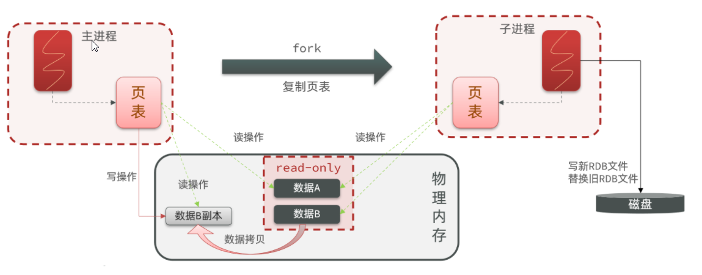

### AOF持久化

AOF全称为Append Only File（追加文件）。Redis处理的每一个写命令都会记录在AOF文件，可以看做是命令日志文件。

**配置：**AOF默认是关闭的，需要修改redis.conf配置文件来开启AOF：

```properties
# 是否开启AOF功能，默认是no
appendonly yes
# AOF文件的名称
appendfilename "appendonly.aof"
```

AOF的命令记录的频率也可以通过redis.conf文件来配：

```properties
# 表示每执行一次写命令，立即记录到AOF文件
appendfsync always 
# 写命令执行完先放入AOF缓冲区，然后表示每隔1秒将缓冲区数据写到AOF文件，是默认方案
appendfsync everysec 
# 写命令执行完先放入AOF缓冲区，由操作系统决定何时将缓冲区内容写回磁盘
appendfsync no
```

三种策略对比：

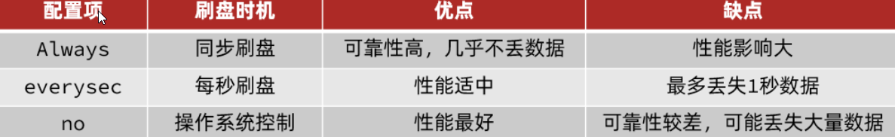

**原理：**

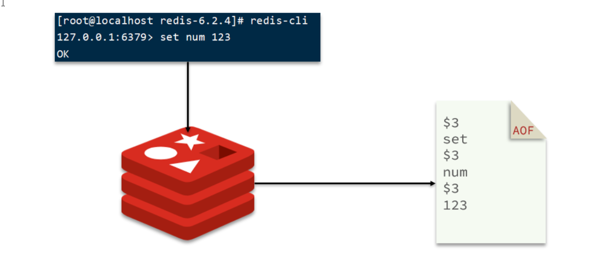

**AOF文件重写：**因为是记录命令，AOF文件会比RDB文件大的多。而且AOF会记录对同一个key的多次写操作，但只有最后一次写操作才有意义。通过执行bgrewriteaof命令，可以让AOF文件执行重写功能，用最少的命令达到相同效果。

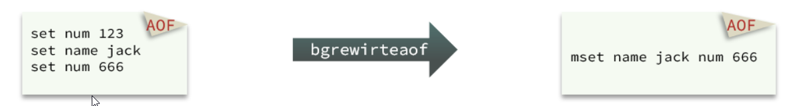

如图，AOF原本有三个命令，但是`set num 123 和 set num 666`都是对num的操作，第二次会覆盖第一次的值，因此第一个命令记录下来没有意义。

Redis也会在触发阈值时自动去重写AOF文件。阈值也可以在redis.conf中配置：

```properties
# AOF文件比上次文件 增长超过多少百分比则触发重写
auto-aof-rewrite-percentage 100
# AOF文件体积最小多大以上才触发重写 
auto-aof-rewrite-min-size 64mb 
```

### 持久化两者对比

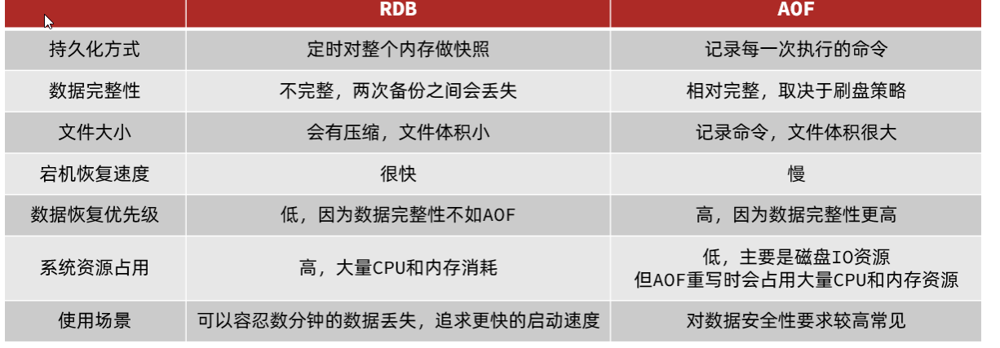

## Redis主从

单节点Redis的并发能力是有上限的，要进一步提高Redis的并发能力，就需要搭建主从集群，实现读写分离。

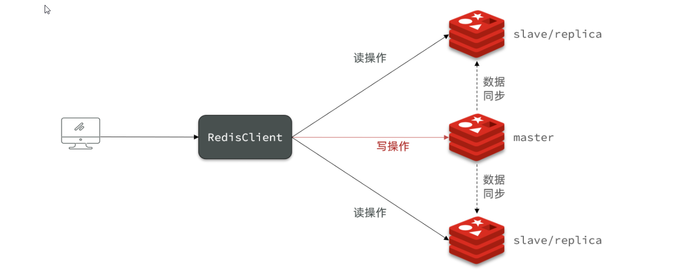

### 主从同步原理

* 全量同步
  * 主从第一次建立连接时，会执行**全量同步**，将master节点的所有数据都拷贝给slave节点，流程：
* 增量同步
  * 只更新slave与master存在差异的部分数据

#### **全量同步**

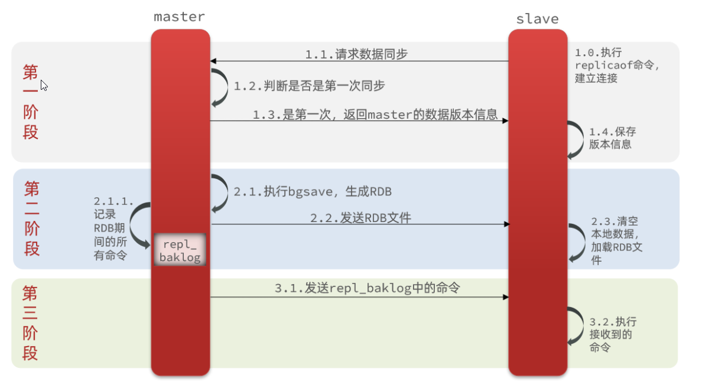

这里有一个问题，master如何得知salve是第一次来连接呢？？

1. master判断发现slave发送来的replid与自己的不一致，说明这是一个全新的slave，就知道要做全量同步了。

2. master会将自己的replid和offset都发送给这个slave，slave保存这些信息。以后slave的replid就与master一致了。因此，master判断一个节点是否是第一次同步的依据，就是看replid是否一致。

有几个概念，可以作为判断依据：

- **Replication Id**：简称replid，是数据集的标记，id一致则说明是同一数据集。每一个master都有唯一的replid，slave则会继承master节点的replid
- **offset**：偏移量，随着记录在repl_baklog中的数据增多而逐渐增大。slave完成同步时也会记录当前同步的offset。**如果slave的offset小于master的offset**，说明slave数据落后于master，需要更新。

因此slave做数据同步，必须向master声明自己的replication id 和offset，master才可以判断到底需要同步哪些数据。

完整流程描述：

- slave节点请求增量同步
- master节点判断replid，发现不一致，拒绝增量同步
- master将完整内存数据生成RDB，发送RDB到slave
- slave清空本地数据，加载master的RDB
- master将RDB期间的命令记录在repl_baklog，并持续将log中的命令发送给slave
- slave执行接收到的命令，保持与master之间的同步

#### **增量同步**

全量同步需要先做RDB，然后将RDB文件通过网络传输个slave，成本太高了。因此除了第一次做全量同步，其它大多数时候slave与master都是做**增量同步**。

什么是增量同步？就是只更新slave与master存在差异的部分数据。如图：

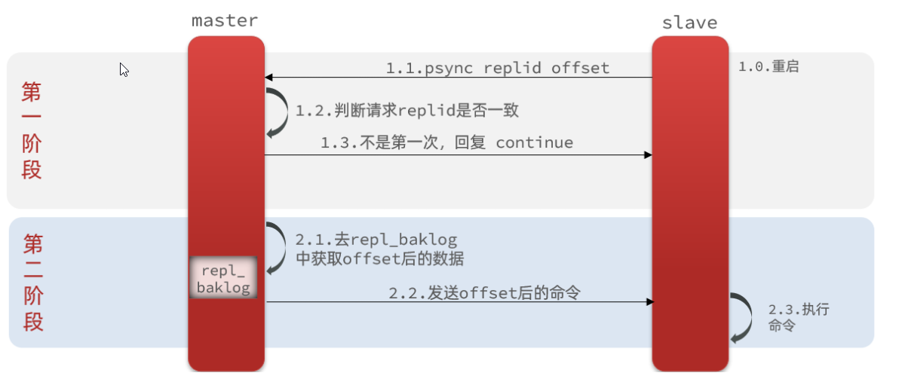

> 那么master怎么知道slave与自己的数据差异在哪里呢?

**repl_backlog原理:**

这个文件是一个固定大小的数组，只不过数组是环形，也就是说**角标到达数组末尾后，会再次从0开始读写**，这样数组头部的数据就会被覆盖。

repl_baklog中会记录Redis处理过的命令日志及offset，包括master当前的offset，和slave已经拷贝到的offset：

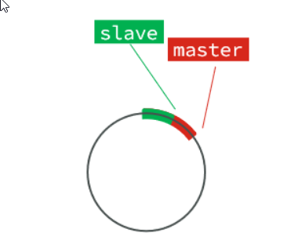


slave与master的offset之间的差异，就是salve需要增量拷贝的数据了。

随着不断有数据写入，master的offset逐渐变大，slave也不断的拷贝，追赶master的offset：

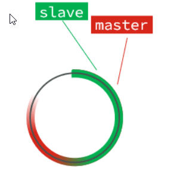

直到数组被填满：

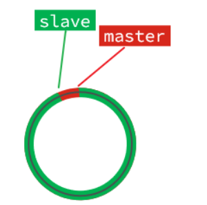

此时，如果有新的数据写入，就会覆盖数组中的旧数据。不过，旧的数据只要是绿色的，说明是已经被同步到slave的数据，即便被覆盖了也没什么影响。因为未同步的仅仅是红色部分。


> 但是，如果slave出现网络阻塞，导致master的offset远远超过了slave的offset： 


如果master继续写入新数据，其offset就会覆盖旧的数据，直到将slave现在的offset也覆盖：

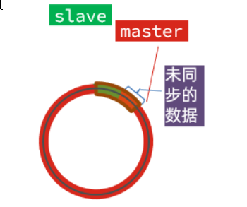

棕色框中的红色部分，就是尚未同步，但是却已经被覆盖的数据。此时如果slave恢复，需要同步，却发现自己的offset都没有了，无法完成增量同步了。只能做全量同步。

> repl_baklog文件大小有上限，如果写满会覆盖slave未读取的消息。如果slave宕机时间过长，就会出现数据未同步就被覆盖的情况，
>
> 因此需要进行全量同步。

#### 总结

简述全量同步和增量同步区别？

- 全量同步：master将完整内存数据生成RDB，发送RDB到slave。后续命令则记录在repl_baklog，逐个发送给slave。
- 增量同步：slave提交自己的offset到master，master获取repl_baklog中从offset之后的命令给slave

什么时候执行全量同步？

- slave节点第一次连接master节点时
- slave节点断开时间太久，repl_baklog中的offset已经被覆盖时

什么时候执行增量同步？

- slave节点断开又恢复，并且在repl_baklog中能找到offset时

## Redis哨兵

### 哨兵原理

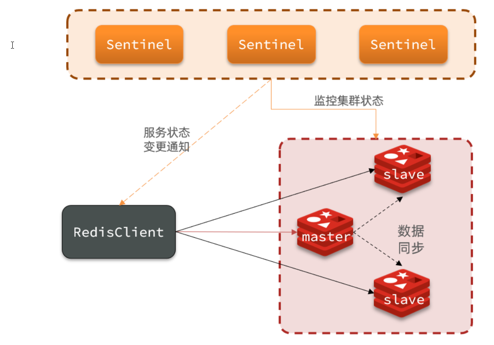

哨兵的作用如下：

- **监控**：Sentinel 会不断检查您的master和slave是否按预期工作
- **自动故障恢复**：如果master故障，Sentinel会将一个slave提升为master。当故障实例恢复后也以新的master为主
- **通知**：Sentinel充当Redis客户端的服务发现来源，当集群发生故障转移时，会将最新信息推送给Redis的客户端

#### 监控原理

Sentinel基于心跳机制监测服务状态，每隔1秒向集群的每个实例发送ping命令：

•	主观下线：如果某sentinel节点发现某实例未在规定时间响应，则认为该实例**主观下线**。

•	客观下线：若超过指定数量（quorum）的sentinel都认为该实例主观下线，则该实例**客观下线**。quorum值最好超过Sentinel实例数量的一半。

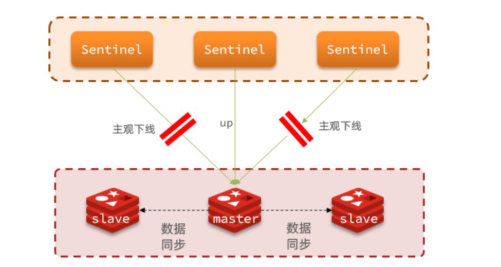

#### 故障回复原理

一旦发现master故障，sentinel需要在salve中选择一个作为新的master，选择依据是这样的：

- 首先会判断slave节点与master节点断开时间长短，如果超过指定值（down-after-milliseconds * 10）则会排除该slave节点
- 然后判断slave节点的slave-priority值，越小优先级越高，如果是0则永不参与选举
- 如果slave-prority一样，则判断slave节点的offset值，越大说明数据越新，优先级越高
- 最后是判断slave节点的运行id大小，越小优先级越高。

#### 通知原理

当选出一个新的master后，该如何实现切换呢？

流程如下：

- sentinel给备选的slave1节点发送slaveof no one命令，让该节点成为master
- sentinel给所有其它slave发送slaveof 192.168.150.101 7002 命令，让这些slave成为新master的从节点，开始从新的master上同步数据。
- 最后，sentinel将故障节点标记为slave，当故障节点恢复后会自动成为新的master的slave节点

#### 总结

Sentinel的三个作用是什么？

- 监控
- 故障转移
- 通知

Sentinel如何判断一个redis实例是否健康？

- 每隔1秒发送一次ping命令，如果超过一定时间没有相向则认为是主观下线
- 如果大多数sentinel都认为实例主观下线，则判定服务下线

故障转移步骤有哪些？

- 首先选定一个slave作为新的master，执行slaveof no one
- 然后让所有节点都执行slaveof 新master
- 修改故障节点配置，添加slaveof 新master

## Redis分片集群

主从和哨兵可以解决高可用、高并发读的问题。但是依然有两个问题没有解决：

- 海量数据存储问题
- 高并发写的问题

### 集群分片

使用分片集群可以解决上述问题，如图:

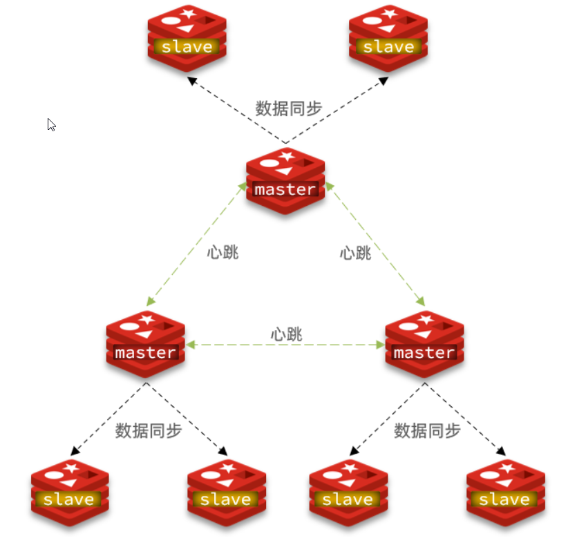

分片集群特征：

- 集群中有多个master，每个master保存不同数据

- 每个master都可以有多个slave节点

- master之间通过ping监测彼此健康状态

- 客户端请求可以访问集群任意节点，最终都会被转发到正确节点

### 散列插槽

**原理**

Redis会把每一个master节点映射到0~16383共16384个插槽（hash slot）上，查看集群信息时就能看到：

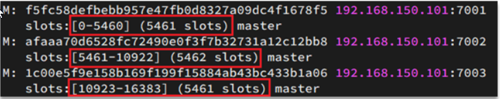

数据key不是与节点绑定，而是与插槽绑定。redis会根据key的有效部分计算插槽值，分两种情况：

- key中包含"{}"，且“{}”中至少包含1个字符，“{}”中的部分是有效部分
- key中不包含“{}”，整个key都是有效部分

例如：key是num，那么就根据num计算，如果是{itcast}num，则根据itcast计算。计算方式是利用CRC16算法得到一个hash值，然后对16384取余，得到的结果就是slot值。

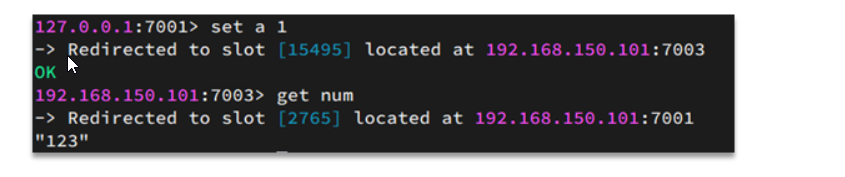

如图，在7001这个节点执行set a 1时，对a做hash运算，对16384取余，得到的结果是15495，因此要存储到7003节点。

到了7003后，执行`get num`时，对num做hash运算，对16384取余，得到的结果是2765，因此需要切换到7001节点

**小结**

Redis如何判断某个key应该在哪个实例？

- 将16384个插槽分配到不同的实例
- 根据key的有效部分计算哈希值，对16384取余
- 余数作为插槽，寻找插槽所在实例即可

如何将同一类数据固定的保存在同一个Redis实例？

- 这一类数据使用相同的有效部分，例如key都以{typeId}为前缀

### **集群伸缩**

需求：向集群中添加一个新的master节点，并向其中存储 num = 10

- 启动一个新的redis实例，端口为7004
- 添加7004到之前的集群，并作为一个master节点
- 给7004节点分配插槽，使得num这个key可以存储到7004实例

这里需要两个新的功能：

- 添加一个节点到集群中
- 将部分插槽分配到新插槽

**创建新的redis实例**

创建一个文件夹：

```sh
mkdir 7004
```

拷贝配置文件：

```sh
cp redis.conf /7004
```

修改配置文件：

```sh
sed /s/6379/7004/g 7004/redis.conf
```

启动

```sh
redis-server 7004/redis.conf
```


**添加新节点到redis**

添加节点的语法如下：


执行命令：

```sh
redis-cli --cluster add-node  192.168.150.101:7004 192.168.150.101:7001
```


通过命令查看集群状态：

```sh
redis-cli -p 7001 cluster nodes
```


如图，7004加入了集群，并且默认是一个master节点：


但是，可以看到7004节点的插槽数量为0，因此没有任何数据可以存储到7004上


**转移插槽**

我们要将num存储到7004节点，因此需要先看看num的插槽是多少：


如上图所示，num的插槽为2765.


我们可以将0~3000的插槽从7001转移到7004，命令格式如下：


具体命令如下：

建立连接：


得到下面的反馈：


询问要移动多少个插槽，我们计划是3000个：

新的问题来了：


那个node来接收这些插槽？？

显然是7004，那么7004节点的id是多少呢？


复制这个id，然后拷贝到刚才的控制台后：


这里询问，你的插槽是从哪里移动过来的？

- all：代表全部，也就是三个节点各转移一部分
- 具体的id：目标节点的id
- done：没有了


这里我们要从7001获取，因此填写7001的id：


填完后，点击done，这样插槽转移就准备好了：


确认要转移吗？输入yes：

然后，通过命令查看结果：

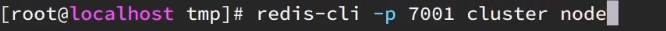 

可以看到： 


目的达成。


**故障转移**

集群初识状态是这样的：


其中7001、7002、7003都是master，我们计划让7002宕机。


**自动故障转移**

当集群中有一个master宕机会发生什么呢？

直接停止一个redis实例，例如7002：

```sh
redis-cli -p 7002 shutdown
```


1）首先是该实例与其它实例失去连接

2）然后是疑似宕机：


3）最后是确定下线，自动提升一个slave为新的master：


4）当7002再次启动，就会变为一个slave节点了：

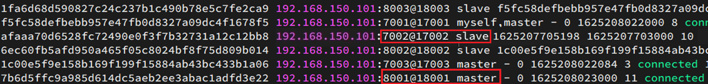


**手动故障转移**

利用cluster failover命令可以手动让集群中的某个master宕机，切换到执行cluster failover命令的这个slave节点，实现无感知的数据迁移。其流程如下：


这种failover命令可以指定三种模式：

- 缺省：默认的流程，如图1~6歩
- force：省略了对offset的一致性校验
- takeover：直接执行第5歩，忽略数据一致性、忽略master状态和其它master的意见


**案例需求**：在7002这个slave节点执行手动故障转移，重新夺回master地位

步骤如下：

1）利用redis-cli连接7002这个节点

2）执行cluster failover命令

如图：


效果：


## 多级缓存

**为什么使用多级缓存**

传统的缓存策略一般是请求到达Tomcat后，先查询Redis，如果未命中则查询数据库，如图：

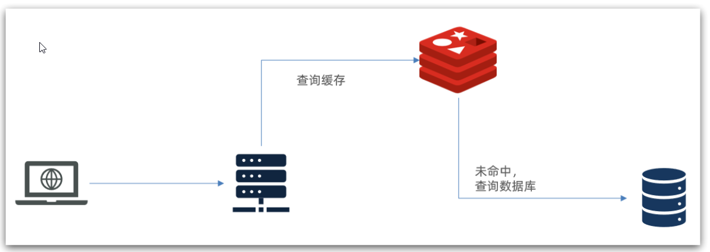

存在下面的问题：

•	请求要经过Tomcat处理，Tomcat的性能成为整个系统的瓶颈

•	Redis缓存失效时，会对数据库产生冲击

**什么是多级缓存**

多级缓存就是充分利用请求处理的每个环节，分别添加缓存，减轻Tomcat压力，提升服务性能：

- 浏览器访问静态资源时，优先读取浏览器本地缓存
- 访问非静态资源（ajax查询数据）时，访问服务端
- 请求到达Nginx后，优先读取Nginx本地缓存
- 如果Nginx本地缓存未命中，则去直接查询Redis（不经过Tomcat）
- 如果Redis查询未命中，则查询Tomcat
- 请求进入Tomcat后，优先查询JVM进程缓存
- 如果JVM进程缓存未命中，则查询数据库

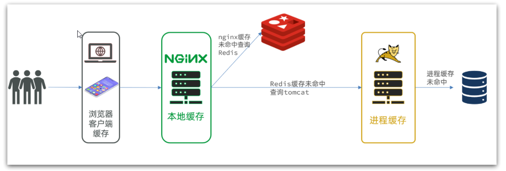

> 在多级缓存架构中，Nginx内部需要编写本地缓存查询、Redis查询、Tomcat查询的业务逻辑，因此这样的nginx服务不再是一个**反向代理服务器**，而是一个编写**业务的Web服务器了**。

1. 因此这样的业务Nginx服务也需要搭建集群来提高并发，再有专门的nginx服务来做反向代理;
2. Tomcat服务将来也会部署为集群模式;

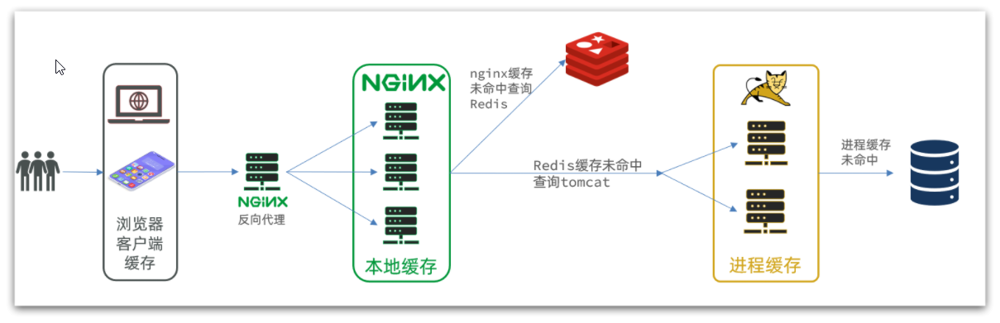

## JVM进程缓存

### Caffeine

缓存在日常开发中启动至关重要的作用，由于是存储在内存中，数据的读取速度是非常快的，能大量减少对数据库的访问，减少数据库的压力。我们把缓存分为两类：

- 分布式缓存，例如Redis：
  - 优点：存储容量更大、可靠性更好、可以在集群间共享
  - 缺点：访问缓存有网络开销
  - 场景：缓存数据量较大、可靠性要求较高、需要在集群间共享
- 进程本地缓存，例如HashMap、GuavaCache：
  - 优点：读取本地内存，没有网络开销，速度更快
  - 缺点：存储容量有限、可靠性较低、无法共享
  - 场景：性能要求较高，缓存数据量较小

我们今天会利用Caffeine框架来实现JVM进程缓存。

**Caffeine基本使用**

@Test
void testBasicOps() {
    // 构建cache对象
    Cache<String, String> cache = Caffeine.newBuilder().build();

```java
@Test
void testBasicOps() {
    // 构建cache对象
    Cache<String, String> cache = Caffeine.newBuilder().build();

    // 存数据
    cache.put("gf", "迪丽热巴");

    // 取数据
    String gf = cache.getIfPresent("gf");
    System.out.println("gf = " + gf);

    // 取数据，包含两个参数：
    // 参数一：缓存的key
    // 参数二：Lambda表达式，表达式参数就是缓存的key，方法体是查询数据库的逻辑
    // 优先根据key查询JVM缓存，如果未命中，则执行参数二的Lambda表达式
    String defaultGF = cache.get("defaultGF", key -> {
        // 根据key去数据库查询数据
        return "柳岩";
    });
    System.out.println("defaultGF = " + defaultGF);
}
```

Caffeine既然是缓存的一种，肯定需要有缓存的清除策略，不然的话内存总会有耗尽的时候。

Caffeine提供了三种缓存驱逐策略：

- **基于容量**：设置缓存的数量上限

  ```java
  // 创建缓存对象
  Cache<String, String> cache = Caffeine.newBuilder()
      .maximumSize(1) // 设置缓存大小上限为 1
      .build();
  ```

- **基于时间**：设置缓存的有效时间

  ```java
  // 创建缓存对象
  Cache<String, String> cache = Caffeine.newBuilder()
      // 设置缓存有效期为 10 秒，从最后一次写入开始计时 
      .expireAfterWrite(Duration.ofSeconds(10)) 
      .build();
  
  ```

- **基于引用**：设置缓存为软引用或弱引用，利用GC来回收缓存数据。性能较差，不建议使用。


> **注意**：在默认情况下，当一个缓存元素过期的时候，Caffeine不会自动立即将其清理和驱逐。而是在一次读或写操作后，或者在空闲时间完成对失效数据的驱逐。

**案例：**

利用Caffeine实现下列需求：

- 给根据id查询商品的业务添加缓存，缓存未命中时查询数据库
- 给根据id查询商品库存的业务添加缓存，缓存未命中时查询数据库
- 缓存初始大小为100
- 缓存上限为10000

① 首先，我们需要定义两个Caffeine的缓存对象，分别保存商品、库存的缓存数据。

~~~java
@Configuration
public class CaffeineConfig {

    @Bean
    public Cache<Long, Item> itemCache(){
        return Caffeine.newBuilder()
                .initialCapacity(100)
                .maximumSize(10_000)
                .build();
    }

    @Bean
    public Cache<Long, ItemStock> stockCache(){
        return Caffeine.newBuilder()
                .initialCapacity(100)
                .maximumSize(10_000)
                .build();
    }
}
~~~

② 添加缓存逻辑

~~~Java
@RestController
@RequestMapping("item")
public class ItemController {

    @Autowired
    private IItemService itemService;
    @Autowired
    private IItemStockService stockService;

    @Autowired
    private Cache<Long, Item> itemCache;
    @Autowired
    private Cache<Long, ItemStock> stockCache;
    
    // ...其它略
    
    @GetMapping("/{id}")
    public Item findById(@PathVariable("id") Long id) {
        return itemCache.get(id, key -> itemService.query()
                .ne("status", 3).eq("id", key)
                .one()
        );
    }

    @GetMapping("/stock/{id}")
    public ItemStock findStockById(@PathVariable("id") Long id) {
        return stockCache.get(id, key -> stockService.getById(key));
    }
}
~~~

## 实现多级缓存

### OpenResty

OpenResty® 是一个基于 Nginx的高性能 Web 平台，用于方便地搭建能够处理超高并发、扩展性极高的动态 Web 应用、Web 服务和动态网关。具备下列特点：

- 具备Nginx的完整功能
- 基于Lua语言进行扩展，集成了大量精良的 Lua 库、第三方模块
- 允许使用Lua**自定义业务逻辑**、**自定义库**

官方网站： https://openresty.org/cn/

我们希望达到的多级缓存架构如图：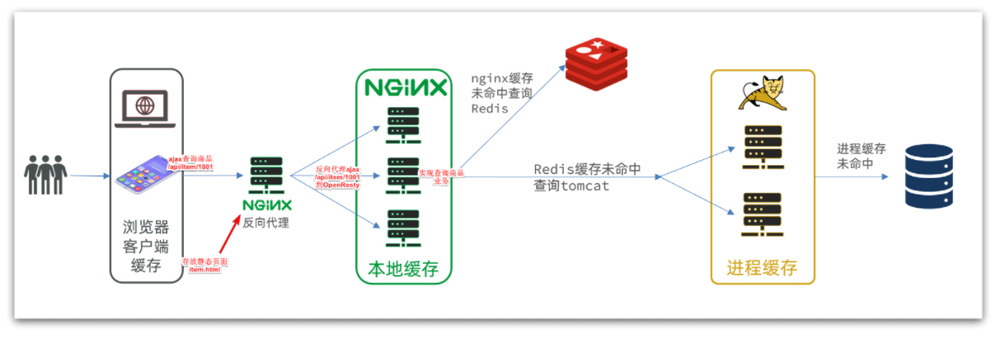

其中：

- windows上的nginx用来做反向代理服务，将前端的查询商品的ajax请求代理到OpenResty集群

- OpenResty集群用来编写多级缓存业务

① 反向代理

请求地址是localhost，端口是80，就被windows上安装的Nginx服务给接收到了。然后代理给了OpenResty集群：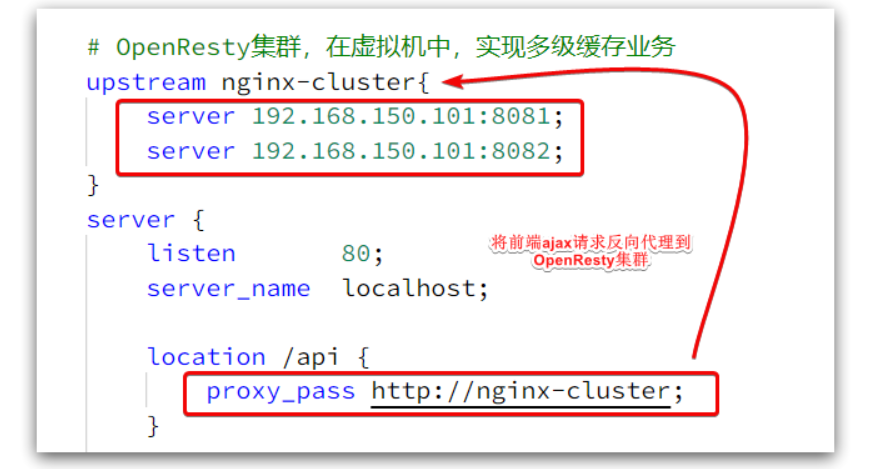

② 在OpenResty中编写业务，查询商品数据并返回到浏览器。

OpenResty的很多功能都依赖于其目录下的Lua库，需要在nginx.conf中指定依赖库的目录，并导入依赖：

1）添加对OpenResty的Lua模块的加载	

修改`/usr/local/openresty/nginx/conf/nginx.conf`文件，在其中的http下面，添加下面代码：

```nginx
#lua 模块
lua_package_path "/usr/local/openresty/lualib/?.lua;;";
#c模块     
lua_package_cpath "/usr/local/openresty/lualib/?.so;;";  
```


2）监听/api/item路径

修改`/usr/local/openresty/nginx/conf/nginx.conf`文件，在nginx.conf的server下面，添加对/api/item这个路径的监听：

```nginx
location ~ /api/item/(\d+) {
    # 默认的响应类型
    default_type application/json;
    # 响应结果由lua/item.lua文件来决定
    content_by_lua_file lua/item.lua;
}
```

OpenResty中提供了一些API用来获取不同类型的前端请求参数：


这个监听，就类似于SpringMVC中的`@GetMapping("/api/item")`做路径映射。

而`content_by_lua_file lua/item.lua`则相当于调用item.lua这个文件，执行其中的业务，把结果返回给用户。相当于java中调用service。

**编写item.lua**

1）在`/usr/loca/openresty/nginx`目录创建文件夹：lua


2）在`/usr/loca/openresty/nginx/lua`文件夹下，新建文件：item.lua

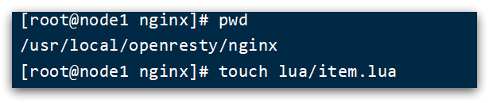


3）编写item.lua，返回假数据

item.lua中，利用ngx.say()函数返回数据到Response中

```lua
-- 获取商品id
local id = ngx.var[1]
-- 拼接并返回
ngx.say('{"id":' .. id .. ',"name":"SALSA AIR","title":"RIMOWA 21寸托运箱拉杆箱 SALSA AIR系列果绿色 820.70.36.4","price":17900,"image":"https://m.360buyimg.com/mobilecms/s720x720_jfs/t6934/364/1195375010/84676/e9f2c55f/597ece38N0ddcbc77.jpg!q70.jpg.webp","category":"拉杆箱","brand":"RIMOWA","spec":"","status":1,"createTime":"2019-04-30T16:00:00.000+00:00","updateTime":"2019-04-30T16:00:00.000+00:00","stock":2999,"sold":31290}')
```


4）重新加载配置

```sh
nginx -s reload
```


刷新商品页面：http://localhost/item.html?id=1001，即可看到效果：

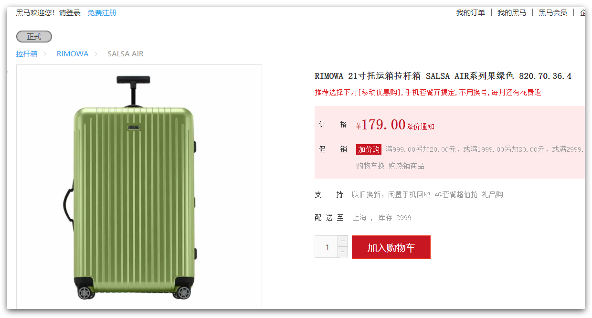

### 查询Tomcat

拿到商品ID后，本应去缓存中查询商品信息，不过目前我们还未建立nginx、redis缓存。因此，这里我们先根据商品id去tomcat查询商品信息。我们实现如图部分：


需要注意的是，我们的OpenResty是在虚拟机，Tomcat是在Windows电脑上。两者IP一定不要搞错了。


**发送http请求的API**

nginx提供了内部API用以发送http请求：

```lua
local resp = ngx.location.capture("/path",{
    method = ngx.HTTP_GET,   -- 请求方式
    args = {a=1,b=2},  -- get方式传参数
})
```

返回的响应内容包括：

- resp.status：响应状态码
- resp.header：响应头，是一个table
- resp.body：响应体，就是响应数据

注意：这里的path是路径，并不包含IP和端口。这个请求会被nginx内部的server监听并处理。

但是我们希望这个请求发送到Tomcat服务器，所以还需要编写一个server来对这个路径做反向代理：

```nginx
 location /path {
     # 这里是windows电脑的ip和Java服务端口，需要确保windows防火墙处于关闭状态
     proxy_pass http://192.168.150.1:8081; 
 }
```


原理如图：


**封装http工具**

下面，我们封装一个发送Http请求的工具，基于ngx.location.capture来实现查询tomcat。


1）添加反向代理，到windows的Java服务

因为item-service中的接口都是/item开头，所以我们监听/item路径，代理到windows上的tomcat服务。

修改 `/usr/local/openresty/nginx/conf/nginx.conf`文件，添加一个location：

```nginx
location /item {
    proxy_pass http://192.168.150.1:8081;
}
```


以后，只要我们调用`ngx.location.capture("/item")`，就一定能发送请求到windows的tomcat服务。


2）封装工具类

之前我们说过，OpenResty启动时会加载以下两个目录中的工具文件：


所以，自定义的http工具也需要放到这个目录下。


在`/usr/local/openresty/lualib`目录下，新建一个common.lua文件：

```sh
vi /usr/local/openresty/lualib/common.lua
```

内容如下:

```lua
-- 封装函数，发送http请求，并解析响应
local function read_http(path, params)
    local resp = ngx.location.capture(path,{
        method = ngx.HTTP_GET,
        args = params,
    })
    if not resp then
        -- 记录错误信息，返回404
        ngx.log(ngx.ERR, "http请求查询失败, path: ", path , ", args: ", args)
        ngx.exit(404)
    end
    return resp.body
end
-- 将方法导出
local _M = {  
    read_http = read_http
}  
return _M
```


这个工具将read_http函数封装到_M这个table类型的变量中，并且返回，这类似于导出。

使用的时候，可以利用`require('common')`来导入该函数库，这里的common是函数库的文件名。


3）实现商品查询

最后，我们修改`/usr/local/openresty/lua/item.lua`文件，利用刚刚封装的函数库实现对tomcat的查询：

```lua
-- 引入自定义common工具模块，返回值是common中返回的 _M
local common = require("common")
-- 从 common中获取read_http这个函数
local read_http = common.read_http
-- 获取路径参数
local id = ngx.var[1]
-- 根据id查询商品
local itemJSON = read_http("/item/".. id, nil)
-- 根据id查询商品库存
local itemStockJSON = read_http("/item/stock/".. id, nil)
```


这里查询到的结果是json字符串，并且包含商品、库存两个json字符串，页面最终需要的是把两个json拼接为一个json：


这就需要我们先把JSON变为lua的table，完成数据整合后，再转为JSON。


**CJSON工具类**

OpenResty提供了一个cjson的模块用来处理JSON的序列化和反序列化。

官方地址： https://github.com/openresty/lua-cjson/

1）引入cjson模块：

```lua
local cjson = require "cjson"
```


2）序列化：

```lua
local obj = {
    name = 'jack',
    age = 21
}
-- 把 table 序列化为 json
local json = cjson.encode(obj)
```


3）反序列化：

```lua
local json = '{"name": "jack", "age": 21}'
-- 反序列化 json为 table
local obj = cjson.decode(json);
print(obj.name)
```


**实现Tomcat查询**

下面，我们修改之前的item.lua中的业务，添加json处理功能：

```lua
-- 导入common函数库
local common = require('common')
local read_http = common.read_http
-- 导入cjson库
local cjson = require('cjson')

-- 获取路径参数
local id = ngx.var[1]
-- 根据id查询商品
local itemJSON = read_http("/item/".. id, nil)
-- 根据id查询商品库存
local itemStockJSON = read_http("/item/stock/".. id, nil)

-- JSON转化为lua的table
local item = cjson.decode(itemJSON)
local stock = cjson.decode(stockJSON)

-- 组合数据
item.stock = stock.stock
item.sold = stock.sold

-- 把item序列化为json 返回结果
ngx.say(cjson.encode(item))
```


**基于ID负载均衡**

刚才的代码中，我们的tomcat是单机部署。而实际开发中，tomcat一定是集群模式：


因此，OpenResty需要对tomcat集群做负载均衡。

而默认的负载均衡规则是轮询模式，当我们查询/item/10001时：

- 第一次会访问8081端口的tomcat服务，在该服务内部就形成了JVM进程缓存
- 第二次会访问8082端口的tomcat服务，该服务内部没有JVM缓存（因为JVM缓存无法共享），会查询数据库
- ...

你看，因为轮询的原因，第一次查询8081形成的JVM缓存并未生效，直到下一次再次访问到8081时才可以生效，缓存命中率太低了。


怎么办？

如果能让同一个商品，每次查询时都访问同一个tomcat服务，那么JVM缓存就一定能生效了。

也就是说，我们需要根据商品id做负载均衡，而不是轮询。


**1）原理**

nginx提供了基于请求路径做负载均衡的算法：

nginx根据请求路径做hash运算，把得到的数值对tomcat服务的数量取余，余数是几，就访问第几个服务，实现负载均衡。


例如：

- 我们的请求路径是 /item/10001
- tomcat总数为2台（8081、8082）
- 对请求路径/item/1001做hash运算求余的结果为1
- 则访问第一个tomcat服务，也就是8081

只要id不变，每次hash运算结果也不会变，那就可以保证同一个商品，一直访问同一个tomcat服务，确保JVM缓存生效。


**2）实现**

修改`/usr/local/openresty/nginx/conf/nginx.conf`文件，实现基于ID做负载均衡。

首先，定义tomcat集群，并设置基于路径做负载均衡：

```nginx 
upstream tomcat-cluster {
    hash $request_uri;
    server 192.168.150.1:8081;
    server 192.168.150.1:8082;
}
```

然后，修改对tomcat服务的反向代理，目标指向tomcat集群：

```nginx
location /item {
    proxy_pass http://tomcat-cluster;
}
```

重新加载OpenResty

```sh
nginx -s reload
```


**3）测试**

启动两台tomcat服务：

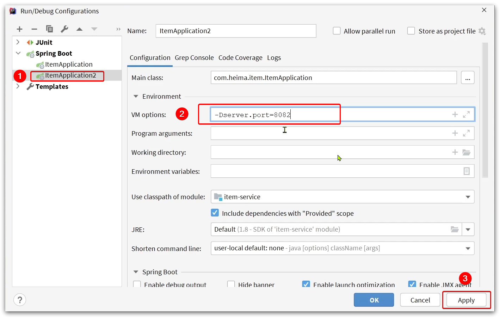

同时启动：

 

清空日志后，再次访问页面，可以看到不同id的商品，访问到了不同的tomcat服务：

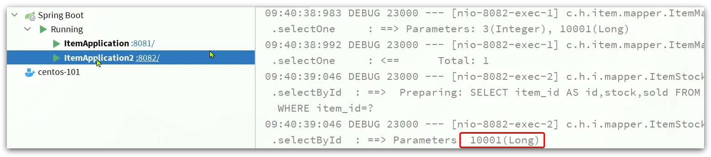


### Redis缓存预热

Redis缓存会面临冷启动问题：

**冷启动**：服务刚刚启动时，Redis中并没有缓存，如果所有商品数据都在第一次查询时添加缓存，可能会给数据库带来较大压力。

**缓存预热**：在实际开发中，我们可以利用大数据统计用户访问的热点数据，在项目启动时将这些热点数据提前查询并保存到Redis中。

**案例：**

这里我们利用InitializingBean接口来实现，因为InitializingBean可以在对象被Spring创建并且成员变量全部注入后执行。

~~~java
@Component
public class RedisHandler implements InitializingBean {

    @Autowired
    private StringRedisTemplate redisTemplate;

    @Autowired
    private IItemService itemService;
    @Autowired
    private IItemStockService stockService;

    private static final ObjectMapper MAPPER = new ObjectMapper();

    @Override
    public void afterPropertiesSet() throws Exception {
        // 初始化缓存
        // 1.查询商品信息
        List<Item> itemList = itemService.list();
        // 2.放入缓存
        for (Item item : itemList) {
            // 2.1.item序列化为JSON
            String json = MAPPER.writeValueAsString(item);
            // 2.2.存入redis
            redisTemplate.opsForValue().set("item:id:" + item.getId(), json);
        }

        // 3.查询商品库存信息
        List<ItemStock> stockList = stockService.list();
        // 4.放入缓存
        for (ItemStock stock : stockList) {
            // 2.1.item序列化为JSON
            String json = MAPPER.writeValueAsString(stock);
            // 2.2.存入redis
            redisTemplate.opsForValue().set("item:stock:id:" + stock.getId(), json);
        }
    }
}
~~~

### 查询Redis缓存

现在，Redis缓存已经准备就绪，我们可以再OpenResty中实现查询Redis的逻辑了。如下图红框所示：


当请求进入OpenResty之后：

- 优先查询Redis缓存
- 如果Redis缓存未命中，再查询Tomcat


**封装Redis工具**

OpenResty提供了操作Redis的模块，我们只要引入该模块就能直接使用。但是为了方便，我们将Redis操作封装到之前的common.lua工具库中。

修改`/usr/local/openresty/lualib/common.lua`文件：

1）引入Redis模块，并初始化Redis对象

```lua
-- 导入redis
local redis = require('resty.redis')
-- 初始化redis
local red = redis:new()
red:set_timeouts(1000, 1000, 1000)
```


2）封装函数，用来释放Redis连接，其实是放入连接池

```lua
-- 关闭redis连接的工具方法，其实是放入连接池
local function close_redis(red)
    local pool_max_idle_time = 10000 -- 连接的空闲时间，单位是毫秒
    local pool_size = 100 --连接池大小
    local ok, err = red:set_keepalive(pool_max_idle_time, pool_size)
    if not ok then
        ngx.log(ngx.ERR, "放入redis连接池失败: ", err)
    end
end
```


3）封装函数，根据key查询Redis数据

```lua
-- 查询redis的方法 ip和port是redis地址，key是查询的key
local function read_redis(ip, port, key)
    -- 获取一个连接
    local ok, err = red:connect(ip, port)
    if not ok then
        ngx.log(ngx.ERR, "连接redis失败 : ", err)
        return nil
    end
    -- 查询redis
    local resp, err = red:get(key)
    -- 查询失败处理
    if not resp then
        ngx.log(ngx.ERR, "查询Redis失败: ", err, ", key = " , key)
    end
    --得到的数据为空处理
    if resp == ngx.null then
        resp = nil
        ngx.log(ngx.ERR, "查询Redis数据为空, key = ", key)
    end
    close_redis(red)
    return resp
end
```


4）导出

```lua
-- 将方法导出
local _M = {  
    read_http = read_http,
    read_redis = read_redis
}  
return _M
```


完整的common.lua：

```lua
-- 导入redis
local redis = require('resty.redis')
-- 初始化redis
local red = redis:new()
red:set_timeouts(1000, 1000, 1000)

-- 关闭redis连接的工具方法，其实是放入连接池
local function close_redis(red)
    local pool_max_idle_time = 10000 -- 连接的空闲时间，单位是毫秒
    local pool_size = 100 --连接池大小
    local ok, err = red:set_keepalive(pool_max_idle_time, pool_size)
    if not ok then
        ngx.log(ngx.ERR, "放入redis连接池失败: ", err)
    end
end

-- 查询redis的方法 ip和port是redis地址，key是查询的key
local function read_redis(ip, port, key)
    -- 获取一个连接
    local ok, err = red:connect(ip, port)
    if not ok then
        ngx.log(ngx.ERR, "连接redis失败 : ", err)
        return nil
    end
    -- 查询redis
    local resp, err = red:get(key)
    -- 查询失败处理
    if not resp then
        ngx.log(ngx.ERR, "查询Redis失败: ", err, ", key = " , key)
    end
    --得到的数据为空处理
    if resp == ngx.null then
        resp = nil
        ngx.log(ngx.ERR, "查询Redis数据为空, key = ", key)
    end
    close_redis(red)
    return resp
end

-- 封装函数，发送http请求，并解析响应
local function read_http(path, params)
    local resp = ngx.location.capture(path,{
        method = ngx.HTTP_GET,
        args = params,
    })
    if not resp then
        -- 记录错误信息，返回404
        ngx.log(ngx.ERR, "http查询失败, path: ", path , ", args: ", args)
        ngx.exit(404)
    end
    return resp.body
end
-- 将方法导出
local _M = {  
    read_http = read_http,
    read_redis = read_redis
}  
return _M
```


**实现Redis查询**

接下来，我们就可以去修改item.lua文件，实现对Redis的查询了。

查询逻辑是：

- 根据id查询Redis
- 如果查询失败则继续查询Tomcat
- 将查询结果返回

1）修改`/usr/local/openresty/lua/item.lua`文件，添加一个查询函数：

```lua
-- 导入common函数库
local common = require('common')
local read_http = common.read_http
local read_redis = common.read_redis
-- 封装查询函数
function read_data(key, path, params)
    -- 查询本地缓存
    local val = read_redis("127.0.0.1", 6379, key)
    -- 判断查询结果
    if not val then
        ngx.log(ngx.ERR, "redis查询失败，尝试查询http， key: ", key)
        -- redis查询失败，去查询http
        val = read_http(path, params)
    end
    -- 返回数据
    return val
end
```


2）而后修改商品查询、库存查询的业务：


3）完整的item.lua代码：

```lua
-- 导入common函数库
local common = require('common')
local read_http = common.read_http
local read_redis = common.read_redis
-- 导入cjson库
local cjson = require('cjson')

-- 封装查询函数
function read_data(key, path, params)
    -- 查询本地缓存
    local val = read_redis("127.0.0.1", 6379, key)
    -- 判断查询结果
    if not val then
        ngx.log(ngx.ERR, "redis查询失败，尝试查询http， key: ", key)
        -- redis查询失败，去查询http
        val = read_http(path, params)
    end
    -- 返回数据
    return val
end

-- 获取路径参数
local id = ngx.var[1]

-- 查询商品信息
local itemJSON = read_data("item:id:" .. id,  "/item/" .. id, nil)
-- 查询库存信息
local stockJSON = read_data("item:stock:id:" .. id, "/item/stock/" .. id, nil)

-- JSON转化为lua的table
local item = cjson.decode(itemJSON)
local stock = cjson.decode(stockJSON)
-- 组合数据
item.stock = stock.stock
item.sold = stock.sold

-- 把item序列化为json 返回结果
ngx.say(cjson.encode(item))
```

### Nginx本地缓存

现在，整个多级缓存中只差最后一环，也就是nginx的本地缓存了。如图：


**本地缓存API**

OpenResty为Nginx提供了**shard dict**的功能，可以在nginx的多个worker之间共享数据，实现缓存功能。

1）开启共享字典，在nginx.conf的http下添加配置：

```nginx
 # 共享字典，也就是本地缓存，名称叫做：item_cache，大小150m
 lua_shared_dict item_cache 150m; 
```


2）操作共享字典：

```lua
-- 获取本地缓存对象
local item_cache = ngx.shared.item_cache
-- 存储, 指定key、value、过期时间，单位s，默认为0代表永不过期
item_cache:set('key', 'value', 1000)
-- 读取
local val = item_cache:get('key')
```


**实现本地缓存查询**

1）修改`/usr/local/openresty/lua/item.lua`文件，修改read_data查询函数，添加本地缓存逻辑：

```lua
-- 导入共享词典，本地缓存
local item_cache = ngx.shared.item_cache

-- 封装查询函数
function read_data(key, expire, path, params)
    -- 查询本地缓存
    local val = item_cache:get(key)
    if not val then
        ngx.log(ngx.ERR, "本地缓存查询失败，尝试查询Redis， key: ", key)
        -- 查询redis
        val = read_redis("127.0.0.1", 6379, key)
        -- 判断查询结果
        if not val then
            ngx.log(ngx.ERR, "redis查询失败，尝试查询http， key: ", key)
            -- redis查询失败，去查询http
            val = read_http(path, params)
        end
    end
    -- 查询成功，把数据写入本地缓存
    item_cache:set(key, val, expire)
    -- 返回数据
    return val
end
```


2）修改item.lua中查询商品和库存的业务，实现最新的read_data函数：


其实就是多了缓存时间参数，过期后nginx缓存会自动删除，下次访问即可更新缓存。

这里给商品基本信息设置超时时间为30分钟，库存为1分钟。

因为库存更新频率较高，如果缓存时间过长，可能与数据库差异较大。


3）完整的item.lua文件：

```lua
-- 导入common函数库
local common = require('common')
local read_http = common.read_http
local read_redis = common.read_redis
-- 导入cjson库
local cjson = require('cjson')
-- 导入共享词典，本地缓存
local item_cache = ngx.shared.item_cache

-- 封装查询函数
function read_data(key, expire, path, params)
    -- 查询本地缓存
    local val = item_cache:get(key)
    if not val then
        ngx.log(ngx.ERR, "本地缓存查询失败，尝试查询Redis， key: ", key)
        -- 查询redis
        val = read_redis("127.0.0.1", 6379, key)
        -- 判断查询结果
        if not val then
            ngx.log(ngx.ERR, "redis查询失败，尝试查询http， key: ", key)
            -- redis查询失败，去查询http
            val = read_http(path, params)
        end
    end
    -- 查询成功，把数据写入本地缓存
    item_cache:set(key, val, expire)
    -- 返回数据
    return val
end

-- 获取路径参数
local id = ngx.var[1]

-- 查询商品信息
local itemJSON = read_data("item:id:" .. id, 1800,  "/item/" .. id, nil)
-- 查询库存信息
local stockJSON = read_data("item:stock:id:" .. id, 60, "/item/stock/" .. id, nil)

-- JSON转化为lua的table
local item = cjson.decode(itemJSON)
local stock = cjson.decode(stockJSON)
-- 组合数据
item.stock = stock.stock
item.sold = stock.sold

-- 把item序列化为json 返回结果
ngx.say(cjson.encode(item))
```

## 缓存同步 

大多数情况下，浏览器查询到的都是缓存数据，如果缓存数据与数据库数据存在较大差异，可能会产生比较严重的后果。

所以我们必须保证数据库数据、缓存数据的一致性，这就是缓存与数据库的同步。

### 数据同步

缓存数据同步的常见方式有三种：

**设置有效期**：给缓存设置有效期，到期后自动删除。再次查询时更新

- 优势：简单、方便
- 缺点：时效性差，缓存过期之前可能不一致
- 场景：更新频率较低，时效性要求低的业务

**同步双写**：在修改数据库的同时，直接修改缓存

- 优势：时效性强，缓存与数据库强一致
- 缺点：有代码侵入，耦合度高；
- 场景：对一致性、时效性要求较高的缓存数据

**异步通知：**修改数据库时发送事件通知，相关服务监听到通知后修改缓存数据

- 优势：低耦合，可以同时通知多个缓存服务
- 缺点：时效性一般，可能存在中间不一致状态
- 场景：时效性要求一般，有多个服务需要同步

而异步实现又可以基于MQ或者Canal来实现：

1）基于MQ的异步通知：


解读：

- 商品服务完成对数据的修改后，只需要发送一条消息到MQ中。
- 缓存服务监听MQ消息，然后完成对缓存的更新

依然有少量的代码侵入。


2）基于Canal的通知


解读：

- 商品服务完成商品修改后，业务直接结束，没有任何代码侵入
- Canal监听MySQL变化，当发现变化后，立即通知缓存服务
- 缓存服务接收到canal通知，更新缓存

代码零侵入


