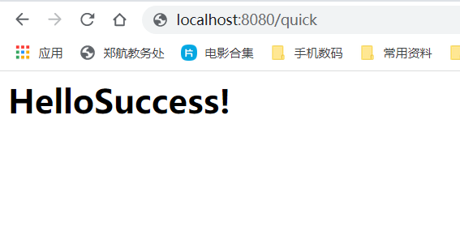
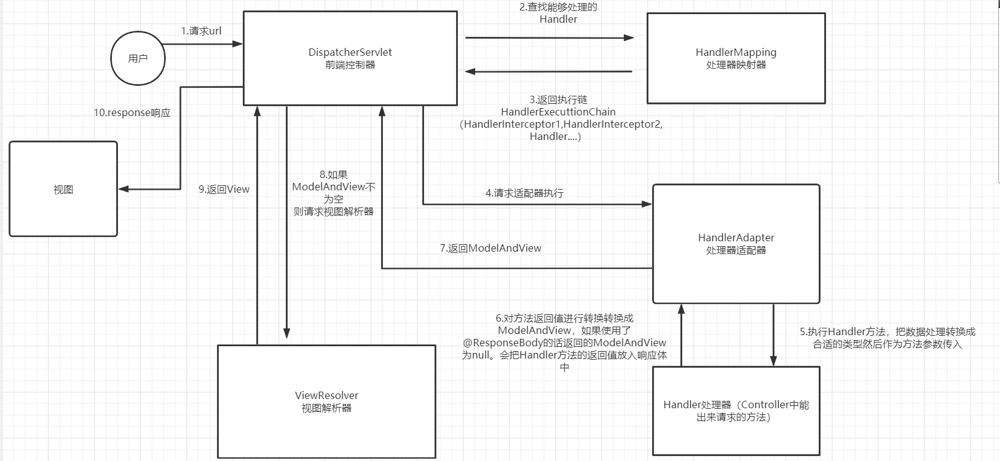
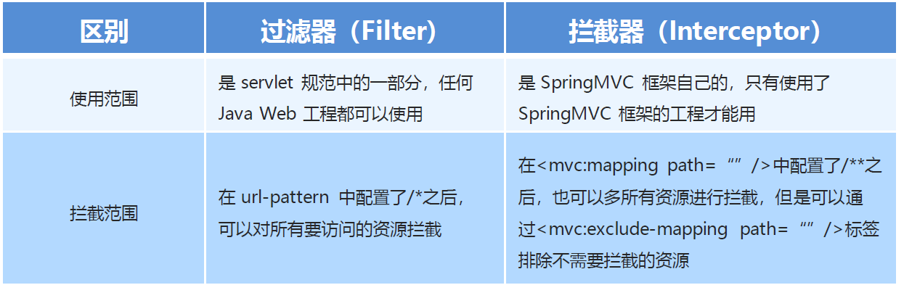
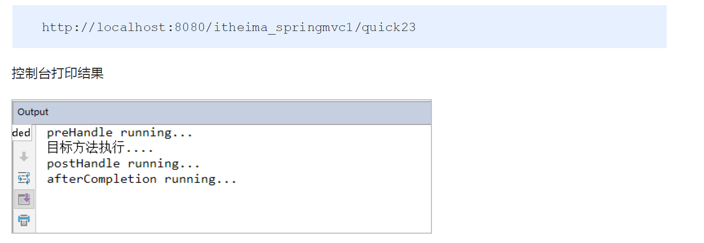
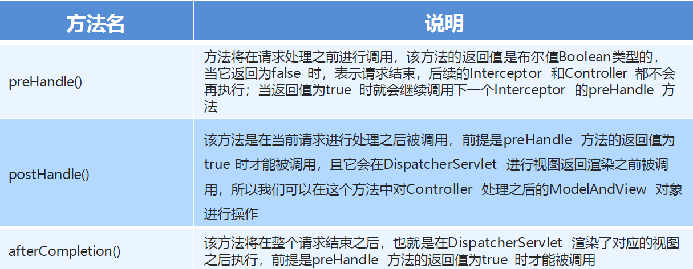
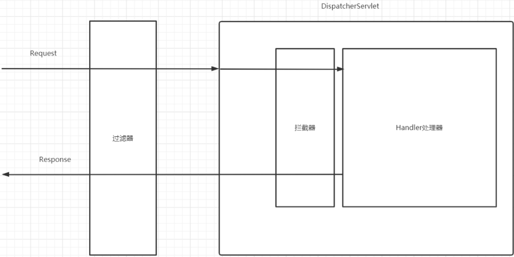

# 1.基本配置

* SpringMVC是一种基于Java 的实现MVC 设计模型的请求驱动类型的轻量级Web 框架，属于SpringFrameWork的后续产品，已经融合在Spring Web Flow 中。

* 开发步骤：

```
1.	导入SpringMVC相关坐标
2.	配置SpringMVC核心控制器DispathcerServlet
3.	创建Controller类和视图页面
4.	使用注解配置Controller类中业务方法的映射地址
5.	配置SpringMVC核心文件spring-mvc.xml
6.	客户端发起请求测试
```

## 1. pom

```xml
    <dependencies>
        <!-- servlet依赖 -->
        <dependency>
            <groupId>javax.servlet</groupId>
            <artifactId>javax.servlet-api</artifactId>
            <version>3.1.0</version>
            <scope>provided</scope>
        </dependency>
        <!--jsp依赖 -->
        <dependency>
            <groupId>javax.servlet.jsp</groupId>
            <artifactId>jsp-api</artifactId>
            <version>2.1</version>
            <scope>provided</scope>
        </dependency>
        <!--springmvc的依赖-->
        <dependency>
            <groupId>org.springframework</groupId>
            <artifactId>spring-webmvc</artifactId>
            <version>5.1.9.RELEASE</version>
        </dependency>

        <!-- jackson，帮助进行json转换-->
        <dependency>
            <groupId>com.fasterxml.jackson.core</groupId>
            <artifactId>jackson-databind</artifactId>
            <version>2.9.0</version>
        </dependency>
    </dependencies>
    <build>
        <plugins>
            <plugin>
                <groupId>org.apache.tomcat.maven</groupId>
                <artifactId>tomcat7-maven-plugin</artifactId>
                <version>2.2</version>
                <configuration>
                    <!--端口-->
                    <port>81</port>
                    <!--项目路径-->
                    <path>/</path>
                    <!--解决get请求中文乱码-->
                    <uriEncoding>utf-8</uriEncoding>
                </configuration>
            </plugin>
        </plugins>
    </build>
```

## 2. web.xml

```xml
<servlet>
        <servlet-name>DispatcherServlet</servlet-name>
        <servlet-class>org.springframework.web.servlet.DispatcherServlet</servlet-class>
        <!--
            为DispatcherServlet提供初始化参数的
            设置springmvc配置文件的路径
                name是固定的，必须是contextConfigLocation
                value指的是SpringMVC配置文件的位置
         -->
        <init-param>
            <param-name>contextConfigLocation</param-name>
            <param-value>classpath:spring-mvc.xml</param-value>
        </init-param>
        <!--
            指定项目启动就初始化DispatcherServlet
         -->
        <load-on-startup>1</load-on-startup>
    </servlet>
    <servlet-mapping>
        <servlet-name>DispatcherServlet</servlet-name>
        <!--
             /           表示当前servlet映射除jsp之外的所有请求（包含静态资源）
             *.do        表示.do结尾的请求路径才能被SpringMVC处理(老项目会出现)
             /*          表示当前servlet映射所有请求（包含静态资源,jsp），不应该使用其配置DispatcherServlet
         -->
        <url-pattern>/</url-pattern>
    </servlet-mapping>


    <!--乱码处理过滤器，由SpringMVC提供-->
    <!-- 处理post请求乱码 -->
    <filter>
        <filter-name>CharacterEncodingFilter</filter-name>
        <filter-class>org.springframework.web.filter.CharacterEncodingFilter</filter-class>
        <init-param>
            <!-- name固定不变，value值根据需要设置 -->
            <param-name>encoding</param-name>
            <param-value>UTF-8</param-value>
        </init-param>
    </filter>
    <filter-mapping>
        <filter-name>CharacterEncodingFilter</filter-name>
        <!-- 所有请求都设置utf-8的编码 -->
        <url-pattern>/*</url-pattern>
    </filter-mapping>
```

## 3. 创建Controller类和视图页面

```java
//创建Controller和业务方法
public class QuickController {
    public String quickMethod(){
        System.out.println("quickMethod running.....");
        return "index";
    }
}
```

```jsp
//创建视图页面index.jsp
<html>
    <body>
        <h2>Hello SpringMVC!</h2>
    </body>
</html>
```

## 4. @Controller

````java
@Controller
public class QuickController {
    @RequestMapping("/quick")
    public String quickMethod()
    {
        System.out.println("quickMethod running.....");
     	return "index";
    }
}
````

## 5. spring-mvc.xml

```xml
   <!--
        SpringMVC只扫描controller包即可
    -->
    <context:component-scan base-package="com.sangeng.controller"/>
    <!-- 解决静态资源访问问题，如果不加mvc:annotation-driven会导致无法访问handler-->
    <mvc:default-servlet-handler/>
    <!--解决响应乱码-->
    <mvc:annotation-driven>
        <mvc:message-converters>
            <bean class="org.springframework.http.converter.StringHttpMessageConverter">
                <constructor-arg value="utf-8"/>
            </bean>
        </mvc:message-converters>
    </mvc:annotation-driven>
```

## 6. 客户端发起请求测试




## 7. SpringMVC流程图示

因为我们有两种开发模式，我们分别来讲解两种模式在SpringMVC中的执行流程。

​	一种是类似JSP的开发流程:

​					 把数据放入域对象中，然后进行页面跳转。

​	另外一种是前后端分离的开发模式，这也是目前市场上主流的模式：

​					 把数据转化为json放入响应体中。

​	完整流程图如下：



### 7.1 类JSP开发模式执行流程

​	1.用户发起请求被DispatchServlet所处理

​	2.DispatchServlet通过HandlerMapping根据具体的请求查找能处理这个请求的Handler。**（HandlerMapping主要是处理请求和Handler方法的映射关系的）**

​	3.HandlerMapping返回一个能够处理请求的执行链给DispatchServlet，这个链中除了包含Handler方法也包含拦截器。

​	4.DispatchServlet拿着执行链去找HandlerAdater执行链中的方法。

​	5.HandlerAdater会去执行对应的Handler方法，把数据处理转换成合适的类型然后作为方法参数传入 

​	6.Handler方法执行完后的返回值会被HandlerAdapter转换成ModelAndView类型。**（HandlerAdater主要进行Handler方法参数和返回值的处理。）**

​	7.返回ModelAndView给DispatchServlet.

​	8.如果对于的ModelAndView对象不为null，则DispatchServlet把ModelAndView交给 ViewResolver 也就是视图解析器解析。

​	9.ViewResolver 也就是视图解析器把ModelAndView中的viewName转换成对应的View对象返回给DispatchServlet。**（ViewResolver 主要负责把String类型的viewName转换成对应的View对象）**

​	10.DispatchServlet使用View对象进行页面的展示。

### 7.2 前后端分离开发模式执行流程

​	前后端分离的开发模式中我们会使用@ResponseBody来把数据写入到响应体中。所以不需要进行页面的跳转。

故流程如下：

​	1.用户发起请求被DispatchServlet所处理

​	2.DispatchServlet通过HandlerMapping根据具体的请求查找能处理这个请求的Handler。**（HandlerMapping主要是处理请求和Handler方法的映射关系的）**

​	3.HandlerMapping返回一个能够处理请求的执行链给DispatchServlet，这个链中除了包含Handler方法也包含拦截器。

​	4.DispatchServlet拿着执行链去找HandlerAdater执行链中的方法。

​	5.HandlerAdater会去执行对应的Handler方法，把数据处理转换成合适的类型然后作为方法参数传入 

​	6.Handler方法执行完后的返回值会被HandlerAdapter转换成ModelAndView类型。由于使用了@ResponseBody注解，返回的ModelAndView会为null ，并且HandlerAdapter会把方法返回值放到响应体中。**（HandlerAdater主要进行Handler方法参数和返回值的处理。）**

​	7.返回ModelAndView给DispatchServlet。

​	8.因为返回的ModelAndView为null,所以不用去解析视图解析和其后面的操作。

```
1. 	用户发送请求至前端控制器DispatcherServlet。
2. 	DispatcherServlet收到请求调用HandlerMapping处理器映射器。
3. 	处理器映射器找到具体的处理器(可以根据xml配置、注解进行查找)，（生成执行链交给DispatcherServlet）生成处理器对象及处理器拦截器(如果有则生成)一并返回给DispatcherServlet。
4. 	DispatcherServlet调用HandlerAdapter处理器适配器。
5. 	HandlerAdapter经过适配调用具体的处理器(Controller，也叫后端控制器)。
6. 	Controller执行完成返回ModelAndView。
7. 	HandlerAdapter将ModelAndView返回给DispatcherServlet。
8. 	DispatcherServlet将ModelAndView传给ViewReslover视图解析器。
9. 	ViewReslover解析后返回具体View。
10. DispatcherServlet根据View进行渲染视图（即将模型数据填充至视图中）。DispatcherServlet响应用户。
```

# 2.请求映射规则

​	该注解可以加到方法上或者是类上。（查看其源码可知）

​	我们可以用其来设定所能匹配请求的要求。只有符合了设置的要求，请求才能被加了该注解的方法或类处理。

## 指定请求路径

​	path或者value属性都可以用来指定请求路径。

例如：

​	我们期望让请求的资源路径为**/test/testPath**的请求能够被**testPath**方法处理则可以写如下代码

~~~~java
@Controller
@RequestMapping("/test")
public class TestController {
    @RequestMapping("/testPath")
    public String testPath(){
        return "/success.jsp";
    }
}
~~~~


## 指定请求方式

​	method属性可以用来指定可处理的请求方式。

例如：

​	我们期望让请求的资源路径为**/test/testMethod**的**POST**请求能够被**testMethod**方法处理。则可以写如下代码

~~~~java
@Controller
@RequestMapping("/test")
public class TestController {

    @RequestMapping(value = "/testMethod",method = RequestMethod.POST)
    public String testMethod(){
        System.out.println("testMethod处理了请求");
        return "/success.jsp";
    }
}

~~~~


注意：我们可以也可以运用如下注解来进行替换

- ​    @PostMapping    等价于   @RequestMapping(method = RequestMethod.POST) 

- ​	@GetMapping    等价于   @RequestMapping(method = RequestMethod.GET) 
- ​	@PutMapping    等价于   @RequestMapping(method = RequestMethod.PUT) 
- ​	@DeleteMapping    等价于   @RequestMapping(method = RequestMethod.DELETE) 

例如：

​	上面的需求我们可以使用下面的写法实现

~~~~java
@Controller
@RequestMapping("/test")
public class TestController {

    @PostMapping(value = "/testMethod")
    public String testMethod(){
        System.out.println("testMethod处理了请求");
        return "/success.jsp";
    }
}
~~~~


## 指定请求参数

​	我们可以使用params属性来对请求参数进行一些限制。可以要求必须具有某些参数，或者是某些参数必须是某个值，或者是某些参数必须不是某个值。


例如：

​	我们期望让请求的资源路径为**/test/testParams**的**GET**请求,并且请求参数中**具有code参数**的请求能够被testParams方法处理。则可以写如下代码

~~~~java
@Controller
@RequestMapping("/test")
public class TestController {
    @RequestMapping(value = "/testParams",method = RequestMethod.GET,params = "code")
    public String testParams(){
        System.out.println("testParams处理了请求");
        return "/success.jsp";
    }
}
~~~~

​	

​	如果是要求**不能有code**这个参数可以把改成如下形式

~~~~java
@Controller
@RequestMapping("/test")
public class TestController {
    @RequestMapping(value = "/testParams",method = RequestMethod.GET,params = "!code")
    public String testParams(){
        System.out.println("testParams处理了请求");
        return "/success.jsp";
    }
}
~~~~

​	

​	如果要求有code这参数，并且这参数值必须**是某个值**可以改成如下形式

~~~~java
@Controller
@RequestMapping("/test")
public class TestController {
    @RequestMapping(value = "/testParams",method = RequestMethod.GET,params = "code=sgct")
    public String testParams(){
        System.out.println("testParams处理了请求");
        return "/success.jsp";
    }
}
~~~~


​	如果要求有code这参数，并且这参数值必须**不是某个值**可以改成如下形式	

~~~~java
@Controller
@RequestMapping("/test")
public class TestController {
    @RequestMapping(value = "/testParams",method = RequestMethod.GET,params = "code!=sgct")
    public String testParams(){
        System.out.println("testParams处理了请求");
        return "/success.jsp";
    }
}
~~~~


## 指定请求头

​	我们可以使用**headers**属性来对请求头进行一些限制。


例如：

​	我们期望让请求的资源路径为**/test/testHeaders的**GET**请求,并且请求头中**具有**deviceType**的请求能够被testHeaders方法处理。则可以写如下代码

~~~~java
@Controller
@RequestMapping("/test")
public class TestController {
    
    @RequestMapping(value = "/testHeaders",method = RequestMethod.GET,headers = "deviceType")
    public String testHeaders(){
        System.out.println("testHeaders处理了请求");
        return "/success.jsp";
    }
}
~~~~


​	如果是要求不能有**deviceType**这个请求头可以把改成如下形式

~~~~java
@Controller
@RequestMapping("/test")
public class TestController {
    
    @RequestMapping(value = "/testHeaders",method = RequestMethod.GET,headers = "!deviceType")
    public String testHeaders(){
        System.out.println("testHeaders处理了请求");
        return "/success.jsp";
    }
}
~~~~


​	如果要求有deviceType这个请求头，并且其值必须**是某个值**可以改成如下形式

~~~~java
@Controller
@RequestMapping("/test")
public class TestController {
    
    @RequestMapping(value = "/testHeaders",method = RequestMethod.GET,headers = "deviceType=ios")
    public String testHeaders(){
        System.out.println("testHeaders处理了请求");
        return "/success.jsp";
    }
}
~~~~


​	如果要求有deviceType这个请求头，并且其值必须**不是某个值**可以改成如下形式

~~~~java
@Controller
@RequestMapping("/test")
public class TestController {
    
    @RequestMapping(value = "/testHeaders",method = RequestMethod.GET,headers = "deviceType!=ios")
    public String testHeaders(){
        System.out.println("testHeaders处理了请求");
        return "/success.jsp";
    }
}
~~~~


### 指定请求头Content-Type

​	我们可以使用**consumes**属性来对**Content-Type**这个请求头进行一些限制。


#### 范例一

​	我们期望让请求的资源路径为**/test/testConsumes**的POST请求,并且请求头中的Content-Type头必须为 **multipart/from-data** 的请求能够被testConsumes方法处理。则可以写如下代码

~~~~java
    @RequestMapping(value = "/testConsumes",method = RequestMethod.POST,consumes = "multipart/from-data")
    public String testConsumes(){
        System.out.println("testConsumes处理了请求");
        return "/success.jsp";
    }
~~~~

#### 范例二

​	如果我们要求请求头Content-Type的值必须**不能为某个multipart/from-data**则可以改成如下形式：

~~~~java
    @RequestMapping(value = "/testConsumes",method = RequestMethod.POST,consumes = "!multipart/from-data")
    public String testConsumes(){
        System.out.println("testConsumes处理了请求");
        return "/success.jsp";
    }
~~~~


## RestFul风格

​	 RestFul是一种网络应用程序的设计风格和开发方式 。现在很多互联网企业的网络**接口**定义都会符合其风格。


主要规则如下：

- ​	 每一个URI代表1种资源     

- ​     客户端使用GET、POST、PUT、DELETE 4个表示操作方式的动词对服务端资源进行操作：GET用来获取资源，POST用来新建资源，PUT用来更新资源，DELETE用来删除资源； 
- ​	 简单参数例如id等写到url路径上  例如： /user/1 HTTP GET：获取id=1的user信息      /user/1 HTTP DELETE ：删除id=1的user信息    
- ​	 复杂的参数转换成json或者xml（现在基本都是json）写到请求体中。


# 3.获取请求参数

##  获取路径参数

​	RestFul风格的接口一些参数是在请求路径上的。类似： /user/1  这里的1就是id。

​	如果我们想获取这种格式的数据可以使用**@PathVariable**来实现。


### 范例一

​	要求定义个RestFul风格的接口，该接口可以用来根据id查询用户。请求路径要求为  /user  ，请求方式要求为GET。

​	而请求参数id要写在请求路径上，例如  /user/1   这里的1就是id。

​	我们可以定义如下方法，通过如下方式来获取路径参数：

~~~~java
@Controller
public class UserController {

    @RequestMapping(value = "/user/{id}",method = RequestMethod.GET)
    public String findUserById( @PathVariable("id")Integer id){
        System.out.println("findUserById");
        System.out.println(id);
        return "/success.jsp";
    }
}
~~~~

### 范例二

​	如果这个接口，想根据id和username查询用户。请求路径要求为  /user  ，请求方式要求为GET。

​	而请求参数id和name要写在请求路径上，例如  /user/1/zs   这里的1就是id，zs是name

​	我们可以定义如下方法，通过如下方式来获取路径参数：

~~~~java
@Controller
public class UserController {
    @RequestMapping(value = "/user/{id}/{name}",method = RequestMethod.GET)
    public String findUser(@PathVariable("id") Integer id,@PathVariable("name") String name){
        System.out.println("findUser");
        System.out.println(id);
        System.out.println(name);
        return "/success.jsp";
    }
}

~~~~


## 获取请求体中的Json格式参数

​	RestFul风格的接口一些比较复杂的参数会转换成Json通过请求体传递过来。这种时候我们可以使用**@RequestBody**注解获取请求体中的数据。

### 配置

​	SpringMVC可以帮我们把json数据转换成我们需要的类型。但是需要进行一些基本配置。SpringMVC默认会使用jackson来进行json的解析。所以我们需要导入jackson的依赖（前面我们已经导入过）。

~~~~xml
        <!-- jackson，帮助进行json转换-->
        <dependency>
            <groupId>com.fasterxml.jackson.core</groupId>
            <artifactId>jackson-databind</artifactId>
            <version>2.9.0</version>
        </dependency>
~~~~

​	然后还要配置注解驱动（前面已经配置过）

~~~~xml
    <mvc:annotation-driven>
    </mvc:annotation-driven>
~~~~


### 使用

#### 范例一

​	要求定义个RestFul风格的接口，该接口可以用来新建用户。请求路径要求为  /user  ，请求方式要求为POST。

用户数据会转换成json通过请求体传递。
​	请求体数据

~~~~json
{"name":"三更","age":15}
~~~~

​	

#### 	1.获取参数封装成实体对象

​	如果我们想把Json数据获取出来封装User对象,我们可以这样定义方法：

~~~~~java
@Controller
public class UserController {
    @RequestMapping(value = "/user",method = RequestMethod.POST)
    public String insertUser(@RequestBody User user){
        System.out.println("insertUser");
        System.out.println(user);
        return "/success.jsp";
    }
}
~~~~~

​	User实体类如下：

~~~~java
@Data
@NoArgsConstructor
@AllArgsConstructor
public class User {
    private Integer id;
    private String name;
    private Integer age;
}

~~~~

​	

#### 	2.获取参数封装成Map集合

​	也可以把该数据获取出来封装成Map集合：

~~~~java
    @RequestMapping(value = "/user",method = RequestMethod.POST)
    public String insertUser(@RequestBody Map map){
        System.out.println("insertUser");
        System.out.println(map);
        return "/success.jsp";
    }
~~~~


#### 范例二

​	如果请求体传递过来的数据是一个User集合转换成的json，Json数据可以这样定义：

~~~~java
[{"name":"三更1","age":14},{"name":"三更2","age":15},{"name":"三更3","age":16}]
~~~~

​	方法定义：

~~~~java
    @RequestMapping(value = "/users",method = RequestMethod.POST)
    public String insertUsers(@RequestBody List<User> users){
        System.out.println("insertUsers");
        System.out.println(users);
        return "/success.jsp";
    }
~~~~


### 注意事项

​	如果需要使用**@RequestBody**来获取请求体中Json并且进行转换，要求请求头 Content-Type 的值要为： application/json 。


## 获取QueryString格式参数 

​	如果接口的参数是使用QueryString的格式的话，我们也可以使用SpringMVC快速获取参数。

​	我们可以使用**@RequestParam**来获取QueryString格式的参数。


### 使用

#### 范例一

​	要求定义个接口，该接口请求路径要求为  /testRequestParam，请求方式无要求。参数为id和name和likes。使用QueryString的格式传递。

#### 	1.参数单独的获取

​	如果我们想把id，name，likes单独获取出来可以使用如下写法：

​	在方法中定义方法参数，方法参数名要和请求参数名一致，这种情况下我们可以省略**@RequestParam**注解。

~~~~java
    @RequestMapping("/testRquestParam")
    public String testRquestParam(Integer id, String name, String[] likes){
        System.out.println("testRquestParam");
        System.out.println(id);
        System.out.println(name);
        System.out.println(Arrays.toString(likes));
        return "/success.jsp";
    }
~~~~

​	如果方法参数名和请求参数名不一致，我们可以加上**@RequestParam**注解例如：

~~~~java
    @RequestMapping("/testRquestParam")
    public String testRquestParam(@RequestParam("id") Integer uid,@RequestParam("name") String name, @RequestParam("likes")String[] likes){
        System.out.println("testRquestParam");
        System.out.println(uid);
        System.out.println(name);
        System.out.println(Arrays.toString(likes));
        return "/success.jsp";
    }
~~~~


#### 	2.获取参数封装成实体对象

​	如果我们想把这些参数封装到一个User对象中可以使用如下写法：

~~~~java
    @RequestMapping("/testRquestParam")
    public String testRquestParam(User user){
        System.out.println("testRquestParam");
        System.out.println(user);
        return "/success.jsp";
    }
~~~~

​	User类定义如下：

~~~~java
@Data
@NoArgsConstructor
@AllArgsConstructor
public class User {
    private Integer id;
    private String name;
    private Integer age;
    private String[] likes;
}
~~~~

​	测试时请求url如下：

~~~~java
http://localhost:81/testRquestParam?id=1&name=三更草堂&likes=编程&likes=录课&likes=烫头
~~~~


​	**注意：实体类中的成员变量要和请求参数名对应上。并且要提供对应的set/get方法。**


### 相关注解其他属性

#### required

​	代表是否必须，默认值为true也就是必须要有对应的参数。如果没有就会报错。

​	如果对应的参数可传可不传则可以把去设置为fasle

例如：

~~~~java
    @RequestMapping("/testRquestParam")
    public String testRquestParam(@RequestParam(value = "id",required = false) Integer uid,@RequestParam("name") String name, @RequestParam("likes")String[] likes){
        System.out.println("testRquestParam");
        System.out.println(uid);
        System.out.println(name);
        System.out.println(Arrays.toString(likes));
        return "/success.jsp";
    }
~~~~


#### defaultValue

如果对应的参数没有，我们可以用defaultValue属性设置默认值。

例如：

~~~~java
    @RequestMapping("/testRquestParam")
    public String testRquestParam(@RequestParam(value = "id",required = false,defaultValue = "777") Integer uid,@RequestParam("name") String name, @RequestParam("likes")String[] likes){
        System.out.println("testRquestParam");
        System.out.println(uid);
        System.out.println(name);
        System.out.println(Arrays.toString(likes));
        return "/success.jsp";
    }
~~~~

## 获取原生对象Servlet

​	我们之前在web阶段我们经常要使用到request对象，response，session对象等。我们也可以通过SpringMVC获取到这些对象。（不过在MVC中我们很少获取这些对象，因为有更简便的方式，避免了我们使用这些原生对象相对繁琐的API。）

​	我们只需要在方法上添加对应类型的参数即可，但是注意数据类型不要写错了，SpringMVC会把我们需要的对象传给我们的形参。

​	例如：

~~~~java
@Controller
public class RequestResponseController {
    @RequestMapping("/getReqAndRes")
    public String getReqAndRes(HttpServletRequest request, HttpServletResponse response, HttpSession session){
        System.out.println();
        return "test";
    }
}
~~~~


​	

## 获取请求头和Cookie

### 获取请求头

​	在方法中定义一个参数，参数前加上**@RequestHeader**注解，知道要获取的请求头名即可获取对应请求头的值。

例如：

​	想要获取 device-type 这个请求头则可以按照如下方式定义方法。

~~~~java
@Controller
public class RequestResponseController {


    @RequestMapping("/getHeader")
    public String getHeader(@RequestHeader(value = "device-type") String deviceType){
        System.out.println(deviceType);
        return "test";
    }
}

~~~~


### 获取Cookie

​	在方法中定义一个参数，参数前加上**@CookieValue** 注解，知道要获取的cookie名即可获取对应cookie的值。

例如：

​	想要获取 JSESSIONID 的cookie值。则可以按照如下方式定义方法。

~~~~java
@Controller
public class RequestResponseController {

    @RequestMapping("/getCookie")
    public String getCookie(@CookieValue("JSESSIONID") String sessionId){
        System.out.println(sessionId);
        return "test";
    }
}

~~~~

# 4.类型转换器

​	虽然我们前面在获取参数时看起来非常轻松，但是在这个过程中是有可能出现一些问题的。

​	例如，请求参数为success=1 我们期望把这个请求参数获取出来赋值给一个Boolean类型的变量。

​    这里就会涉及到  Stirng-——>Boolean的类型转换了。实际上SpringMVC中内置了很多类型转换器来进行类型转换。也有专门进行Stirng-——>Boolean类型转换的转换器**StringToBooleanConverter**。

​	如果是符合SpringMVC内置转换器的转换规则就可以很轻松的实现转换。但是如果不符合转换器的规则呢？

​	例如，请求参数为birthday=2004-12-12 我们期望把这个请求参数获取出来赋值给一个Date类型的变量。就不符合内置的规则了。内置的可以把 2004/12/12 这种格式进行转换。这种情况下我们就可以选择自定义类型转换。


## 自定义类型转换器

### ①创建类实现Converter接口

~~~~java
public class StringToDateConverter implements Converter<String, Date> {
    public Date convert(String source) {
        return null;
    }
}
~~~~

### ②实现convert方法

~~~~java
public class StringToDateConverter implements Converter<String, Date> {
    public Date convert(String source) {
        //String->Date   2005-12-12 
        Date date = null;
        try {
            SimpleDateFormat simpleDateFormat = new SimpleDateFormat("yyyy-MM-dd");
            date = simpleDateFormat.parse(source);
        } catch (ParseException e) {
            e.printStackTrace();
        }
        return date;
    }
}
~~~~

### ③配置让SpringMVC使用自定义转换器

~~~~~xml
    <!--解决响应乱码-->
    <mvc:annotation-driven conversion-service="myConversionService">
        <mvc:message-converters>
            <bean class="org.springframework.http.converter.StringHttpMessageConverter">
                <constructor-arg value="utf-8"/>
            </bean>
        </mvc:message-converters>
    </mvc:annotation-driven>

    <bean class="org.springframework.context.support.ConversionServiceFactoryBean" id="myConversionService">
        <property name="converters">
            <set>
                <bean class="com.sangeng.converter.StringToDateConverter"></bean>
            </set>
        </property>
    </bean>
~~~~~


### 日期转换简便解决方案

​	如果是String到Date的转换我们也可以使用另外一种更方便的方式。使用@DateTimeFormat来指定字符串的格式。

~~~~java
    @RequestMapping("/testDateConverter")
    public String testDateConverter(@DateTimeFormat(pattern = "yyyy-MM-dd") Date birthday){
        System.out.println("testDateConverter");
        System.out.println(birthday);
        return "/success.jsp";
    }
~~~~


# 5.响应体响应数据（重点）

​	无论是RestFul风格还是我们之前web阶段接触过的异步请求，都需要把数据转换成Json放入响应体中。


## 数据放到响应体

​	我们的SpringMVC为我们提供了**@ResponseBody**来非常方便的把Json放到响应体中。

​	**@ResponseBody**可以加在哪些东西上面？类上和方法上

​	具体代码请参考范例。


## 数据转换成Json

​	SpringMVC可以把我们进行Json的转换，不过需要进行相应配置（已经配置过）。


### 配置

### ①导入jackson依赖

~~~~xml
        <!-- jackson，帮助进行json转换-->
        <dependency>
            <groupId>com.fasterxml.jackson.core</groupId>
            <artifactId>jackson-databind</artifactId>
            <version>2.9.0</version>
        </dependency>
~~~~

### ②开启mvc的注解驱动

~~~~xml
    <mvc:annotation-driven></mvc:annotation-driven>
~~~~


### 使用

​	只要把要转换的数据直接作为方法的返回值返回即可。SpringMVC会帮我们把返回值转换成json。具体代码请参考范例。


### 范例

#### 范例一

​	要求定义个RestFul风格的接口，该接口可以用来根据id查询用户。请求路径要求为  /response/user  ，请求方式要求为GET。

​	而请求参数id要写在请求路径上，例如   /response/user/1   这里的1就是id。

​	要求获取参数id,去查询对应id的用户信息（模拟查询即可，可以选择直接new一个User对象），并且转换成json响应到响应体中。

~~~~java
@Controller
@RequestMapping("/response")
public class ResponseController {
    @GetMapping("/user/{id}")
    @ResponseBody //这方法的返回值放入响应体中
    public User testResponse(@PathVariable Integer id){
        User user = new User(id,null,null,null);
        return user;//因为以及做过配置，所以会把返回值转换成json
    }
}

~~~~


#### 范例二

​	要求定义个RestFul风格的接口，该接口可以查询所有用户。请求路径要求为  /response/user  ，请求方式要求为GET。

​	去查询所有的用户信息（模拟查询即可，可以选择直接创建集合，添加几个User对象），并且转换成json响应到响应体中。

~~~~java
@Controller
@RequestMapping("/response")
@ResponseBody  //这类中所有方法的返回值都会放到响应体中
public class ResponseController {

    @GetMapping("/user/{id}")
    public User testResponse(@PathVariable Integer id){
        User user = new User(id,null,null,null);
        return user;
    }

    @GetMapping("/user")
    public List<User> testResponse2(){
        List<User> list = new ArrayList<User>();
        list.add(new User(1,"三更",15,null));
        list.add(new User(2,"四更",16,null));
        list.add(new User(3,"五更",17,null));
        return list;
    }
}
~~~~

​	如果一个Controller中的所有方法返回值都要放入响应体，那么我们可以直接在Controller类上加@ResponseBody。

​	我们可以使用**@RestController** 注解替换@Controller和@ResponseBody两个注解

~~~java
@RequestMapping("/response")
@RestController //相当于  @Controller+@ResponseBody
public class ResponseController {

    @GetMapping("/user/{id}")
    public User testResponse(@PathVariable Integer id){
        User user = new User(id,null,null,null);
        return user;
    }

    @GetMapping("/user")
    public List<User> testResponse2(){
        List<User> list = new ArrayList<User>();
        list.add(new User(1,"三更",15,null));
        list.add(new User(2,"四更",16,null));
        list.add(new User(3,"五更",17,null));
        return list;
    }
}

~~~


# 6.页面跳转

​	在SpringMVC中我们可以非常轻松的实现页面跳转，只需要把方法的返回值写成要跳转页面的路径即可。

例如：

~~~~java
@Controller
public class PageJumpController {
    @RequestMapping("/testJump")
    public String testJump(){
        return "/success.jsp";
    }
}
~~~~

​	

​	默认的跳转其实是转发的方式跳转的。我们也可以选择加上标识，在要跳转的路径前加上**forward:** 。这样SpringMVC也会帮我们进行请求转发。

例如：

~~~~java
@Controller
public class PageJumpController {
    @RequestMapping("/testJump")
    public String testJump(){
        return "forward:/success.jsp";
    }
}
~~~~


​	如果想实现重定向跳转则可以在跳转路径前加上 **redirect:**  进行标识。这样SpringMVC就会帮我们进行重定向跳转。

例如：

~~~~java
@Controller
public class PageJumpController {
    @RequestMapping("/testJump")
    public String testJump(){
        return "redirect:/success.jsp";
    }
}

~~~~


## 视图解析器

​	如果我们经常需要跳转页面，并且页面所在的路径比较长，我们每次写完整路径会显的有点麻烦。我们可以配置视图解析器，设置跳转路径的前缀和后缀。这样可以简化我们的书写。


### 使用步骤

### ①配置视图解析器

​	我们需要完SpringMVC容器中注入InternalResourceViewResolver对象。

~~~~xml
    <!--配置视图解析器-->
    <bean class="org.springframework.web.servlet.view.InternalResourceViewResolver" id="viewResolver">
        <!--要求拼接的前缀-->
        <property name="prefix" value="/WEB-INF/page/"></property>
        <!--要拼接的后缀-->
        <property name="suffix" value=".jsp"></property>
    </bean>
~~~~

### ②页面跳转

​	视图解析器会在逻辑视图的基础上拼接得到物理视图。

~~~~java
    @RequestMapping("/testJumpToJsp")
    public String testJumpToJsp(){
//        return "/WEB-INF/page/test.jsp";
        return "test";
    }
~~~~


### 不进行前后缀拼接

​	如果在配置了视图解析器的情况下，某些方法中并不想拼接前后缀去跳转。这种情况下我们可以在跳转路径前加**forward:** 或者**redirect:**进行标识。这样就不会进行前后缀的拼接了。

​	例如:

~~~~java
    @RequestMapping("/testJumpHtml")
    public String testJumpHtml(){
        //如果加了forward:  或者redirect: 就不会进行前后缀的拼接
        return "forward:/hello1.html";
    }
~~~~


# 7.拦截器

## 拦截器（interceptor）的作用

1. Spring MVC 的拦截器类似于Servlet 开发中的过滤器Filter，用于对处理器进行预处理和后处理。
2. 将拦截器按一定的顺序联结成一条链，这条链称为拦截器链（Interceptor Chain）。在访问被拦截的方法或字段时，拦截器链中的拦截器就会按其之前定义的顺序被调用。拦截器也是AOP思想的具体实现。

## 拦截器和过滤器区别



## 拦截器步骤

### 创建拦截器类实现HandlerInterceptor接口

```java
public class MyHandlerInterceptor1 implements HandlerInterceptor {
    public boolean preHandle(HttpServletRequest request, HttpServletResponse response, Object handler) {
        System.out.println("preHandle running...");return true;
    }
    public void postHandle(
        HttpServletRequest request, HttpServletResponse response, Object handler, ModelAndView modelAndView)	{
        System.out.println("postHandle running...");
    }
    public void afterCompletion(
        HttpServletRequest request, HttpServletResponse response, Object handler, Exception ex) 
    {
        System.out.println("afterCompletion running...");                                                   	 }
}
```

### 配置拦截器

```xml
<!--配置拦截器-->
<mvc:interceptors>
    <mvc:interceptor>
        <mvc:mapping path="/**"/>
        <bean class="com.itheima.interceptor.MyHandlerInterceptor1"/>
    </mvc:interceptor>
</mvc:interceptors>
```

### 测试拦截器的拦截效果

```java
@RequestMapping("/quick23")
@ResponseBody
public ModelAndViewquickMethod23() throws IOException, ParseException{
   	 System.out.println("目标方法执行....");
	 ModelAndViewmodelAndView= new ModelAndView();
	 modelAndView.addObject("name","itcast");
   	 modelAndView.setViewName("index");return modelAndView;
}
```



## 拦截器方法说明




## 拦截器图片解析



# 统一异常处理

​	我们在实际项目中Dao层和Service层的异常都会被抛到Controller层。但是如果我们在Controller的方法中都加上异常的try...catch处理也会显的非常的繁琐。

​	所以SpringMVC为我们提供了统一异常处理方案。可以把Controller层的异常进行统一处理。这样既提高了代码的复用性也让异常处理代码和我们的业务代码解耦。

​	一种是实现HandlerExceptionResolver接口的方式，一种是使用@ControllerAdvice注解的方式。


## HandlerExceptionResolver

### ①实现接口

~~~~java
public class MyHandlerExceptionResolver implements HandlerExceptionResolver {

}

~~~~


### ②重写方法

~~~~java
public class MyHandlerExceptionResolver implements HandlerExceptionResolver {
    
    //如果handler中出现了异常，就会调用到该方法，我们可以在本方法中进行统一的异常处理。
    public ModelAndView resolveException(HttpServletRequest request, HttpServletResponse response, Object handler, Exception ex) {
        //获取异常信息，把异常信息放入域对象中
        String msg = ex.getMessage();
        ModelAndView modelAndView = new ModelAndView();
        modelAndView.addObject("msg",msg);
        //跳转到error.jsp
        modelAndView.setViewName("/WEB-INF/page/error.jsp");
        return modelAndView;
    }
}

~~~~


### ③注入容器

​	可以使用注解注入也可以使用xml配置注入。这里使用注解注入的方式。在类上加**@Component**注解，注意要保证类能被组件扫描扫描到。

~~~~~java
@Component
public class MyHandlerExceptionResolver implements HandlerExceptionResolver {
	//....省略无关代码
}
~~~~~


## @ControllerAdvice（重要）

### ①创建类加上@ControllerAdvice注解进行标识

~~~~java
@ControllerAdvice
public class MyControllerAdvice {

}
~~~~


### ②定义异常处理方法	

​	定义异常处理方法，使用**@ExceptionHandler**标识可以处理的异常。

~~~~java
@ControllerAdvice
public class MyControllerAdvice {

    @ExceptionHandler({NullPointerException.class,ArithmeticException.class})
    public ModelAndView handlerException(Exception ex){
        //如果出现了相关的异常，就会调用该方法
        String msg = ex.getMessage();
        ModelAndView modelAndView = new ModelAndView();
        //把异常信息存入域中
        modelAndView.addObject("msg",msg);
        //跳转到error.jsp
        modelAndView.setViewName("/WEB-INF/page/error.jsp");
        return modelAndView;
    }
}
~~~~


### ③注入容器

​	可以使用注解注入也可以使用xml配置注入。这里使用注解注入的方式。在类上加**@Component**注解，注意要保证类能被组件扫描扫描到。

~~~~java
@ControllerAdvice
@Component
public class MyControllerAdvice {
	//省略无关代码
}
~~~~


## 总结

​	我们在实际项目中一般会选择使用@ControllerAdvice 来进行异常的统一处理。

​	因为如果在前后端不分离的项目中，异常处理一般是跳转到错误页面，让用户有个更好的体验。而前后端分离的项目中，异常处理一般是把异常信息封装到Json中写入响应体。无论是哪种情况，使用@ControllerAdvice的写法都能比较方便的实现。

​	例如下面这种方式就是前后端分离的异常处理方案，把异常信息封装到对象中，转换成json写入响应体。

~~~~java
@ControllerAdvice
@Component
public class MyControllerAdvice {

    @ExceptionHandler({NullPointerException.class,ArithmeticException.class})
    @ResponseBody
    public Result handlerException(Exception ex){
        Result result = new Result();
        result.setMsg(ex.getMessage());
        result.setCode(500);
        return result;
    }
}

~~~~